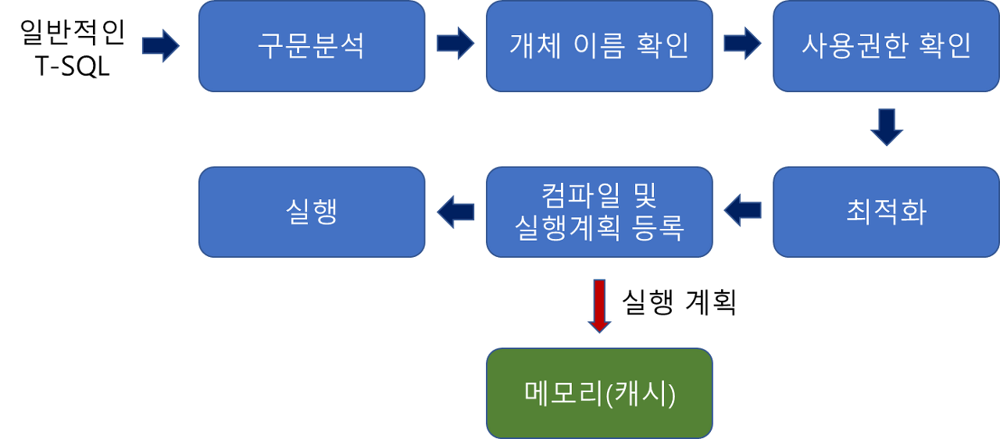
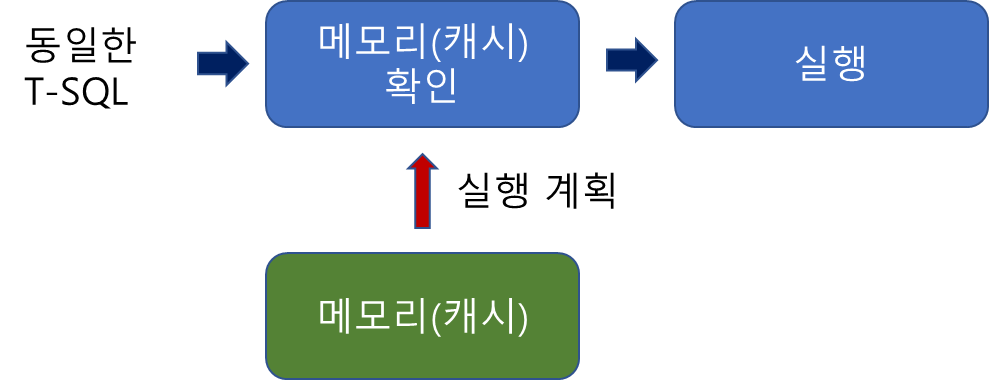
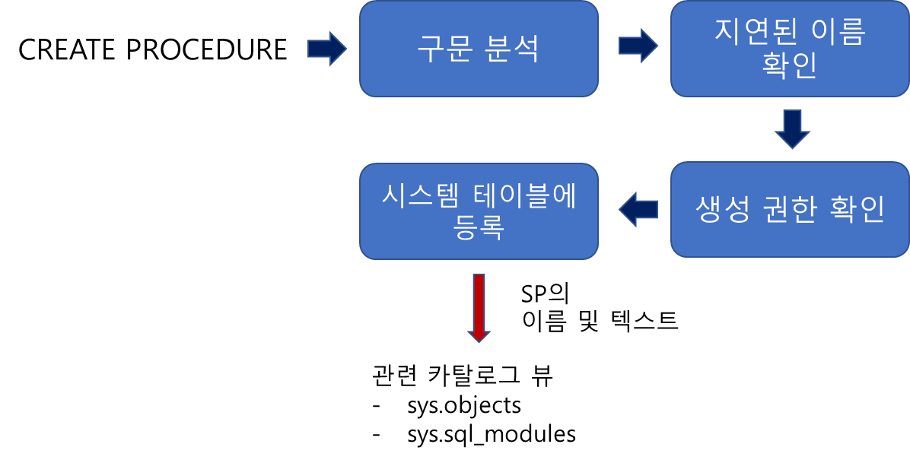
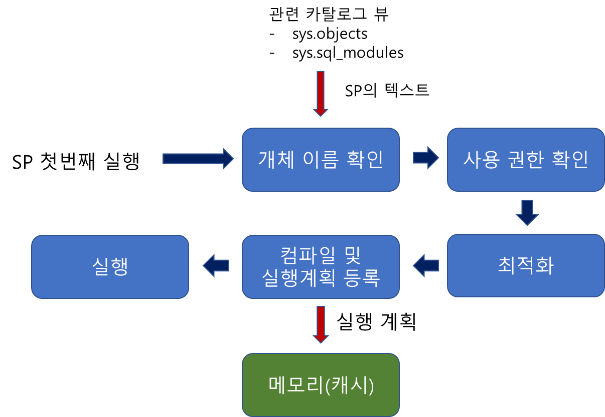
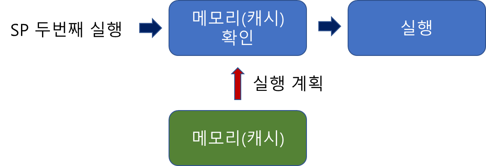

# (저장) 프로시저 (Stored Procedure)

# 1. 개념

- 절차형 SQL을 활용하여 특정 기능을 수행할 수 있는 트랜잭션 언어
    - 절차형 SQL : C, JAVA 처럼 연속적인 실행이나 분기, 반복 등의 제어가 가능한 SQL
    <details>
    <summary>'절차형'?SQL</summary>
    <div markdown="1">
    <ul>
        <li>SQL : Structured Query Language 데이터베이스에서 데이터를 추출하고 조작하는데 사용하는 데이터 처리언어</li>
        <li>절차형 SQL : SQL중 절차 지향적 프로그래밍 가능하도록 하는 트랜잭션 언어</li>
        <li>oracle : PL/SQL, SQL Server : T-SQL.. 등 절차형 SQL에 해당하지 않는 SQL = 비절차형 SQL이자만, 딱히 이런 용어를 사용하지는 않는 것 같음.</li>
    </ul>
    </div>
    </details>

    - 트랜잭션 언어 : DB를 조작하고 트랜잭션을 처리하는 언어. SQL과 TCL이 속한다.

- 호출을 통해 실행되며 미리 저장해 놓은 SQL작업을 수행한다.
- 일련의 쿼리를 마치 하나의 함수처럼 실행하기 위한 쿼리 집합.
- 특정 로직의 쿼리를 함수처럼 만들어 놓은 것.

❕프로시저는 DB에 저장되어 수행되기 때문에 Stored 프로시저 라고도 불린다. (프로시저=저장(된) 프로시저=SP)

### (참고)[Oracle] 함수와 차이점
    - Oracle에 프로시저와 비슷한 '함수'라는 기능이 있다.
    - (프로그래밍 언어의 함수 의미하는 것x)

| 프로시저 | 함수 |
| --- | --- |
| 특정한 작업을 수행한다 | 특정한 계산을 수행한다. |
| 리턴 값이 있을 수 도 없을 수도 있다. | 반드시 리턴값이 있어야함 |
| 리턴 값을 여러개 가질 수 있음 | 오직 하나의 리턴 값을 가질 수 있음 |
| 서버(DB)에서 기술 | 화면(Client)에서 기술 |
| 수식 내에서 사용 불가 | 수식 내에서만 사용 가능 |
| 단독으로 문장 구성 가능 | 단독으로 문장 구성 불가능 |
- 추가 이해 필요!

### 장점

- 하나의 요청으로 여러 SQL문을 실행할 수 있다.(네트워크 부하를 줄일 수 있다.)
- SQL의 구문을 분석하고 실행 가능한 코드로 변환하는 데에는 많은 비용이 소모되는 데, 이 비용을 대폭 줄일 수 있다.
    - 매번 같은 쿼리를 쓸 때마다 옵티마이저가 구문 분석하고 실행할 필요가 없어짐.
    - 저장 프로시저를 처음 실행하면, 최적화, 컴파일 단계를 거쳐 그 결과가 캐시 메모리에 저장되는데, 이후 SP실행 시에는 캐시에서 가져와 사용
    - 똑같은 쿼리가 여러 번 실행되면 저장 프로시저로 만들어 놓고 사용하는 게 좋다.
- 개발언어에 비의존적이다.
    - MS-SQL에 맞는 저장 프로시저를 MySQL로 마이크레이션한다면, SP안의 로직만 MySQL에 맞춰 바꾸고, 호출하는 SP명은 그대로 이기 때문에 SP를 호출하는 서버 코드는 변경하지 않아도 된다.
- 확장 및 유지보수가 수월해진다.
    - 위와 같은 이유로 언제든지 부담없이 저장 프로시저의 내용을 수정할 수 있으므로, 쿼리 변경이 발생할 시 저장프로시저만 변경하면 된다.
- 보안을 강화할 수 있다.
    - 사용자별로 테이블에 건한을 주는게 아니라, 저장 프로시저에만 접근 권한을 주는 방식으로 보안을 강화할 수 있다.
    - 실제 테이블에 접근하여 다양한 조작을 하는 것은 위험하므로, 실무에서는 개발자에게 SP권한만 주는 방식을 많이 사용한다고 함
- 네트워크 부하를 줄일 수 있음
    - 클라이언트에서 서버로 쿼리의 모든 텍스트가 전송될 경우 네트워크에 큰 부하가 발생하지만, SP를 이용하면 SP명,매개변수 등 몇 글자만 전송하면 되기 때문에 부하를 크게 줄일 수 있다.

### 문제점

대부분의 경우 성능이 향상되지만, 항상 그런것은 아니다.

- SP를 실행할때 최적화 단계를 수행한다. 이 최적화 단계에 인덱스를 사용할지 말지 결정하게 된다.
- 인덱스를 사용한다고 항상 수행결과가 빨라지지 않음.
- 만약 가져올 데이터가 많은데 인덱스를 사용하면 오히 성능이 나빠지게 될 수 있다.
    - SP는 첫번재 수행시 최적화가 이루어져 인덱스 사용 여부가 결정된다.
    - 만약 첫 수행때 데이터를 몇 건만 가져오도록 파라미터가 설정되어 있다면, 인덱스를 사용하도록 최적화되어 컴파일 되었을 것.
    - 그런데 두 번째 수행에서 많은 건수의 데이터를 가져오는 파라미터가 들어가면 SP에서는 처음 컴파일 한대로 인덱스를 사용하는 프로시저를 실행시킨다.
- 이를 방지하는 방법 중 인덱스 사용여부가 불분명하면 저장 프로시저를 생성하는 시점에 아예 실행 시 마다 다시 컴파일 되게 설정할 수 있다.
    
    ```sql
    DROP PROC sp_recompile_test
    GO
    CREATE PROC sp_recompile_test
    	[매개변수]
    WITH RECOMPILE
    AS
    	[사용될 쿼리문]
    GO
    ```
    

# 2. 일반적인 SQL문과 프로시저 동작 비교

SQL Server 기반으로 설명
- T-SQL : (MS SQL에서) Transact-SQL, SQL에 대해 마이크로소프트와 Sybase가 확장. 선언문을 이용하여 RDB를 조회, 변경, 정의하기 위해 본래 IBM이 개발한 표준화된 컴퓨터 언어.
- 우리가 작성하는 SQL = 일반 SQL

## 2.1 일반적인 T-SQL



```sql
SELECT name FROM userTABLE;
```

1. 구문분석 : 구문 자체 오류 확인 (EX 오타)
2. 개체이름 확인 : userTABLE이라는 테이블이 현재 DB에 있는지 , 그 안에 name이라는 컬럼이 있는지 확인
3. 사용권한 확인 : userTABLE을 현재 접근 중인 사용자가 권한이 있는지 확인
4. 최적화 : 해당 쿼리문이 가장 좋은 성능을 낼 수 있는 경로 결정. (인덱스 사용여부 결정) 예시에서는 테이블 스캔 또는 클러스터 인텍스 스캔
5. 최적화 결과를 바탕으로 컴파일 및 실행 계획 결과를 캐시에 등록
6. 컴파일된 결과 실행

### 이후 동일한 SQL을 실행하면?



- 캐시 확인후 바로 실행 = 시간 단축
- 쿼리 전체가 한글자도 틀리지 않고 같아야함.
- 그렇지 않으면 위의 전체 과정을 다시 반복한다.

## 2.2 저장 프로시저 동작방식

### 2.2.1 프로시저 정의



1. 구문 분석 : 구문 오류 파악
2. 지연된 이름 확인(deferred name resolution) : 프로시저는 정의 시점에 테이블 이름에 해당하는 개체의 “존재 여부와 상관없이” 정의 가능 → 해당 테이블의 존재 여부를 프로시저 “실행”시점에 확인하기 때문
    - 하지만 테이블의 열의 이름이 틀리면 오류 발생
    - 따라서 없는 테이블에 프로시저 정의에 사용하지 않도록 주의
3. 생성 권한 확인 : 사용자가 저장 프로시저를 생성할 권한이 있는지 확인
4. 시스템 테이블에 등록 : 카탈로그 뷰에서 내용을 확인할 수 있음

### 2.2.2 첫 프로시저 실행



- 일반쿼리 수행과 유사. 구문분석은 정의해서 했기때문에 따로 구문분석 하지 않음
1. 개체 이름 확인 : “정의”단계에서 지연된, 실제로 해당 객체가 유효한지 확인.
    - 실행 단계에만 해당 개체가 존재하면 실행이 된다.
2. 일반쿼리 수행과 같은 방식으로 사용권한확인, 최적화, 컴파일 및 실행계획 등록 을 거쳐 실행한다.

### 2.2.3. 이후 프로시저 실행



캐시에 있는 것을 그대로 가져와 재사용 → 수행시간이 단축

❓ **일반 SQL과 같은데?**

```sql
SELECT * FROM userTABLE WHERE name = "신짱구"
SELECT * FROM userTABLE WHERE name = "김철수"
SELECT * FROM userTABLE WHERE name = "한유리"
```

위의 쿼리는 where의 조건 값만 다르지만, 모두 다른 쿼리로 인식하기 때문에 매번 최적화와 컴파일을 다시 수행한다.

```sql
CREATE PROC select_by_name
	@Name NVARCHAR(3)
AS
	SELECT * FROM userTABLE WHERE name = @name;
```

```sql
EXEC select_by_name '신짱구';
EXEC select_by_name '김철수';
EXEC select_by_name '한유리';
```

이를 위의 프로시저로 만들면 처음 신짱구를 검색하는 과정에서만 최적화 및 컴파일을 수행하고, 나머지는 캐시에 있는 것을 사용하게 된다.

---

# 면접질문

- (x)프로시저와 함수, 메서드를 비교해보세요
    - 프로시저 : 특정 프로세스를 “절차적”으로 기술해놓은것. 보편적으로 결과값 반환이 없음. SIDE Effect 있음
    - 함수 : 입력값을 기반으로 새로운 값을 반환. SIDE Effect가 없도록 만듦
    - 메서드 : 객체지향 관점. 0개이상의 변수들에 대한 집합을 가진 함수.
    - [https://murphymoon.tistory.com/entry/프로시저procedure-함수function-메서드method의-차이점-프로그래밍-면접-질문-1](https://murphymoon.tistory.com/entry/%ED%94%84%EB%A1%9C%EC%8B%9C%EC%A0%80procedure-%ED%95%A8%EC%88%98function-%EB%A9%94%EC%84%9C%EB%93%9Cmethod%EC%9D%98-%EC%B0%A8%EC%9D%B4%EC%A0%90-%ED%94%84%EB%A1%9C%EA%B7%B8%EB%9E%98%EB%B0%8D-%EB%A9%B4%EC%A0%91-%EC%A7%88%EB%AC%B8-1)
- 프로시저를 설명해보세
- 트리거와 프로시저를 비교해보세요
    - 프로시저는 사용자, 애플리케이션, 트리거에 등에 의해 명시적으로 실행되고
    - 트리거는 이벤트 발생(DML) 수행시 DBMS에 의해 암시적으로 실행

# 출처

- [https://pangtrue.tistory.com/196](https://pangtrue.tistory.com/196)
- [https://devkingdom.tistory.com/323](https://devkingdom.tistory.com/323)
- [https://seohee-ha.tistory.com/125](https://seohee-ha.tistory.com/125)
- [https://benggri.tistory.com/76](https://benggri.tistory.com/76)
- [https://trustall.tistory.com/36](https://trustall.tistory.com/36)
- [https://www.elancer.co.kr/blog/view?seq=156](https://www.elancer.co.kr/blog/view?seq=156)
- [https://melonicedlatte.com/database/2017/10/06/155711.html](https://melonicedlatte.com/database/2017/10/06/155711.html)