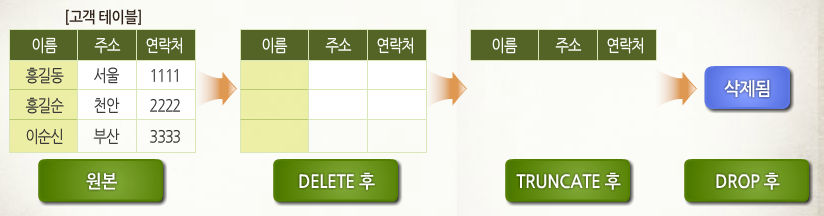

# DELETE_DROP_Truncate_비교

### 공통점
모두 삭제하는 명령이다
<br></br>
### 차이점


- **DELETE**
    - 데이터는 지워지지만, 테이블 용량은 줄어 들지 않음
    - 원하는 데이터만 지울 수 있음
    - 삭제 작업 이전으로 되돌릴 수 있음 (커밋 이전이라면 가능함)
    - 사용자 commit, 로그 남김, 속도 느림     
     💡로그 = 실패 지점으로 복구, 데이터베이스 동기화(DBMS 일관성 유지)에 사용됨

```sql
-- ORACLE, MySQL
DELETE FROM 테이블명
WHERE 조건
```
<br></br>
- **Truncate**
    - 테이블은 삭제하지 않고, 데이터만 삭제함 (**테이블을 최초 생성된 초기 상태로 만듦**)
    - 원하는 데이터만 지울 수 없고 모든 데이터를 지워야 함
    - 삭제 후 절대 되돌릴 수 없음
    - auto commit, 로그 안남김, 속도 빠름

```sql
-- ORACLE, MySQL 
TRUNCATE TABLE 테이블명
```
<br></br>
- **DROP**
    - **테이블 전체를 삭제함**
    - 테이블의 공간과 객체 모두를 삭제하기 때문에, 삭제 후 절대 되돌릴 수 없음
    - auto commit, 로그 안남김, 속도 빠름

```sql
-- ORACLE, MySQL
DROP TABLE 테이블명 
```

<br></br>

### 면접질문
1. DELETE, TRUNCATE, DROP의 차이를 설명해주세요

<br></br>

### 출처
[https://wikidocs.net/4021](https://wikidocs.net/4021)     
[https://yurimac.tistory.com/34](https://yurimac.tistory.com/34)
