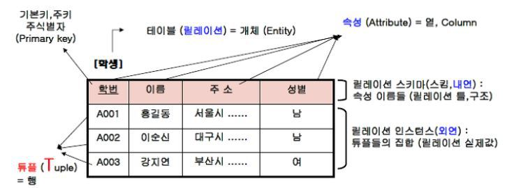
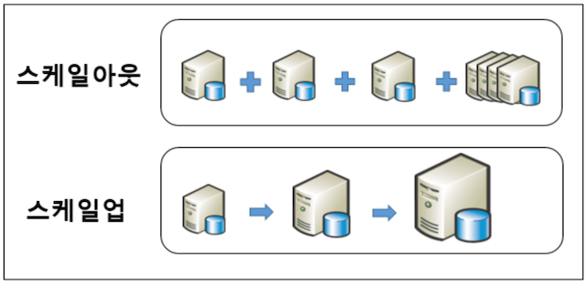
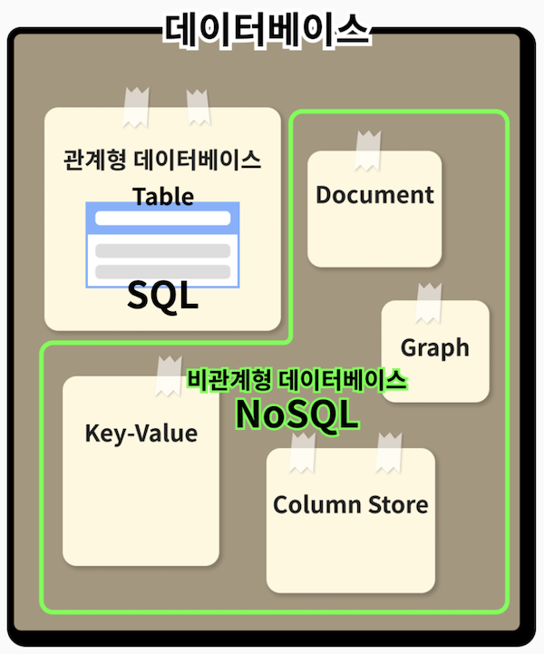
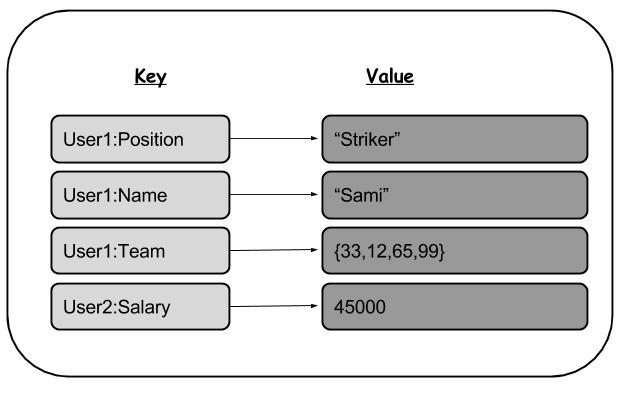
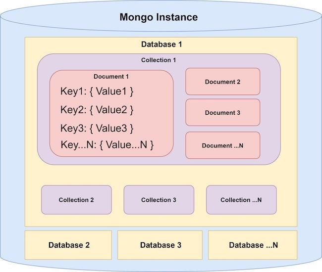
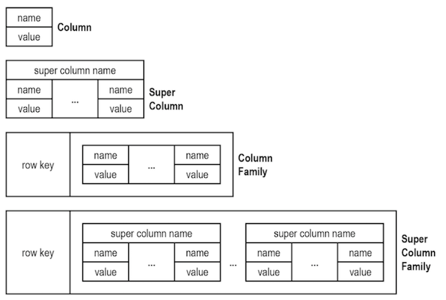
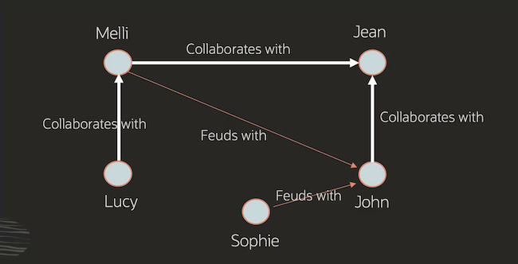

# SQL_NoSQL

## 관계형 데이터베이스, RDBMS, SQL

- 고정된 행(row)와 열(column)로 구성된 테이블에 데이터를 저장함
- 테이블의 구조와 데이터 타입 등을 사전에 정의하며, 테이블에 정의된 내용에 알맞은 형태의 데이터만 삽입할 수 있음
- 테이블의 관계가 구조화된 데이터의 모음이기 때문에, **구조화된 쿼리 언어인 SQL(Structured Query Language)을 사용해서 데이터를 처리할 수 있음** 
→ 즉, SQL은 관계형 데이터베이스 전용 프로그래밍 언어이기 때문에 관계형 데이터베이스를 SQL이라고 부르기도 함
- 대표적인 관계형 데이터베이스 시스템(RDBMS)은 MySQL, Oracle, SQLite, MariaDB, PostgresSQL이 있음
<br></br>
### 장점
- 명확하게 정의된 스키마를 가짐
- 데이터의 무결성을 보장함 → 관계를 가지고 있어, 각 데이터가 중복없이 저장되게 함
<br></br>
### 단점
- 유연성이 떨어짐, 데이터 스키마를 사전에 계획하고 알려야 함
- 관계를 맺고 있어서 조인문이 많은 복잡한 쿼리가 만들어 질 수 있음
- 대체로 수직적 확장(Scale Up)만 가능함

```sql
💡 수직적 확장(Scale Up)?
- 서버에 CPU나 RAM 등을 추가하거나 고성능의 부품, 서버로 교환하는 방법
  즉, 1의 처리 능력을 가진 서버 1대를 7의 처리 능력을 가진 서버로 그 자체 처리 능력을 향상시킴
- 서버 1대로 모든 부하가 집중될 수 있음
- 1대의 서버에서 모든 데이터를 처리하므로 데이터 갱신이 빈번하게 일어나는 DB 서버에 적합함
  (빈번하게 갱신이 일어나면 여러 대의 서버에서는 정합성 유지가 어렵기 때문)
- 주로 RDBMS에서 사용

💡 수평적 확장(Scale Out)?
- 접속된 서버를 여러 대 추가하여 처리 능력을 향상하는 방법
  즉, 1의 처리 능력을 가진 서버에 동일한 서버 6대를 더 추가하여, 총 7의 처리 능력을 만드는 것
- 서버 1대가 장애로 다운되더라도 다른 서버로 서비스 제공이 가능하다는 장점
- 갱신 데이터의 정합성 유지가 어렵다는 단점
```


<br></br>

## 비관계형 데이터베이스, NoSQL

- 관계형 데이터베이스를 뺀 나머지 유형을 총칭
- 관계형 데이터베이스를 SQL이라고 칭하는 것과 마찬가지로, 비관계형 데이터베이스를 칭할 때 NoSQL이라고 함
- NoSQL은 유연한 스키마를 제공하며, 대량의 데이터와 높은 사용자 부하에서도 손쉽게 확장이 가능함
- 관계형 데이터베이스에서는 데이터를 입력할 때 스키마에 맞게 입력해야 하지만, NoSQL에서는 데이터를 읽어올 때 스키마에 따라 데이터를 읽어 옴(= schema on read 방식). 즉, 스키마 확인을 데이터를 읽는 시점에서 함
<br></br>
### 장점
- 스키마가 없어서 유연함, 언제든지 저장된 데이터를 조정하고 새로운 필드를 추가할 수 있음
- 데이터베이스가 애플리케이션이 필요로 하는 형식으로 저장되므로, 데이터를 읽어오는 속도가 빨라짐
- 수직 및 수평 확장이 가능해서, 애플리케이션이 발생시키는 모든 읽기/쓰기 요청을 처리 가능함
<br></br>
### 단점
- 데이터가 여러 컬렉션에 중복되어 있기 때문에, 수정 시 모든 컬렉션에서 수행해야 함
- 스키마가 존재하지 않기 때문에 명확한 데이터 구조를 보장하지 않아, 데이터 구조 결정이 어려울 수 있음

<br></br>

## NoSQL 데이터베이스 유형
### Key-Value 타입

- Key-Value의 데이터 쌍을 배열의 형태로 저장함 
→ 구조를 정하지 않고 Key만 겹치지 않게 넣으면 되기 때문에 유연하게 데이터를 넣을 수 있음
- Redis, Dynamo 등이 대표적인 Key-Value 형식의 데이터베이스

<br></br>
### 문서형(Document) 데이터베이스

- 데이터를 테이블이 아닌 문서처럼 저장하는 데이터베이스(JSON 또는 BSON 형식)
- 각각의 문서는 하나의 속성에 대한 데이터를 가지고 있고, 컬렉션이라고 하는 그룹으로 묶어서 관리함
- 스키마가 지속적으로 변경되는 애플리케이션에 적합함
- 대표적인 문서형 데이터베이스에는 MongoDB가 있음

<br></br>
### Wide-Column Store 데이터베이스

- 데이터베이스의 열(column)에 대한 데이터를 집중적으로 관리하는 데이터베이스
- 각 열에는 key-value 형식으로 데이터가 저장되고, 컬럼 패밀리라고 하는 열의 집합체 단위로 데이터를 처리할 수 있음
- 하나의 행에 많은 열을 포함할 수 있기 때문에 유연성이 높음
- 데이터 처리에 필요한 열을 유연하게 선택할 수 있다는 점에서, 규모가 큰 데이터 분석에 주로 사용되는 데이터베이스 형식임
- 대표적인 wide-column 데이터베이스에는 Cassandra, HBase가 있음

<br></br>
### 그래프(Graph) 데이터베이스

- 자료구조의 그래프와 비슷한 형식으로 데이터 간의 관계를 구성하는 데이터베이스
- 노드(node)에 속성(entity)별로 데이터를 저장하며, 각 노드 간 관계는 선(edge)로 표현함
- 대표적인 그래프 데이터베이스에는 Neo4J, InfiniteGraph가 있음

<br></br>

## SQL vs NoSQL
### SQL 데이터베이스 사용이 더 좋은 경우
- **데이터베이스의 ACID 성질을 준수해야 하는 경우**
    - SQL을 사용하면 데이터베이스와 상호작용하는 방식을 정확하게 규정할 수 있기 때문에, 데이터베이스에서 데이터를 처리할 때 발생할 수 있는 예외 상황을 줄이고 데이터베이스의 무결성을 보호할 수 있음
    - 전자 상거래를 비롯한 모든 금융 서비스를 위한 소프트웨어 개발에서는 반드시 데이터베이스의 ACID 성질을 준수해야 함
- **소프트웨어에 사용되는 데이터가 구조적이고 일관적인 경우**
    - 프로젝트의 규모가 많은 서버를 필요로 하지 않고 일관된 데이터를 사용하는 경우,  관계형 데이터베이스를 사용하는 경우가 많음

<br></br>
### NoSQL 데이터베이스 사용이 더 좋은 경우
- **데이터의 구조가 거의/전혀 없는 대용량의 데이터를 저장하는 경우      
정확한 데이터 구조를 알 수 없거나 변경/확장될 수 있는 경우**
    - 소프트웨어 개발에 정형화되지 않은 많은 양의 데이터가 필요한 경우, NoSQL을 사용하는 게 효율적임
- ****빠르게 서비스를 구축하는 과정에서 데이터 구조를 자주 업데이트 하는 경우****
    - NoSQL 데이터베이스의 경우 스키마를 미리 준비할 필요가 없기 때문에 빠르게 개발하는 과정에 매우 유리함
- **DB에 데이터를 쓰는 양이 읽는 양보다 많은 경우, RDBMS는 성능이 저하됨**
    - 초당 데이터가 수십만개씩 써지는 SNS의 경우 NoSQL이 더 적합함

<br></br>
<br></br>

### 면접질문
1. RDBMS와 NoSQL의 차이에 대해 설명해주세요
2. 그렇다면 RDBMS와 NoSQL은 어느 경우에 적합한가요?
3. NoSQL 데이터베이스 유형에 대해 설명해주세요

<br></br>

### 출처
[https://hanamon.kr/데이터베이스-sql-vs-nosql/](https://hanamon.kr/%EB%8D%B0%EC%9D%B4%ED%84%B0%EB%B2%A0%EC%9D%B4%EC%8A%A4-sql-vs-nosql/)     
[https://newtoner.tistory.com/23](https://newtoner.tistory.com/23)     
[https://stackoverflow.com/questions/62010368/what-exactly-is-a-wide-column-store](https://stackoverflow.com/questions/62010368/what-exactly-is-a-wide-column-store)     
[https://www.oracle.com/kr/autonomous-database/what-is-graph-database/](https://www.oracle.com/kr/autonomous-database/what-is-graph-database/)    
[https://gyoogle.dev/blog/computer-science/data-base/SQL & NOSQL.html](https://gyoogle.dev/blog/computer-science/data-base/SQL%20&%20NOSQL.html)    
[https://velog.io/@eunhye_/DB-Scale-up과-Scale-out](https://velog.io/@eunhye_/DB-Scale-up%EA%B3%BC-Scale-out)     
[https://datacookbook.kr/90](https://datacookbook.kr/90)     
https://www.fun-coding.org/post/mongodb_basic1.html#gsc.tab=0
