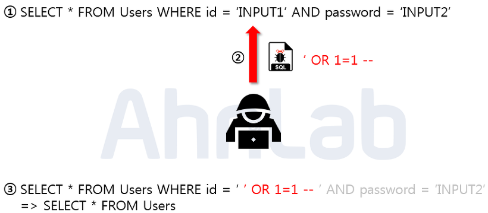

# SQL injection
# 1. 개념

- 악의적인 사용자가 보안상 취약점을 이용하여, 임의의 SQL문을 주입하고 실행되게 하여 DB가 비정상적인 동작을 하도록 조작하는 행위
- 전문 스캐너 프로그램 혹은 봇넷 등을 이용해 웹사이트를 무차별적으로 공격하는 과정에서 취약한 사이트가 발견되면 DB등의 데이터를 조작하는 일련의 공격방식
    - 스캐너 프로그램 : 서비스를 제공하는 서버의 상태를 확인하는 프로그램. 네트워크상 서버들을 스캐닝하여 서버의 열려있는 포트, 제공서비스, OS, 취약점 등의 정보를 수집한다.
- 사용자의 입력값이 서버측에서 코드로 실행되는 코드인젝션 공격 기법 중 하나이다.
- 클라이언트 측에서 SQL쿼리에 신뢰할 수 없는 데이터가 입력되었을 때, 데이터가 쿼리 로직의 일부로 해석되어 DB에 실행될 때 발생한다. → 사용자 입력값을 제대로 필터링, 이스케이프 해야함
- 2017.03. 여기어때 대규모 개인정보 유출사건, 2015. “뽐뿌” 개인정보 노출 사고 등이 SQL Injection이 원인이었다.

## 공격 목적

1. 정보유출
2. 저장된 데이터 유출 및 조작
3. 원격 코드 실행 : 일부 DB의 경우 확장 프로시저를 이용하여 원격으로 시스템 명령의 실행이 가능하다. 이 경우 원격 자원 접근 및 데이터 유출, 삭제가 가능하다.
4. 인증 우회 : 로그인 폼 등에서 발생. 상위 권한을 가진 사용자의 권한으로 인증 절차를 우회하여 로그인 정보없이 로그인할 수 있음.

# 2. 공격 종류 및 방법

## 2.1 Error based SQL Injection - 논리적 에러를 이용

- SQL Injection 중 가장 많이 쓰이고 대중적은 공격기법



- ①  쿼리문은 일반적으로 로그인시 사용되는 구문. → 입력값에 대한 검증이 없음을 확인
- ② 악의적인 사용자가 입력값으로 임의의 SQL문 주입
- ③ SQL문이 SLECT * FROM Users 의미로 바뀌게 됨 → 테이블의 모든 정보를 조회하여 가장 먼저 만들어진 계정으로 로그인에 성공함
    
    ```sql
    SELECT * FROM Users 
    WHERE id = '' OR 1=1 --'and~(--뒤부처 주석처리 되버림)
    ```
    
    - 보통 관리자 계정을 맨 처음 만들기때문에 관리자 권한을 탈취해 2차 피해 일으킬 가능성 ⬆️

## 2.2 Union based SQL Injection - Union 명령어 이용

- Union은 두 쿼리문의 결과를 통합해서 보여주므로, 정상적인 쿼리문에 union을 통해 원하는 쿼리문을 실행하는 방식
- 조건1. union 하는 두 테이블의 컬럼 수 가 같아야함
- 조건2. 데이터 형이 같아야함


- ① Board 테이블에서 게시글을 검색하는 쿼리문. (입력값에 대한 검증 없음 확인)
- ② 악의적 사용자가 입력값으로 Union ~문을 삽입
- ③ union 구문이 합쳐져, 사용자의 개인정보가 게시글과 함께 보여지게됨
    
    ```sql
    SELECT * FROM Board 
    WHERE title LIKE '%' 
    UNION
    SELECT null, id, passwd FROM Users -- %'And contents ~~(주석처리됨)
    ```

**select >null< 을 사용하는 이유**
- DB에 정의된 데이터 타입에 상관없이 사용가능 하기 때문. 빈칸을 채우는 용도라고 생각하면된다.
- 데이터타입이 숫자라면 1,2,3,.. 무의미한 숫자를 사용하거나
- 문자타입이면 ''등을 대신 사용할 수도 있다.
  

    

## 2.3 Blind SQL Injection(1) - Boolean based SQL

DB로 부터 특정한 값이나 데이터를 전달받지 않고, 단순히 참과 거짓의 정보를 알고 싶을 때 사용
- ex) 테이블 명이 맞는지 아닌지 확인하고 싶음

- 로그인폼에 SQL 인젝션이 가능하다고 했을때, 서버가 응답하는 로그인 성공과 로그인 실패 메시지를 이용하여, DB테이블 정보 등을 추출해 낼 수 있음


- 해당 예시는 DB 테이블 명을 알아내는 Blind SQL Injection임.
- 해당 구문이 입력되면, 이는 MySQL에서 테이블 명을 조회하는 구문으로 limit 키워드를 통해 하나의 테이블만 조회하고 SUBSTR함수로 첫 글자만, ASCII를 통해 ascii값으로 변환해줌.
- 만약 조회되는 테이블 명이 User라면 ‘U’가 아스키 값으로 조회되고, 뒤의 100이라는 숫자와 비교하여 거짓이면 로그인 실패, 참이 될때까지 100숫자를 변경해가며 비교한다.능
- 공격자가 시스템 권한을 획득해야하므로 공격 난이도가 높지만, 성공한다면 서버에 직접적인 피해를 입힐 수 있음

### 예시

- User 테이블을 가정

```sql
CREATE TABLE User(
   username VARCHAR(50),
   password VARCHAR(50)
)ENGINE=InnoDB;
```

- DB에서 username과 password 선택

```sql
String Query = "SELECT * FROM username = ' " + username
               + " ' AND password = ' " + password + " ' ";
               
execute_query(Query);
```

- 사용자 입력을 받은 후 유효성 검사 없이 쿼리 생성

```sql
//문제 없이 수행
SELECT * FROM `User` WHERE UserName = 'Hady' AND Password = 'root';

//SQL Injection 공격 - 테이블 삭제
SELECT * FROM `User` WHERE UserName = '' AND Password = '';drop table User;--'
```
- 만약 조회되는 테이블 명이 User라면 ‘U’가 아스키 값으로 조회되고, 뒤의 100이라는 숫자와 비교하여 거짓이면 로그인 실패, 참이 될때까지 100숫자를 변경해가며 비교한다.
- 
## 2.4 Blind SQL Injection(2) - Time based SQL
서버로부터 특정한 응답 대신 참 혹은 거짓 응답을 통해 DB정보를 유출시키는 기법

- 해당 예시는 현재 사용하는 DB의 길이를 알아내는 Time based SQL injection
- LENGTH함수는 문자열 길이를 반환하고, DATABASE함수는 DB이름을 반환함
- LENGTH(DATABASE()) = 1 이 참이면 SLEEP(2)가 동작하므로 1부분을 조작해 DB의 길이를 알아낼 수 있다. (SLEEP 대신 BENCHMARK나 WAIT 등을 이용할 수 있음)

**sleep을 사용하는 이유**
- 시간기반 인젝션은 쿼리값이 true/false 상관없이 결과값 자체를 화면에 출력하지 않는다.
- 따라서 true / false 값을 우리가 알아보기 위해 경과 시간을 보고 참,거짓을 판단한다.

  
## 2.5 Stored Procedure SQL Injection - 저장된 프로시저
- 저장 프로시저 : 일련의 쿼리들을 모아 하나의 함수처럼 사용하기 위한 것
    - 사용하고자하는 쿼리에 미리 형식을 지정한 것
    - 운영상 편의를 위해 만들어둔 SQL집합의 형태
- SQL인젝션의 취약점으로 인해 웹상에서 저장된 프로시저에 대한 접근권한을 가져서 실행이 가능

- 자세한 예시 : [https://peemangit.tistory.com/153](https://peemangit.tistory.com/153)

## 2.6 Mass SQL Injection - 대량

- 2008년에 처음 발견된 공격기법으로, 기존의 SQL Injection방식과 달리 한 번의 공격으로 다량의 DB가 조작되어 피해를 입는 것.
- MS-SQL을 사용하는 ASP 기반 웹 애플리케이션에서 많이 사용됨
- 쿼리문을 HEX방식으로 인코딩 하여 공격함
    - HEX인코딩 : ascii, base64 처럼 인코딩 방식 중 하나.
        - 색상코드에서 특히 많이 사용 (헥사 코드)
        - 공간 효율성이 안좋아 주로 하드웨어적으로만 사용된다.
        - (base 계열이 63~75%임에 반해 hex는 50% 정도 밖에 안된다.)
- DB값을 변조하여 DB에 악성코드를 삽입하고, 사용자들이 변조된 사이트에 접속 시 좀비 PC로 감염됨. → DDos 공격에 사용
- [참고] mass sql injection 예시 : [https://using.tistory.com/11](https://using.tistory.com/11)
- [참고] mass sql injection 분석하기 : [https://tisiphone.tistory.com/67](https://tisiphone.tistory.com/67)

# 3. 대응방안

## 3.1 입력 값에 대한 검증

- 사용자가 입력하는 값에 대한 검증이 필요하다
- SQl Injection에 사용되는 기법과 키워드가 엄청나게 많으므로 서버단에서 화이트 리스트 기반으로 검증해야한다. (블랙리스트 기반은 수많은 차단 리스트를 등록해야하고 하나라도 빠지면 공격에 성공)
    - 화이트 리스트 검증 : 허용 가능한 입력값에 대한 리스트를 사용 → 편의성이 떨어짐
    - 블랙 리스트 검증 : 허용되지 않는 입력값에 대한 리스트 사용
        - SQL쿼리 구조를 변경하는 특수문자, SQL예약어 등을 미리 등록하고 입력을 제한한다.
        - 해당문자가 입력되었을때, 에러메시지를 반환하거나, 미리 준비해둔 문자열로 치환
            - (특수문자) ' , " , = , & , | , ! , ( , ) , { , } , $ , % , @ , #, -- 등
            - (예 약 어) UNION, GROUP BY, IF, COLUMN, END, INSTANCE 등
            - (함 수 명) DATABASE(), CONCAT(), COUNT(), LOWER() 등
        - 공백으로 치환하는 방법도 많이 쓰이지만, 취약함
            - SESELECTLECT에서 SELECT를 공백으로 치환해도 다시 SELECT가 만들어짐 → 의미 없는 단어로 치환되어야함

## 3.2 Prepared Statement 구문 사용

- 사용자 입력 값이 DB의 파라미터로 들어가기전 DBMS가 미리 컴파일 하여 실행하지 않고 대기함.
- 그 후 사용자 입력값을 문자열로 인식하게 하여 공격 쿼리가 들어가도 이미 의미없는 단순 문자열이기때문에 저체 쿼리문도 공격자의 의도로 작동하지 않음
- Prepared Statement 또는 매개변수화된 구문을 사용해서 동일한 구문을 실행함에 있어 SQL 인젝션 공격을 방지하고 높은 효율성으로 쿼리문을 실행할 수 있다.

## 3.3 Error Message 노출 금지

SQL Injection을 수행하려면 DB의 정보(테이블명, 컬럼명 등)이 필요하므로 DB오류 발생 시에는 사용자에게 보여줄 수 있는 페이지나 메시지를 따로 띄우도록 하는게 바람직함.

## 3.4 웹 방화벽 사용

웹 공격 방어에 특화된 웹 방화벽을 사용한다

- 소프트웨어 형 : 서버 내에 직접 설치하는 방밥
- 하드웨어 형 : 네트워크 상에서 서버 앞 단에 직접 하드웨어 장비로 구성하는 것
- 프록시 형 : DNS서버 주소를 웹 방화벽으로 바꾸고 서버로 가는 트래픽이 웹 방화벽을 먼저 거치도록 하는 방식

## 3.5 DB 보안 적용

관리자 DB 계정과 웹 애플리케이션 운영 계정의 권한을 분리하여 운영.

DDL, DML 등 사용하는 구문 별 계정을 구분하여 운영

이외 주기적 로그 점검, 취약점 점검 등을 적용할 수 있음

---

# 면접질문

- SQL 인젝션이 무엇인지 설명해주세요
- SQL 인젝션을 방어 및 방지하기 위한 방법에 대해 알고 있다면 설명해주세요

# 출처

- [https://noirstar.tistory.com/264](https://noirstar.tistory.com/264)
- [책] 2021시나공 정보처리기사 필기
- [https://gomguk.tistory.com/118](https://gomguk.tistory.com/118)
- [https://haker.tistory.com/98](https://haker.tistory.com/98)
- [https://velog.io/@yu-jin-song/DB-SQL-인젝션SQL-Injection](https://velog.io/@yu-jin-song/DB-SQL-%EC%9D%B8%EC%A0%9D%EC%85%98SQL-Injection)
- [https://webstone.tistory.com/25](https://webstone.tistory.com/25)
- [https://qkqhxla1.tistory.com/30](https://qkqhxla1.tistory.com/30)
- [https://tkdrms568.tistory.com/148](https://tkdrms568.tistory.com/148)
