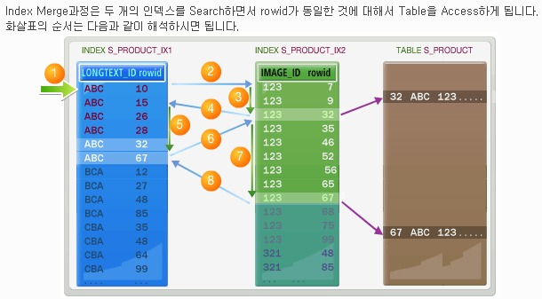
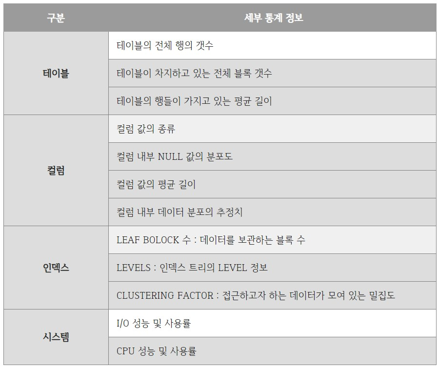

# [DB]Optimizer

# 1. ⭐개념

**가장 효율적인 방법으로 SQL을 수행할 최적의 처리 경로를 생성해주는 DBMS 핵심엔진.**

- DBMS의 두뇌
- SQL을 작성하고 실행시키면 옵티마이저에서 실행계획을 세운 뒤 시스템 통계정보를 활용하여 각 실행계획의 예상 비용을 산정한 후 이를 비교해 최고의 효율을 가지고 있는 실행계획에 따라 쿼리를 수행한다.
- 옵티마이저가 생성한 SQL 처리경로를 실행계획(Execution Plan)이라고 한다.


## 1.1 옵티마이저 최적화 목표

### 전체 처리 속도 최적화

쿼리 최종 결과집합을 끝까지 읽는 것을 전제로, 시스템 리소스를 가장 적게 사용하는 실행계획을 선택. 

대부분의 DBMS의 기본 옵티마이저 모드는 전체 처리 속도 최적화에 맞춰져 있다.

### 최초 응답속도 최적화

전체 결과집합 중 일부만 읽다가 멈추는 것을 전제로, 가장 빠른 응답속도를 낼 수 있는 실행계획을 선택

만약 이 모드에서 생성한 실행계획으로 데이터를 끝까지 읽으면, 전체 처리 속도 최적화 실행계획보다 더 많은 리소스를 사용하고 수행 속도도 느려질 수 있다. 

# 2. ⭐종류

실행 계획을 세우는 방식에 따라 규칙기반과 비용기반으로 나눈다.

| 항목 | 규칙 기반 옵티마이저 | 비용 기반 옵티마이저 |
| --- | --- | --- |
| 개념 | 사전에 정의된 규칙기반 | 최소 비용 계산 실행계획 수립 |
| 기준 |  실행 우선 순위(Ranking) | 액세스 비용(Cost) |
| 인덱스 | 인덱스 존재 시 가장 우선시 사용 | Cost에 의한 결정 |
| 성능 | 사용자 SQL 작성 숙련도 | 옵티마이저 예측 성능 |
| 장점 | 판단이 매우 규칙적 실행 예상 가능 | 통계 정보를 통한 현실 요소 적용 |
| 단점 | 예측 통계정보 요소 무시 |  성능 보장 계획의 예측 제어 어려움 |
| 사례 | AND 중심 양쪽 ‘=’시 Index Merge 사용 | AND 중심 양쪽 ‘=’시 분포도 별 Index 선택 |

**사례 추가 설명**
AND 중심으로 양쪽 '='사용시
```sql
SELECT * FROM PRODUCT A
wHERE A.LONGTEXT_ID = 'ABC' AND A.IMAGE_ID = '123' ;
```
규칙 기반 옵티마이저는 조건이 (모두 인덱스 이고) '='로서 우선순위가 동일하므로 merge를 사용하는데
이때, index merge방식을 이용한다.

비용 기본 옵티마이저는 분포도별로 index를 선택한다.

- Index Merge
    - 한 테이블에 2개 이상의 인덱스가 있는 상태에서 2개의 인덱스를 모두 사용하는 쿼리가 사용될 때 두 개의 인덱스를 이용하여 조회하여 merge하는 것

    - 결합 INDEX 보다 속도가 느리다. 

        - 결합 index : 여러개의 컬럼으로 구성된 index로 where절에서 index에 해당하는 컬럼을 모두 사용했을 시 UNIQUE index를 사용하는 merge.

    - INDEX
    ```SQL
    INDEX NAME : COLUMNS
    ---------------------------------
    PRODUCT_ID_PK : ID
    PRODUCT_ID_IDX1 : LONGTEXT_ID
    PRODUCT_ID_IDX2 : IMAGE_ID
    ```

    - 실행계획
    ```
    ---------------------------------
    0         SELECT STATEMENT Optimizer=RULE
    1   0       TABLE ACCESS(BY INDEX ROWID) OF 'S_PRODUCT'
    2   1           AND-EQUAL
    3   2               INDEX(RANGE SCAN) OF 'S_PRODUCT_IDX1'(NON_UNIZUE)
    4   3               INDEX(RANGE SCAN) OF 'S_PRODUCT_IDX2'(NON_UNIQUE)
    ```

    - INDEX Merge의 Acesss 방법
    


## 2.1 규칙 기반 옵티마이저 (RBO)

**실행 속도가 빠른 순으로 규칙을 먼저 세워두고 우선순위가 앞서는 방법을 채택**

- 과거 옵티마이저는 비용 예측 성능이 떨어져 규칙기반을 사용

### 2.1.2 규칙 우선순위

1. ROWID를 사용한 단일 행인 경우
    
    - Single row by rowid : ROWID를 통해서 테이블에서 하나의 행을 액세스하는 방식
    
    - ROWID는 행이 포함된 데이터 파일, 블록 등의 정보를 가지고 있기 때문에 다른 정보를 참조하지 않고도 바로 원하는 행을 액세스할 수 있다. 하나의 행을 액세스하는 가장 빠른 방법이다.
    
2. 클러스터 조인에 의한 단일 행인 경우
3. 유일하거나 기본키를 가진 해시 클러스터 키에 의한 단일 행인 경우
4. 유일하거나 기본키에 의한 단일 행인 경우
    
    - Single row by unique or primary key : 유일 인덱스(Unique Index)를 통해서 하나의 행을 액세스하는 방식
    
    - 이 방식은 인덱스를 먼저 액세스하고 인덱스에 존재하는 ROWID를 추출하여 테이블의 행을 액세스한다.
    
5. 클러스터 조인인 경우
6. 해시 클러스터 조인인 경우
7. 인덱스 클러스터 키인 경우
8. 복합 갈럼 인덱스인 경우
    
    - composite index : 복합 인덱스에 동등(‘=’ 연산자) 조건으로 검색하는 경우
    
    - 예를 들어, 만약 A+B 칼럼으로 복합 인덱스가 생성되어 있고, 조건절에서 WHERE A=10 AND B=1 형태로 검색하는 방식이다. 
    - 복합 인덱스 사이의 우선 순위 규칙은 다음과 같다. 
    - 인덱스 구성 칼럼의 개수가 더 많고 해당 인덱스의 모든 구성 칼럼에 대해 ‘=’로 값이 주어질 수록 우선순위가 더 높다. 
    - 예를 들어, A+B로 구성된 인덱스와 A+B+C로 구성된 인덱스가 각각 존재하고 조건절에서 A, B, C 칼럼 모두에 대해 ‘=’로 값이 주어진다면 A+B+C 인덱스가 우선 순위가 높다. 
    - 만약 조건절에서 A, B 칼럼에만 ‘=’로 값이 주어진다면 A+B는 인덱스의 모든 구성 칼럼에 대해 값이 주어지고 A+B+C 인덱스 입장에서는 인덱스의 일부 칼럼에 대해서만 값이 주어졌기 때문에 A+B 인덱스가 우선 순위가 높게 된다.
    
9. 단일 칼럼 인덱스인 경우
    
    - Single column index : 단일 칼럼 인덱스에 ‘=’ 조건으로 검색하는 경우
    
    - 만약 A 칼럼에 단일 칼럼 인덱스가 생성되어 있고, 조건절에서 A=10 형태로 검색하는 방식이다.
    
10. 인덱스가 구성된 제한된 범위를 검색하는 경우
    
    - Bounded range search on indexed columns : 인덱스가 생성되어 있는 칼럼에 양쪽 범위를 한정하는 형태로 검색하는 방식
    
    - 이러한 연산자에는 BETWEEN, LIKE 등이 있다. 만약 A 칼럼에 인덱스가 생성되어 있고, A BETWEEN ‘10’ AND ‘20’ 또는 A LIKE '1%' 형태로 검색하는 방식이다.
    
11. 인덱스가 구성된 칼럼에서 무제한 범위를 검색하는 경우
    
    - Unbounded range search on indexed columns : 인덱스가 생성되어 있는 칼럼에 한쪽 범위만 한정하는 형태로 검색하는 방식
    
    - 이러한 연산자에는 >, >=, <, <= 등이 있다. 만약 A 칼럼에 인덱스가 생성되어 있고, A > '10' 또는 A < '20' 형태로 검색하는 방식이다.
    
12. 정렬-병합(Sort-Merge) 조인인 경우
13. 인덱스가 구성된 칼럼에서 MAX 혹은 MIN을 구하는 경우
14. 인덱스가 구성된 칼럼에서 ORDER BY를 실행하는 경우
15. 전체 테이블 스캔(Full Table Scan)하는 경우
    
    - Full table scan : 전체 테이블을 액세스하면서 조건절에 주어진 조건을 만족하는 행만을 결과로 추출

#### 규칙 우선순위를 사용하면   
- 옵티마이저의 실행 계획이 세워지는 것을 예측가능 → 내가 원하는 대로 실행 계획이 세워지도록 유도! 할 수 있음
- 비효율적인 실행계획이 도출 될 수 있음
    - ex) 테이블에 데이터가 얼마 없을 경우 풀스캔이 빠를 수 있지만 인덱스를 확인한다…
- 옵티마이저의 실행 계획을 유도할 수 있는['힌트'](#46-옵티마이저-힌트)할 수 없음

## 2.2 비용 기반 옵티마이저 (CBO)

**옵티마이저에서 실행 계획을 세운 뒤(최대 2천개까지) 비용이 최소한으로 나온 실행 계획 수행**

- 최근에 많이 사용하는 방식
- 테이블, 인덱스, 칼럼 등의 다양한 객체 통계 정보와 시스템 통계 정보를 이용
- 통계정보가 없을 경우, 비효율적인 실행계획을 생성할 수 있으므로 정확한 통계 정보를 유지하는 것이 중요!

### 2.2.1 모드

모드에 따라 최적 비용을 구하는 방식이 달라진다.

- **CHOOSE** : SQL이 실행되는 환경에서 통계 정보를 가져올 수 있으면 비용 기반 옵티마이저로, 그렇지 않으면 규칙 기반 옵티마이저로 작동
    - 현재는 잘 사용하지 않음
- **FIRST_ROWS** : 옵티마이저가 처리 결과 중 첫 건을 출력하는데 걸리는 시간을 최소화 할 수 있는 실행 계획을 세우는 모드
- **FIRST_ROWS_n** : SQL의 실행 결과를 출력하는데까지 걸리는 응답속도를 최적화 하는 모드
- **ALL_ROWS** : SQL 실행 결과 전체를 빠르게 처리하는데 최적화 된 실행계획을 세우는 모드. 마지막으로 출력될 행까지 최소한의 자원을 사용하여 최대한 빨리 가져오게 함.
    - 오라클 10g 이후 이 모드가 기본값

### 2.2.2 시스템 통계정보




# 3. 동작 방식

 
- **Parser :** SQL문장을 분석하여 문법 검사와 구성요소를 파악하고 이를 파싱 해서 파싱 트리를 만듬.

- **(CBO)Query Transformer :** 파싱된 SQL을 보고 같은 결과를 도출하되, 좀 더 나은 실행 계획을 갖는 SQL로 변환이 가능한지를 판단하여 변환 작업을 수행.
    - 사용자가 작성한 SQL문을 처리하기에 보다 용이한 형태로 변환

- **(CBO)Estimator :** 시스템 통계정보를 딕셔너리로부터 수집하여 SQL을 실행할 때 소요되는 총 비용을 계산.
    - 대안 계획 생성기에 의해서 생성된 대안 계획의 비용을 예측
    - 대안 계획의 정확한 비용을 예측하기 위해서 연산의 중간 집합의 크기 및 결과 집합의 크기, 분포도 등의 예측이 정확해야 함.
    
- **(CBO)Plan Generator :** Estimator를 통해 계산된 값들을 토대로 후보군이 되는 실행계획을 도출.
    - 동일한 결과를 생성하는 다양한 대안 계획을 생성
    - 대안 계획은 연산의 적용 순서 변경, 연산 방법 변경, 조인 순서 변경 등을 통해서 생성됨.
    - 일한 결과를 생성하는 가능한 모든 대안 계획을 생성해야 보다 나은 최적화를 수행할 수 있음.
    - 그러나 대안 계획의 생성이 너무 많아지면 최적화를 수행하는 시간이 그만큼 오래 걸린 수 있음.
    - 그래서 대부분의 상용 옵티마이저들은 대안 계획의 수를 제약하는 다양한 방법을 사용함.
    - 이러한 현실적인 제약으로 인해 생성된 대안 계획들 중에서 최적의 대안 계획이 포함되지 않을 수도 있음.

- **Row-Source Generator :** 옵티마이저가 생성한 실행계획을 SQL 엔진이 실제 실행할 수 있는 코드나 프로시저 형태로 포맷팅.

- **SQL Engine :** SQL을 실행.

# 4. 옵티마이저를 최적으로 활용하기 위해 다루어야할 내용

### 4.1 통계 비용

- 옵티마이저는 실행 계획 도출 시 DBMS에서 제공하는 통계정보 사용.
- 통계정보가 꾸준히 갱신되어야 좋은 성능을 유지할 수 있음
- 자동 통계정보를 생성 할 수 있고, 사용자가 직접 수동으로 통계정보를 생성 할 수도 있음
- DBMS_STATS 패키지를 이용하면 DB, 스키마 및 계정, 테이블 인덱스 단위로 구분하여 통계 정보를 수집할 수 있다.

### 4.2 옵티마이저에 영향을 줄 수 있는 / 관련있는 파라미터

옵티마이저에 직접적으로 영향을 줄 수 있는 파라미터 들은 개발하고자 하는 방향으로 설계단계에서 최적화로 설정하고 바꾸지 않는 것이 좋다.

- ex) OPTIMIZER_MODE는 옵티마이저의 모드를 결정하는 파라미터인데, 중간에 이것이 변경되면 실행계획이 꼬일 수 있다.

SQL, 데이터, 통계정보, 하드웨어 등 모든 환경이 동일하더라도 DBMS 버전을 업그레이드 하거나 하면 옵티마이저가 다르게 작성할 수 있음! 옵티마저 관련 파라미터가 추가/변경 되어 나타나는 현상

### 4.3 SQL과 연산자 형태

결과가 같더라도 SQL을 어떤 형태로 작성했는지 또는 어떤 연산자를 사용했는지에 따라 옵티마이저가 다른 선택을 할 수 있다.

### 4.4 옵티마이징 팩터

쿼리를 똑같이 작성하더라도 인덱스, IOT, 클러스터링, 파티셔닝 등을 어떻게 구성했는 지에 따라 실행계획과 성능이 크게 달라진다.

### 4.5 DBMS 제약 설정

개체 무결성, 참조 무결성, 도메인 무결성 등을 위해 DBMS가 제공하는 PK, FK, Check, Not Null 같은 제약 설정 기능을 이용할 수 있고, 이들 제약 설정은 옵티마이저가 쿼리 성능을 최적화하는 데에 매우 중요한 정보를 제공한다. 

예를 들어, 인덱스 칼럼에 Not Null 제약이 설정돼 있으면 옵티마이저는 전체 개수를 구하는 Count 쿼리에 이 인덱스를 활용할 수 있다.

### 4.6 옵티마이저 힌트

옵티마이저의 판단보다 사용자가 지정한 옵티마이저 힌트가 우선한다.

#### [오라클]힌트
    - SQL튜닝의 핵심 부분. 일종의 지시문

    - 옵티마이저에게 SQL문 실행을 위한 데이터를 스캐닝하는 경로, 조인하는 방법 등을 알려주기 위해 SQL 사용자가 SQL구문에 작성하는 것.

    - 오라클이 항상 최적의 실행경로를 만들어내는 것이 불가능 하기 때문에 직접 최적 실행 경로를 작성해 주는 것.

    - 사용자가 특정 SQL문장에서 어떤 인덱스가 선택도가 높은지 알고 있는 경우 옵티마이저에 의존한 실행 계획보다 훨씬 효율적인 실행계획을 구사 할 수 있다.

    - 하지만, 힌트, 인덱스, 조인의 개념을 정확히 이해하지 않고 사용하는 무분별한 힌트 사용은 성능 저하를 초래할 수 있다.

    **사용법**
    - 쿼리 서두에 힌트를 명시한다.
    - /*+힌트*/ (주석기호/*주석*/)
    - 아래는 인덱스 영역에서 순방향으로 스캔하라는 뜻의 힌트를 명시한 것이다.
    ```sql
    SELECT /*+ index_asc(e_idx_myemp1_ename) */
        EMPNO, ENAME, SAL 
    FROM MYEMP1 e
    WHERE ENAME >= '가'
    ```

# 5. 옵티마이저의 한계

**옵티마이저는 만능이 아니다!**

- 옵티마이저를 맹신하지 않고, 비효율적으로 작동한다면 오라클의 힌트와 같은 부가적인 장치로 올바르게 작동하도록 유도 해야함.

### 옵티마이저가 완벽하게 못하게 하는 요인

#### 5.1. **옵티마이징 팩터 부족**
    
    옵티마이저는 주어진 환경에서 가장 최적의 실행계획을 수립하기 위해 정해진 기능을 수행할 뿐이다. 
    
    옵티마이저가 아무리 정교하고 기술적으로 발전하더라도 사용자가 적절한 옵티마이징 팩터(효과적으로 구성된 인덱스, IOT, 클러스터링, 파티셔닝 등)를 제공하지 않는다면 좋은 실행계획을 수립할 수 없다.
    
#### 5.2. **통계정보의 부정확성**
    
    최적화에 필요한 모든 정보를 수집해서 보관할 수 있다면 옵티마이저도 그만큼 고성능 실행계획을 수립하겠지만, 100% 정확한 통계정보를 유지하기는 현실적으로 불가능하다. 
    
    특히, 칼럼 분포가 고르지 않을 때 칼럼 히스토그램이 반드시 필요한데, 이를 수집하고 유지하는 비용이 만만치 않다. 
    
    칼럼을 결합했을 때의 모든 결합 분포를 미리 구해두기 어려운 것도 큰 제약 중 하나다. 이는 상관관계에 있는 두 칼럼이 조건절에 사용될 때 옵티마이저가 잘못된 실행계획을 수립하게 만드는 주요인이다.
    
#### 5.3. **바인드 변수 사용 시 균등 분포 가정**
    
    아무리 정확한 칼럼 히스토그램을 보유하더라도 바인드 변수를 사용한 SQL에는 무용지물이다. 
    
    조건절에 바인드 변수를 사용하면 옵티마이저가 균등 분포를 가정하고 비용을 계산하기 때문이다.

    참고 : [https://backdoosaan.tistory.com/34](https://backdoosaan.tistory.com/34)
    
#### 5.4. **비현실적인 가정**
    
    옵티마이저는 쿼리 수행 비용을 평가할 때 여러 가정을 사용하는데, 그중 일부는 상당히 비현실적이어서 종종 이해할 수 없는 실행계획을 수립하곤 한다. 
    
    예전 Oracle 버전에선 Single Block I/O와 Multiblock I/O의 비용을 같게 평가하고 데이터 블록의 캐싱 효과도 고려하지 않았는데, 그런 것들이 비현실적인 가정의 좋은 예다. 
    
    DBMS 버전이 올라가면서 이런 비현실적인 가정들이 계속 보완되고 있지만 완벽하지 않고, 모두 해결되리라고 기대하는 것도 무리다.
    
#### 5.5. **규칙에 의존하는 CBO**
    
    아무리 비용 기반 옵티마이저라 하더라도 부분적으로는 규칙에 의존한다. 
    
    예를 들어, 최적화 목표를 최초 응답속도에 맞추면 order by 소트를 대체할 인덱스가 있을 때 무조건 그 인덱스를 사용한다.
    
#### 5.6. **하드웨어 성능**
    
    옵티마이저는 기본적으로 옵티마이저 개발팀이 사용한 하드웨어 사양에 맞춰져 있다. 
    
    따라서 실제 운영 시스템의 하드웨어 사양이 그것과 다를 때 옵티마이저가 잘못된 실행계획을 수립할 가능성이 높아진다. 
    
    또한 애플리케이션 특성(I/O 패턴, 부하 정도 등)에 의해서도 하드웨어 성능은 달라진다.
    

---

# 면접질문

- 옵티마이저에 대해 설명해주세요.(개념)
- 옵티마이저의 필요성
    - SQL 개발자가 작성한 SQL문을 어떻게 실행하느냐에 따라 성능이 달라지는데, 옵티마이저가 최적의 실행계획을 관리해주므로써, 일반적은 성능을 보장해줄 수 있다.
- 옵티마이저 실행방법
    1. 개발자가 SQL을 실행하면 파싱을 실행해 SQL문법 검사 및 구문분석 수행
    2. 구문 분석 완료 후 옵티마이저가 규칙/비용 기반으로 실행 계획 수립
    3. 실행 계획 수립 완료 후, 최종적으로 SQL 수행, 실행이 완료되면 데이터 인출 

# 출처

- [https://coding-factory.tistory.com/743](https://coding-factory.tistory.com/743)
- [https://code-lab1.tistory.com/137](https://code-lab1.tistory.com/137)
- [https://zangzangs.tistory.com/103](https://zangzangs.tistory.com/103)
- [https://theheydaze.tistory.com/592](https://theheydaze.tistory.com/592)
- [https://devuna.tistory.com/35](https://devuna.tistory.com/35)
- [https://devyongsik.tistory.com/84](https://devyongsik.tistory.com/84)
- [https://blog.naver.com/y2kgr/80208478773](https://blog.naver.com/y2kgr/80208478773)