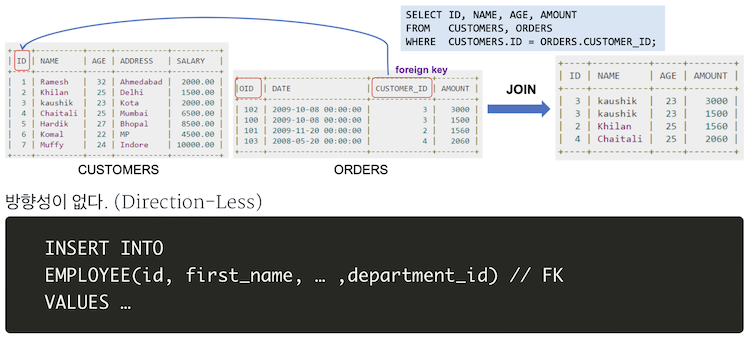

# 객체 관계 매핑(ORM)
## ORM이란

   

Object Relational Mapping(객체-관계 매핑)의 약자로, **객체와 관계형 데이터베이스의 데이터를 자동으로 매핑(연결)해주는 것**을 말함

- 객체 지향 프로그래밍은 클래스를 사용하고, 관계형 데이터베이스는 테이블을 사용함
→ **객체 모델과 관계형 모델 간 불일치**가 존재하게 됨
- ORM을 통해 객체 간의 관계를 바탕으로 SQL을 자동으로 생성하여 불일치를 해결함

ex)

```python
from django.db import models

class Post(models.Model):
    title = models.CharField(max_length=50)
    body = models.CharField(max_length=1200)
```

위 코드를 실행하면 자동으로 아래와 같은 테이블이 생성됨


장고가 ORM으로 자동으로 아래와 같은 쿼리를 생성해서 실행했기 때문!

```sql
CREATE TABLE "blog1_post" (
    "id" integer NOT NULL PRIMARY KEY AUTOINCREMENT, 
    "title" varchar(50) NOT NULL,
    "body" varchar(1200) NOT NULL
)
```

<br></br>
### 객체와 테이블 사이의 불일치?

1. **세분성** 
    - 경우에 따라 데이터베이스에 있는 해당 테이블 수보다 객체 모델이 더 많은 클래스를 가질 수 있음
    - 예를 들어, 사용자 세부사항에서
        - 코드 재사용과 유지보수를 위해 Person과 Address라는 두 개의 클래스로 나눌 수 있음
        - 그러나 데이터베이스에는 person이라는 하나의 테이블에 사용자 세부사항을 저장할 수 있음
2. **상속** 
    - RDBMS에는 객체지향 프로그래밍 언어의 ‘상속’ 개념이 존재하지 않음
3. **일치** 
    - RDBMS에서는 PK가 같으면 서로 동일한 record로 정의하지만, Java에서는 주소값이 같거나(==) 내용이 같은 경우(equals())를 구분하여 정의함
4. **연관성**
    - 객체지향 언어는 객체 참조로 연관성을 나타내는 반면, RDBMS는 연관성을 ‘외래키’로 나타냄
    
    ```java
    // Java에서의 객체 참조 -> 방향성이 존재
    public class Employee {
    		private int id;
    		private String first_name;
    		private Department department;   // Department 객체를 참조함
    		...
    }
    // Employee -> Department
    // 자바에서 양방향 관계가 필요한 경우, 연관을 두 번 정의해야 함 
    ```
    
    
    

5. **탐색/순회**
    - 객체지향 언어와 RDBMS에서 객체에 액세스하는 방법은 근본적으로 다름
    - Java에서는 하나의 연결에서 다른 연결로 이동하면서 탐색/순회함 (그래프 형태)
        - 예를 들어, aUser.getBillingDetails().getAccountNumber()
    - RDBMS에서는 일반적으로 SQL 쿼리 수를 최소화하고 JOIN을 통해 여러 엔티티를 로드하고 원하는 대상 엔티티를 선택함

<br></br>

## ORM 프레임워크 종류
ORM을 구현하기 위한 구조와, 구현을 위해 필요한 여러 기능들을 제공하는 소프트웨어

- JAVA(JPA) - Hibernate, EclipseLink, DataNucleus, Ebean 등
    - JPA는 자바 진영에서 ORM 기술 표준으로 사용되는 인터페이스의 모음으로, JPA를 구현한 대표적인 오픈소스로는 Hibernate가 있음
- C++ - ODB, QxOrm 등
- Python - Django, SQLAlchemy, Storm 등
- iOS - DatabaseObjects, Core Data 등
- .NET - NHibernate, DatabaseObject, Dapper 등
- PHP - Doctrine, Propel, RedBean 등

<br></br>

## ORM의 장단점
### 장점    
- **객체지향적인 코드로 인해 더 직관적이고 비즈니스 로직에 더 집중할 수 있게 도와줌**
    - ORM을 이용하면 SQL Query가 아닌 직관적인 코드(메소드)로 데이터를 조작할 수 있어, 개발자가 객체 모델로 프로그래밍하는 데 집중할 수 있도록 도와줌
    - 각종 객체에 대한 코드를 별도로 작성하기 때문에 코드의 가독성을 올려줌
    - SQL의 절차적이고 순차적인 접근이 아닌 객체 지향적인 접근으로 인해 생산성이 증가함
    
- **재사용 및 유지보수의 편리성이 증가함**
    - ORM은 독립적(하나의 클래스)으로 작성되어 있고, 해당 객체들을 재활용할 수 있음
    - 때문에 모델에서 가공된 데이터를 컨트롤러에 의해 뷰와 합쳐지는 형태로 디자인 패턴을 견고하게 다지는데 유리함
    - 매핑정보가 명확하여, ERD를 보는 것에 대한 의존도를 낮출 수 있음
    
- **DBMS에 대한 종속성이 줄어듦**
    - 대부분 ORM 솔루션은 DB에 종속적이지 않음 → DBMS를 교체해야 하더라도 비교적 적은 리스크와 시간이 소요됨
    - 자바에서 가공할 경우(JPA를 사용할 경우), equals, hashCode의 오버라이드 같은 자바의 기능을 이용할 수 있고, 간결하고 빠른 가공이 가능함
<br></br>
### 단점
- **ORM은 프레임워크가 자동으로 SQL을 작성하기 때문에, 의도대로 SQL이 작성되었는지 확인할 필요가 있음** (즉, SQL을 알고 있어야 함)

- **완벽히 ORM으로만 서비스를 구현하기 어려움**
    - 사용하기는 편하지만 설계는 매우 신중하게 해야함 (프로젝트의 복잡성이 커질 경우 난이도가 올라감)
    - 잘못 구현된 경우, 속도 저하 및 일관성이 무너지는 문제점이 발생할 수 있음
    - 일부 자주 사용되는 대형 쿼리는 속도를 내기 위해 SP를 쓰는 등 별도의 튜닝이 필요할 수 있음
    
- **프로시저가 많은 시스템에서는 ORM의 객체 지향적인 장점을 활용하기 어려움**
    - 이미 프로시저가 많은 시스템에선 다시 객체로 바꿔야하며, 그 과정에서 생산성 저하나 리스크가 많이 발생할 수 있음

<br></br>
<br></br>

### 면접질문   
1. ORM 프로그래밍은 무엇인가요?
2. ORM 프로그래밍이 RDBMS와 비교했을 때 어떤 장단점을 가지고 있나요?

<br></br>
### 출처
[https://gmlwjd9405.github.io/2019/02/01/orm.html](https://gmlwjd9405.github.io/2019/02/01/orm.html)     
[https://lipcoder.tistory.com/366](https://lipcoder.tistory.com/366)      
[https://tibetsandfox.tistory.com/17](https://tibetsandfox.tistory.com/17)      
[https://thisisprogrammingworld.tistory.com/132](https://thisisprogrammingworld.tistory.com/132)
