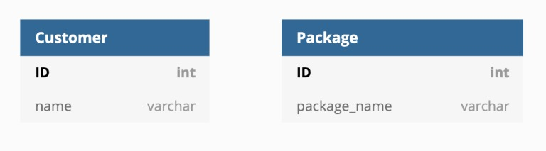

# 관계, 키
# 1. 관계

## 정의

- 엔터티의 인스턴스 사이 논리적 연관성
- 존재하는 형태나 행위로서 서로서로에게 연관성이 부여된 상태
- [관계명, 관계차수, 선택성]으로 구성
    - 관계명(Membership)
        - 관계의 이름, 각 관계는 2개의 관계명을 가지고 있다. (부서[포함한다]-사원[소속된다])
        - 능동적이거나 수동적으로 명명
        - 과거/미래형이 아닌 현재형으로 표현(수강신청했다X, 수강신청한다O)
    - 관계차수(Degree, Cardinality)
        - 관계의 참여자수 1:1, 1:M, M:N으로 표현
    - 관계선택사양(Optionality)
        - 관계의 필수/선택 관계를 표현
        - 필수참여관계는 엔터티끼리 필수적으로 연결되어야하는 관계
        - 선택참여 관계는 언터티까리 선택적으로 연결되어야하는 관계

## 관계 분류

- ERD : 존재에 의한 관계, 행위에 대한 관계 (구분없이 단일화된 표기법)
- UML : 연관관계, 의존관계 (실선과 점선으로 표기 구분)
- *UML : Unified Modeling Language, 시스템 개발과정에서 개발자간의 의사소통을 원할하게 이루어지게 하기 위해 표준화한 모델링 언어. 소프트웨어 시스템, 업무 모델링, 시스템의 산출물을 규정하고 시각화, 문서화 하는 언어. ([https://velog.io/@hanblueblue/UML-UML-기초](https://velog.io/@hanblueblue/UML-UML-%EA%B8%B0%EC%B4%88))

<table>
    <th>분류</th>
    <th>설명</th>
    <th>예시</th>
    <tr>
        <td>존재에 따른 분류</td>
        <td>엔터티 간의 상태를 의미. 
            ERD : 존재/행위 단일화된 표기법 
            UML : 연관관계, 실선 표현</td>
        <td>소속한다</td>
    </tr>
    <tr>
        <td>행위에 따른 분류</td>
        <td>엔터티간의 행위를 의미 
        ERD : 존재/행위 단일화된 표기법 
        UML : 의존관계, 점선 표현</td>
        <td>주문한다</td>
    </tr>
</table>

## 표기법(ERD)

- Barker / IE표기법
    
    

    

- Crow’s Foot 표기법

    

- 관계 읽는 방법
    - 관계에 참여하는 기준 엔터티를 하나의 또는 각(Each)로 읽고 대상 엔터티의 개수를 읽고 관계선택사양과 관계명을 읽는다.
    - 기준(Source) 엔터티를 한 개(One)또는 각(Each)로 읽음
    - 대상(Target) 엔터티의 관계참여도, 즉 개수(하나, 하나이상)를 읽음
    - 관계 선택사양과 관계명을 읽음
    
    
    

## 종류

### 1:1 관계

- **하나의 레코드가 다른 테이블의 레코드 한 개와 연결된 경우.**
- **1:1 관계는 자주 사용하지 않는다. 1:1로 나타낼 수 있는 관계라면 Users 테이블에 phone_id를 대신해 phone_number를 직접 저장하는 게 나을 수 있다.**
- (EX) **다음과 같이 Users 테이블과 Phonebook 테이블이 있다고 가정한다.**
    - **Users 테이블은 ID, name, phone_id를 가지고 있다.**
    - **이 중 phone_id는 외래키(foreign key)로써, Phonebook 테이블의 ID 와 연결되어 있다.**
    - **Phonebook 테이블은 ID와 phone_number를 가지고 있다.각 전화번호가 단 한 명의 유저와 연결되어 있고, 그 반대도 동일하다면, Users 테이블과 Phonebook 테이블은 1:1 관계(One-to-one relationship)이다**
    
    

### 1:N 관계

- **하나의 레코드가 서로 다른 여러 개의 레코드와 연결된 경우**
- **Users 테이블과 Phonebook 테이블의 관계를 다음과 같다면,**
- **이 구조에서는 한 명의 유저가 여러 전화번호를 가질 수 있다. 그러나 여러명의 유저가 하나의 전화번호를 가질 수는 없다.**
- **이런 1:N(일대다) 관계는 관계형 데이터베이스에서 가장 많이 사용한다.**

### N:M관

- **여러 개의 레코드가 다른 테이블의 여러 개의 레코드와 관계가 있는 경우**
- **N:M(다대다) 관계를 위해 스키마를 디자인할 때에는, Join 테이블을 만들어 관리함.**
- **1:N(일대다) 관계와 비슷하지만, 양방향에서 다수의 레코드를 가질 수 있다.**
- **다음과 같이 여행 상품을 관리하는 테이블이 있다고 가정한다.**
- (EX)**여러 개의 여행 상품이 있고, 여러 명의 고객이 있다.고객 한 명은 여러 개의 여행 상품을 구매할 수 있고, 여행 상품 하나는 여러 명의 고객이 구매할 수 있다.**
    
    
    
    - **다대다 관계는 두 개의 일대다 관계와 그 모양이 같다. 두 개의 테이블과 1:N(일대다) 관계를 형성하는 새로운 테이블로 N:M(다대다) 관계를 나타낼 수 있다.**
    - **이렇게 다대다 관계를 위한 테이블을 조인 테이블이라고 한다.N:M(다대다) 관계를 그림으로 나타내면 다음과 같다.**
        
        
        
    - **customer_package 테이블에서는 고객 한 명이 여러 개의 여행 상품을 가질 수 있고, 여행 상품 하나가 여러 개의 고객을 가질 수 있다.**
    - **customer_package 테이블은 customer_id와 package_id를 묶어주는 역할이다.**
    - **이 테이블을 통해 어떤 고객이 몇 개의 여행 상품을 구매했는지 또는, 어떤 여행 상품이 몇 명의 고객을 가지고 있는지 등을 확인할 수 있다.**
    - **이렇게 조인 테이블을 생성하더라도, 조인 테이블을 위한 기본키(여기서는 ID)는 반드시 있어야 한다.**
    
    <aside>
    💡 만약 외래키를 리스트 형식으로 관리하는 필드가 있다면?(조인 테이블을 사용하지 않을 시 문제점)
    1. 필드에 저장되는 데이터의 크기를 설정해야하는데 엄청 커지게 되고 데이터가 저장되지 못할 수 도 있다.
    2. 데이터를 조회하는데 많은 비용이 발생하게 된다.
    3. 데이터를 수정할 때 두 곳에 수정이 잘 되었는지 확인이 불편하다. (실수를 유발한다.)
    
    </aside>
    

### ☝️ 자기 참조 관계(Self Referencing Relationship)

- **때로는 테이블 내에서도 관계가 필요하다.**
- **예를 들어 추천인이 누구인지 파악하기 위해 사용할 수 있다.**
    - **다음과 같이 유저 테이블이 있다. user_id는 기본 키(primary key), name은 사용자의 이름, 그리고 recommend_id는 추천인 아이디이다.**
    
    
    
    - **User 테이블의 recommend_id는 User 테이블의 user_id와 연결되어 있다. 한 명의 유저(user_id)는 한 명의 추천인(recommend_id)를 가질 수 있다.**
    - **그러나 여러 명이 한 명의 유저를 추천인으로 등록할 수 있다.**
- **이 관계는 1:N(일대다) 관계와 유사하다고 생각할 수 있다. 그러나 일반적으로 일대다 관계는 서로 다른 테이블의 관계를 나타낼 때 표현하는 방법이다.**

---

# 2. 키 Key

## 주 식별자 특성

- 식별자 개념은 엔터티와 키 사이 어딘가… 필요할시 내용 추가할 것 여기서는 식별자 특성만 알고 있으면 된다!

<table>
    <th>특징</th>
    <th>내용</th>
    <th>예시</th>
    <tr>
        <td>유일성</td>
        <td>주식별자에 의해 엔터티내의 모든 인스턴스들을 유일하게 구분함</td>
        <td>사원번호가 모든 직원에게 개인별로 고유하게 부여됨</td>
    </tr>
     <tr>
        <td>최소성</td>
        <td>주식별자를 구성하는 속성의 수는 유일성을 만족하는 최소의 수가 되어야함</td>
        <td>사원분류코드+사원번호를 식별자를 구성하면, 사원번호만으로도 식별가능 하므로 부적절한 구조</td>
    </tr>
     <tr>
        <td>불변성</td>
        <td>주식별자가 한 번 특정 엔터티에 지정되면 그 식별자의 값은 변하지 않아야 함</td>
        <td>사원번호가 바뀌면 안됨</td>
    </tr>
     <tr>
        <td>존재성</td>
        <td>주식별자가 지정되면 반드시 데이터 값이 존재 (Null 안됨) </td>
        <td>사원번호 없는 직원은 있을 수 없음</td>
    </tr>
</table>

## 기본키(Primary Key)

- 유일성과 최소성을 만족하는 키, 줄어서 PK라고 표시함. Null값 허용하지 않음.
- 테이블에 특정 레코드를 구별하기 위해 후보키 중 선택된 고유한 식별자.
- 여러 후보키가 존재할 수 경우 고려하면 좋은 선택 기준
    - 값이 변경이 빈번하지 않은 필드 선택
    - 값이 상대적으로 복잡하지 않은 필드 선택

### ➕자연키(Natural Key)

유저 테이블을 만든다고 가정하면 주민번호, 이름, 성별 등의 속성이 있다. 

이름, 성별은 중복값이 들어올 수 있으므로 부적절하고 남는 것은 주민등록번호가 된다. 

이런식으로 중복값을 제외하며 중복되지 않는 것을 ‘자연스레’ 뽑다가 나오는 속성으로 기본키를 정한다고 해서 이 키를 자연키라고 표현한다.

자연키는 사용자에게 입력받는 정보이므로 언젠가 변할 가능성이 있다.

ex) 주민번호, 사원번호(재발급 가능)

### ➕인조키(Artificial Key)

위 상황에서 주민등록번호를 사용하지 않고 인위적으로 유저 아이디를 부여하여 고유 식별자를 생성할 경우. 

이 키를 인조키라고 한다. Oracle dml sequence, MySQL의 auto increment 등으로 설정한다. 

인조키는 변하지 않는다. 참여자(데이터)가 몇 명이든 그들을 구분할 수 있다.

### ❓자연키와 인조키 중 무엇을 사용할까

보통의 경우 자연키보다는 인조키를 기본키로 설정하고 그것을 권장한다.

비즈니스 모델에서 추출한 자연키는 비즈니스 규칙에 의해 혹은 그 의미가 변할 여지가 다분하다.

ex) 과거에는 홈페이지 가입시 주민번호를 필수로 받던 시절이 있었음 → 보안정책 변경 →DB에서 주민번호를 기본키로 사용했다면 엄청난 수정을 해야했음 💡주민번호가 갖는 고유특성은 변하지 않았지만 그 값이 갖는 의미가 변했기 때문에 더이상 DB에서 사용불가

### ➕복합키(Composite Key)

- 두 개 이상의 칼럼을 묶어서 하나의 기본키로 지정하는 것.
- 기본키는 하나의 테이블에 하나만 존재할 수 있고, 기본키는 하나 이상의 칼럼으로 구성 될 수 있다. 그러므로 기본키가 복합키라면 복합키또한 당연히 유일성과 최소성을 만족함.

### ➕유니크 (키)(Unique Key)

- 유일성을 갖기 위한 키로 그렇게 지정한 것
- null을 허용한다!
- 해당 키에 유니크 속성을 부여한 것을 유니크 키라고 표현한다.
- 하나의 테이블에 컬럼마다 지정이 가능하다. (PK는 오직하나)
- ex) 회원가입시 닉네임을 중복설정 불가능 하게 하면 닉네임은 유니크 키라고 표현할 수 있음.
- 기본키가 유니크 키의 성질을 포함하는 것.

| Unique key | Primary key |
| --- | --- |
| 중복방지용 | 중복방지 + key 식별 |
| Null 허용 | Null 불가 |
| 여러 열 지정가능 | 한 열에만 지정가능 |

## 외래키(Foreign Key)

- FK라고도 하며, 다른 테이블의 기본키를 그대로 참조하는 값.
- 개체와의 관계를 식별하는 데 사용
- 테이블A가 테이블B를 참조할 때,  A의 외래키는 B의 레코드를 유일하게 식별할 수 있어야함.
- 하나의 필드 또는 전체 필드의 부분집합으로 중복값이나 Null값을 가질 수 없음.

## 후보키(Candidate Key)

- 기본키가 될 수 있는 후보들
- 유일성과 최소성을 동시에 만족하는 키
- 유일성과 최소성을 만족하는 슈퍼키. 슈퍼키 중 어떤 한 속성이라도 제거하면 슈퍼기의 성질을 잃는 경우 이 키는 후보키이다.
- **대체키(Alternate Key)** : 후보키가 2개 이상일 경우 기본키로 지정 후 남은 키

## 슈퍼키(Super Key)

- 각 레코드를 유일하게 식별할 수 있는 유일성을 갖춘 키
- 테이블 내 필드 전체의 부분집합 중 레코드를 유일하게 식별해 낼 수 있는 속성 또는 속성집합.

## 키 간 관계

---

# 면접질문

- 기본키와 복합키를 설명하시오.
    - **기본 키** 는 모든 행 데이터가 고유하게 식별되는 테이블의 해당 열입니다. 테이블의 모든 행에는 기본 키가 있어야하며 두 행은 동일한 기본 키를 가질 수 없습니다. 기본 키 값은 절대로 null이거나 수정하거나 업데이트 할 수 없습니다. **복합 키** 는 열 세트가 테이블의 모든 행을 고유하게 식별하는 후보 키의 양식입니다.
- Unique키로 무엇을 이해합니까?
    - Unique 키는 유일성을 가지기 위해 설정해 놓은 키로 중복이 되는 것을 방지합니다. Primary 키는 오직 하나만 생성할 수 있지만, Unique키는 여러개 생성이 가능합니다. Primary키의 경우 NULL 값을 허용하지 않지만, Unique 키는 NULL 값을 허용합니다.

# 출처

- [https://hanamon.kr/관계형-데이터베이스-설계-관계-종류/](https://hanamon.kr/%EA%B4%80%EA%B3%84%ED%98%95-%EB%8D%B0%EC%9D%B4%ED%84%B0%EB%B2%A0%EC%9D%B4%EC%8A%A4-%EC%84%A4%EA%B3%84-%EA%B4%80%EA%B3%84-%EC%A2%85%EB%A5%98/)
- TOPCIT ESSENCE ver3 기술영역 - 데이터 이해와 활용
- [책]면접을 위한 CS전공지식 노트
- [https://velog.io/@kw78999/DB-바커와-IE-표기법](https://velog.io/@kw78999/DB-%EB%B0%94%EC%BB%A4%EC%99%80-IE-%ED%91%9C%EA%B8%B0%EB%B2%95)
- 자연키와 인조키 : [https://multifrontgarden.tistory.com/180](https://multifrontgarden.tistory.com/180)
- UM : L[https://velog.io/@hanblueblue/UML-UML-기초](https://velog.io/@hanblueblue/UML-UML-%EA%B8%B0%EC%B4%88)
- [https://lotuus.tistory.com/43](https://lotuus.tistory.com/43)
- 면접질문참고 : [https://hyonee.tistory.com/41](https://hyonee.tistory.com/41)
- 복합키 : [https://velog.io/@kon6443/DB-기본키-외래키-후보키-복합키-개념-4x1bgz5w](https://velog.io/@kon6443/DB-%EA%B8%B0%EB%B3%B8%ED%82%A4-%EC%99%B8%EB%9E%98%ED%82%A4-%ED%9B%84%EB%B3%B4%ED%82%A4-%EB%B3%B5%ED%95%A9%ED%82%A4-%EA%B0%9C%EB%85%90-4x1bgz5w)
- 유니크키 : [https://unluckyjung.github.io/db/2020/11/16/PrimaryKey_VS_Unique/](https://unluckyjung.github.io/db/2020/11/16/PrimaryKey_VS_Unique/)
- [https://jjeongil.tistory.com/1234](https://jjeongil.tistory.com/1234)
- [https://snepbnt.tistory.com/68](https://snepbnt.tistory.com/68)
- [https://im-codding.tistory.com/59](https://im-codding.tistory.com/59)
- UML : [https://sabarada.tistory.com/72](https://sabarada.tistory.com/72)
