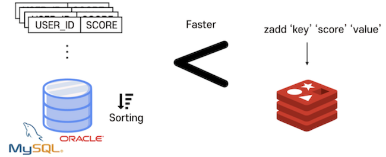

# 레디스(Redis)
## 개념


**Redis는 고성능 키-값 저장소로서 String, list, hash, set, sorted set 등의 자료 구조를 지원하는 NoSQL**
- Remote Dictionary Server의 약자로, 외부에서 사용 가능한 Key-Value 쌍의 해시 맵 형태의 서버
- 별도의 쿼리 없이 Key를 통해 빠르게 결과를 가져올 수 있음
- 다른 DBMS들처럼 디스크에 데이터를 저장하는 구조가 아니라, 메모리에 데이터를 저장(인메모리)하기 때문에 작업 속도가 빠름
- 대신 인메모리 데이터 저장소이기 때문에 용량이 크지 않음 → 보통 캐시 데이터베이스 서버로 사용함

<br></br>

## 특징
- **영속성을 지원하는 인 메모리 데이터 저장소**
    - 데이터를 메모리에 저장하기 때문에, 서버의 전원이 꺼지면 모든 데이터가 삭제됨
    - 이러한 문제를 해결하기 위해, 메모리에 저장되어 있는 Redis의 데이터를 디스크로 백업하는 기능을 지원하며, AOF 방식과 RDB 방식이 있음

```sql
💡 AOF
- 입력/수정/삭제 명령을 실행할 때마다 로그 파일에 저장하게 되며, 서버가 재시작될 때 로그 파일에 기록된 데이터를 실행하여 데이터를 복구할 수 있음
- 장점: 실시간 데이터를 백업할 수 있음, 저장 속도가 빠르고 데이터 손실이 거의 없음, 복원 가능
- 단점: 로그 파일 크기가 매우 커질 수 있음, 데이터 복원 소요시간이 긺

💡 RDB
- 운영 중인 데이터를 압축된 크기로 저장하는 방식
- 장점: 데이터 크기가 작음, 복구 속도가 빠름(크기 작고 단일 파일이므로)
- 단점: 실시간 데이터로 백업이 어려움(지정된 시간에 백업 진행), 백업 시간 오래 걸림, 데이터 손실 우려

-> Redis에서 RDB와 AOF의 장/단점으로 인해 2가지 방식 모두 사용하는 경우가 있으며, 
 RDB로는 주기적으로 백업하고, 백업 기준으로 AOF 로그를 초기화하여 시간절약과 실시간 데이터를 유지함
```


- **다양한 자료구조(컬렉션)를 지원함**
    
    
    

- **싱글 스레드 방식으로 인해 연산을 원자적으로 수행할 수 있음**
    - 멀티 스레드를 사용하면서 발생하는 문맥 교환 비용을 줄일 수 있고, 스레드 간 자원 공유 문제에서 자유로움
    - “Redis는 single thread이며 multiplexing이란 기술을 사용하여 단일 프로세스가 모든 클라이언트 요청을 처리합니다. 모든 요청이 순차적으로 처리되며, 이는 Node.js의 작동 방식과 매우 유사합니다. Redis 2.4부터는 디스크 I/O와 관련된 느린 I/O 작업을 백그라운드에서 수행하기 위해 여러 개의 스레드를 사용하지만 Redis가 단일 스레드를 사용하여 모든 요청을 처리한다는 사실은 바뀌지 않습니다.”
    - Redis Documents 중 ([https://junuuu.tistory.com/746](https://junuuu.tistory.com/746) 참고)

<br></br>

## 사용 예시
**운영 중인 웹 서버에서 키-값 형태의 데이터를 처리해야 하며, I/O가 빈번히 발생해** 다른 저장 방식을 사용하면 효율이 떨어지는 경우에 사용함 

ex) 조회수와 같은 카운트 형태의 데이터      
유튜브의 인기 동영상의 경우, 1시간도 안돼서 100만 조회수를 넘기는 경우도 있음     
→ 조회수 데이터를 RDB 형태로 저장해 I/O 반복하면 엄청난 자원이 사용될 것     
→ Redis를 사용해 조회수 데이터를 캐싱 처리하고, 일정한 주기에 따라 RDS를 업데이트 한다면 성능이 향상됨      

- 또한 **사용자의 세션 관리**에도 많이 사용됨 → 사용자의 세션을 유지하고, 불러오고, 여러 활동들을 추적하는 데 효과적으로 사용할 수 있음
- 매우 빠르게 동작한다는 특성을 이용해, **메시지 큐**에도 사용할 수 있음
- **API 캐싱**에도 사용할 수 있음

<br></br>
<br></br>

### 면접질문
1. Redis와 MongoDB 차이점?
2. Redis에 대해서 간단히 설명해주세요
3. Redis를 왜 사용하나요?

<br></br>
### 출처
[https://zangzangs.tistory.com/72](https://zangzangs.tistory.com/72)    
[https://steady-coding.tistory.com/586](https://steady-coding.tistory.com/586)    
[https://server-talk.tistory.com/489](https://server-talk.tistory.com/489)    
[https://brunch.co.kr/@skykamja24/575](https://brunch.co.kr/@skykamja24/575)    
