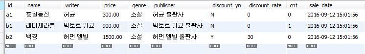
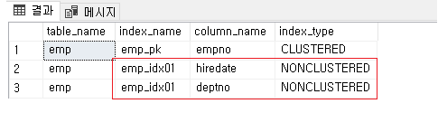

# 인덱스 생성 방법(My SQL, MS SQL SERVER, Oracle)

# 1. MySQL

기본적으로 primarykey = primary index = 클러스터형 인덱스

우리가 생성하는 인덱스 = 보조 인덱스 = 비클러스터형 인덱스(MS SQL)



## 1.1 생성

- 테이블을 만든 후 추가로 생성할 때

```sql
CREATE [UNIQUE] INDEX <인덱스명> ON <테이블명> ( 칼럼명1); --단일 [UNIQUE]는 선택 옵
CREATE [UNIQUE] INDEX <인덱스명> ON <테이블명> ( 칼럼명1, 칼럼명2, ... ); --다중
CREATE [UNIQUE] INDEX <인덱스명> ON <테이블명> ( 칼럼명 DESC) -- 인덱스 생성시 필드 정렬방식 설정
CREATE [UNIQUE] INDEX <인덱스명> ON <테이블명> ( 칼럼명 ASC)

CREATE INDEX idx_test ON books ( writer );
```

- 테이블 생성 시 인덱스 생성할 때

```sql
INDEX <인덱스명> ( 칼럼명1, 칼럼명2 ) 
UNIQUE INDEX <인덱스명> ( 칼럼명 )  --> 항상 유일해야 함.

CREATE TABLE `books` (
       `id` varchar(5) NOT NULL,
       `name` varchar(20) NOT NULL,
       `writer` varchar(20) NOT NULL,
       `price` decimal(10,2) DEFAULT '0.00',
       `genre` varchar(20) NOT NULL,
       `publisher` varchar(20) NOT NULL,
       `discount_yn` char(1) NOT NULL,
       `discount_rate` decimal(10,0) DEFAULT '0',
       `cnt` decimal(10,0) DEFAULT '0',
       `sale_date` datetime DEFAULT NULL,
       PRIMARY KEY (`id`), --기본키 = 기본인덱스 = 클러스터 인덱스
       INDEX `idx_test` (`writer`) -- 보조인덱스 = 비클러스터 인덱
     );
```


>☑️ **특정 테이블에 Primary Key 가 존재하면서 UNIQUE KEY 가 존재할 경우**
>
>- Primary Key 로 지정된 컬럼은 클러스터드 인덱스가 된다.
>
>- Unique Key 로 지정된 컬럼들은 보조 인덱스가 된다.
>
>- Unique Key 로 지정된 컬럼이 NULL 을 허용하던 허용하지 않던 상관없이 모두 보조 인덱스가 된다.


> ☑️**특정 테이블에 Primary Key 가 존재하지 않으며 특정 컬럼에 UNIQUE NOT NULL 제약이 지정될 경우**
>
>- 해당 컬럼은 클러스터드 인덱스가 된다.
>
>- NOT NULL 조건이 없다면 보조 인덱스가 된다.


- 인덱스를 테이블에 추가

```sql
ALTER TABLE <테이블명> ADD INDEX <인덱스명> ( 칼럼명1, 칼럼명2, ... );

ALTER TABLE books ADD INDEX idx_test ( writer );
```

## 1.2 보기&삭제

- 테이블에 등록된 인덱스 확인

```sql
SHOW INDEX FROM <테이블명>;
(참고 - 테이블 인덱스 크기 확인) 
SHOW table status like <테이블명>;

SHOW INDEX FROM books;
```

- 인덱스 사용 확인
    - 내가 쿼리한 select 문이 인덱스를 사용해서 조회했는지 확인하는 방법

```sql
select * from 테이블명 where 인덱스적용한컬럼명 = '데이터' ;
```

- 인덱스 삭제

```sql
ALTER TABLE <테이블명> DROP INDEX <인덱스명>;

ALTER TABLE books DROP INDEX idx_test;
```

# 2. MS-SQL Server

우리가 생성하는 일반적인 인덱스 = 비클러스터형 인덱스 생성(mysql의 보조인덱스)

## 2.1 생성

기본적으로 오름차순이다.

```sql
CREATE INDEX [인덱스명] ON [테이블명] ([칼럼1], [칼럼2], [칼럼3] ...)

CREATE INDEX emp_idx01 ON dbo.emp (hiredate)

/* 인덱스 컬럼 정렬1 (단일 컬럼) */
CREATE INDEX emp_idx01 ON dbo.emp (hiredate DESC) -- 디폴트 ASC

/* 인덱스 컬럼 정렬2 (다중 컬럼) */
CREATE INDEX emp_idx01 ON dbo.emp (hiredate DESC, deptno ASC)
```

## 2.2 삭제

```sql
DROP INDEX [인덱스명] ON [테이블명]

DROP INDEX emp_idx01 ON dbo.emp
```

## 2.3 인덱스 변경

- 칼럼을 추가하거나 빼는 경우 인덱스를 변경해야함
- 그러나 인덱스 변경 명령x → 삭제하고 다시 인덱스를 생성해야한다!

## 2.4 조회

emp 테이블을 조회하면 **emp_idx01** 인덱스가 비클러스터형으로 생성된 것을 확인할 수 있다.

```sql
SELECT a.name      AS table_name
     , b.name      AS index_name
     , d.name      AS column_name
     , b.type_desc AS index_type
  FROM SYS.TABLES a
     , SYS.INDEXES b
     , SYS.INDEX_COLUMNS c
     , SYS.COLUMNS d
 WHERE a.name = 'emp' 
   AND a.object_id = b.object_id 
   AND b.object_id = c.object_id 
   AND b.index_id  = c.index_id 
   AND c.object_id = d.object_id 
   AND c.column_id = d.column_id
```



## 2.5

```sql
/* 클러스터형 인덱스 생성 */
CREATE CLUSTERED INDEX emp_idx02 ON dbo.emp (empno)

/* 비클러스터형 인덱스 생성 */
CREATE NONCLUSTERED INDEX emp_idx03 ON dbo.emp (deptno) -- 명시적
CREATE INDEX emp_idx04 ON dbo.emp (job) --암시적
```

- 클러스터형 인덱스는 물리적으로 행을 재배열하여 저장하며, 테이블당 하나의 클러스터형 인덱스를 생성할 수 있다. 기본 키(PK)를 생성하면 클러스터형 인덱스가 생성된다.
    - 데이터 접근 방식: **루트 페이지 → 데이터 페이지**
- 비클러스터형 인덱스는 데이터 행의 주소(RID)를 별도의 인덱스 페이지에 저장하며, 테이블에 여러 개(버전마다 상의)의 비클러스터형 인덱스를 생성할 수 있다. NONCLUSTERED 키워드는 생략해도 비클러스터형 인덱스가 생성된다.
    - 데이터 접근 방식: **루트 페이지 → 리프 페이지 → 데이터 페이지**

# 3. Oracle

가장 많이 사용하는 B-트리 인덱스(일반 인덱스)에 대해 설명

## 3.1 생성

```sql
CREATE INDEX emp_ix01 ON emp(hiredate) -- 단일

CREATE INDEX emp_ix02 ON emp(job, deptno) -- 복합

CREATE UNIQUE INDEX emp_uk ON emp(empno, mgr) -- unique
```

- 단일 : rowid 와 인덱스로 지정된 컬럼이 정렬되어 (테이블데이터와 분리된)별도의 공간에 저장
    - 인덱스 영역이 이미 정렬되어 있어 아주 빠르게 검색
- 복합 : 최대 32개 컬럼까지 지정가능
- unique : 인덱스 지정된 컬럼이 unique 값이어야함

## 3.2 삭제

```sql
DROP INDEX [스키마명.]인덱스명;
DROP INDEX emp_idx01
```

## 3.3 정렬

기본값은 오름차순

```sql
CREATE INDEX emp_ix01 ON emp(hiredate DESC) -- 내림차
```

## 3.4 인덱스 변경(수정)

alter index 문이 없으므로 추가/변경을 위해서는 삭제하고 재생성 해야함

```sql
-- 인덱스 삭제
DROP INDEX emp_ix01;
-- 인덱스 재생성
CREATE INDEX emp_ix01 ON emp(hiredate, job);
```

- 인덱스 명 변경은 할 수 있음

```sql
ALTER INDEX [스키마명.]인덱스명 RENAME TO 변경인덱스명

ALTER INDEX emp_ix01 RENAME TO emp_ix01_new
```

- 속도가 저하되거나 깨졌을 경우 리빌드 하여 재구축가능
    - **ONLINE:** 온라인 상태에서 인덱스 리빌드 진행 (리빌드 중에 테이블 DML 작업 가능, 사용시 주의)
    - **TABLESPACE:** 테이블스페이스를 변경 시 사용

```sql
ALTER INDEX [스키마명.]인덱스명 REBUILD [ONLINE] [TABLESPACE 테이블스페이스명]

ALTER INDEX emp_ix01 REBUILD
```

- 인덱스 비활성화
    - 해당 인덱스는 사용이 불가해지고 DML작업이 수행되도 갱신x
    - 다시 활성화 하려면 리빌드 하면 됨.

```sql
ALTER INDEX emp_ix01 UNUSABLE
```

## 3.5 인덱스 조회

오라클 쿼리를 작성하기 전에 필수적으로 인덱스(Index)를 확인해야 한다. 인덱스를 무시하고 쿼리를 작성하면 심각한 성능 이슈가 발생 할 수 있다.

```sql
SELECT a.table_name 
     , a.index_name 
     , a.column_name 
  FROM all_ind_columns a 
 WHERE a.table_name = 'EMP' 
 ORDER BY a.index_name
        , a.column_position

/*컬럼 코멘트를 포함하여 조회*/ 
SELECT a.table_name
     , a.index_name
     , a.column_name
     , b.comments
  FROM all_ind_columns a
     , all_col_comments b
 WHERE a.table_name = 'EMP'
   AND a.table_owner = b.owner
   AND a.table_name = b.table_name
   AND a.column_name = b.column_name
 ORDER BY a.index_name
        , a.column_position
```

---

# 면접질문

- 인덱스 만드는 법을 설명해보세요.

# 출처

- https://huskdoll.tistory.com/605
- https://spiderwebcoding.tistory.com/6
- https://inpa.tistory.com/entry/MYSQL-%F0%9F%93%9A-%EC%9D%B8%EB%8D%B1%EC%8A%A4index-%ED%95%B5%EC%8B%AC-%EC%84%A4%EA%B3%84-%EC%82%AC%EC%9A%A9-%EB%AC%B8%EB%B2%95-%F0%9F%92%AF-%EC%B4%9D%EC%A0%95%EB%A6%AC
- [https://gent.tistory.com/492](https://gent.tistory.com/492)
- [https://gent.tistory.com/418](https://gent.tistory.com/418)