# 정규화_반정규화

## 정규화
데이터의 일관성, 최소한의 데이터 중복, 최대한의 데이터 유연성을 위한 방법 → 즉, 데이터를 분해하는 과정      
정규화를 수행하면 비즈니스에 변화가 발생해도 데이터 모델의 변경을 최소화할 수 있음

- 정규화는 제1정규화부터 제5정규화까지 있지만, 실질적으로는 제3정규화까지만 수행함

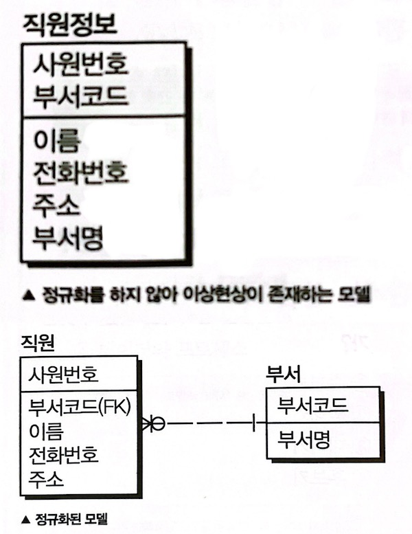

ex) 정규화를 수행하지 않은 위쪽 모델의 경우, 새로운 직원이 추가되는 경우 부서 정보가 없으면 부서코드를 임의의 값으로 넣어야 하는 등 이상현상이 발생함 
→ 정규화된 모델은 테이블이 분해되어, 직원 테이블과 부서 테이블 간에 부서코드로 조인을 수행하여 합집합으로 만들 수 있음 

  

## 정규화 절차
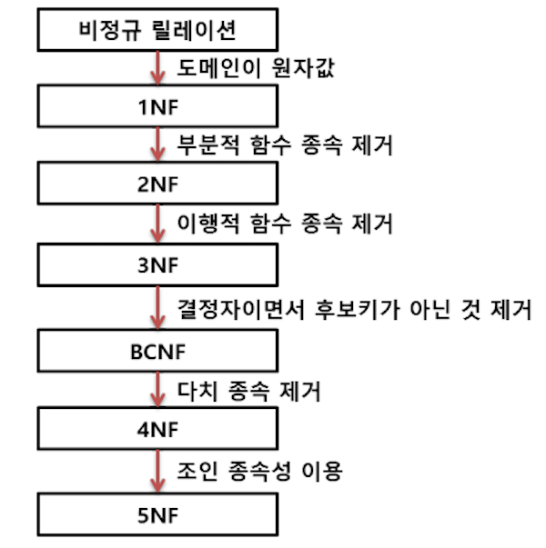    

### 제1정규화
테이블의 컬럼이 원자값(하나의 값)을 갖도록 테이블을 분해함        
ex) 추신수와 박세리는 여러 개의 취미를 가지고 있기 때문에 분해하여 제1정규형을 만족시킴 

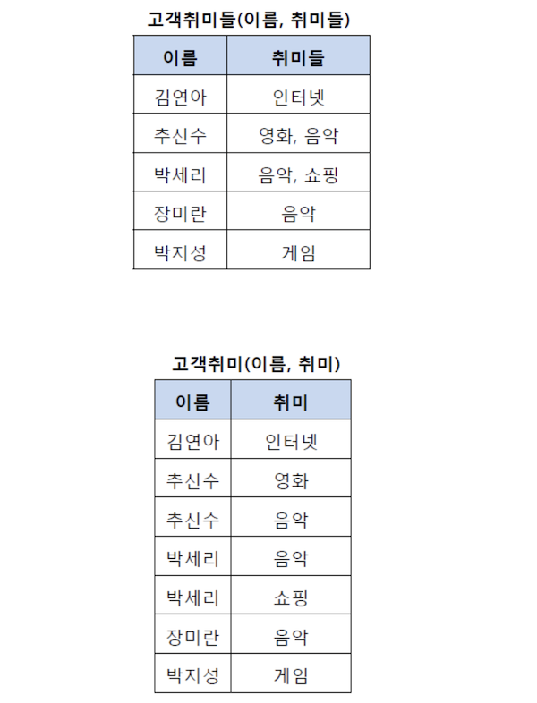
  
### 제2정규화
제1 정규화를 진행한 테이블에 대해 **완전 함수 종속성을 만족하도록** 테이블을 분해하는 것       
완전 함수 종속이라는 것은 기본키의 부분집합이 결정자가 되어서는 안된다는 것

ex) (학생번호, 강좌이름)의 복합키가 성적을 결정하고 있지만, ‘강좌이름’이 ‘강의실’을 결정할 수 있음(부분 함수 종속성 발생) → 기존의 테이블에서 강의실을 분해하여 별도의 테이블로 관리해 부분 함수 종속을 제거하고, 완전 함수 종속을 만족시킴  

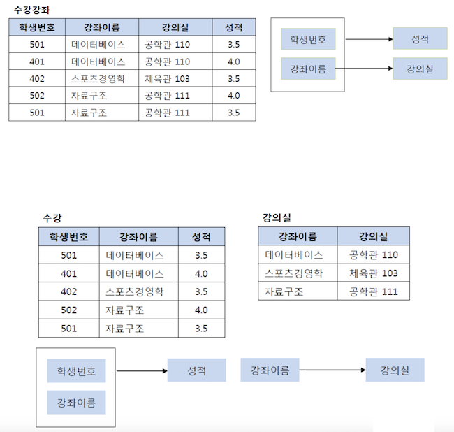
  
### 제3정규화
제2정규화를 진행한 테이블에 대해 **이행적 종속을 없애도록** 테이블을 분해하는 것      
이행적 종속이란 A→B, B→C가 성립할 때, A→C가 성립되는 것 

ex) ’학생번호→강좌이름→수강료’라는 이행적 관계가 발행하고 있기 때문에, (학생번호, 강좌이름) 테이블과 (강좌이름, 수강료) 테이블로 분해해야 함    
학생번호(갑)-강좌이름/수강료(을) 관계가 되어야 하는데, 학생번호(갑)-강좌이름(을)-수강료(병) 관계임 

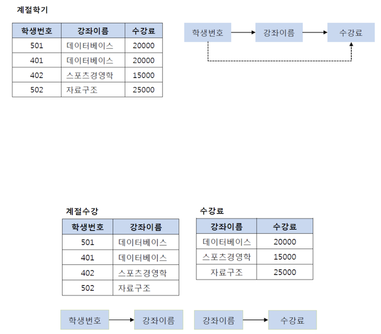
  
### BCNF 정규화
제3정규화를 진행한 테이블에 대해 **모든 결정자가 후보키가 되도록** 테이블을 분해하는 것 

ex) 운송장번호는 택배원 이름을 결정하는 결정자이지만, 후보키가 아님 → 상품 테이블과 택배 테이블로 분해함 

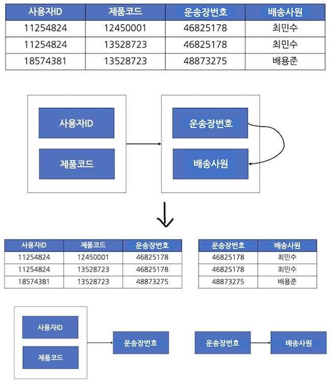
  
### 제4정규화
BCNF 정규화를 진행한 테이블에 대해 **다치 종속이 없어지도록** 테이블을 분해하는 것      
다치 종속이란 다음 조건들을 **모두 만족할 때**를 뜻함 

- 하나의 A값에 여러 개의 B값이 존재하면(=1:N), 다치 종속성을 가진다고 하고 A↠B라고 표시함
- 최소 3개의 칼럼이 존재해야 함
- R(A, B, C)가 있고, A와 B 사이에 다치 종속성이 있을 때, B와 C가 독립적이어야 함

ex) 학생 번호 하나에 과목 여러 개와 취미 여러 개가 종속되는 다치 종속성이 발생하고 있으며, 학생 번호를 토대로 값을 조회하면 중복이 발생하게 됨(과목과 취미는 독립적인데도 중복이 여러 번 발생하게 됨)
→ 과목 테이블과 취미 테이블로 분해함

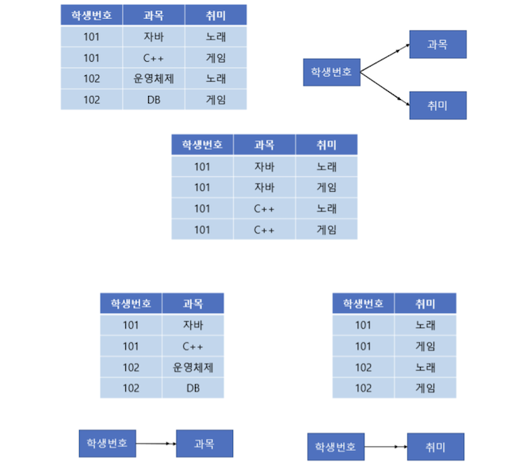
  
### 제5정규화(=PJNF)

- 제4정규화를 진행한 테이블에 대해 **조인 종속이 없어지도록** 테이블을 분해하는 것
- 하나의 테이블을 여러 개의 테이블로 무손실 분해했다가 다시 결합할 수 있다면 조인 종속이라고 함 
(A 테이블을 B와 C로 분해했다가 다시 조인했을 때 그대로 A가 되는 경우)
    
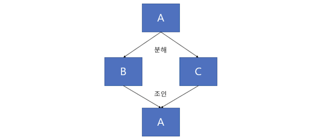
    
- 현실의 데이터베이스에서는 제5정규형은 사용하지 않음

[https://www.studytonight.com/dbms/fifth-normal-form.php](https://www.studytonight.com/dbms/fifth-normal-form.php) 자세한 내용 참고!

  

## 비정규화(Unnormalized form) 
데이터베이스 정규화의 조건을 충족하지 않는 데이터 모델로, 정규화 과정의 출발점이 될 수 있음    
즉, 정규화 하기 이전의 데이터 모델 상태 

  

## 반(역)정규화(Denormalization)
정규화된 엔티티, 속성, 관계에 대해 시스템의 성능 향상과 개발과 운영의 단순화를 위해 중복, 통합, 분리 등을 수행하는 데이터 모델링의 기법 

- 데이터를 조회할 때, 조인으로 인한 성능 저하가 예상될 경우 수행함
- 완벽한 구조설계를 포기하고 데이터의 무결성(정확성+일관성)을 떨어트리는 대신, 읽기 성능을 향상시킴
    - 읽기 속도는 빨라지지만 쓰기(삽입, 수정, 삭제) 속도는 느려짐
    - 중복된 데이터의 공간 차지로 인해, 저장 공간의 효율이 떨어짐
    - 테이블 자체가 크고 복잡해서 쉽게 수정할 수 없고 확장성도 떨어짐
  
ex) 내가 [3교시 선생님의 강의와 수강료]를 알고 싶다면, 
정규화된 테이블에서는, <강사> 테이블에서 (강의시간, 이름, 담당수업)을 확인하고, <수업> 테이블에서 (수업코드)를 확인하고, <수강료> 테이블에서 (수강료)를 확인해야 하지만, 
비정규화된 테이블에서는 쉽게 확인할 수 있음

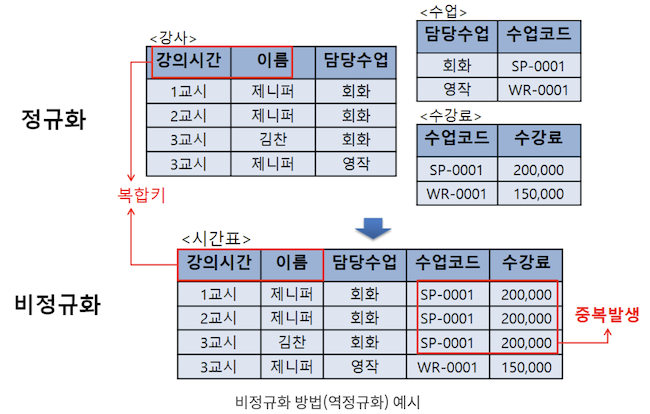

  
### 반정규화 기법

- 계산된 칼럼 추가 - 배치 프로그램으로 총판매액, 평균잔고, 계좌평가 등을 미리 계산하고, 그 결과를 특정 칼럼에 추가함
- 테이블 수직 분할 - 하나의 테이블을 두 개 이상의 테이블로 분할함
    
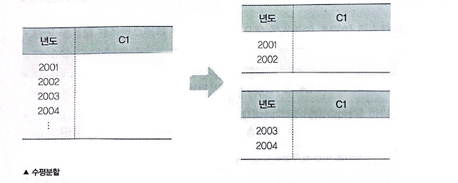
    
- 테이블 수평 분할 - 하나의 테이블에 있는 값을 기준으로 테이블을 분할함
    
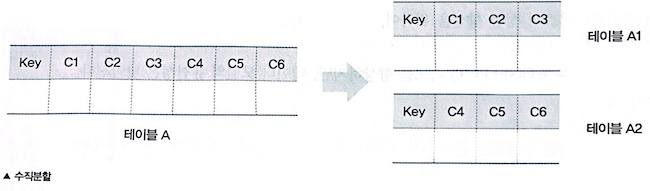
    
- 테이블 병합

  

### 면접질문
1. 정규화에 대해 설명해주세요
2. 정규화의 목적이 무엇인가요?
3. 각 정규화 단계를 설명해보세요
4. 정규화와 역 정규화에 대해 설명해보세요 

  

### 출처
[https://mangkyu.tistory.com/110](https://mangkyu.tistory.com/110)    
[https://code-lab1.tistory.com/270](https://code-lab1.tistory.com/270)     
[https://chankim.tistory.com/7](https://chankim.tistory.com/7)    
[https://ko.wikipedia.org/wiki/역정규화](https://ko.wikipedia.org/wiki/%EC%97%AD%EC%A0%95%EA%B7%9C%ED%99%94)     
https://4legs-study.tistory.com/162
https://dbpedia.org/page/Unnormalized_form
