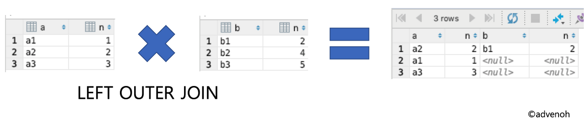
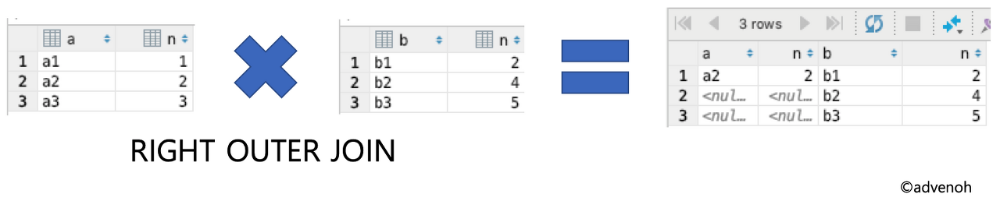
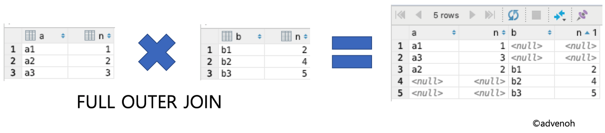
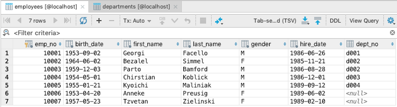
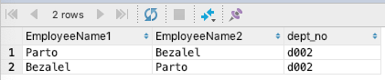
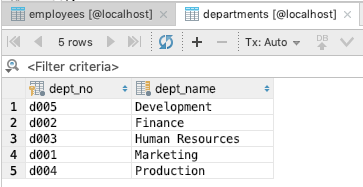
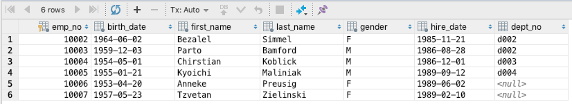
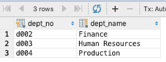

# 1. 개념

- 두 개 이상의 테이블을 묶어서 하나의 결과물을 만드는 것.
- 데이터 조회 시 다른 테이블의 데이터를 함께 조회해야할 때 사용
- MySQL-JOIN, MongoDB-lookup
- <이미지 출처 : [https://imgur.com/gallery/8u7fc](https://imgur.com/gallery/8u7fc)>


# 2. 종류

- ⭐INNER JOIN 내부조인
    - CROSS JOIN = CARTESION JOIN 교차조인
    - ⭐EQUAL JOIN 등가/동등/동일 조인
    - NON-EQUAL JOIN 비등가 조인
    - ⭐NATURAL JOIN 자연 조인
- ⭐OUTER JOIN 외부 조인
    - ⭐LEFT JOIN 왼쪽 조인
    - ⭐RIGHT JOIN 오른쪽 조인
    - ⭐FULL OUTER JOIN 완전 외부 조인, 합집합 조인
- ⭐SELF JOIN
- ANTI JOIN
- SEMI JOIN

## 1) 내부조인

- 두 테이블 간의 교집합을 나타냄.
- 가장 일반적인 조인
- ON의 조건에 맞는 공통된 부분이 있는 경우만 출력
- ※ 이하 예시 코드는  MySQL

### 교차 조인

두 테이블을 카디션 프로덕트(곱집합)한 결과. 특별한 조건 없이 테이블 A의 각 행과 B의 각 행을 다 조합한 결과

```sql
SELECT * FROM employees CROSS JOIN dept_emp;

SELECT * FROM employees, dept_emp;
```

### 동등 조인

동등비교(=)를 사용하는 조인

```sql
SELECT * FROM employees
  INNER JOIN dept_emp
    ON employees.emp_no = dept_emp.emp_no;

SELECT * FROM employees, dept_emp
WHERE employees.emp_no = dept_emp.emp_no;
```

### 비등가 조인

동등비교를 하지 않는 조인, 조건문이 크거나 작거나, 같지 않는 비교등을 사용하면 비등가 조인이다.

```sql
SELECT * FROM employees, departments
WHERE emplyees.emp_no between 10003 and 10004;
```

### 자연조인

동등 조인의 한 유형으로 두 테이블의 칼럼명이 같은 경우 이 기준으로 조인 조건문이 암시적으로 일어나는 내부조인.

- 같은 이름을 가진 칼럼이 한 번만 추출된다. (동등조인은 2번)

```sql
SELECT * FROM employees NATURAL JOIN dept_emp;
```

## 2) 외부조인

- 공통 데이터 외에 어느 한 테이블에만 존재하는 데이터도 함께 결합하여 조회하고자 할 때 사용하는 방법.
- 어느 테이블을 기준으로 삼을 지에 따라 Right, Left, Full로 나눈다.
- 내부조인과 달리 순서가 중요하다. 어떤 테이블에 먼저 접근하냐에 따라 쿼리 성능에 영향을 미친다.
- 더 적은 데이터를 추출하는 테이블을 먼저 접근하는 테이블(드라이빙테이블)로 삼는 것이 좋다.

### LEFT (OUTER) JOIN

- 테이블 A(왼쪽=기준)의 모든 데이터와 테이블 B와 매칭 되는 레코드를 모두 포함.
- B에 일치하는 항목이 없으면 해당 값은 null

```sql
SELECT * FROM table1
  LEFT OUTER JOIN table2
    ON table1.n = table2.n;
```



### RIGHT (OUTER) JOIN

- 테이블 B(오른쪽=기준)의 모든 데이터와 테이블 A와 매칭 되는 레코드를 모두 포함.
- A에 일치하는 항목이 없으면 해당 값은 null

```sql
SELECT * FROM table1
  RIGHT OUTER JOIN table2
    ON table1.n = table2.n;
```



### FULL OUTER JOIN

- 양쪽 테이블에서 일치하는 레코드와 함께 테이블 A와 B의 모든 레코드 집합 생성.
- 일치항목이 없으면 누락된 쪽에 null
- ! MySQL은 명시적인 SQL구문을 지원하지 않으나, UNION을 사용하여 조인가능

```sql
/*sudo*/
SELECT * FROM TableA A
FULL OUTER JOIN TableB B ON A.key = B.key

/*MySQL - JOIN and UNION*/
SELECT * FROM table1
  LEFT OUTER JOIN table2
    ON table1.n = table2.n
UNION
SELECT * FROM table1
  RIGHT OUTER JOIN table2
    ON table1.n = table2.n;

/*MySQL - UNION ALL and EXCLUSIVE jOIN*/
SELECT * FROM table1
  LEFT OUTER JOIN table2
    ON table1.n = table2.n
UNION ALL
SELECT * FROM table1
  RIGHT OUTER JOIN table2
    ON table1.n = table2.n
WHERE table1.n IS null;
```



## 3) SELF JOIN

- 자기자신과 하는 조인
- EX) 임직원 중 같은 부서에서 일하는 직원을 알고 싶음
    
    
    

```sql
SELECT A.first_name AS EmployeeName1, B.first_name AS EmployeeName2, A.dept_no
FROM employees AS A, employees AS B
WHERE A.emp_no <> B.emp_no
AND A.dept_no = B.dept_no;
```
- <> 연산자는 != 을 의미함.



## 4) ANTI JOIN

- 서브쿼리 내에 존재하지 않는 데이터만 추출하여 메인 쿼리에서 추출하는 조인
- NOT EXISTS 또는 NOT IN 사용하여 작성가능
  - issue : 안티조인에 서브쿼리가 없으면?
    - 안티조인의 개념 자체가 서브쿼리를 사용하는 조인! 이기는 하지만, 구하고자 하는 그 내용 자체(?)는 lejt-join / is_null을 사용해서 구할 수 도 있다. not in, not exists 다음에는 당연히 쿼리문이 와야한다.
    - 참고 : [https://juneyr.dev/anti-join](https://juneyr.dev/anti-join)
- (예시 EMPLOYEE 테이블은 위에 나온 것 과 동일)
    
    
    

```sql
SELECT * FROM employees AS e
WHERE emp_no >= 10002
      AND NOT EXISTS(SELECT *
                     FROM departments AS d
                     WHERE e.dept_no = d.dept_no
                           AND d.dept_no >= 2);
```



## 5) SEMI JOIN

안티조인과 반대로 서브 쿼리 내에 존재하는 데이터만 가지고 메인 쿼리를 추출하는 방식

```sql
/*EXISTS 사용*/
SELECT * FROM departments as d
WHERE EXISTS(SELECT *
             FROM employees AS e
             WHERE e.dept_no = d.dept_no
                   AND e.emp_no >= 10003);

/*IN 사용*/
SELECT * FROM departments as d
WHERE d.dept_no IN (SELECT e.dept_no
                    FROM employees AS e
                    WHERE e.emp_no >= 10003);
```



# 3. (참고)조인 원리

## 1) 중첩 루프 조인(NLJ, Nested Loop Join)

- 중첩 for문과 같은 원리
- 랜덤 접근에 대한 비용이 많이 증가하므로 대용량 테이블에서는 사용하지 않음.

```sql
for each row in t1 matching reference key{
	for each row in t2 matching reference key{
		if row satisties join coditions, send to clint
	}
}
```

## 2) 정렬 병합 조인

- 각 테이블을 조인할 필드 기준으로 정렬하고 정렬이 끝난 후 조인 작업을 수행.
- 조인 시 쓸 적절한 인덱스가 없고 대용량의 테이블들을 조인하고 조인 조건으로 <. >등 범위 비교 연산자가 있을 때 사용

## 3) 해시 조인

- 해시 테이블을 기반으로 조인
- 두 개 테이블을 조인한다고 했을때, 하나의 테이블이 메모리에 온전히 들어가면 일반적으로 중첩 루프조인보다 효율적이다.
    - 메모리에 올릴 수 없을 정도로 크면 디스크 사용 비용이 발생하고, 동등 조인에서만 사용할 수 있음
- MySQL8.0.18. release 이후 사용

---

# 면접질문

- JOIN의 종류와 각 특징에 대해 이야기 해보세요
- 셀프 조인을 사용할 경우 예를 들어보세요
- 왼쪽 외부조인시 오직 LEFT에 있는 값만을 가져오도록 쿼리를 한번 짜보세요.

# 출처

- [https://advenoh.tistory.com/23](https://advenoh.tistory.com/23)
- [https://velog.io/@newdana01/Database-테이블-조인-이해하기](https://velog.io/@newdana01/Database-%ED%85%8C%EC%9D%B4%EB%B8%94-%EC%A1%B0%EC%9D%B8-%EC%9D%B4%ED%95%B4%ED%95%98%EA%B8%B0)
- [https://hongcoding.tistory.com/146](https://hongcoding.tistory.com/146)
- [책] 면접을 위한 cs 전공지식노트
- [https://m.blog.naver.com/isaac7263/222117156620](https://m.blog.naver.com/isaac7263/222117156620)
