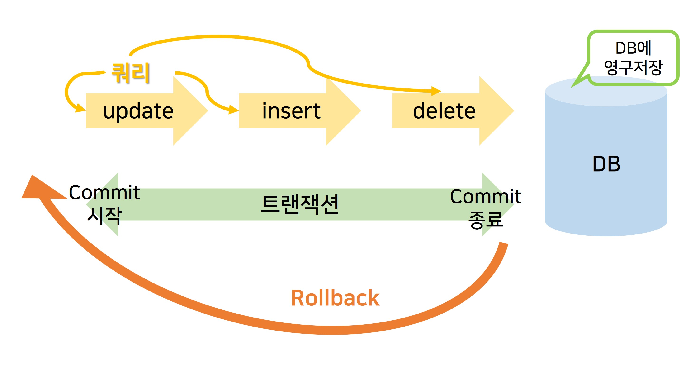
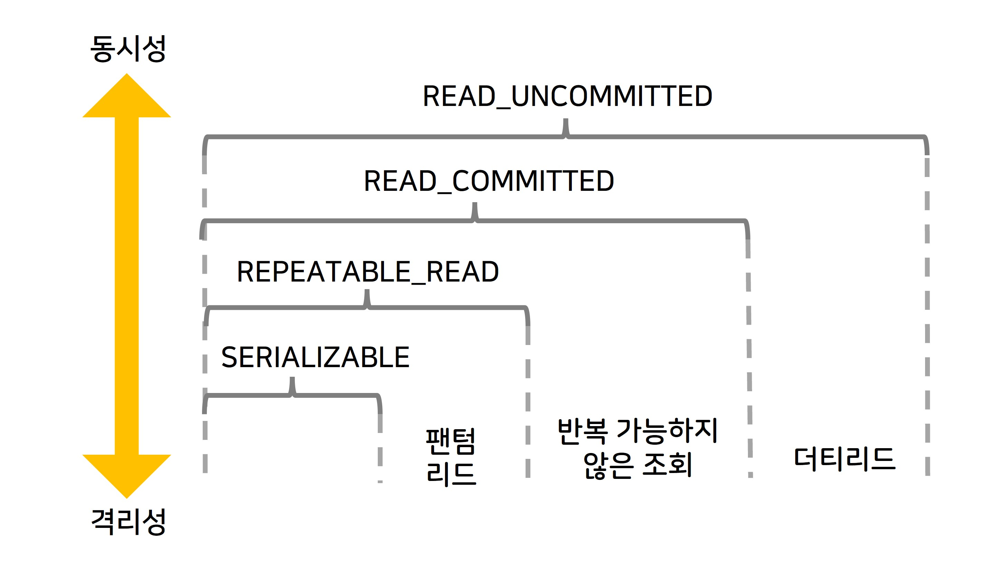
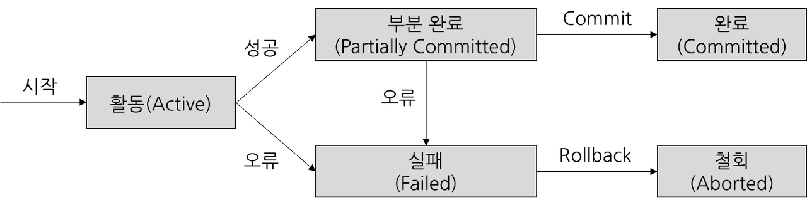

# 트랜잭션, ACID, 무결성

# 1. 트랜잭션

DB의 상태를 변화시키기 위해 수행하는 작업의 논리적 단위.

- 상태를 변화시킨다 = SELECT, INSERT, UPDATE, DELETE 등 조작어를 사용하는 행동

DB에서 병행제어 및 회복 작업 시 처리되는 작업의 논리적 단위.

사용자가 시스템에 대한 서비스 요구 시 시스템이 응답하기 위한 상태 변환과정의 작업단위.

- 트랜잭션은 상황에 따라 Commit 되거나 Rollback 된다.
    - Commit : 모든 부분작업이 정상적으로 완료되면 이 변경사항을 한꺼번에 DB에 반영한다.
    - Rollback : 부분 작업이 실패하면 트랜잭션 실행 전으로 되돌린다.


> 💡 **트랙잭션을 사용하는 이유 이해하기**
> - 상황 : ATM 계좌이채
> 1. A은행에서 출근하여 B은행으로 송금하려함
> 2. 송금 중 알수없는 오류로 A은행 계좌에서 돈은 빠져나갔지만, B은행 계좌에 입금되지 않았음.
> 3. 이와 같은 상황을 막기위해 거래가 성공적으로 모두 끝나야 이를 완전한 거래로 승인하고, 도중에 오류가 발생하면 이 거래를 처음부터 없던 거래로 완전히 되돌린다.
> ➡️이렇게 거래 안정성을 확보하는 방법이 트랜잭션!


# 2. ACID : 트랜잭션의 특징

4가지 특성 Atomicity, Consitency, Isolation, Durability 를 ACID라고 부름

## 1) 원자성 Atomicity

- 트랜잭션이 DB에 모두 반영되거나 혹은 전혀 반영되지 않아야한다. (All or Nothing)
- 트랜잭션의 작업이 부분적으로 실행되거나 중단되지 않는 것을 보장함.
- 오류가 나면 Rollback을 하는데 트랜잭션의 길이가 엄청 길면 확실하게 오류가 발생하지 않은 부분도 처음부터 다시 작업해야함 ➡️save point로 해결할 수 있다.

### Commit

- 여러 쿼리가 성공적으로 처리되었다고 확정하는 명령어.
- 트랜잭션 단위로 수행되어 변경된 내용이 모두 영구적으로 저장되는 것
- 커밋이 수행됨 = 트랜잭션이 성공적으로 수행됨

### Rollback

- 트랜잭션으로 처리한 하나의 묶음 과정을 일어나기 전으로 돌리는 명령어.
- Commit 되지 않은 변경된 모든 내용을 취소하고 DB를 이전상태로 되돌림.
    
    
    

### savepoint

- 오류가 발생하지 않음이 확실한 부분이 Rollback 되지않도록하는 중간 저장지점.
- (트랜잭션의) 전체가 아닌 특정 부분에서 트랜잭션을 취소 시킬 수 있다.
- 취소 하려는 지점을 savepoint로 명시한 뒤, rollback to savepointname; 실행하면 해당 savepoint 지점까지 처리한 작업이 rollback

```sql
COMMIT
작업1
작업2
SAVEPOINT A;
작업3
작업4
SAVEPOINT B;
작업5
작업6
ROLLBACK TO SAVEPOINT B; //작업5,6 취소
ROLLBACK TO SAVEPOINT A; //작업 3,4 (,5,6)취소
ROLLBACK // 작업1,2(,3,4,5,6) 취소 
```

## 2) 일관성(Constency)

- 트랜잭션의 작업 처리는 항상 일관 성이 있어야함.
- 트랜잭션의 실행은 항상 기대되는 값을 정확하게 보여줘야 햠.
- 트랜잭션 수행 전/후로 데이터 모델의 제약조건(기본키, 외래키, 도메인 제약조건 등)을 만족해야한다.
- ex) SQL연산을  col1+col2+col3-col4의 로직으로 실행하는데 실행때마다 예측된 결과가 항상 같지않고 다른 결과가 나오면 일관성이 깨진것.
- 트랜잭션에서 일관성보장은 어떤 이벤트와 조건이 발생했을 때, 트리거를 통해 보장한다. (= 허용한 방식으로만 데이터를 변경)

### 트리거(Trigger)

- 특정 테이블에 INSERT, DELETE, UPDATE같은 DML문이 수행됐을때, DB에서 자동으로 동작하도록 설정된 프로그램.
- 사용자가 직접 호출하는 형태가 이니라, DB에서 자동으로 호출하는 것이 특징.
- 한쪽 테이블에 정보 수정이 일어났을 경우, 다른 쪽 테이블에도 함께 정보가 수정될 수 있도록 자동으로 업데이트를 하는 명령 등을 구성.

## 3) 격리성=고립성(Isolation)

- 트랜잭션 수행 시 다른 트랜잭션이 작업에 끼어들지 못하도록 보장하는 것.
- 둘 이상의 트랜잭션이 동시에 병행(parallelism)실행되고 있을 때, 어떤 트랜잭션도 다른 트랜잭션에 끼어들 수 없다. = 서로 격리되어 마치 순차적으로 실행되는 것처럼 작동
- 격리성을 보장하기 위해 Lock&Unlock기법을 사용함
    - 데이터를 읽거나 쓰기 작업 중일 때는 해당 영역에 Lock을 걸어 다른 트랜잭션이 접근하지 못하게 함.
    - 먼저 들어온 트랜잭션 요청이 끝나면 Unlock하여 다른 트랜잭션이 처리 될 수 있도록 허용
    - 만약 Lock&Unlock을 잘못사용하는 경우 어떠한 트랜잭션도 수행될 수 없는 데드락(Deadlock)상태에 빠질 수 있음.
- 격리 수준에 따라 나눠서 보장

### 격리 수준

- 격리수준에 따라 발생하는 현상
    - 팬텀리드(phntom read) : 한 트랜잭션 내에서 동일한 쿼리를 보냈을 때 해당 조회 결과가 다른경우.
    - 반복 가능하지 않은 조회(non-repeatable read) : 한 트랜잭션 내의 같은 행에 두 번이상 조회가 발생했는데, 그 값이 다른 경우. (팬텀리드는 다른 행이 선택 될 수 도 있는것, 반복 가능하지 않은 조회는 행 값이 달라질 수 있는 것)
    - 더티 리드(dirty read) : 한 트랜잭션이 실행 중일 때 다른 트랜잭션에 의해 수행되었지만 아직 커밋 되지 않은 행의 데이터를 읽을 수 있을 때 발생. 반복가능하지않은 조회와 유사
        
        
        
- 격리수준
    - SERIALIZATION : 트랜잭션을 순차적으로 진행. 여러 트랜잭션이 동시에 같은 행 접근 불가. 교착상태가 일어날 확률이 높고 성능이 가장 떨어진다.
    - REPEATABLE_READ : 하나의 트랜잭션이 수정한 행을 다른 트랜잭션이 수정할 수 없도록 막아지주만, 새로운 행을 추가하는 것은 막지 않음
    - READ_COMMITTED : 가장 많이 사용되는 격리수준. 다른 트랜잭션이 커밋하지 않은 정보는 읽을 수 없음. (= 완료된 데이터에 대해서만 조회 허용)하지만 어떤 트랜잭션이 접근한 행을 다른 트랜잭션이 수정할 수 있음.
    - READ_UNCOMMITTED : 가장 낮은 격리수준. 하나의 트랜잭션이 커밋되기 이전에 다른 트랜잭션이 노출 될 수 있음=가장 빠름. 데이터 무결성을 위해 되도록이면 사용하지 않는 것이 이상적이나, 몇몇 행이 조회되지 않더라도 괜찬은 거대한 양의 데이터를 ‘어림잡아’ 집계하는 데 사용하면 유용.

## 4) 지속성=영속성(Durability)

- 성공적으로 수행된 트랜잭션은 영원히 반영되어야함.
- commit을 실행했다면 해당 데이터는 DB에 영원히 반영되어야함.
- DB에 시스템 장애가 발생해도 원래 상태로 복구하는 회복 기능(ex. 체크썸, 저널링, 롤백 등)이 있어야 함을 의미함.
    - 저널링 : 파일 시스템 또는 DB시스템에서 변경사항을 반영(commit)하기 위해 로깅하는 것, 트랜잭션 등 변경 사항에 대한 로그를 남기는 것.

# 3. 무결성

- 데이터의 정확성, 일관성, 유효성을 유지하는 것.
- 관점에 따라 키 무결성을 개체(엔터티)무결성 안에 포함 시키기도 하고 종류가 다양
    - 개체, 키, 참조, 고유, Null, 도메인, 관계, 사용자 정의

## ⭐개체 무결성 Entity Integrity

- 기본키로 선택된 필드는 빈 값을 허용하지 않음.
- 모든 테이블은 기본키가 반드시 존재해야하며 각 기본키는 반드시 유일 값을 가지되 Null이 아니어야함.

## 키 무결성 Key Integrity

- 하나의 릴레이션에는 적어도 하나의 키가 존재해야함.
- 테이블의 모든 레코드는 서로 식별 가능해야함

## ⭐참조 무결성 Referential Integrity

- 서로 참조 관계에 있는 두 테이블이 데이터는 항상 일관된 값을 유지해야함.
- 외래키는 Null값을 가지거나, 외래키가 참조하는 테이블의 기본키에 존재하는 값이어야 하며, 기본키가 참조되는 외래키가 존재할 경우 데이터는 삭제 또는 변경할 수 없음.

## ⭐도메인 무결성 Domain Integrity

- 특정 속성 값이 그 속성이 정의된 도메인에 속한 값이어야함
- 테이블에 존재하는 필드의 무결성을 보장하기 위한 것으로, 데이터 타입, Null 허용여부 등을 정희하여 사용.
- 속성값은 원자성을 가지며, 해당 도메인에 정의된 값이어야함.
- 가끔 영역 무결성이라고도 함.

## 🟡 Null 무결성

- 특정 속성 값이 null이 올 수 없다는 조건이 주어진 경우 그 속성 값은 Null이 될 수 없음

## 🟡고유 무결성 Unique Intergrity

- 특정 속성에 대해 고유한 값을 가지도록 조건을 주어진 경우 그 속성 값은 모두 고유한 값을 가짐.

## 관계 무결성 Relation intergrity

- 릴레이션에 어느 한 튜플의 삽입 가능 여부 또는 한 릴레이션과 다른 릴레이션의 튜플 사이의 관계에 대한 적절성 유부를 지정한 규정.

## 사용자 정의 무결성 User Defined Integrity

- 다른 무결성 범주에 속하지 않는 사용자 정의 제약조건을 만족해야함.

# cf) 트랜잭션 상태



- 활동 (Active)

    - 트랜잭션이 실행 중에 있는 상태, 연산들이 정상적으로 실행 중인 상태

- 장애 (Failed)

    - 트랜잭션이 실행에 오류가 발생하여 중단된 상태

- 철회 (Aborted)

    - 트랜잭션이 비정상적으로 종료되어 Rollback 연산을 수행한 상태

- 부분 완료 (Partially Committed)

    - 트랜잭션이 마지막 연산까지 실행했지만, Commit 연산이 실행되기 직전의 상태

- 완료 (Committed)
    - 트랜잭션이 성공적으로 종료되어 Commit 연산응 실행한 후의 상태

---

# 면접질문

- 트리거에 대해 설명해주세요.
- DB락에 대해 설명해주세요
    - **공유락**(LS, Shared Lock) Read Lock라고도 하는 공유락은 트랜잭션이 읽기를 할 때 사용하는 락이며, 데이터를 읽기만하기 때문에 같은 공유락 끼리는 동시에 접근이 가능합니다.
    - **베타락**(LX, Exclusive Lock) Write Lock라고도 하는 베타락은 데이터를 변경할 때 사용하는 락입니다. 트랜잭션이 완료될 때까지 유지되며, 베타락이 끝나기 전까지 어떠한 접근도 허용하지 않습니다.
- 무결성에 대해 이야기해보세요. 무결성을 유지하려는 이유는 무엇인가요?
- 트랜잭션의 성질을 말해보세요.
- 트랜잭션을 병행으로 처리하려고 할 때 발생할 수 있는 문제를 설명해보시요.[추가 설명 필요]
    - 갱신 내용 손실 : 동시에 하나의 데이터가 갱신될 때 하나의 갱신이 누락되는 경우
    - 현황 파악 오류 : 하나의 데이터 갱신이 끝나지 않은 시점에서 다른 트랜잭션이 해당 데이터를 조회하는 경우
    - 모순성 : 두 트랜잭션이 동시에 실행될 때 데이터베이스가 일관성이 없는 모순된 상태로 남는 문제
    - 연쇄 복귀 : 두 트랜잭션이 하나의 레코드를 갱신할 때 하나의 트랜잭션이 롤백하면 다른 하나의 트랜잭션 마저 롤백이 되는 문제
- 트랜잭션을 병행처리할때 위와 같은 문제를 발생하기 위한 방법을 설명하시오.[추가설명필요]
    - 로킹 제어 기법을 사용한다. 어떤 트랜잭션이 특정 DB의 데이터를 사용할 때 DB의 일정부분을 Lock시키고 트랜잭션이 완료될때 해당부분을 Unlock시키는 방법이다. 종류는 크게 두가지가 있는데 공유 로킹은 Lock한 부분을 읽기는 가능하지만 쓰기는 불가능한 것이고 배타 로킹은 읽기,쓰기 둘다 불가능하게 한 것이다.
- 로킹 단위를 크게/작게 했을 대 차이점
    - 로킹 단위가 크면 그만큼 관리가 쉽지만 병행성이 떨어진다. 로킹단위가 작으면 관리가 어렵고 오버헤드가 증가하지만, 병행성이 올라간다.
- **[로킹 제어가 일으킬 수 있는 문제점은 무엇인가?](https://kadamon.tistory.com/21#Q-%--%EB%A-%-C%ED%--%B-%--%EC%A-%-C%EC%--%B-%EA%B-%--%--%EC%-D%BC%EC%-C%BC%ED%--%AC%--%EC%--%--%--%EC%-E%--%EB%-A%--%--%EB%AC%B-%EC%A-%-C%EC%A-%--%EC%-D%--%--%EB%AC%B-%EC%--%--%EC%-D%B-%EA%B-%--%-F)**
    - 로킹단위에 따라 다르겠지만 트랜잭션의 직렬화 가능성이 높아진다.(병행처리하나마나 할 수도있다.) 또 데드락이 발생할 수 있다.

# 출처

- 트랜잭션이란 ? [https://dkswnkk.tistory.com/555](https://dkswnkk.tistory.com/555)
- TOPCIT ESSENCE ver3 기술영역-데이터 이해와 활용
- [https://computer-science-student.tistory.com/196](https://computer-science-student.tistory.com/196)
- [책] 면접을 위한 CS 전공지식 노트
- [https://theheydaze.tistory.com/582](https://theheydaze.tistory.com/582)
- [https://dev-coco.tistory.com/158](https://dev-coco.tistory.com/158)
- [https://kadamon.tistory.com/21](https://kadamon.tistory.com/21)