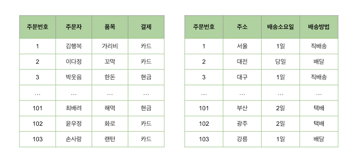
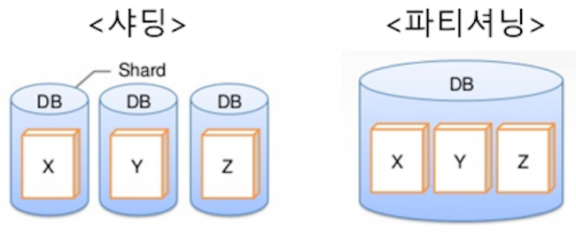

# 파티셔닝(Partitioning)_샤딩(Sharding)

**파티셔닝과 샤딩은 데이터베이스를 분할하는 방법!**

## 파티셔닝이란?
- 큰 테이블이나 인덱스를 관리하기 쉬운 파티션이라는 작은 단위로 물리적으로 분할하는 것
- 데이터는 물리적으로 여러 테이블로 분산되어 저장되지만, 사용자는 하나의 테이블에 접근하는 것처럼 사용할 수 있음

### 장점
- 관리적 측면에서, 파티션 단위로 데이터를 백업/추가/삭제/변경하기 때문에
    - 전체 데이터를 소실할 가능성이 줄어들어 데이터 가용성이 향상됨
    - 파티션 별로 백업 및 복구가 가능함
    - 파티션 단위로 I/O 분산이 가능하여 UPDATE 성능을 향상시킴
- 성능적 측면에서, 파티션 단위로 조회하기 때문에
    - 데이터 검색 시 필요한 부분만 탐색해 성능이 증가함
    - 필요한 데이터만 빠르게 조회할 수 있기 때문에 쿼리가 가벼워짐

### 단점
- 테이블 간 조인에 대한 비용이 증가함
- 테이블과 인덱스를 별도로 파티셔닝 할 수 없기 때문에, 테이블과 인덱스를 같이 파티셔닝해야 함

  

## 파티셔닝의 종류
### 수평 파티셔닝
     
- 테이블의 Row를 분할하여 여러 개의 서로 다른 테이블로 나누는 방법
- 주로 데이터베이스의 용량이 커지는 경우, 성능 저하를 막기 위해 사용됨
  
### 수직 파티셔닝
     
- 테이블의 Column을 분할하여 여러 개의 서로 다른 테이블로 나누는 방법
- 성능 개선, 민감한 정보에 대한 접근 제한, 자주 사용되지 않는 Column을 모으기 위해 사용될 수 있음

  

## 파티셔닝의 분할 기준

### Range 파티셔닝
특정 기준에 의해서 범위(연속적인 범위)를 나눌 때 사용함  ex) 연도별로 판매 테이블 파티셔닝

- 장점 - 사용/관리가 쉬움
- 단점 - 데이터가 균일하게 분포되지 못해서 성능 저하가 있을 수 있음 (판매가 많이 된 년도에는 데이터가 많아서 작업 속도가 느리지만, 판매량이 적은 년도에는 데이터가 적어서 빨리 조회되는 경우)
  
### Hash 파티셔닝
키 값을 해시함수에 넣어 나오는 값으로 파티셔닝함

- 장점 - 해시 함수가 데이터를 각 테이블스페이스 별로 균등하게 분포시켜서 성능을 향상시킴
- 단점 - 사용자가 데이터를 분산하지 않고 해시 함수가 분산시키기 때문에 데이터 관리가 어려움
  
### List 파티셔닝
파티셔닝할 항목을 사용자가 직접 지정하는 방식 → 불연속적인 값의 목록을 각 파티션에 지정함     
순서에 상관없이, 사용자가 미리 정한 그룹핑 기준에 따라 데이터를 분할해 저장함  ex) 판매 데이터를 지역별로 분할

- 장점 - 항목을 잘 설정할 경우 빠른 성능이 보장됨
- 단점 - 항목을 잘못 설정할 경우 성능이 저하됨 (A지역용 파티션을 별도로 생성했으나 판매 부진으로 판매량이 없을 경우)
  
### Composite 파티셔닝
여러 파티셔닝 종류를 복합적으로 사용하는 것 

1. **Range-Hash 파티션** 
- 특정 기준에 의해(일자별로) 먼저 파티셔닝을 하고, 그 안에 또 해시 파티셔닝을 하는 방법
- 장점 - Range 파티션만 쓰는 것보다 데이터가 균일하게 분포됨
- 단점 - 데이터가 어느 파티션에 속할지 제어할 수 없음
  
2. **Range-List 파티션**
- 특정 기준에 의해(일자별로) 먼저 파티셔닝을 하고, 그 안에 또 리스트 파티셔닝을 하는 방법
- 장점 - 각 데이터가 어느 파티션에 속할지 파악이 가능함

  

## 파티셔닝 vs 샤딩
      
파티셔닝은 모든 데이터를 동일한 서버에 저장하지만, 샤딩은 데이터를 서로 다른 서버로 분산해 저장함     
- 파티셔닝은 DML의 성능이 개선되고 유지보수성, 가용성이 향상된다는 장점, 서로 다른 DB 서버에 저장함으로써 DB 서버의 부하를 분산시킬 수 있다는 장점이 있음
- **규모가 큰 서비스, 트래픽이 많이 몰리는 경우에는 샤딩을 사용하는 등, 데이터베이스의 특성에 따라 선택함!**

  

## 샤딩이란?
  
하나의 거대한 데이터베이스나 네트워크 시스템을 여러 개의 작은 조각으로 나누어 분산 저장하여 관리하는 것     
샤딩을 통해 나누어진 블록들의 구간을 샤드(shard)라고 부름     
- 수평 파티셔닝과 유사하지만, 서로 다른 서버에 분산하여 저장한다는 점이 차이점    
- 샤딩의 분할기준은 파티셔닝과 거의 유사해서 따로 적진 않았음!     

### 장점
- 수평적 확장이 가능함
- 필요한 데이터만 빠르게 조회할 수 있기 때문에 쿼리 자체가 가벼움
- 오래돼서 조회가 드문 데이터를 별도의 서버에 저장해서 운영상의 스토리지 이득을 볼 수 있음

### 단점
- 데이터를 물리적으로 독립된 데이터베이스에 각각 분할하여 저장하므로, 여러 샤드에 걸친 데이터를 조인하는 것이 어려움
- 한 데이터베이스에 집중적으로 데이터가 몰리면 성능이 느려짐

  
  

### 면접질문
1. DB의 파티셔닝에 대해서 설명해보세요
2. DB의 샤딩에 대해서 설명해보세요

  
### 출처
[https://gmlwjd9405.github.io/2018/09/24/db-partitioning.html](https://gmlwjd9405.github.io/2018/09/24/db-partitioning.html)     
[https://dataonair.or.kr/db-tech-reference/d-guide/sql/?mod=document&uid=373](https://dataonair.or.kr/db-tech-reference/d-guide/sql/?mod=document&uid=373)    
[https://lee-mandu.tistory.com/475](https://lee-mandu.tistory.com/475)     
[https://hudi.blog/db-partitioning-and-sharding/](https://hudi.blog/db-partitioning-and-sharding/)     
[http://wiki.hash.kr/index.php/샤딩](http://wiki.hash.kr/index.php/%EC%83%A4%EB%94%A9)    
[https://offetuoso.github.io/blog/develop/database/tech/sharding/](https://offetuoso.github.io/blog/develop/database/tech/sharding/)      
https://aiday.tistory.com/123#google_vignette
