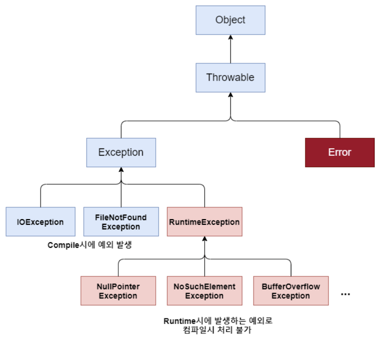
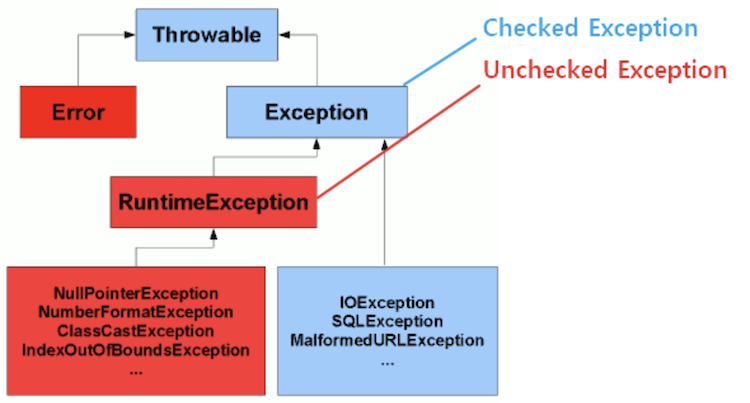
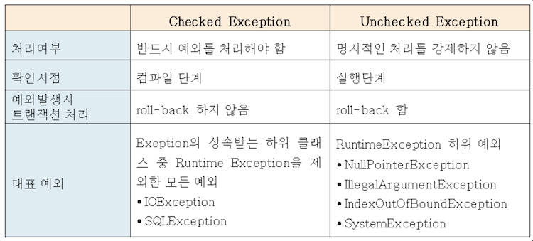
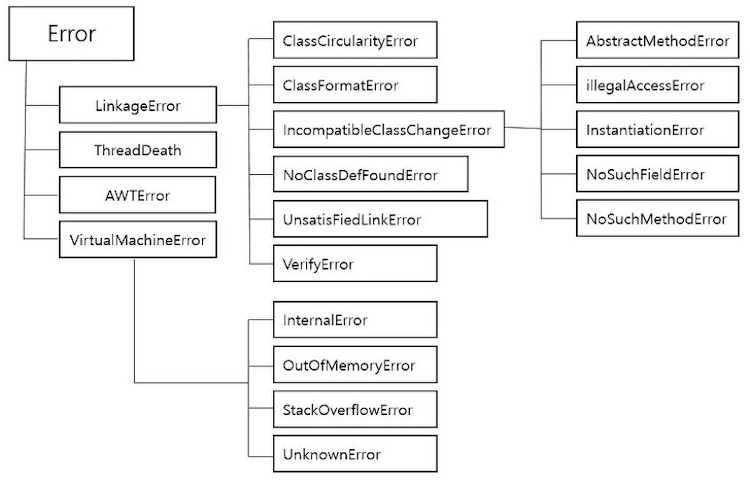
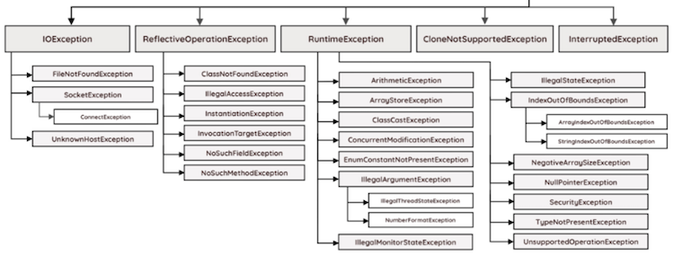

# Error_Exception_Checked/Unchecked Exception
## 프로그램 오류(에러) -> 언어 공통
프로그램이 실행 중 어떤 원인에 의하여 오작동을 하거나 비정상적으로 종료되는 경우가 있는데, 이러한 결과를 초래하는 원인을 프로그램 오류라고 함

프로그램 오류는 발생시점에 따라 **컴파일 에러,** **런타임 에러** 및 **논리적 에러**로 나눌 수 있음

- **컴파일 에러**
    - 소스코드를 컴파일하면 컴파일러가 소스코드(*.java)에 대해 오타나 잘못된 구문, 자료형 체크 등의 기본적인 검사를 수행하여 오류가 있는지 알려주는데, 이때 발생하는 에러를 컴파일 에러라고 함
    - 컴파일러가 에러 메시지를 출력해줌
    - 대표적인 원인은 문법 오류

- **런타임 에러**
    - 컴파일을 에러 없이 성공적으로 마쳤다고 해서 프로그램의 실행 시 에러가 발생하지 않는 것은 아님
    - 컴파일러가 소스코드의 기본적인 사항은 검사해줄 수 있지만, 실행 도중에 발생할 수 있는 잠재적인 오류까지 검사할 수 없기 때문
    - 런타임 에러를 방지하기 위해서는 프로그램의 실행 도중 발생할 수 있는 모든 경우의 수를 고려하여 이에 대한 대비를 하는 것이 필요함

- **논리적 에러**
    - 프로그램이 실행하고 작동되는 데에는 아무런 문제가 없지만, 결과가 예상과 달라 사용자가 의도한 작업을 수행하지 못하게 되는 것
    - ex) 재고량이 음수가 나오는 경우, 게임 캐릭터의 생명이 0이어도 죽지 않는 경우 등
    - 컴퓨터에서 에러 메시지를 알려주지 않기 때문에, 개발자가 프로그램의 전반적인 코드와 알고리즘을 체크해야 함



---



이때 Exception 클래스를 **Checked Exception**(컴파일 예외)과 **Unchecked Exception**(런타임 예외)로 나눌 수도 있음

- 코드적 관점에서 예외 처리 동작을 필수 지정 여부에 따라 나누기 위해 분리함
- Checked Exception은 컴파일러가 예외처리를 확인하는 예외들이고, Unchecked Exception은 컴파일러가 예외처리를 확인하지 않는 예외들임 
- 즉, Checked Exception과 Unchecked Exception의 가장 핵심적인 차이는 ‘**반드시 예외 처리를 해야 하는가?**’임
    - Checked Exception은 체크하는 시점이 컴파일 단계이기 때문에, 별도의 예외 처리를 하지 않는다면 컴파일 자체가 되지 않으므로 반드시 예외 처리를 해야함
    - Unchecked Exception은 개발자의 충분한 주의로 회피할 수 있는 경우가 대부분이기 때문에, 상대적으로 미약한 예외로 취급되어 명시적인 예외 처리를 하지 않아도 됨
      (일반적으로 프로그램 로직의 에러들이기 때문에, 예외를 처리하기 보다는 예외가 발생하지 않도록 코드를 수정하는 것이 바람직함)

-> 오라클 문서에 따르면 클라이언트가 예외로부터 합리적으로 회복할 수 있는 경우 체크 예외를 사용해야 하며, 회복할 수 없는 경우 언체크 예외를 사용해야 함     
  예를 들어, 파일을 열기 전에 입력 파일 이름을 검증하고 이름이 유효하지 않으면 체크 예외가 발생하지만 이러한 경우에는 다른 파일 이름을 사용해 시스템 회복이 가능함. 하지만 입력 파일 이름이 널인 경우 언체크 예외를 발생시켜야 함 

```java
// Checked Exception
private static void checkedExceptionWithTryCatch() {
    File file = new File("not_existing_file.txt");
    try {
        FileInputStream stream = new FileInputStream(file);
    } catch (FileNotFoundException e) {
        e.printStackTrace();
    }
}
```
```java
// Unchecked Exception
private static void divideByZero() {
    int numerator = 1;
    int denominator = 0;
    int result = numerator / denominator;  // 런타임에 ArithmeticException이 발생할 것입니다
}
```
<br></br>


- Rollback은 작업이 실패하면 트랜잭션 실행 전으로 되돌리는 것(=실행 취소) [DB 트랜잭션, 롤백](https://github.com/psyStudy/CS_study/blob/1ca7b3df61fa9d544412e5bae2a01d3afa9b217e/DB/트랜잭션_ACID_무결성.md?plain=1#L15)
- Checked Exception은 복구가 가능하므로 Rollback을 진행하지 않음
    - 예) 특정 이미지 파일을 찾아서 전송하는 함수에서 이미지를 찾지 못했을 경우 기본 이미지를 전송함
    - Spring 관련 개념이라 자세히 적진 않았음

<br></br>

## Error(에러)란
프로그램 코드에 의해서 수습될 수 없는 심각한 오류

JVM 실행에 문제가 생긴 것으로, 에러가 발생하면 프로그램이 비정상적으로 종료됨

### Error의 종류


- **StackOverflowError**
    - 프로그램이 너무 많이 반복되어 StackOverflow가 발생할 때 던져지는 오류

- **OutOfMemoryError**
    - JVM의 메모리 부족으로 더 이상 객체를 할당할 수 없을 때 던져지는 오류
    - GC에 의해 추가적인 메모리가 확보되지 못할 때, Heap 크기가 부족할 때, 너무 많은 Class를 로드할 때, 큰 메모리의 Native 메소드가 호출될 때 등
    - 이를 해결하기 위해, 덤프 파일을 분석하거나 JVM의 옵션을 수정할 수 있음

<br></br>

## Exception(예외)란
프로그램 코드에 의해서 수습될 수 있는 다소 미약한 오류

개발자가 예외처리(try-catch문)를 해준다면 예외가 발생하더라도 프로그램의 비정상적인 종료를 막을 수도 있음

### Exception의 종류



- (Runtime) **ArrayIndexOutBoundsException**
    - 배열의 범위를 넘어선 인덱스를 참조할 때 발생하는 에러
- (Runtime) **ArithmeticException**
    - 정수를 0으로 나눌 때 발생하는 에러
- (Runtime) **NullPointException**
    - null 객체에 접근해서 메소드를 호출하는 경우 발생하는 에러
    - 자바 프로그램에서 가장 빈번하게 발생하는 에러임
- (Runtime) **ClassCastException**
    - 타입 변환은 상위 클래스와 하위 클래스간의 상속 관계이거나 혹은 구현 클래스와 인터페이스 간 일 때만 가능함
    - 즉 상속/구현 관계가 아니면 클래스는 다른 클래스로 타입을 변환할 수 없는데, 이 규칙을 무시하고 억지로 타입을 변환시킬 경우 발생하는 에러
- (Runtime) **InputMismatchException**
    - 의도치 않은 입력 오류 시 발생하는 에러

- (Compile) **IOException**
    - 입력과 출력(write 메소드 등)을 다루는 메소드에 예외처리가 없는 경우 발생하는 에러
    - print(), println()을 예외처리 없이 사용했는데도 아무 문제가 없는 이유는 메소드 내부에서 자체적으로 컴파일 예외 처리를 미리 해놓았기 때문
- (Compile) **FileNotFoundException**
    - 파일에 접근하려고 하는데 파일을 찾지 못했을 때 발생하는 에러

<br></br>

## 예외 처리 구문 try-catch

```java
try {
    // 예외가 발생할 가능성이 있는 문장들을 넣음
} catch (Exception1 e1) {
    // Exception1이 발생했을 경우, 이를 처리하기 위한 문장을 적음 
} catch (Exception2 e2) {
    // Exception2가 발생했을 경우, 이를 처리하기 위한 문장을 적음
} finally {
    // 예외의 발생여부에 상관없이 항상 수행되어야 하는 문장을 적음
}
```

- 하나의 try 블록 다음에는 여러 종류의 예외를 처리할 수 있도록 하나 이상의 catch 블록이 올 수 있으며, 이 중 발생한 예외 종류와 일치하는 단 한 개의 catch 블록만 수행됨
    - 발생한 예외의 종류와 일치하는 catch 블록이 없으면 예외는 처리되지 않음
    - try 블록 내에서 에러가 발생하지 않은 경우에는 catch 블록을 거치지 않고 전체 try-catch문을 빠져나가서 프로그램 수행을 계속함
<br></br>
### throw 키워드
throw 키워드를 사용해서 개발자가 고의로 예외를 발생시킬 수 있음 

- 연산자 new를 이용해서 발생시키려는 예외 클래스의 객체를 만듦
- 키워드 throw를 이용해서 예외를 발생시킴

```java
try {
    Exception e = new Exception("고의로 발생시켰음");
    throw e; 
} catch (Exception e) {
    System.out.println("에러 메시지 : " + e.getMessage());
    e.printStackTrace();
}

// 실행 결과
// 에러 메시지 : 고의로 발생시켰음
// java.lang.Exception: 고의로 발생시켰음 at ExceptionEx6.main(ExceptionEx6.java:6)
```

<br></br>
<br></br>

### 면접질문
1. Error와 Exception의 차이를 설명해주세요
2. Checked Exception과 Unchecked Exception에 대해 설명해주세요

<br></br>
### 출처
도서 ‘Java의 정석’     
[https://velog.io/@jipark09/Java-Error와-Exception-차이](https://velog.io/@jipark09/Java-Error%EC%99%80-Exception-%EC%B0%A8%EC%9D%B4)      
[https://inpa.tistory.com/entry/JAVA-☕-에러Error-와-예외-클래스Exception-💯-총정리](https://inpa.tistory.com/entry/JAVA-%E2%98%95-%EC%97%90%EB%9F%ACError-%EC%99%80-%EC%98%88%EC%99%B8-%ED%81%B4%EB%9E%98%EC%8A%A4Exception-%F0%9F%92%AF-%EC%B4%9D%EC%A0%95%EB%A6%AC)     
[https://velog.io/@daydream/Java-Checked-Exception과-Unchecked-Exception](https://velog.io/@daydream/Java-Checked-Exception%EA%B3%BC-Unchecked-Exception)
