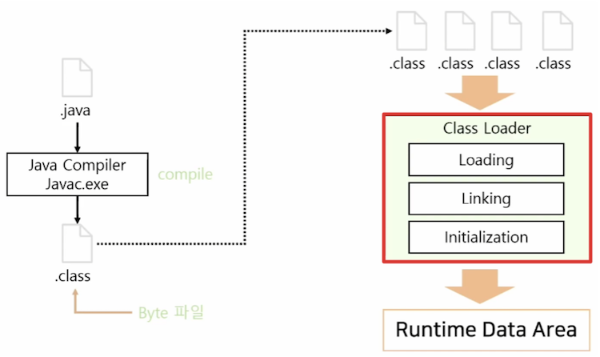
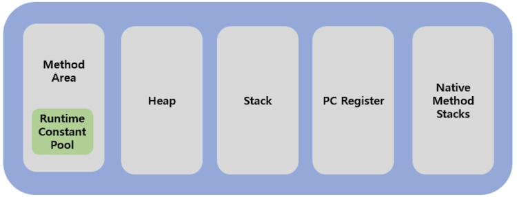
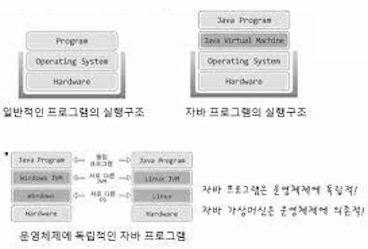
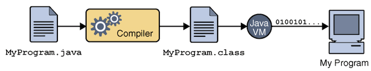
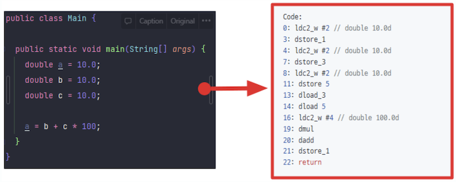

# JVM_자바 실행방식
## 자바 가상 머신(JVM, Java Virtual Machine)

자바 가상머신은 운영체제 위에서 실행되는 하나의 프로그램이며, **자바 프로그램을 실행시킴**

### Class Loader(클래스 로더)

- JVM에 클래스 파일을 로드하고, 링크를 통해 배치하는 작업을 수행하는 모듈
- 로드된 바이트 코드(.class)들을 읽어서 JVM의 메모리 영역인 Runtime Data Areas에 배치함
- 클래스에 메모리를 올리는 로딩 기능은 한 번에 메모리에 올리지 않고, 애플리케이션에서 필요한 경우 동적으로 메모리에 적재함
- 클래스 파일의 로딩 순서는 3단계로 구성됨 (Loading → Linking → Initialization)
    - Loading - 클래스 파일을 가져와서 JVM의 메모리에 로드함
    - Linking - 클래스 파일을 검증함
    - Initialization - 클래스 변수들을 초기화함

  
### Execution Engine(실행 엔진)
- 바이트 코드를 명령어 단위로 읽어 바이너리 코드로 번역하여 실행함
- 이때 실행 엔진은 인터프리터와 JIT 컴파일러 두 가지 방식을 혼합하여 바이트 코드를 실행
- **인터프리터(Interpreter)**
    - 바이트 코드 명령어를 하나씩 읽어서 해석하고 바로 실행함
    - 같은 메소드라도 여러 번 호출이 된다면 매번 해석하고 실행해야 해서 속도가 느림
- **JIT 컴파일러(Just-In-Time Compiler)**
    - 인터프리터의 단점을 보완하기 위해 도입된 방식
    - 바이트 코드 전체를 컴파일하여 Native Code로 변경해서 캐싱해둠 → 다음에 실행할 때는 네이티브 코드로 컴파일된 코드를 바로 사용함
    - But, 바이트 코드를 네이티브 코드로 변환하는 데도 비용이 소모되므로, JVM은 모든 코드를 JIT 컴파일러 방식으로 실행하지 않고 인터프리터 방식을 사용하다가 일정 기준을 넘어가면 JIT 컴파일 방식으로 명령어를 실행함
- **GC(Garbage Collector)**

> 💡 **바이트 코드 vs 네이티브 코드 vs 바이너리 코드**
>
> - **바이트 코드**: CPU가 아닌 가상머신에서 이해할 수 있는 이진코드
> - **바이너리 코드(이진 코드)**: CPU가 인식할 수 있는 0과 1로 구성된 이진코드
> 
> 즉 고급언어 -> 바이트 코드 -> 바이너리 코드로 변환되는 것!
> 
> - **네이티브 코드**: C, C++처럼 JVM 같은 인터프리터 없이도 운영체제가 읽을 수 있는 형태로 컴파일해서
>  사용할 수 있는 코드, 메모리가 관리(메모리 해제, 가비지 수집 등)되지 않음

  
### Runtime Data Areas(런타임 데이터 영역)

- JVM의 메모리 영역으로, 자바 애플리케이션을 실행할 때 사용되는 데이터들을 적재함
- **Method Area**
    - 클래스로더로 읽은 클래스 파일을 클래스별로 런타임 상수 풀, 필드 데이터, 메소드 데이터, 메소드 코드, 생성자 코드 등을 분류해서 저장함
    - **Runtime Constant Pool(런타임 상수 풀)**
        - 클래스와 인터페이스 상수, 메소드와 필드에 대한 모든 레퍼런스(주소값)를 저장함
        - JVM은 런타임 상수 풀을 통해 해당 메소드와 필드의 실제 메모리 상 주소를 찾아 참조할 수 있음
    - 모든 스레드에서 공유
- **Heap Area**
    - 프로그램 상에서 데이터를 저장하기 위해 런타임 시 동적으로 할당하여 사용하는 메모리 영역
    - 인스턴스(객체)와 배열을 저장
    - 모든 스레드에서 공유
- **Stack Area**
    - 지역 변수, 매개변수 등 연산 중 발생하는 임시 데이터를 저장함
    - 각 스레드 별로 생성
- **PC Register**
    - 현재 실행 중인 JVM의 명령어 주소를 가지고 있음
    - 각 스레드 별로 생성
- **Native Method Stack Area**
    - 자바 외 언어로 작성된 네이티브 코드를 위한 메모리
    - C/C++ 등의 코드를 수행하기 위한 스택으로 네이티브 메소드의 매개변수, 지역변수 등을 바이트 코드로 저장함
    - 각 스레드 별로 생성

  

## 자바 실행방식
### 자바 프로그램의 실행구조
일반적인 프로그램은 운영체제 위에서 실행됨     
즉, 하드웨어를 기반으로 운영체제가 동작하고, 그 위에서 프로그램이 실행되는 구조    

     

그러나 자바 프로그램은 자바 가상머신 위에서 실행됨     
즉, 운영체제가 자바 가상머신을 실행시키고, 자바 가상머신이 자바 프로그램을 실행시키는 구조    
- 자바 프로그램을 운영체제에 상관없이 실행시킬 수 있음 (운영체제 별로 존재하는 차이점을 가상머신이 중간에서 해결해줌)

  
### 자바의 실행방식

1. 자바 소스코드(.java)를 작성함 
2. 자바 프로그램을 실행하면, JVM은 OS로부터 메모리를 할당 받음 
3. 자바 컴파일러(javac)가 자바 소스코드(.java)를 읽어 JVM이 이해할 수 있는 자바 바이트코드(.class)로 변환시킴
    
    
    
4. Class Loader는 클래스 파일들을 로딩하여 Runtime Data Area에 올림 
5. Execution engine은 Runtime Data Area에 로드된 코드를 인터프리터 방식 또는 JIT 방식으로 실행함. 이때 실행 중인 프로그램에서 동적으로 생성되는 객체들은 Heap에 할당되며, Garbage Collector에 의해 메모리 관리가 이루어짐
6. 자바 프로그램이 모두 실행된 후, JVM은 프로그램의 종료를 감지하고, 필요한 경우 추가적인 종료 작업(파일 닫기, 자원 해제 등)을 수행함 

  
  

### 면접질문    
1. JVM의 구조와 Java의 실행방식을 설명해주세요

  
### 출처
윤성우의 열혈 Java 프로그래밍_윤성우      
[https://inpa.tistory.com/entry/JAVA-☕-JDK-JRE-JVM-개념-구성-원리-💯-완벽-총정리](https://inpa.tistory.com/entry/JAVA-%E2%98%95-JDK-JRE-JVM-%EA%B0%9C%EB%85%90-%EA%B5%AC%EC%84%B1-%EC%9B%90%EB%A6%AC-%F0%9F%92%AF-%EC%99%84%EB%B2%BD-%EC%B4%9D%EC%A0%95%EB%A6%AC)      
[https://inpa.tistory.com/entry/JAVA-☕-JVM-내부-구조-메모리-영역-심화편](https://inpa.tistory.com/entry/JAVA-%E2%98%95-JVM-%EB%82%B4%EB%B6%80-%EA%B5%AC%EC%A1%B0-%EB%A9%94%EB%AA%A8%EB%A6%AC-%EC%98%81%EC%97%AD-%EC%8B%AC%ED%99%94%ED%8E%B8)       
[https://sgcomputer.tistory.com/64](https://sgcomputer.tistory.com/64)       
[https://godjiblog.co.kr/1-jvm의-구조와-java의-실행-방식/](https://godjiblog.co.kr/1-jvm%EC%9D%98-%EA%B5%AC%EC%A1%B0%EC%99%80-java%EC%9D%98-%EC%8B%A4%ED%96%89-%EB%B0%A9%EC%8B%9D/)       
[https://velog.io/@livenow/Live-Study-JVM은-무엇이며-자바-코드는-어떻게-실행하는-것인가](https://velog.io/@livenow/Live-Study-JVM%EC%9D%80-%EB%AC%B4%EC%97%87%EC%9D%B4%EB%A9%B0-%EC%9E%90%EB%B0%94-%EC%BD%94%EB%93%9C%EB%8A%94-%EC%96%B4%EB%96%BB%EA%B2%8C-%EC%8B%A4%ED%96%89%ED%95%98%EB%8A%94-%EA%B2%83%EC%9D%B8%EA%B0%80)     
