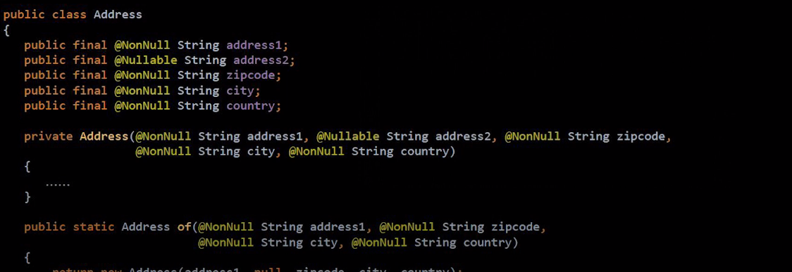
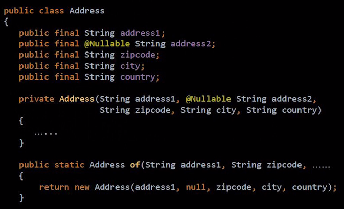

# Java에서 null을 안전하게 다루는법

# 1. Null에 대해

## 정의

- 의미가 모호하다.
    - 값이 할당되지 않은 변수
    - 존재하지 않는 상태
    - 초기화안된 상태
    - 정의가 안된 상태
    - null 그 자체로 값..?
- 모든 참조 유형이 될 수 있는 특수 리터럴 (모든 참조는 null가능)
- 빈값, 0과는 전혀 다름.

## null 참조

- 특정한 값이 없음을 나타내기위해 null 도입.
- 두 참조값이 null이면 두 참조는 동일하다고 판단한다.

## 소프트웨어 결함 통계

- 구글 플레이 앱 약 1000개를 조사해보니 NullPointer 문제가 150여 개 발생
- 그만큼 null과 관련된 Exception이나 오류가 많이 발생하는 것을 의미.

# 2. Null을 안전하게 다루는 법

## (1) 자바의 기본 장치

### (1-1) 단정문(Assertion)

- java1.4 부터 추가
- 개발자가 “본인의 코드”에서 가정한 사실이 올바른 지 검사할 수 있게 해주는 기능. 생산자=소비자 일 때
- Exception과 비슷하지만 예외처리가 아니라 검사라는 기능을 제공하는 것.
- 개발자가 의도한 특정 코드나 조건, 변수값을 먼저 검증, 검사하는 것.

**사용법**

- **assert 부울식;** 또는 **assert 부울식 : 수식;**
    - assert age>0 : “나이는 음수가 될 수 없습니다 : ”+age;
    - assert val<10 : “10보다 작은 값만 쓸 수 있습니다” ;
- 부울식이 거짓이면 AssertionError 발생
- 수식은 AssertionError에 포함될 상세 정보를 만드는 생성식이다.

**주의할점**

- Assertion은 일반적으로 컴파일되는 상황에서는 실행되지 않음.
    - 별도의 옵션 필요(-enableassertions 또는 -ea)
- Assertion을 사용하면 안되는 상황
    - public 메소드의 파라미터를 검사하는 경우 : IllegalArgumentException을 사용하는 것이 올바르다.
    - 올바른 수행을 위해 필요한 작업을 수행하는 경우 :
        - **assert checkName();** 같이 특정상황을 체크하여 어떤 결과를 기대하는 메서드를 만들었을 때, assert를 이용하려고 한다면 컴파일시 실행되지 않으므로, **assert checkName();**또한 실행되지 않는다.
        - 따라서 별도의 결과값을 담을 변수를 생성하여 그 변수를 가지고 assert에 사용하도록 해야한다.

### (1-2) Java.util.Objects

JAVA8에서 null체크와 관련된 메서드들이 생김. 

- Java 8
    - isNull(Object obj)
    - nonNull(Object obj)
    - requireNonNull(T obj)
    - requireNonNull(T obj, String message)
    - requireNonNull(T obj, Supplier<String> messageSupplier)

JAVA9에서 null일 경우 기본값을 제공하는 메서드들이 생김.

- Java 9
    - requireNonNullElse(T obj, T defaultObj)
    - requireNonNullElseGet(T obj, Supplier<? extends T> supplier)

<br></br>
### (1-3) java.util.Optional
[Optional 개념](https://github.com/psyStudy/CS_study/blob/main/Java/Java%20SE와%20Java%20EE%20차이_Java%20버전별%20특징.md)

Optional을 올바르게 사용하면 코드가 null-safe해지고 가독성이 좋아지며 애플리케이션이 안정적이 되지만,   
Optional을 잘못 사용하면 NullPointerException 대신 NoSuchElementException가 발생하고, 코드의 가독성을 떨어뜨리고, 시간적/공간적 비용이 증가하는 문제점이 발생함

만약 Optional로 받은 변수를 값이 있는지 판단하지 않고 접근하려고 한다면 NoSuchElementException이 발생하게 됨 
```java
Optional<User> optionalUser = ... ;

// Optional이 갖는 value가 없으면 NoSuchElementException 발생
User user = optionalUser.get();
```
즉, Null-Safe하기 위해 Optional을 사용하였는데, 값의 존재 여부를 판단하지 않고 접근한다면 NullPointerException는 피해도 NoSuchElementException가 발생할 수 있음 
<br></br>
#### [올바른 Optional 사용법 가이드] -> 애초에 주제에 벗어나는 내용이었던 거 같음
- 절대로 Optional 변수와 **반환값에 null을 사용하지 말라**
    - Optional은 컨테이너/박싱 클래스일 뿐이며, Optional 변수에 null을 할당하는 것은 Optional 변수 자체가 null인지 또 검사해야 하는 문제를 야기함
    - `Optional<Cart> emptyCart = null` -> 이렇게 쓰면 안된다!
    - 값이 없는 경우라면 Optional.empty()로 초기화해야 함
<br></br>
- isPresent()-get()은 orElse()나 orElseXXX 등으로 대체하라
    - 가급적이면 isPresent()로 검사하고 get()으로 값을 꺼내기보다는 orElseGet 등을 활용해 처리해야 함
    ```java
    private String findDefaultName() {
        return ...;
    }
    
    // AVOID
    public String findUserName(long id) {
        Optional<String> optionalName = ... ;
    
        if (optionalName.isPresent()) {
            return optionalName.get();
        } else {
            return findDefaultName();
        }
    }
    
    // PREFER
    public String findUserName(long id) {
        Optional<String> optionalName = ... ;
        // orElseGet은 값이 준비되어 있지 않은 경우, orElse는 값이 준비되어 있는 경우에 사용 
        return optionalName.orElseGet(this::findDefaultName);
    }
    ```

- 단순히 값을 얻으려는 목적으로만 Optional을 사용하지 마라
    - 단순히 값을 얻고자 할 때, Optional을 사용하는 것은 비용 낭비가 될 수 있음 -> 직접 값을 다루자
    - Optional을 필드, 메서드 매개변수, 집합 자료형에 쓰지 말라
  ```java
  // AVOID
    public String findUserName(long id) {
        String name = ... ;
        
        return Optional.ofNullable(name).orElse("Default");
    }
    
    // PREFER
    public String findUserName(long id) {
        String name = ... ;
        
        return name == null 
          ? "Default" 
          : name;
    }
  ```

- 집합 자료형(List, Set, Map)을 감싸는 데 Optional을 쓰지 말고 빈 집합을 사용해라
  ```java
  // AVOID
    public Optional<List<User>> getUserList() {
        List<User> userList = ...; // null이 올 수 있음
    
        return Optional.ofNullable(items);
    }
    
    // PREFER
    public List<User> getUserList() {
        List<User> userList = ...; // null이 올 수 있음
    
        return items == null 
          ? Collections.emptyList() 
          : userList;
    }
  ```
<br></br>
## (2) null을 잘 사용하기

1. **API(매개변수, 반환)에 null을 최대한 쓰지 말기.**
    - null을 지나치게 유연한 메서드로 만들지 말고 **명시적 메서드**를 만들어라.
        - API에 null을 받아서 분기처리하지 말고, null이 있을 때와 없을 때 메서드를 나눠서 만들어라.
    - null을 반환하지 말기
        - 반환값이 있어야 한다면, null을 반환하지 말고 예외를 던져라.
        - 빈 반환 값은 빈 컬렉션이나 null객체를 사용
        - 반환 값이 없을 수도 있다면 Optional반환
    - 선택적 매개변수는 null대신 다형성(메서드 추가 정의)을 사용해서 표현
2. **사전 조건과 사후 조건을 확인하라 : “계약에 의한 설계(design by contract)”⭐**
    - API 소비자와 제공자 사이 지켜야할 규약.
    - 개방-폐쇄 원칙의 상위 개념
    - null이 들어오지 말아야하면 잘 확인해야한다는 내용.
    - Spring의 Assert클래스를 사용
3. **null의 범위를 지역(클래스, 메소드 등)에 제한하기**
    - null도 지역적으로 제한하면 큰 문제가 안일어남.
    - 설계가 잘 된 코드에서는 null의 위험이 줄어든다.
4. **초기화를 명확히 하라.**
    - 초기화 시점과 실행 시점이 겹치지 않아야 한다.
    - 실행 시점엔 초기화되지 않은 필드가 없어야 한다.
    - 실행 시점에 null인 필드는 초기화되지 않았다는 의미가 아닌 값이 없다는 의미여야 한다.
    - 객체 필드의 생명주기는 모두 객체의 생명주기와 같아야 한다.
    - 지연 초기화 필드의 경우 팩토리 메서드로 null 처리를 캡슐화하라.

# 3. null에 안전하다고 보장해 주는 도구 (null을 사용할 수 있음을 알려줌)

### JSR-308 타입 어노테이션


- 선언부가 아닌 타입 지정 위치에 어노테이션 추가 가능
- 어노테이션 프로세싱을 통한 빈약한 자바 타입 시스템을 강화
- 초안 제출 2006/10/17, 최종안 승인 2014/2/18 자바 8에 추가
- **Checker Framework**
    - **@Nullable**
    - **@NonNull**

### Checker Framework

- null 안전성 확인(**@Nullable, @NonNull,** @PolyNull)
- Map 키, 잠금, 순차 자료형 색인값, 정규식, 문자열 형식, 단위 등 다수 확인 기능 제공
- 자작 확인 기능 추가 가능
- 특정 환경이나 IDE 독립적

### @NonNull과 @Nullable
- @NonNull : Null값이 올 수 없음을 나타냄.
- @Nullable : Null값 허용을 나타냄.





- 기본 null 정책 (Null 일때만 붙여라)
    - 과도한 어노테이션 사용을 예방하기 위해 만듦.
    - 기본 @NonNull : 필드, 매개변수, 반환값 등
    - 예외적 @Nullable : 지역변수, 타입 캐스트 증
    - 패키지, 클래스 수준에서 정책을 마음대로 설정할 수 있다. @DefaultQualifier
        
        ```java
        @DefaultQualifier(value = NonNull.class, locations = TypeUseLocation.LOCAL_VARIABLE)
        package dev.fupfin.null_safety.strict;
        ```
        
        ```java
        @DefaultQualifier(value = Nullable.class, locations = TypeUseLocation.FIELD)
        class MyClass {
        	Object nullableField = null;
            @NonNull Object nonNullField = new Object();
        }
        ```
        
- **어노테이션 달린 자바 표준 API 제공**
    - 자바 8 표준 API
    - 임의의 API에 어노테이션 설정 가능
    
    ```java
    private static void password(){
    	Console console = System.console();
    	char[] password = console.readPassword(); //<-Error:(30, 27) java : [dereference.of.nullable] dereference of possibly-null reference console
    }
    ```
    
- **자동 타입 개선(Automatic type refinement)**
    - 단순한 정적 타입 확인이 아닌 코드 흐름과 실행 결과를 반영
    - 코드를 null 확인을 한 경우 @nonNull로 취급
    - 메서드 내부로 제한
    
    ```java
    private static void password(){
    	Console console = System.console();
    	char[] password = nonNull(console) ? console.readPassword() : new char[0]; //OK
    }
    ```
    
- **집합 타입 요소의 null 안정성 지원**
    - List, Set, Map, 배열 등 집합 자료형의 요소도 null 확인
    - 기본이 "널이아님" 상
    - 타입 매개변수에 @Nullable 지정
    
    ```java
    private static void printlist(){
    	List<String> names = Arrays.asList("kim", "choi", null, "park", "hwang");
    		//(위 널에서)Error:(42, 43) java: [assignment.type.incompatiable] incompatiable types in assignment. found:@Initailized @NonNull List<@Initialized @Nullable String>...
    	for (String name : names)
    		out.println(name);
    }
    ```
    

---

# 면접질문

- 자바에서 null을 안전하게 다루는 방법에 대해 설명해주세요.
    - (scripts)공개 메서드가 아닌 곳에는 assert를 사용하여 null을 방어할 수 있습니다. 또한 메서드의 인자를 받을 때 Objects.requireNonNull()을 사용하여 방어할 수 있습니다. 그리고 Optional을 사용해 리턴 타입에서 null을 반환하지 않도록 방어할 수 있습니다. 마지막으로 사전 조건과 사후 조건을 명확히 하여 계약에 의한 설계를 실천해야 합니다.
- Optional API에 대해 설명해주세요.
    - (scripts)개발할때 가장 많이 발생하는 예외 중 하나가 NPE(NullPointerException)입니다. NPE를 피하려면 null 여부 검사를 필연적으로 하게 되는데 만약 null 검사를 해야하는 변수가 많은 경우 코드가 복잡해지고 번거롭습니다. 하지만 Java8 부터 Optional<T>을 제공하여 null로 인한 예외가 발생하지 않도록 도와주고, Optional 클래스의 메소드를 통해 null을 컨트롤 할 수 있습니

# 출처

- [https://eastglow.github.io/back-end/2020/01/10/Java-자바에서-null을-안전하게-다루는-방법.html](https://eastglow.github.io/back-end/2020/01/10/Java-%EC%9E%90%EB%B0%94%EC%97%90%EC%84%9C-null%EC%9D%84-%EC%95%88%EC%A0%84%ED%95%98%EA%B2%8C-%EB%8B%A4%EB%A3%A8%EB%8A%94-%EB%B0%A9%EB%B2%95.html)
- [https://www.slideshare.net/gyumee/null-142590829](https://www.slideshare.net/gyumee/null-142590829)
- [https://le2ksy.tistory.com/65](https://le2ksy.tistory.com/65)
- [https://velog.io/@jifrozen/자바-면접질문-정리](https://velog.io/@jifrozen/%EC%9E%90%EB%B0%94-%EB%A9%B4%EC%A0%91%EC%A7%88%EB%AC%B8-%EC%A0%95%EB%A6%AC)
- [https://www.youtube.com/watch?v=vX3yY_36Sk4](https://www.youtube.com/watch?v=vX3yY_36Sk4)
- [https://dev-coco.tistory.com/153](https://dev-coco.tistory.com/153)
-
