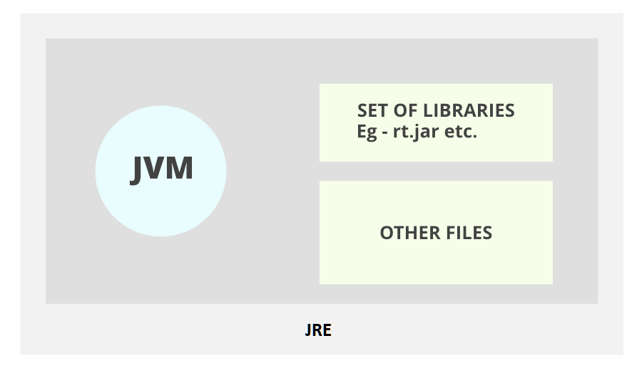

# Java와 C/C++차이, JDK와 JRE차이

# 1. JAVA vs. C/C++

## 실행 환경 차이

- java : 컴파일+jar 압축 ; 링크 과정없이 컴파일러가 바로 바이트 코드를 생성
    - 자바 가상 머신 위에서 바이트 코드로 컴파일 된다.
    
- C/C++ : 컴파일 + 링크
    - OS에 맞는 기계어로 컴파일한다 → JAVA보다 빠르다.
    - 기계어로 직접 컴파일 되고 운영체제에 의해 실행된다.

## 설계 목표

- Java : 보안, 이식성, 빠른 개발에 비중
    - 버그를 일으키기 쉬운 기능은 없애고, 직접 가비지컬랙션을 통해 메모리 관리함. → 보안성이 좋은 이유
    - C++의 연산자 오버로드나 다중 상속과 같은 기능을 쓸 수 없음(빠른 개발을 위해서)
- C++ : 속도와 C언어와의 하위 호환성에 중점
    - 절차 지향 언어인 C의 효율성을 개선하기 위해 *OOP(객체 지향 프로그래밍; Object Oriented Programing)을 결합한 것이기 때문. 완벽한 OOP가 아닌 절차 지향이 섞여있어 약점이 많음.
        - *OOP : 객체 지향 프로그래밍, Object Oriented Programming : 프로그래밍에서 필요한 데이터를 추상화 시켜 상태와 행위를 가진 객체로 만들고, 객체들간의 상호작용을 통해 로직을 구성하는 방법.
    - 프로그래머가 메모리 관리 및 제어, 포인터, 전처리기 같은 기능을 컨트롤 한다. → Java에 비해 보안성이 약한 이유

## 메모리 관리
1.
- Java : 객체를 항상 Heap영역에만 할당하고 가비지 콜렉터가 이를 수거한다.
- C++ : 객체를 Heap과 Stack 영역에 모두 할당할 수 있다.
2.
- Java : GC를 지원하여 메모리 누수를 예방한다.
- C++ : *유효하지 않은 메모리가 존재할 수 있다. 이런 객체는 소멸 될 수 없기 때문에 메모리 누수로 이어진다.
    - *유효하지 않은 메모리 : 메모리에 할당하였지만, 접근 가능한 참조가 없는 객체를 의미한다.
3. 
- Java : 객체가 기본 초기화 상태로 수행된다.
- C++ : 객체를 초기화하지 않고 생성할 수 있다. (따라서 쓰레기 값을 가질 수 있음.)

## 바인딩

>💡 **바인딩**
>
>일반 함수를 정적 바인딩, 가상 함수를 동적 바인딩이라고 생각하면 된다
>
>- 정적바인딩: 컴파일 시, 어떤 함수를 호출할 지 결정
>
>→ (장점) 다형성(polymorphism) 으로 인해 융통성을 갖게 됨. 
>→ (단점) 실행속도가 미세하지만 느려짐
>
>- 동적바인딩: 런타임 중, 실행코드가 결정이 됨
>
>→ (장점) 실행속도는 동적바인딩보다 빠름 
>
>→ (단점) 융통성이 적음

- Java : 동적 바인딩
    - 런타임에 기반하여 method를 호출한다.
    - 별도의 데이터 관리가 필요하고, 불필요한 오버헤드가 붙을 수 있다.
- C++ : 정적 바인딩
    - 컴파일 타임에 함수 호출을 결정, 프로그램 실행 중 불필요한 오베헤드가 없음.
    - 부모 클래스의 함수를 오베라이딩 하는 과정에서 정적 바인딩으로 인한 문제가 발생하기 때문에 virtual 키워드를 제공한다.(가상 method)

## 상속

- Java : 클래스 다중 상속을 지원하지 않는다.
    - Interface를 지원한다. Interface는 다중 상속이 가능하다.
    - 이는 Interface가 추상메소드로 구성되어 있기 때문에, 다중 상속을 받은 클래스에서 해당 메소드를 구현하므로 다이아몬드 문제가 발생하지 않는다.
    -(JAVA 8 이후 인터페이스 다중상속이 가능하지만 디폴드 메소드가 있다면 구현체에서 오버라이딩 해야한다. java8이후 인터페이스에 대한 부분이 다를 수 있으므로 인터페이스 파트를 확인하자!)
    - [https://kangyb.tistory.com/14](https://kangyb.tistory.com/14)
- C++ : 클래스 다중 상속을 지원한다.
    - C++은 가상 상속을 통해 다이이아몬드 문제를 회피한다.
    - Interface를 지원하지 않는다.

```cpp
class USBDevice
{
private:
	long m_id;

public:
	USBDevice(long id) : m_id(id) {} 

	long getID() { return m_id; }

	void plugAndPlay() {} 
};

class NetworkDevice
{
private:
	long m_id;

public:
	class NetworkDevice(long id) : m_id(id) {}

	long getID() { return m_id;	}

	void networking() {}
};

class USBNetworkDevice : public USBDevice, public NetworkDevice
{
public:
	USBNetworkDevice(long usb_id, long net_id)
		:USBDevice(usb_id), NetworkDevice(net_id)
	{}
};

int main()
{
	USBNetworkDevice my_device(3.14, 6.022);

	my_device.networking(); //NetworkDevice에서 상속
	my_device.plugAndPlay(); //USBDevice에서 상속

    my_device.USBDevice::getID(); //두 부모에 중복되는 멤버가 있으면 부모 이름을 앞에 명시해 주자.
    my_device.NetWorkDevice::getID();

	return 0;
}

```

클래스 다중 상속을 지원하는 언어는 ‘다이아몬드 문제’가 발생한다.

> 다이아몬드 문제는, 다중상속을 지원하는 언어에서 하나의 클래스가 여러 상위 클래스 상속을 받고 상위 클래스들에 동일한 메소드가 존재할 때 하위 클래스에서 어느 상위 클래스의 메소드를 상속받아야 하는지 모호한 문제이다.
> 
> 
> 
> 

## 라이브러리

- Java : C++에 비해 표준 라이브러리가 거대하다.
    - Java SE 표준라이브러리는 컴퓨터 네트워크, 그래픽 사용자 인터페이스, XML처리, 로깅, 데이터베이스 접근, 암호학, 기타 요소들을 모두 제공합니다.
    - 다른 외부 라이브러리도 잘 사용할 수 있다.

- C++ : C++의 표준라이브러리는 문자열, 컨테이너, 입출력 스트림 등의 비교적 범용적인 요소들만 제공한다.
    - Java와 같은 추가기능을 사용하려면 제 3자 라이브러리를 이용해야함.

- (참고, 안드로이드 같은 경우 dbsplite외 다른 db를 사용하고 싶을 경우 외부 서버가 필요하는 등 외부 라이브러리 사용이 힘든 경우가 있다.)

## 매개변수 전달방식

- JAVA : ⭐항상 call by value(종종 다르게 적힌 곳 있음)
    - 자바는 객체를 가르키는 레퍼런스라는 개념이 있는것이지, 이게 함수의 매개변수로 넘어갈때는 call by value 로 넘어갑니다. 즉  레퍼런스 그 자체가 deep copy 되어 넘어갑니다.
- C++ : call by value와 call by reference를 모두 지원.
    - 기본적으로 *객체를 값으로 전달
    - ( "& 레퍼런스" 일 경우 call by reference , 즉 clone copy 하지 않음 )
    - *객체 : array[], class 등을 말함.
- C : call by value, **( 포인터 그 자체도 매개변수로 넘어갈때 value 복사됨, clone copy 됨 )**
- Python : call by value ( python은 모두 객체이기때문에, call by object 라 불리지만, 다른 언어와 비교해 말하자면 그렇다는 , 즉 자바의 객체 레퍼런스를 넘기는것과 동일 효과)
- Javascript : call by value ( 자바,파이썬과 동일)
<br></br>
- Call by Reference : 참조에 의한 호출, 전달받은 값을 참조한다. 전달 받은 값을 변경할 경우 원본 값도 변경된다.
- Call by Value : 값을 호출하는 것. 전달받은 값을 복사하여 처리한다. 전달받은 값을 변경하여도 원본 값은 변경되지 않는다.

## 기타

- JAVA : 모든 메소드가 가상 메소드로, 레퍼런스 유형이 아니라, 객체 유형에 따라 메소드 구현이 결정된다.
- C++ : 가상 메소드 별로 선언해야함.

- JAVA : 원시 데이터형의 크기가 정의 되어 있음.
    - JVM에서 작동 되니까!
- C++ : 구현(시스템)에 따라 데이터형의 크기가 달라짐 -> 
    - OS(16비트, 64비트)나 컴파일러에서 자료형의 크기가 조금씩 다르다는점 기억해 두자.
    - OS별(16bit/32bit/64bit) 크기 사용의 요점은 다음과 같다.
        * int는 시스템의 기본연산 단위를 사용한다. (16bit=>2byte, 32=>4byte, 64=>4byte)
        * 64bit에서 long형을 8byte로 확장하였다. (16bit=>4byte, 32=>4byte, 64=>8byte)
    - int가 시스템에 따라 다른 이유는 int는 CPU에서는 word 단위로 연산하게 되는데 이때 word의 크기가 int의 크기와 동일하게 됩니다. 그러므로 CPU에서 처리하는 기준에 따라 int크기가 달라지게 됩니다.

- Java : 연산자 오버로딩을 지원하지 않는다.
- C++: 연산자 오버로딩을 지원한다.
- * 연산자 오버로딩 : 기존 제공하고 있는 연산자를 재정의하여 사용자 정의 클래스로 사용하는 것.
```cpp
#include <iostream>
using namespace std;
 
class Point {
private :
    int x, y;
 
public :
    Point(int x_, int y_) {
        x = x_;
        y = y_;
    }
 
    void print() {
        cout << "x : " << x << ", y : " << y << "\n";
    }
 
    Point operator + (Point& p) {
        x = x + p.x;
        y = y + p.y;
        return Point(x, y);
    }
};
 
 
int main(void) {
    Point p1 = { 1, 1 };
    Point p2(2, 2);
    
    Point p3 = p1 + p2;
 
    p3.print();
 
    return 0;
}
```
```
x : 3, y : 3
```
- 함수의 이름은 operator입니다. 함수의 이름을 operator로 사용함으로써 컴파일러에게 연산자 오버로드 함수인것을 명시합니다.
- 0번째 줄을 보시면 Point p3 = p1 + p2; 라는 코드가 있습니다.
여기서 p1이 오버로드 된 + 연산자 함수를 호출했으며, + 뒤에있는 p2는 Point& p로 넘겨 받아지는 것 입니다.
반환값은 Point 객체로 x와 y가 각각 더해진 새로운 임시 Point 객체를 반환합니다.
이 반환된 임시 객체 값이 p3 값으로 넘어가서 결과적으로 3, 3이 출력되는 것입니다.

- java : 자동으로 배열의 인덱스 검사를 진행한다. 
    - 인덱스를 잘못 입력하면 컴파일은 되고 ArrayIndexOutOfBounds등으로 에러 알려줌.
- c/c++ 인덱스 검사를 선택적으로 진행한다.
    - 배열 유효성 검사를 하지 않아 인덱스를 잘못 입력해도 에러를 일으키지 않고 쓰레기값을 내놓는다.


## ⭐요약 정리

**Java**

- Heap영역에만 객체를 할당합니다.
- 유효하지 않은 메모리를 GC가 관리합니다.
- 클래스 다중 상속을 지원하지 않습니다.
- Interface 다중 상속을 지원합니다.
- 상당히 거대한 표준 라이브러리를 지원합니다.
- JVM으로 인해 운영체제에 종속되지 않습니다.
- 자동으로 인덱스 검사를 진행합니다.
- 연산자 오버로딩을 지원하지 않습니다.
- Call by value만을 채택하여 사용합니다.

**C++**

- Stack, Heap 영역 모두 객체를 할당할 수 있습니다.
- 유효하지 않은 메모리를 개발자가 직접 관리해야 합니다.
- 클래스 다중 상속을 지원합니다.
- 기계어로 직접 컴파일되고, 운영체제에 의해 실행됩니다.
- 인덱스 검사를 선택적으로 지원합니다.
- 연산자 오버로딩을 지원합니다.
- Call by value와 Call by reference 모두 사용 가능합니다.

---

# 2. JDK와 JRE차이


## 2.1 JRE ; Java Runtime Environment



자바 실행 환경. 

JRE는 JVM 뿐만 아니라, Java binaries, Java 클래스 라이브러리 등을 포함하고 있어 자바 프로그램의 실행을 지원한다.

컴파일러나 디버거 등의 도구는 포함하지 않는다.

→ 자바 프로그램을 개발하는 것이 아니라 실행하기만 원한다면 JRE 설치한다.

## 2.2 JDK ; Java Development Kit


자바 개발 키트.

자바 애플리케이션을 개발하기 위한 환경을 지원한다.

JDK는 JRE를 포함할 뿐 아니라, 컴파일러(javac), javadoc, jar 등 개발에 유용한 도구들을 포함하고 있다. 

→ 자바 프로그램을 개발하기 위해서는 JDK를 설치해야함.

---

# 면접질문

- JAVA와 C/C++의 차이가 무엇인가요?
    - JAVA말고 할 줄 아는 언어가 있나요? → 답변, 그 언어와 자바의 차이가 무엇인가요 묻는 사례
    - 자신이 사용하는 언어와의 차이 알아두기
- JDK와 JRE의 차이가 무엇입니까?
- [참고]**Call by Reference와 Call by Value의 차이는 무엇입니까?**
    
    **Call by Value**
    
    방식은 함수에 인자를 전달할 때 인자값을 복사하여 전달하는 방식입니다. 이 방식에서는 원본 데이터와 전달된 복사본이 서로 다른 메모리 주소를 가지기 때문에, 함수 내에서 인자의 값을 변경해도 원본 데이터에는 영향을 미치지 않습니다. C, C++, Java, Python 등이 call by value 방식을 사용합니다.
    
    **Call by Reference**
    
    방식은 함수에 인자를 전달할 때 인자의 메모리 주소를 전달하는 방식입니다. 함수 호출시에 인자로 전달되는 변수의 레퍼런스를 전달하며 해당 주소를 통해 원본 데이터를 직접 수정할 수 있습니다. C++, Swift, PHP 등이 call by reference 방식을 지원합니다.
    
- java의 기본타입(원시타입)은 call by value고 참조타입은 call by reference인가요?
    - java는 항상 call by value로 작동합니다. java의 참조변수에는 원본 객체에 대한 참조를 값으로 복사하여 가지고 있습니다. 즉 변수가 가지는 값이 레퍼런스이므로 인자로 넘길 때 call by value에 의해 변수가 가지고 있는 레버런스가 복사되어 전달되는것 입니다. 함수 내에서 객체의 속성을 변경하게 되면 원래 객체에 영항을 줄 수 있지만 함수 내에서 전달된 참조변수 자체를 변경하면 호출자의 원래 참조에는 영향을 주지 않습니다.

# 출처

- [https://sujinhope.github.io/2019/12/09/CS-Java-면접-질문(기술면접-대비).html](https://sujinhope.github.io/2019/12/09/CS-Java-%EB%A9%B4%EC%A0%91-%EC%A7%88%EB%AC%B8(%EA%B8%B0%EC%88%A0%EB%A9%B4%EC%A0%91-%EB%8C%80%EB%B9%84).html)
- [https://theheydaze.tistory.com/598](https://theheydaze.tistory.com/598)
- [https://velog.io/@chiyongs/Java-VS-C](https://velog.io/@chiyongs/Java-VS-C)
- [https://aomee0880.tistory.com/145](https://aomee0880.tistory.com/145)
- [https://code-lab1.tistory.com/253](https://code-lab1.tistory.com/253)

- [https://jhnyang.tistory.com/203](https://jhnyang.tistory.com/203)
- [https://yeolco.tistory.com/119](https://yeolco.tistory.com/119)
- [https://myblog.opendocs.co.kr/archives/1230](https://myblog.opendocs.co.kr/archives/1230)
- [https://elevate-yourself.tistory.com/6](https://elevate-yourself.tistory.com/6)