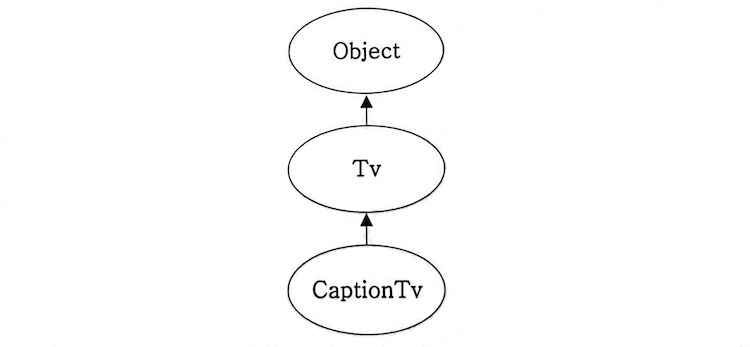
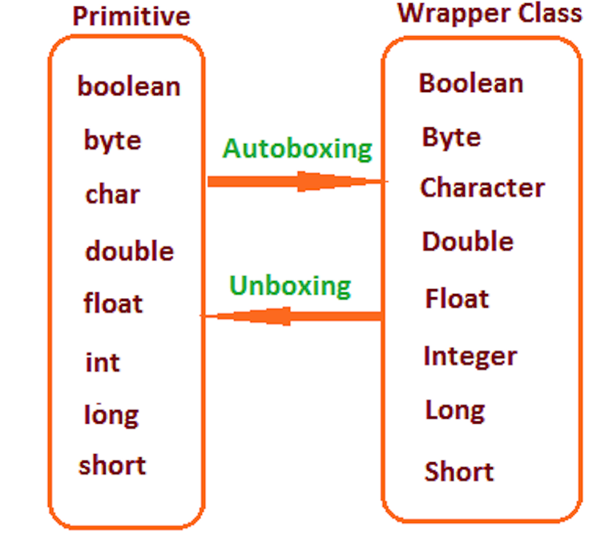
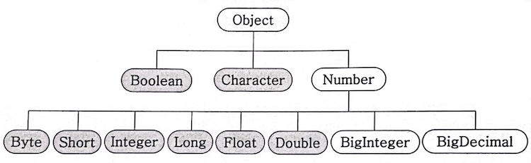

# Object_Wrapper Class
## Object 클래스
모든 클래스 상속계층도의 제일 위에 위치하는 조상클래스

- 다른 클래스를 상속하지 않는 모든 클래스는 자동적으로 Object 클래스를 상속하게 됨
    - Object 클래스에는 toString(), equals와 같은 모든 인스턴스가 가져야 할 기본적인 11개의 메소드가 정의되어 있기 때문에, 이러한 메소드를 따로 정의하지 않고도 사용할 수 있음
    
    ```java
    class Tv { ... }
    
    class CaptionTv extends Tv { ... }
    ```
    
    
    
<br></br>
### Object 클래스의 메소드
- `protected Object clone()`
    - 객체 자신의 복사본을 반환함
- `public boolean equals(Object obj)`
    - 객체 자신과 객체 obj가 같은 객체인지 알려줌 (같으면 true)
- `protected void finalize()`
    - 객체가 소멸될 때 가비지 컬렉터에 의해 자동으로 호출됨
    - 이때 수행되어야 하는 코드가 있는 경우에만 오버라이딩하여 사용함
- `public Class getClass()`
    - 객체 자신의 클래스 정보를 담고 있는 Class 인스턴스를 반환함
- `public int hashCode()`
    - 객체 자신의 해시코드를 반환함
- `public String toString()`
    - 객체 자신의 정보를 문자열로 반환함
    
- `public void wait()` / `public void wait(long timeout)` / `public void wait(long timeout, int nanos)`
    - 다른 스레드가 notify()나 notifyAll()을 호출할 때까지 현재 스레드를 무한히 또는 지정된 시간(timeout, nanos) 동안 기다리게 함
    - 동기화 관련 메소드로, 호출하는 스레드가 반드시 고유 락을 갖고 있어야 함 (즉, synchronized 블록 내에서 호출되어야 함)
    - [모니터](https://github.com/psyStudy/CS_study/blob/main/OS/동기화_세마포어_뮤텍스.md) 관련 내용 참고
- `public void notify()`
    - 잠들어 있던 스레드 중 임의로 하나를 골라 깨움 (wait로 잠든 메소드를 깨움)
    - 동기화 관련 메소드로, 호출하는 스레드가 반드시 고유 락을 갖고 있어야 함 (즉, synchronized 블록 내에서 호출되어야 함)
- `public void notifyAll()`
    - 잠들어 있던 스레드를 모두 깨움
    - 동기화 관련 메소드로, 호출하는 스레드가 반드시 고유 락을 갖고 있어야 함 (즉, synchronized 블록 내에서 호출되어야 함)
    - notify()는 어느 스레드를 깨울지 선택할 수 없기 때문에 제어가 어려움 → 보통 notifyAll()을 사용함

<br></br>

## Wrapper Class
### 래퍼 클래스란?
이름이 의미하듯이 ‘감싸는 클래스’로, **래퍼 클래스가 감싸는 대상은 실수, 문자와 같은 기본 자료형의 값들**이다

기본형(primitive type) 변수도 때로는 객체로 다루어져야 하는 경우가 있는데(ex, 매개변수로 객체를 요구할 때, 기본형 값이 아닌 객체로 저장해야 할 때, 객체 간에 비교가 필요할 때 등), 이때 래퍼 클래스가 필요함 

```java
public static void showData(Object obj) {
    System.out.println(obj);
}

// 위 메소드의 인자로 정수 3과 실수 7.15를 전달해야 하는 상황에서, 
// 기본 자료형의 값을 인스턴스로 만들어 전달해야 함 -> 래퍼 클래스 필요 
public static void main(String[] args) {
    Integer iInst = new Integer(3);
    showData(iInst);
    showData(new Double(7.15));
}
```
<br></br>
아래와 같이 모든 기본 자료형을 대상으로 래퍼 클래스가 정의되어 있음 

- **Boolean** → `public Boolean(boolean value)` (생성자)
- **Character** → `public Character(char value)`
- **Byte** → `public Byte(byte value)`
- **Short** → `public Short(short value)`
- **Integer** → `public Integer(int value)`
- **Long** → `public Long(long value)`
- **Float** → `public Float(float value)`, `public Float(double value)`
- **Double** → `public Double(double value)`

<br></br>

### 래퍼 클래스의 두 가지 기능 - Boxing, Unboxing
- 값을 인스턴스에 감싸는 행위를 ‘박싱(Boxing)’이라고 하고, 반대로 저장된 값을 꺼내는 행위를 ‘언박싱(Unboxing)이라고 함
- 박싱은 인스턴스의 생성을 통해서 이루어지지만, 언박싱은 래퍼 클래스에 정의된 메소드의 호출을 통해서 이루어짐
- 래퍼 인스턴스들은 담고 있는 값을 수정하지 못하므로, 값의 수정이 필요하면 새로운 래퍼 인스턴스를 생성해야 함 → `iObj = new Integer(iObj.intValue() + 10);`


<br></br>
각 래퍼 클래스별 언박싱 메소드의 이름은 아래와 같음   
- **Boolean** → `public boolean booleanValue()`
- **Character** → `public char charValue()`
- **Byte** → `public byte byteValue()`
- **Short** → `public short shortValue()`
- **Integer** → `public int intValue()`
- **Long** → `public long longValue()`
- **Float** → `public float floatValue()`
- **Double** → `public double doubleValue()`

<br></br>
### 오토 박싱(Auto Boxing) & 오토 언박싱(Auto Unboxing)
자바 5부터 박싱과 언박싱이 필요한 상황에 자바 컴파일러가 이를 자동으로 처리하기 시작함 

- **오토 박싱**
    
    ```java
    Integer iObj = 10;  ->  Integer iObj = new Integer(10);
    Double dObj = 3.14;  ->  Double dObj = new Double(3.14);
    ```
    

- **오토 언박싱**
    
    ```java
    int num1 = iObj;  ->  int num1 = iObj.intValue();
    double num2 = dObj;  ->  double num2 = dObj.doubleValue();
    ```
    

- **오토 박싱 & 오토 언박싱 동시에 진행**
    - Integer형 참조변수 num을 int형 변수 num처럼 사용할 수 있게 됨
    
    ```java
    num++;  ->  new Integer(num.intValue() + 1);
    num += 3;  ->. new Integer(num.intValue() + 3);
    ```
    
<br></br>

## Number Class
Number 클래스는 추상클래스로 내부적으로 숫자를 멤버변수로 갖는 클래스들의 조상임



- 위 그림은 Wrapper 클래스의 상속계층도로, 기본형 중에서 숫자와 관련된 Wrapper 클래스들은 모두 Number 클래스의 자손임
    - BigInteger는 long으로도 다룰 수 없는 큰 범위의 정소를, BigDecimal은 double로도 다룰 수 없는 큰 범위의 부동 소수점을 처리하기 위한 것으로, 자주 쓰이지는 않음

<br></br>
<br></br>

### 면접질문    
1. Wrapper Class란 무엇이며, Boxing과 UnBoxing은 무엇인지 설명하세요

<br></br>
### 출처
도서 ‘Java의 정석’     
도서 ‘윤성우의 열혈 Java 프로그래밍’     
[http://happinessoncode.com/2017/10/05/java-object-wait-and-notify/](http://happinessoncode.com/2017/10/05/java-object-wait-and-notify/)     
[https://inpa.tistory.com/entry/JAVA-☕-wrapper-class-Boxing-UnBoxing](https://inpa.tistory.com/entry/JAVA-%E2%98%95-wrapper-class-Boxing-UnBoxing)
