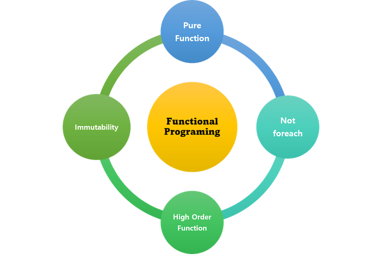

# Stream API
## 함수형 프로그래밍이란
### 프로그래밍 패러다임

프로그래밍 스타일, 전체적인 프로그래밍 방식을 나타내는 용어.

프로그래머에게 프로그래밍의 관점을 갖게 해 주고, 결정하는 역할을 한다.

프로그래밍 언어 ≠ 프로그래밍 패러다임

최근에는 여러 패러다임이 관대하게 지원되는 경향이 있음

프로그래밍 패러다임은 크게 아래와 같이 구분할 수 있음

- **명령형 프로그래밍** - 무엇(What)을 할 것인지 나타내기보다 **어떻게(How)** 할 것인지를 설명하는 방식
    - 절차지향 프로그래밍 - 수행되어야 할 순차적인 처리 과정을 포함하는 방식(C, C++ 등)
    - 객체지향 프로그래밍 - 객체들의 집합으로 프로그램의 상호작용을 표현(C++, Java, C# 등)
- **선언형 프로그래밍** - 어떻게 할 것인지(How)를 나타내기 보다 **무엇(What)**을 할 것인지 설명하는 방식
    - 함수형 프로그래밍 - 순수 함수를 조합하고 소프트웨어를 만드는 방식 (클로저, 하스켈, 리스프 등)

함수형 프로그래밍은 거의 모든 것을 **순수 함수**로 나누어 문제를 해결하는 기법으로, 작은 문제를 해결하기 위한 함수를 작성하여 가독성을 높이고 유지보수를 용이하게 해줌 

<br></br>
### 함수형 프로그래밍의 특징



1. **순수 함수(Pure Function)**
- 동일한 입력에는 항상 같은 값을 반환해야 함(참조 투명성)
- 함수의 실행과 프로그램의 실행은 독립적이어야 함
- 함수 내부에서 인자의 값을 변경하거나 프로그램 상태를 변경하는 Side Effect(부수효과)가 없어야 함
- 따라서 스레드에 안정성을 보장받아 병렬 처리를 동기화 없이 진행할 수 있음

```java
private String name = "홍길동";

// Not Pure
public String greeting() {
    return "Hello " + name;  // 전역변수 사용 -> 프로그램의 실행과 함수 실행이 독립적이지 않게 됨  
}

// Pure Function
public static String greeting(String name) {
    return "Hello " + name;
}
```
<br></br>
2. **Not foreach (=No Iterate)**
- 반복문 내부에는 가변적인 값들에 대한 처리 코드가 포함되어 있기 때문에, 함수형 프로그래밍에서는 for, while문과 같은 반복문을 사용하지 않음
- 반복문 대신 map, filter 같은 함수를 매개변수로 받는 메소드를 사용함

```java
List<Integer> numbers = List.of(1, 2, 3, 4, 5);

// for loop
for (int idx = 0; idx < numbers.size(); idx++) {
    System.out.println(numbers.get(idx));
}

// Functional
numbers.forEach((num) -> {
    System.out.println(num);
}
```
<br></br>
3. **불변성(Immutability)**
- 함수형 프로그래밍에서의 데이터는 변하지 않는 불변성을 유지해야 함
- 데이터의 변경이 필요한 경우, 원본 데이터 구조를 변경하지 않고 그 데이터의 복사본을 만들어서 그 일부를 변경하고, 변경한 복사본을 사용해 작업을 진행함

```java
public static void main(String[] args) {
    List<String> alphabets = Arrays.asList("a", "b", "c");
    List<String> newAlphabets = add(alphabets, "d");

    System.out.println(alphabets);  // [a, b, c]
    System.out.println(newAlphabets); // [a, b, c, d]
}

public static List<String> add(List<String> strings, String text) {
    List<String> dest = new ArrayList<>();

    // overhead 리스트를 순회하면서 원소들을 복사함 (DeepCopy) 
    for (String string : strings) { 
        dest.add(string);
    }

    dest.add(text);
    return dest;
}
```
<br></br>
4. ****고차함수(Higher-order functions)****        
함수형 프로그래밍에서는 함수가 1급 객체가 되며, 1급 객체의 특징은 아래와 같음       
- 변수나 데이터 구조 안에 담을 수 있음
- 파라미터로 전달할 수 있음
- 반환값(return value)으로 사용할 수 있음
<br></br>

함수가 1급 객체이기 때문에, 고차함수로 만들 수 있게 됨 
- 고차함수는 함수를 인자로 받거나, 함수를 반환값으로 이용할 수 있는 것을 말함
- 클로저 개념이 사용되는데, 클로저는 내부 함수에서 외부 함수의 값(greetingText)에 접근하고 scope가 종료되어도 계속 접근할 수 있는 것을 의미함

```java
// greeting 함수는 인사말을 입력받고 함수를 반환함
// 반환되는 함수는 이름을 인자로 받으며, 상위 함수에서 입력받은 인사말을 출력함 
Function<String, Function<String, String>> greeting = (greetingText) -> {
    return (name) -> {
        return greetingText + " " + name;
    };
};

// 함수형 인터페이스 Function 사용 
Function<String, String> hello = greeting.apply("Hello");
Function<String, String> hi = greeting.apply("HI");

System.out.println(hello.apply("홍길동"));
System.out.println(hi.apply("홍길동"));

/* 출력 결과
Hello 홍길동
HI 홍길동 
*/
```


<br></br>
### 함수형 프로그래밍의 장단점

- 장점
    - 높은 수준의 추상화를 제공함
    - 함수 단위의 코드 재사용이 수월함
    - 불변성을 지향하기 때문에 프로그램의 동작을 예측하기 쉬움
- 단점
    - 순수함수를 구현하기 위해서 코드의 가독성이 떨어질 수 있음
    - 함수형 프로그래밍에서는 반복이 for문이 아닌 재귀를 통해 이루어지는데, 재귀적 코드 스타일은 무한 루프에 빠질 수 있음
    - 순수함수를 사용하는 것은 쉬울 수 있지만 조합하는 것은 쉽지 않음

<br></br>
---

## Stream API란

자바는 객체지향 언어이기 때문에 기본적으로 함수형 프로그래밍이 불가능함     
하지만 **Java 8부터 Stream API와** 람다식, 함수형 인터페이스 등을 지원하면서 자바를 이용해 **함수형으로 프로그래밍할 수 있는 API들을 제공**해주고 있음 

Stream은 컬렉션의 저장 요소를 하나씩 참조해서 람다식으로 처리할 수 있도록 해주는 반복자임      
Stream API에 정의된 함수들을 통해, 데이터를 추상화(데이터의 종류에 상관없이 같은 방식으로 데이터를 처리하여 재사용성을 높이는 것)하고 처리할 수 있음 

기본의 컬렉션의 메소드를 이용해 데이터 처리를 하려면, 각 요소를 순회하면서 처리해야 하며 하나의 단계가 끝나고 다른 단계를 진행하는 절차적인 구조를 가지고 있었음    
하지만 Stream을 이용하면 간결화된 코드와 향상된 성능으로 많은 데이터를 효과적으로 병렬처리할 수 있음   

```java
/* Stream 사용 전 */
String[] nameArr = {"IronMan", "Captain", "Hulk", "Thor"}
List<String> nameList = Arrays.asList(nameArr);

// 원본의 데이터가 직접 정렬됨
Arrays.sort(nameArr);
Collections.sort(nameList);

for (String str: nameArr) {
  System.out.println(str);
}

for (String str : nameList) {
  System.out.println(str);
}
```

```java
/* Stream 사용 후 */
String[] nameArr = {"IronMan", "Captain", "Hulk", "Thor"}
List<String> nameList = Arrays.asList(nameArr);

// 원본의 데이터가 아닌 별도의 Stream을 생성함
Stream<String> nameStream = nameList.stream();
Stream<String> arrayStream = Arrays.stream(nameArr);

// 복사된 데이터를 정렬하여 출력함
nameStream.sorted().forEach(System.out::println);
arrayStream.sorted().forEach(System.out::println);
```

<br></br>
### Stream API의 특징

- **람다식으로 요소 처리 코드를 제공함**
    - Stream API가 제공하는 대부분의 요소 처리 메소드는 함수형 인터페이스 매개 타입을 가지기 때문에, 람다식 또는 메소드 참조를 이용해서 요소 처리 내용을 매개값으로 전달할 수 있음
<br></br>
- **원본의 데이터를 변경하지 않음**
    - Stream API는 원본의 데이터를 조회하여 원본의 데이터가 아닌 별도의 요소들로 Stream을 생성함
    - 원본의 데이터는 읽기만 할 뿐, 정렬이나 필터링 등의 작업은 별도의 Stream 요소들에서 처리됨
    
    ```java
    List<String> sortedList = nameStream.sorted().collect(Collections.toList());
    ```
<br></br>    
- **내부 반복자를 사용하므로 병렬 처리가 쉬움**
    - 기존에는 반복문을 사용하기 위해서 for나 while 등과 같은 문법을 사용해야 했지만, Stream API에서는 그러한 반복 문법을 메소드 내부에 숨기고 있기 때문에 간결한 코드 작성이 가능함
    - 어떻게 요소를 반복시킬 것인가는 컬렉션에게 맡겨두고, 개발자는 요소 처리 코드에만 집중할 수 있음
    
    ```java
    // 반복문이 forEach라는 함수 내부에 숨겨져 있음
    nameStream.forEach(System.out::println);
    ```
    
<br></br>
- **스트림은 중간 처리와 최종 처리를 할 수 있음**
    - 중간 처리에서는 매핑, 필터링, 정렬을 수행하고, 최종 처리에서는 반복, 평균, 총합 등의 집계 처리를 수행함
<br></br>
- **지연 연산을 수행함**
    - 결과값이 필요할 때까지 연산을 늦추는 기법 (최종처리 연산이 수행될 때까지 연산을 늦춤) -> 그 대신 최소한의 필수적인 작업만을 수행하고자, 지연연산을 위한 준비과정을 수행함
    - 준비작업은 스트림 파이프라인이 어떠한 중간연산과 최종연산으로 구성되어 있는지 검사하고, 어떤 방식으로 최적화를 진행할지 미리 계획함
    - 스트림에서 제공하는 최적화 전략으로는 루프퓨전과 쇼트서킷이 대표적임 
    

<br></br>

## Stream 사용 과정
### Stream 얻기
원본 데이터의 복사본 얻음 
- **컬렉션으로부터 스트림 얻기**
    - Stream<T> Collection.stream()
    
    ```java
    List<Student> list = Arrays.asList(new Student("홍길동", 10), new Student("한석봉", 20), new Student("이순신", 30));
    		
    Stream<Student> stream = list.stream();
    ```
    
<br></br>
- **배열로부터 스트림 얻기**
    - Stream<T> ****Arrays.stream(T[])
    
    ```java
    Student[] student= {new Student("홍길동", 10), new Student("한석봉", 20), new Student("이순신", 30)};
    		
    Stream<Student> stream = Arrays.stream(student);
    ```
    
<br></br>
- **숫자 범위로부터 스트림 얻기**
    - IntStream.range(int, int) → 끝 값 포함 안함
    - IntStream.rangeClosed(int, int) → 끝 값 포함함
    
    ```java
    IntStream stream = IntStream.range(1, 100);  // 1~99
    IntStream stream2 = IntStream.rangeClosed(1, 100);  // 1~100
    ```
    
<br></br>
- **Stream은 일회용임**
    - Stream API는 일회용이기 때문에 한 번 사용이 끝나면 재사용이 불가능하므로, Stream이 또 필요한 경우에는 Stream을 다시 생성해주어야 함
    - 만약 닫힌 Stream을 다시 사용한다면 IllegalStateException 발생
    
    ```java
    userStream.sorted().forEach(System.out::print);
    
    // 스트림이 이미 사용되어 닫혔으므로 에러 발생
    int count = userStream.count(); 
    
    /* IllegalStateException 발생
    java.lang.IllegalStateException: stream has already been operated upon or closed
        at java.util.stream.AbstractPipeline.evaluate(AbstractPipeline.java:229)
        at java.util.stream.ReferencePipeline.noneMatch(ReferencePipeline.java:459)
    */
    ```
    
<br></br>
### 중간 처리 메소드

- **Stream filter()**
    - 메소드 이름처럼 Collection 내 원소 중에서 조건을 만족하는 원소를 필터링함
    - 조건은 filter 람다 함수를 이용해 인자로 전달함
    
    ```java
    List<String> colors = Lists.newArrayList("BLACK", "RED", "BLUE", "RED", "BLACK");
    
    List<String> filterColors = colors.stream()
                    .filter(color -> {
                        if ("BLACK".equals(color)) {
                            return true;
                        }
                        return false;
                    }).collect(Collectors.toList());
    
    System.out.print(filterColors);  // [BLACK, BLACK]
    ```
    
<br></br>
- **Stream<R> map(Function<T, R>)**
    - 각 원소들의 형태를 변경해줌
    - Integer→String과 같은 간단한 타입 변환 뿐만 아니라, 람다 함수를 인자로 전달함으로써 아예 새로운 값으로 변경해줄 수도 있음
    
    ```java
    List<String> colors = Lists.newArrayList("BLACK", "RED", "BLUE", "RED", "BLACK");
    
    final List<Integer> collect = colors.stream()
                    .map(color -> {
                        return color.length();
                    }).collect(Collectors.toList());
    
    System.out.println(collect); // [5, 3, 4, 3, 5]
    ```
    
<br></br>
- **Stream<T> sorted()**
    - Collection 내 원소들을 정렬함
    
    ```java
    List<String> colors = Lists.newArrayList("BLACK", "RED", "BLUE", "RED", "BLACK");
    
    // 문자열의 길이순으로 정렬 
    final List<String> collect = colors.stream()
                    .sorted((before, current) -> {
                        if (before.length() > current.length()) {
                            return 1;
                        }
                        return -1;
                    })
                    .collect(Collectors.toList());
    
    System.out.println(collect); // [RED, RED, BLUE, BLACK, BLACK]
    ```

<br></br>
### 최종 처리 메소드
- **void forEach()**
    - 요소 전체를 반복함
    - 최종 처리 메소드이므로 이후에 sum()과 같은 다른 최종 메소드를 호출하면 안됨
    
    ```java
    //1~100까지 중 짝수만 ArrayList에 담고 출력함
    ArrayList<Integer> list = new ArrayList<>();
    IntStream.range(1, 101).filter(a->a%2==0).forEach(a->list.add(a));
    System.out.println(list);
    ```
    
<br></br>
- **R collect(Collector<T,A,R> collector)**
    - 필요한 요소만 컬렉션으로 담을 수 있고, 요소들을 그룹핑할 수 있음
    
    ```java
    List<Student> maleList = totalList.stream().filter(s -> s.getSex() == Student.Sex.MALE)
    				.collect(Collectors.toList());
    ```
    
<br></br>
<br></br>

### 면접질문
1. Stream API를 사용해 본 적이 있는가?
2. Stream API의 특징은 무엇이 있나요?

<br></br>
### 출처
[https://mangkyu.tistory.com/112](https://mangkyu.tistory.com/112)     
[https://jongminfire.dev/함수형-프로그래밍이란](https://jongminfire.dev/%ED%95%A8%EC%88%98%ED%98%95-%ED%94%84%EB%A1%9C%EA%B7%B8%EB%9E%98%EB%B0%8D%EC%9D%B4%EB%9E%80)    
[https://warpgate3.tistory.com/entry/자바코드로-보는-함수형-프로그래밍-Functional-Programming-in-Java](https://warpgate3.tistory.com/entry/%EC%9E%90%EB%B0%94%EC%BD%94%EB%93%9C%EB%A1%9C-%EB%B3%B4%EB%8A%94-%ED%95%A8%EC%88%98%ED%98%95-%ED%94%84%EB%A1%9C%EA%B7%B8%EB%9E%98%EB%B0%8D-Functional-Programming-in-Java)     
[https://warpgate3.tistory.com/entry/Stream](https://warpgate3.tistory.com/entry/Stream)     
[https://hongs-coding.tistory.com/35](https://hongs-coding.tistory.com/35)
