# call by value , call by reference

java는 오직 call by value이다.

설명을 위해 call by value, reference를 모두 사용하는 c++ 코드가 같이 설명될 수 있음

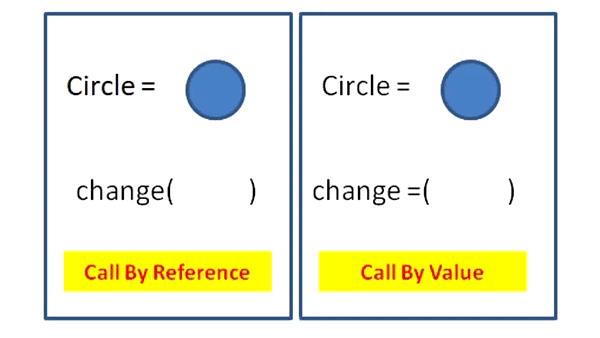

# 1. call by value

값에 의한 호출.

- 인자로 받은 값(=그 자체로 유의마한 데이터)을 복사하여 처리한다.
- 장점 : 복사하여 처리하기 때문에 안전하다. 원래 값이 보존된다.
- 단점 : 복사를 하기 때문에 메모리 사용량이 늘어난다.

- 예시 - 두 변수 값을 바꾸는 Swap 함수 실행.

```cpp
#include <iostream>
 
using namespace std;
 
void Swap(int x, int y)
{
	int tmp = x;
	x = y;
	y = tmp;
}
 
int main()
{
	int a = 10;
	int b = 20;
 
	Swap(a, b);
 
	cout << "a : " << a << endl;
	cout << "b : " << b << endl;
}
```

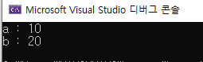

- 하지만 인자값이 바뀌지 않음!
- 지역변수와 매개변수는 그 값이 stack에 할당되므로
- swap이 호출되는 순간 매개변수 x, y가 stack에 할당되고, a와 b값이 x,y에 복사됨.
- 따라서 swap을 실행해도 원래의 a, b에는 영향을 주지 않음.

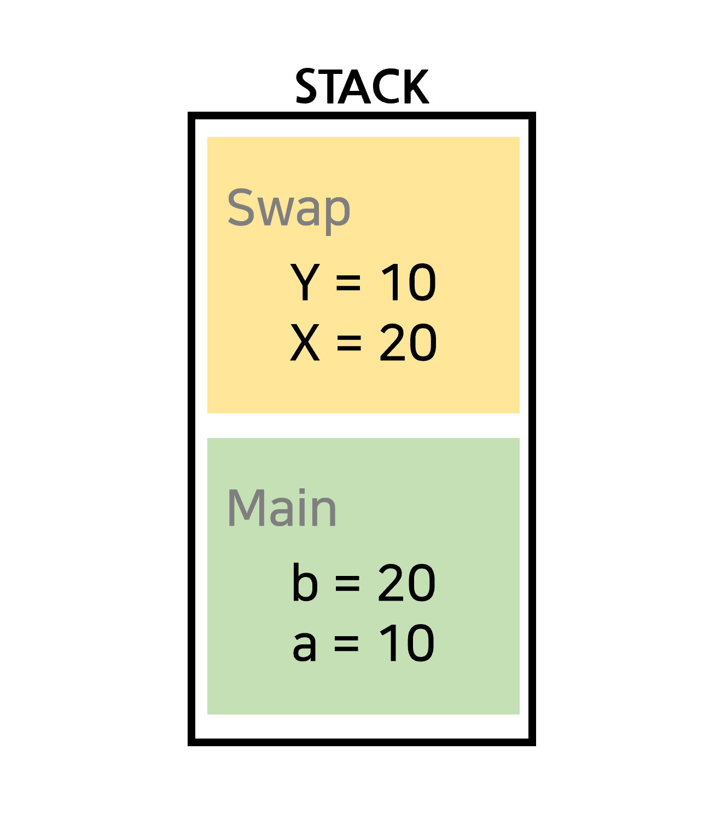

# 2. call by reference

참조에 의한 호출.

- 인자로 받은 값의 주소를 참조하여 직접 값에 영향을 준다.
- 장점 : 복사하지 않고 직접 참조하므로 빠르다.
- 단점 : 직접 참조하므로 원래 값이 영향을 받는다.

- 예시 - 이번에는 swap을 포인트 변수로 선언

```cpp
#include <iostream>
 
using namespace std;
 
void Swap(int *a, int *b)
{
	int tmp = *a;
	*a = *b;
	*b = tmp;
}
 
int main()
{
	int a = 10;
	int b = 20;
 
	Swap(&a, &b);
 
	cout << "a : " << a << endl;
	cout << "b : " << b << endl;
}
```

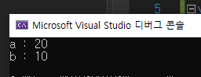

- 포인터 변수를 사용하여 주소값을 전달하여 swap안에서도 a,b와 직접 접근할 수 있다.
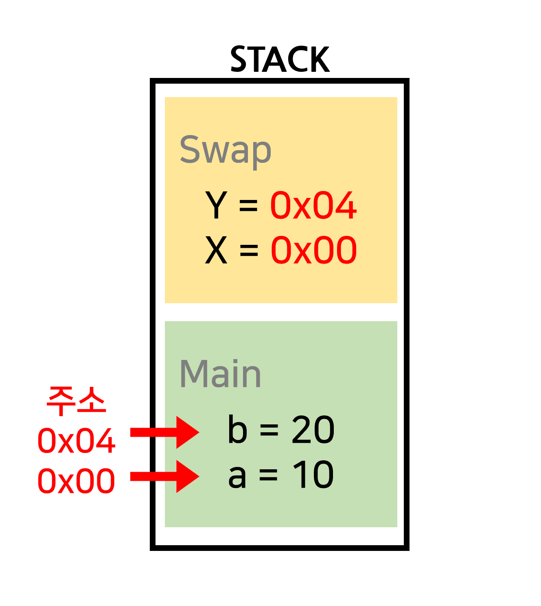

# 3. JAVA의 call by value

Java는 항상 call by value 방식이다.

java는 함수에 전달되는 인자 데이터 타입에 따라(원시타입과 참조타입) 함수 호출방식이 달라진다.

- 원시타입의 경우 c++ 예제와 똑같은 call by value
- 참조타입의 경우 해당 객체를 가리키는 주소값=value를 새로 생성하여 넘긴다. (call by reference 처럼 보이는 call by value)
- 변수를 생성하면 JVM에서 Stack영역에 할당된다.
- 원시타입은 stack영역에 변수와 함께 저장된다.
- 참조타입은 객체는 heap에 저장되고, stack영역에 있는 변수가 객체의 주소값을 가지고 있다.
    
    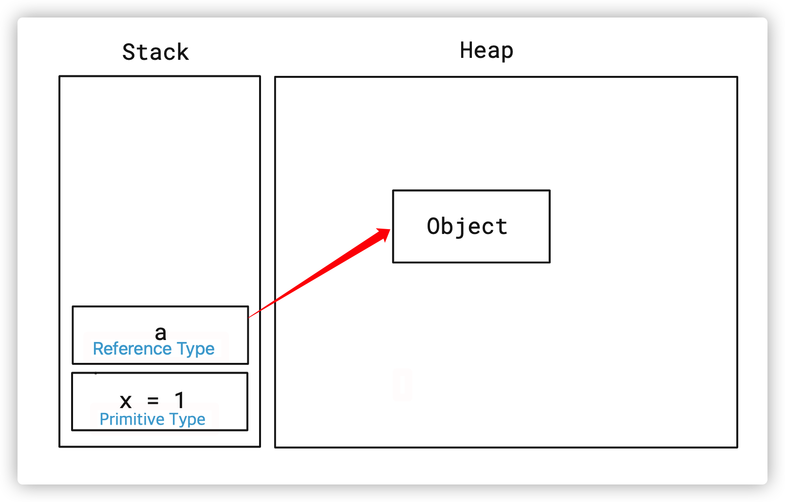
    

## 3.1 JAVA의 원시타입 전달

아래 코드에서 `test()` 의 변수 `a`, `b` 와 `modify(a, b)` 로 전달받은 파라미터 `a`, `b` 의 이름과 값은 같습니다.

하지만 다른 변수입니다.

`modify(a, b)` 를 호출하는 순간 Stack 영역에 새로운 변수 `a`, `b` 가 새로 생성되어 총 4 개의 변수가 존재합니다.

```java
public class PrimitiveTypeTest {

    @Test
    @DisplayName("Primitive Type 은 Stack 메모리에 저장되어서 변경해도 원본 변수에 영향이 없다")
    void test() {
        int a = 1;
        int b = 2;

        // Before a==1, b==2 인것 확인
        assertEquals(a, 1); // 동일하다는 실행결과 *assertEquals 를 정의 찾아보기
        assertEquals(b, 2); //// 동일하다는 실행결과 

        modify(a, b); 

        // After: modify(a, b) 호출 후에도 값이 변하지 않음
        assertEquals(a, 1); // 동일하다는 실행결과 
        assertEquals(b, 2); // 동일하다는 실행결과 
    }

    private void modify(int a, int b) {
        // 여기 있는 파라미터 a, b 는 이름만 같을 뿐 test() 에 있는 a, b 와 다른 변수
        a = 5;
        b = 10;
    }
}
```

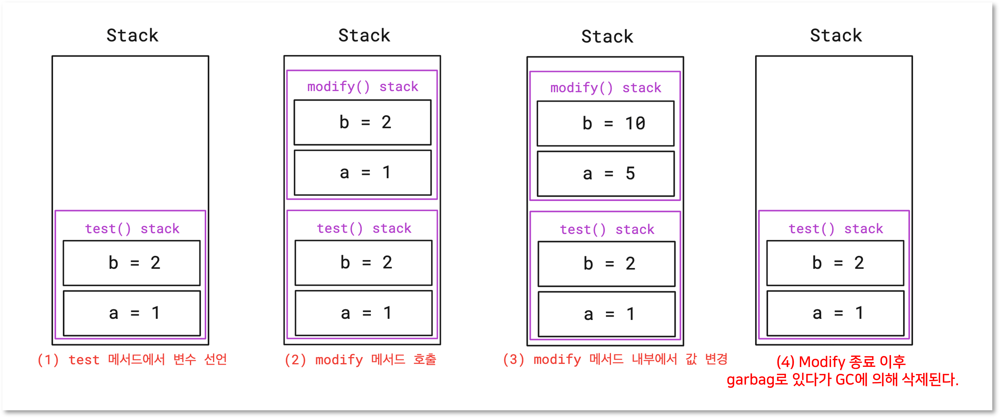

## 3.2 JAVA의 참조타입 전달

여기서 `modify(a, b)` 를 호출한 후에 `a.age` 의 값이 변경되었기 때문에 Call by Reference 로 파라미터를 넘겨주었다고 착각하기 쉽습니다.

하지만 **Reference 자체를 전달하는 게 아니라 주소값만 전달**해주고 `modify()` 에서 생긴 변수들이 주소값을 보고 객체를 같이 참조하고 있는 겁니다.

```java
class User {
    public int age;

    public User(int age) {
        this.age = age;
    }
}

public class ReferenceTypeTest {

    @Test
    @DisplayName("Reference Type 은 주소값을 넘겨 받아서 같은 객체를 바라본다" +
                 "그래서 변경하면 원본 변수에도 영향이 있다")
    void test() {
        User a = new User(10);
        User b = new User(20);

        // Before
        assertEquals(a.age, 10);
        assertEquals(b.age, 20);

        modify(a, b);

        // After
        assertEquals(a.age, 11);
        assertEquals(b.age, 20);
    }

    private void modify(User a, User b) {
        // a, b 와 이름이 같고 같은 객체를 바라본다.
        // 하지만 test 에 있는 변수와 확실히 다른 변수다.

        // modify 의 a 와 test 의 a 는 같은 객체를 바라봐서 영향이 있음
        a.age++;

        // b 에 새로운 객체를 할당하면 가리키는 객체가 달라지고 원본에는 영향 없음
        b = new User(30);
        b.age++;
    }
}
```

### 3.2.1. **처음 변수 선언 시 메모리 상태**

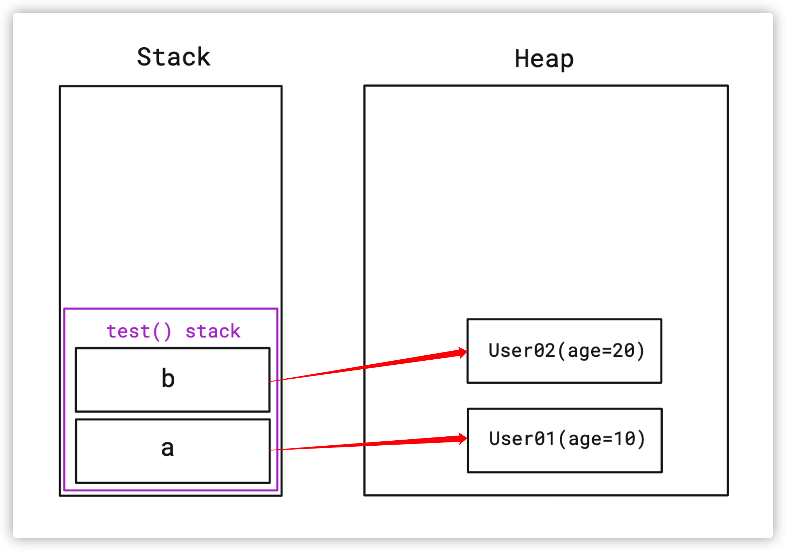

### 3.2.2. modify(a,b) 호출 시점 메모리 상태

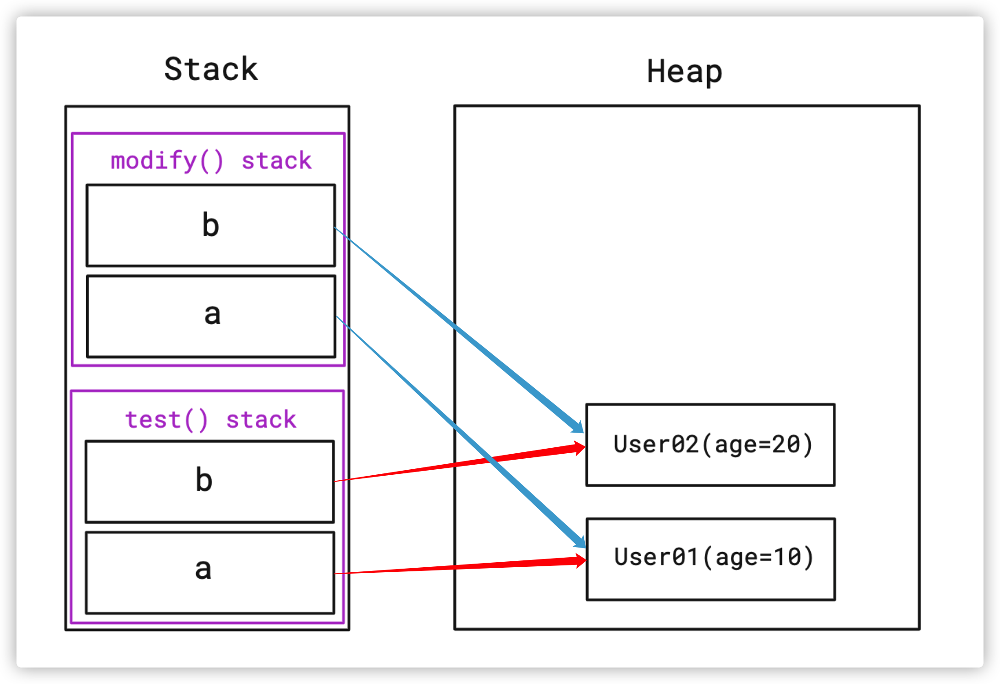

### 3.2.3. modify(a,b)수행 직후 메모리 상태

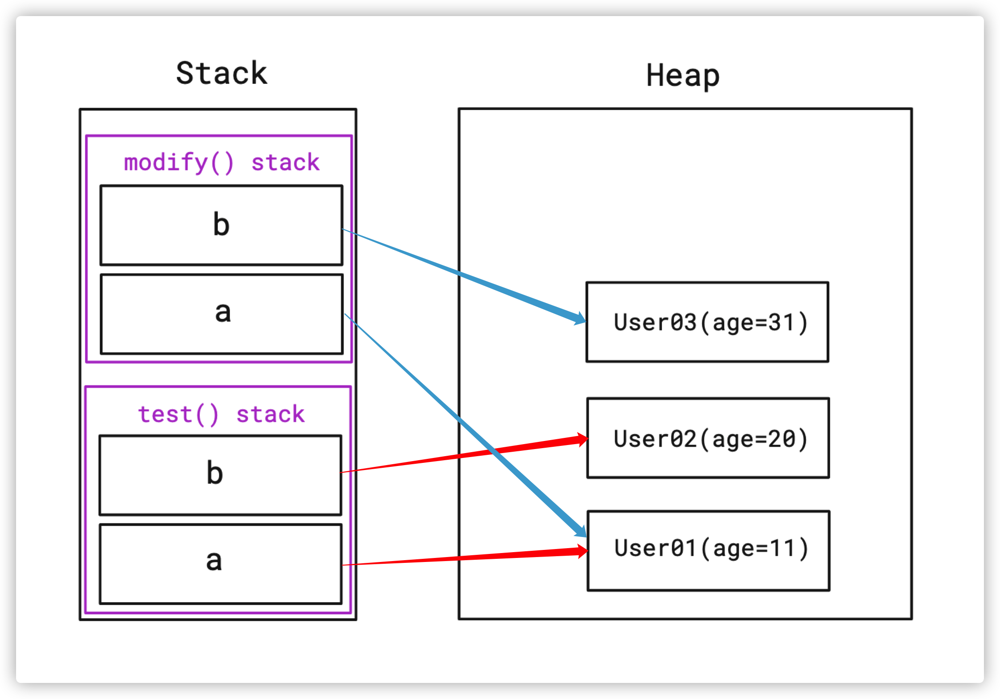

- `test()` 영역과 `modify()` 영역에 존재하는 `a` 라는 변수들은 같은 객체인 `User01` 을 바라보고 있기 때문에 객체를 공유합니다.
- `b` 라는 변수는 서로 같은 객체인 `User02` 를 바라보고 있었지만 `modify(a, b)` 내부에서 새로운 객체를 생성해서 할당했기 때문에 `User03` 이라는 객체를 바라봅니다.
- 그래서 `User03` 의 `age` 값을 변경해도 `test()` 에 있는 `b` 에는 아무런 변화가 없습니다.

### 3.2.4. test() 끝난 후 최종 메모리 상태

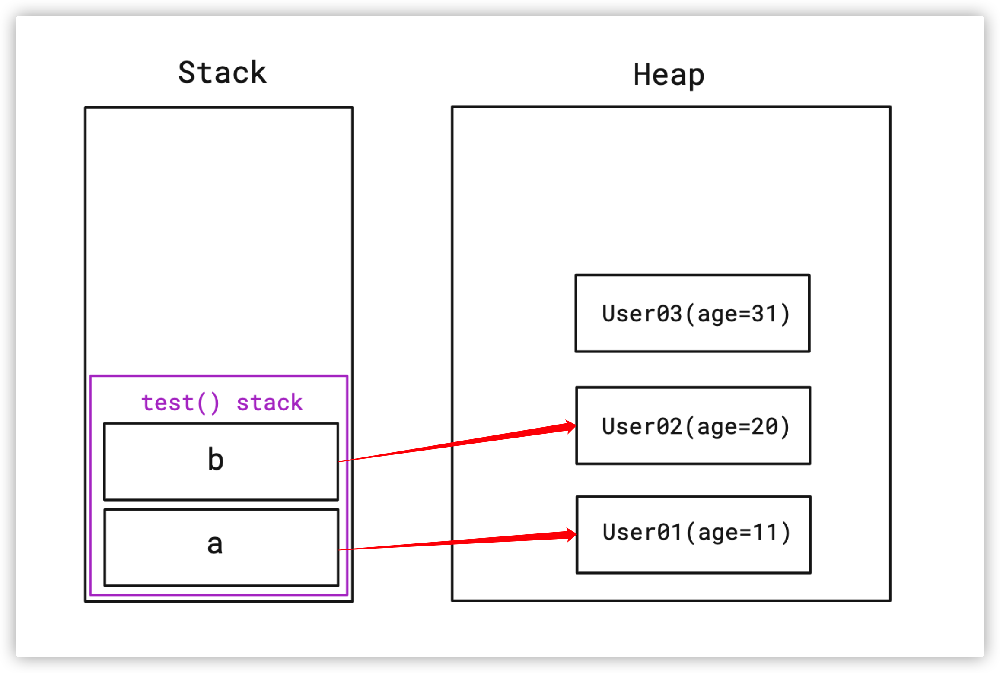

- `modify(a, b)` 메서드를 빠져나오면 Stack 영역에 할당된 변수들은 사라집니다.
- 최종적으로 위와 같은 상태가 되며 `User03` 은 어떤 곳에서도 참조되고 있지 않기 때문에 나중에 Garbage Collector 에 의해 제거될 겁니다.

---

# 면접질문

- call by value와 call by reference 의 차이를 설명해 보세요.
- 그럼 자바의 원시타입(기본타입)은 call by value로 작동하고, 참조타입은 call by reference로 작동하나요?
    - java는 항상 call by value로 작동합니다. java의 참조변수에는 원본 객체에 대한 참조를 값으로 복사하여 가지고 있습니다. 즉 변수가 가지는 값이 레퍼런스이므로 인자로 넘길 때 call by value에 의해 변수가 가지고 있는 레버런스가 복사되어 전달되는것 입니다. 함수 내에서 객체의 속성을 변경하게 되면 원래 객체에 영항을 줄 수 있지만 함수 내에서 전달된 참조변수 자체를 변경하면 호출자의 원래 참조에는 영향을 주지 않습니다.

# 출처

- [https://sudo-minz.tistory.com/91](https://sudo-minz.tistory.com/91)
- [https://kangworld.tistory.com/64](https://kangworld.tistory.com/64)
- [https://devlog-wjdrbs96.tistory.com/44](https://devlog-wjdrbs96.tistory.com/44)
- [https://bcp0109.tistory.com/360](https://bcp0109.tistory.com/360)
- [https://velog.io/@ka0ka0ka/1-3d8vtbh5](https://velog.io/@ka0ka0ka/1-3d8vtbh5)