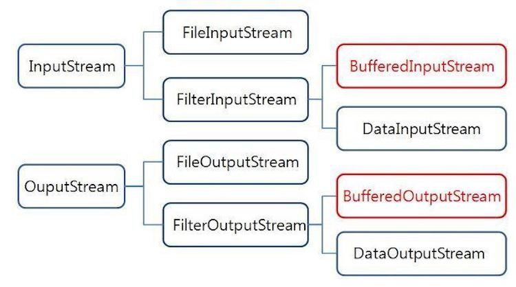

# try-with-resource, 강한 결합/약한 결합
## try-with-resource

try(…)에서 선언된 객체들에 대해서 try가 종료될 때 자동으로 자원을 해제해주는 기능 

> **자원(resource)이란?**      
외부의 데이터(DB, Network, File)를 말함      
자바 내부에 위치한 요소가 아니기 때문에 자바 코드에서 접근하려고 할 때 예외가 발생할 가능성이 높음     
자원을 사용한 후에는 꼭 해제 작업이 필요함(해제 안해주면 동시성 문제, 메모리 낭비 등 문제 발생)
> 
- try 괄호 안에서 선언된 객체가 **AutoCloseable을 구현**하였다면, 자바는 try 구문이 종료될 때 객체의 close() 메소드를 자동으로 호출해줌
- Java 7 부터 도입된 기능임
- 코드를 짧고 간결하게 만들어 가독성과 유지보수성을 높임
<br></br>
### try-catch-finally로 자원 해제

Java 7 이전에 try-catch-finally 구문에서 자원을 해제하려면 필요한 코드 양이 많아 지저분했음 

```java
// 파일을 열고 문자열을 모두 출력하는 코드
public static void main(String args[]) throws IOException {
    FileInputStream is = null;
    BufferedInputStream bis = null;

    try {
	is = new FileInputStream("file.txt");
	bis = new BufferedInputStream(is);
	int data = -1;
	while((data = bis.read()) != -1) {
	    System.out.print((char) data);
	}
    } 
    // main에서 IOException을 throws 한다고 명시적으로 선언함
    // try문을 사용하다가 Exception이 발생하는 경우, 자원해제가 되지 않을 수도 있음
    // -> finally에 close 코드를 넣어줘야 함 
    finally {
	if (is != null) is.close();
	if (bis != null) bis.close();
    }
}
```

<br></br>

### try-with-resources로 자원을 쉽게 해제
Java 7부터 try-with-resources 구문으로 자원을 쉽게 해제할 수 있음 

```java
public static void main(String args[]) throws IOException {
    try (
	// 괄호 내부에 객체를 2개 이상 넣을 경우 세미콜론으로 구분해줘야 함 
	FileInputStream is = new FileInputStream("file.txt");
	BufferedInputStream bis = new BufferedInputStream(is)
    ) {
	int data = -1;
	while ((data = bis.read()) != -1) {
	    System.out.print((char) data);
	}
    } 
    /*
    코드의 실행 위치가 try문을 벗어나면 try-with-resources는 자동으로 
    try() 안에서 선언된 객체의 close() 메소드를 호출함
    */
}
```

<br></br>

### AutoCloseable
Java 7부터 지원하는 인터페이스로, try-with-resources 구문을 위해 도입됨 

```java
// close 메소드 하나만 선언되어 있는 인터페이스임
public interface AutoCloseable {
    void close() throws Exception;
}
```

- BufferedInputStream과 FileInputStream은 AutoCloseable을 구현한 InputStream을 상속하는 클래스이므로, try-with-resources에 의해서 해제될 수 있음



```java
public abstract class InputStream extends Object implements Closeable {
    ...
}

public interface Closeable extends AutoCloseable {
    void close() throws IOException;
}
```
<br></br>
내가 만든 클래스가 try-with-resources로 자원이 해제되길 원한다면, AutoCloseable을 implements 해야 함 

```java
public static void main(String args[]) {
    try (CustomResource cr = new CustomResource()) {
        cr.doSomething();
    } catch (Exception e) {
    }
}

private static class CustomResource implements AutoCloseable {
    public void doSomething() {
        System.out.println("Do something...");
    }

    @Override
    public void close() throws Exception {
        System.out.println("CustomResource.close() is called");
    }
}

/*
출력내용 
Do something...
CustomResource.close() is called
*/
```
<br></br>
---

## 강한 결합과 약한 결합
### 강한 결합
어떤 객체가 다른 객체에 강한 의존성을 가지고 있음을 뜻함 

ex)

```java
public class Person {
    private Chicken chicken;
    
    public Person() {
        this.chicken = new Chicken();
    }

    public void startEat() {
        chicken.eat();
    }
}

public class Chicken {
    public void eat() {
        System.out.println("치킨을 먹습니다.");
    }
}
```

- Person 클래스의 멤버 변수 타입이 Chicken 클래스임
- Chicken 클래스가 없으면 Person 클래스를 정의할 수 없게 되며, Chicken 클래스를 다른 클래스로 바꾸게 되면 Person 클래스의 코드 대부분이 변경되어야 함
- 즉, Person 클래스는 Chicken 클래스에 의존하게 됨

<br></br>

### 약한 결합
인터페이스를 통해 약한 결합을 이루게 하여 유지보수성을 향상시킴 

ex)

```java
/* Food.java */
public interface Food {
    void eat();
}
```

```java
/* Chicken.java */
public class Chicken implements Food {
    @Override
    public void eat() {
        System.out.println("치킨을 먹습니다.");
    }
}

/* Pizza.java */
public class Pizza implements Food {
    @Override
    public void eat() {
        System.out.println("피자를 먹습니다.");
    }
}
```

```java
/* Person.java */
public class Person {
    private Food food;

    public Person(Food food) {
        this.food = food;
    }

    public void startEat() {
        food.eat();
    }
}
```

<br></br>
<br></br>

### 면접질문
1. try-with-resource에 대해서 설명해주세요
2. 강한 결합과 약한 결합이 무엇인지 설명해주세요 

<br></br>
### 출처
[https://codechacha.com/ko/java-try-with-resources/](https://codechacha.com/ko/java-try-with-resources/)    
[https://inpa.tistory.com/entry/JAVA-☕-예외-처리-Try-With-Resource-문법](https://inpa.tistory.com/entry/JAVA-%E2%98%95-%EC%98%88%EC%99%B8-%EC%B2%98%EB%A6%AC-Try-With-Resource-%EB%AC%B8%EB%B2%95)     
[https://medium.com/@hongseongho/java-try-with-resources-cdd547181e0](https://medium.com/@hongseongho/java-try-with-resources-cdd547181e0)     
[https://velog.io/@damiano1027/Java-강한-결합과-약한-결합](https://velog.io/@damiano1027/Java-%EA%B0%95%ED%95%9C-%EA%B2%B0%ED%95%A9%EA%B3%BC-%EC%95%BD%ED%95%9C-%EA%B2%B0%ED%95%A9)
