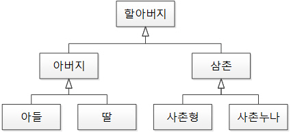
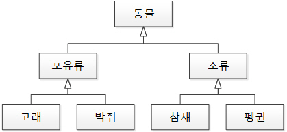
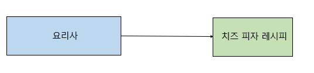
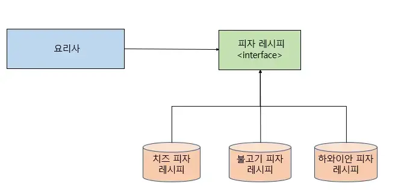

# 객체 지향 프로그래밍(OOP), SOLID

# 1. OOP; 객체 지향 프로그래밍

Object Oriented Programing

**현실 세계의 사물 및 개념들을 객체로 보고, 그 객체를 조립하여 프로그래밍 하는 기법.**

- 절차 지향 프로그래밍에 있었던 코드의 재사용성과 중복제거가 가장 큰 목적이다.
- 실제 상의 물체를 객체로 표현하고, 이들 사이의 관계, 상호 작용을 프로그램으로 나타낸다.
- 객체를 추출하고 객체들의 관계를 결정하고 이들의 상호작용에 필요한 함수와 변수를 설계 및 구현한다.
<br></br>
- 핵심은 연관된 변수와 메서드를 하나의 그룹으로 묶어서 그룹핑하는 것.
- 사람의 사고와 가장 비슷하게 프로그래밍을 하기 위해서 생성된 기법.
- 하나의 클래스를 바탕으로 서로 다른 상태를 가진 인스턴스를 만들면 서로 다른 행동을 하게 된다.
- 하나의 클래스가 여러 개의 인스턴스가 될 수 있다는 점이 객체 지향이 제공하는 가장 기본적인 재활용성.
<br></br>
- 절차지향 프로그래밍 : 실행하고자하는 절차를 정하고, 이 절차대로 프로그래밍하는 방법.
    - 목적을 달상하기 위한 일의 흐름에 중점을 둔다.

## 1️⃣ 특징 4가지

### 1. 추상화 Abstraction

- 목적과 관련이 없는 부분을 제외하여 필요한 부분을 포착하는 기법
- 객체의 공통된 속성들 중 필요한 부부을 포착해서 클래스로 정의하는 설계 기법
- 구체적인 사물들의 공통적인 특징을 파악해서 이를 하나의 개념으로 다루는 것

### 2. 캡슐화 E**ncapsulation**

- 외부에 노출할 필요가 없는 정보들은 은닉(정보은닉)
- 정보은닉(Information hiding) : 필요가 없는 정보는 외부에서 접근하지 못하도록 제한하는 것.
- 높은 응집도, 낮은 결합도를 유지하여 유연함과 유지 보수성 증가.
    
    ```
    **응집력/응집도(cohesion)**
    프로그램의 한 요소가 해당 기능을 수행하기 위해 얼마만큼의 연관된 책임과 아이디어가 뭉쳐있는지 나타내는 정도.
    모듈 내부 구성요소 간 연관정도. 
    
    **결합력/결합(coupling)**
    프로그램 코드의 한 요소가 다른 것과 얼마나 강력하게 연결되어 있는지, 얼마나 의존적인지를 나타내는 정도. 
    외부 모듈과의 연관성, 상호의존성을 나타내는 정도
    결합도가 낮으면 한 요소가 다른 요소들과 관계를 크게 맺고 있지 않은 상태 의미
    ```
    

### 3. 상속화 **Inheritance**

- 부모 클래스가 자손 클래스에게 속성을 물려주는 것.
- 코드의 재사용.
- 여러 객체들이 가진 공통된 특성을 부각시켜 하나의 개념이나 법칙으로 성립시키는 과정.

### 4. 다형화 **polymorphism**

- 같은 형태이지만 다른 기능을 하는 것
- 서로 다른 클래스의 객체가 같은 메시지를 받았을 때 각자의 방식으로 동작하는 능력
- [ex) 오버로딩, 오버라이딩(click!)](https://github.com/psyStudy/CS_study/blob/main/Java/%EC%98%A4%EB%B2%84%EB%9D%BC%EC%9D%B4%EB%94%A9%2C%20%EC%98%A4%EB%B2%84%EB%A1%9C%EB%94%A9.md)

## 2️⃣ OOP 장점

- 사람의 관점에서 프로그래밍하므로 이해하기 쉽고 파악하기 쉽다.
- 강한 응집력과 약한 결합력을 가진다.
    - (관계는 있지만 없어도 대체해서 동작시킬 수 있는 유연함이 있음)
- 재사용성, 확장성, 융통성이 높다.

## 3️⃣ OOP 단점

- 객체지향은 객체와 클래스를 사용하여 각 모듈의 높은 독립성을 권장한다. 따라서 여러 클래스를 상속해서 중복 코드 최소화를 유지하고, 유지보수 확장성을 높인다. → 실행 속도가 느리다.
- 객체가 많으면 프로그램 용량이 커질 수 있다.
- 설계에 많은 시간이 투자된다.
- 설계 실패 시, 다시 처음부터 시작해야한다.
- 객체가 상태를 갖기 때문에 예상치 못한 부작용이 발생할 수 있다. 변수가 존재하고 이 변수를 통해 객체가 예측할 수 없는 상태를 갖게되어 애플리케이션 내부에서 버그를 발생시킬 수 있다.

## 4️⃣ OOP 설계 원칙 5가지 = SOLID

SOLID를 지켜 SW를 설계하면 이해하기 쉽고, 유연하며, 유지보수 및 확장이 편리해진다.

### S ; 단일 책임의 원칙

Single Responsibility Principle ; SRP

- **모든 클래스는 단 하나의 책임만 가져야한다.**
- 클래스를 그 책임을 완전히 캡슐화 해야함을 의미.
- ex) 결제 클래스는 오직 결제 기능만을 책임지고, 만약 수정해야하면 결제에 관한 문제만 수정해야한다.

### O ; 개방 폐쇄의 원칙

Open Close Principle ; OCP

- 기존 코드를 변경하지 않으면서 기능을 추가할 수 있도록 설계가 되어야한다.
- **확장에는 열려있고, 수정에는 닫혀있어야한다.**
- ex) 캐릭터를 하나 생성하는데 캐릭터마다 움직임이 다른 경우, 움직임 패턴 구현을 하위 클래스에 맡긴다면 캐릭터 클래스의 수정은 필요없고(Closed), 움직임 패턴만 재정의 하면 된다(Open)
- 관련 매커니즘 : 추상화, 다형성

### L ; 리스코프 치환 원칙

Liskov Substitution Principle ; LSP

- (일반화 관계에서) 자식 클래스는 최소한 자신의 부모 클래스에서 가능한 행위는 수행할 수 있어야한다.
- **하위 타입은 항상 상위 타입을 대체할 수 있어야 함.**
- 다형성과 확장성을 극대화하며, 개방-폐쇄 원칙을 구성한다.
- 부모 클래스 자리에 자식 클래스를 넣어도 역할을 수행하는데 문제가 없어야함.
    
    
    
    리스코포 치환 원칙 위배. 
    
    
    
    리스코프 치환 원칙 준수. 
    

### I ; 인터페이스 분리 원칙

Interface Segregation Principle ; ISP

- 인터페이스를 클라이언트에 특화되도록 분리시키라는 설계 원칙.
- 인터페이스 내에 메소드는 최소한 일수록 좋다. (하나의 일반적인 인터페이스보다 여러개의 구체적인 인터페이스가 낫다.)
- 최소한의 기능만 제공하면서 하나의 역할에 집중하라는 의미.
- 단일책임원칙과, 인터페이스 분리 원칙은 같은 문제에 대한 2가지 다른 해결책이다.
- 가능한 최소한 인터페이스를 사용하여 단일 책임을 강조.
- 일반적으로 ISP보다 SRP할 것을 권장.

### D ; 의존관계 역전 원칙

Denpendency Inversion Principle ; DIP

- 고수준 모듈은 저수준 모듈의 구현에 의존해서는 안된다.
- 의존 관계를 맺을 때 변화하기 쉬운 것, 자주 변화하는 것 보다는 변화하기 어려운 것, 거의 변화가 없는 것에 의존해야한다는 의미.
    
    
    
    
    
- DIP 원칙을 따르는 가장 인기 있는 방법은 [의존성 주입(DI; Dependency Injection)](https://dev-coco.tistory.com/70)을 활용

---

# 면접질문

- 객체 지향 프로그램에 대해 설명해주세요.
- 객체지향의 설계원칙에 대해 설명해주세요. / OOP의 5대 설계원칙이 무엇인가요?

# 출처

- [https://computer-science-student.tistory.com/140](https://computer-science-student.tistory.com/140)
- [https://theheydaze.tistory.com/603](https://theheydaze.tistory.com/603)
- [https://dev-coco.tistory.com/142](https://dev-coco.tistory.com/142)
