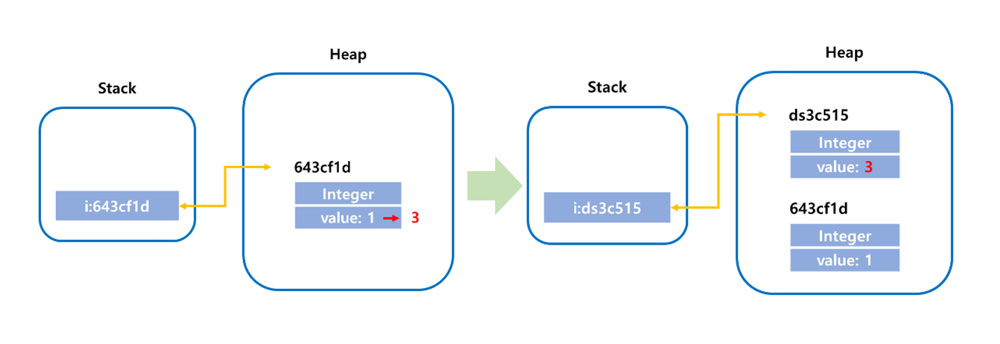

# 동시성 이슈, Mutable

# 1. Mutable 과 Immutable

자바의 객체를 Mutable(가변) 객체와 Immutable(불변) 객체로 나눌 수 있다.

## 1.1. Mutable Object 가변 객체

클래스가 인스턴스를 생성한 이후에도 내부 상태가 변경 가능한 객체이다.

- 힙 영역에 생성된 객체가 변경됨을 의미한다.
- 멀티 스레드 환경에서 사용하려면 별도의 동기화 처리가 필요하다.
- java에서 사용하는 대부분의 객체는 가변 객체이며, 대표적으로 ArrayList, HashMap, StringBuilder, StringBuffer 등이 있다.
- 프로그래머가 커스텀 객체를 생성하여 내부 상태를 변경할 수 있게 하면, 이것 또한 가변 객체이다.

## 1.2. Immutable Object 불변 객체

데이터의 변경이 불가능한 객체를 말한다. (객체 생성 이후 내부 상태가 변하지 않는 객체)

- 객체의 수정이 불가능한 것이 아니라, **힙 영역에 저장된 값을 수정할 수 없는 것을 의미한다.**
- 종류 : String, Boolean, Integer, Float, Long, Double 등 = [원시타입에 매칭되는 참조 타입(String 빼고,,,)](https://github.com/psyStudy/CS_study/blob/main/Java/%ED%81%B4%EB%9E%98%EC%8A%A4%EC%99%80%20%EA%B0%9D%EC%B2%B4%20%EB%B0%8F%20%EC%9D%B8%EC%8A%A4%ED%84%B4%EC%8A%A4%2C%20static%2C%20%EC%9B%90%EC%8B%9C%ED%83%80%EC%9E%85%EA%B3%BC%20%EC%B0%B8%EC%A1%B0%ED%83%80%EC%9E%85.md)
- 객체 내부 상태를 제공하는 메소드를 제공하지 않거나, 방어적 복사를 통해 제공한다.

```java
Integer i - 1;
i = 3; // 수정된거 아니야?
```



- 실제로 객체가 변경된 것이아니라, 새로운 객체를 생성하고, 이 객체에 대한 참조값을 변경한 것이다.
- 기존 1로 할당된 객체는 GC에 의해 사라지게 된다.

### [➡️ 불변 객체를 만드는 법 : final (click!)](https://github.com/psyStudy/CS_study/blob/main/Java/%EC%A0%91%EA%B7%BC%20%EC%A0%9C%EC%96%B4%EC%9E%90%2C%20final.md)

### 불변 객체의 장점

**1. Thread-safe 하여 멀티스레드 프로그램밍에 유용하며, 동기화를 고려하지 않아도 된다.**
  - 공유 자원이 불변 자원이면 항상 동일 값을 반환하기 때문에 동기화를 고려하지 않아도 된다. 안정성을 보장하고, 성능상의 이점도 가져다 준다.
    
**2. 실패 원자적 (Failure Atomic) 메소드를 만들 수 있다.**
  - 가변 객체로 작업 중 예외가 발생하면 객체는 불안정상태에 빠질 수 있고, 이는 또 다른 에러를 유발할 수 있다. 불변 객체의 경우 예외가 발생해도 메소드 호출 이전의 상태를 유지 할 수 있다. 또한 예외가 발생해도 오류가 나지 않은 것처럼 다음 로직을 처리할 수 있다.
    
**3. 부수효과가 없고, 다른 사람이 유지보수 하기 좋다.**
  - Cache, Map, Set 등의 요소로 활용하기 적합하다.
    
**4. 가비지 컬렉션의 성능을 높일 수 있다.**
  - 불변객체를 이용하면 불변객체 내부의 객체는 GC의 스캔 대상에서 제외된다.
  - 그러므로 불변객체를 이용하면 GC 스캔빈도와 범위가 줄어들어 GC성능에 도움이 된다고 할 수 있다.
  
    > **💡 더 자세하게! <br>**
    > - GC는 새롭게 생선된 객체는 금방 죽는다는 Weak Generation Hypothesis (가설)에 의해 설계되어 있음.<br>
    > - 새로 생성된 불변 객체 → 생명주기가 짧은 객체 → GC 스캔 대상에서 제외 → 성능 도움<br>
    > - 가변 객체 → 생명주기가 긴 객체 → GC가 지속적으로 스캔(스캔 범위⬆️, 스캔 빈도⬆️)<br>
    

### 불변 객체 단점

객체 값이 할당될 때마다 새로운 객체가 필요하므로, 메모리 누수와 성능저하를 발생시킬 수 있다.

---

# 2. 동시성 이슈

## 2.1. 동시성 이슈란?

멀티 스레드를 이용하면 공유하는 영역이 많이 프로세스 방식보다 context switching(문맥 교환) 오버헤드가 작아, 메모리 리소스가 상대적으로 적다는 장점이 있다. 

하지만 동시에 단점이 존재하는데, 여러 스레드가 동시에 하나의 자원을 공유하고 있기 때문에 같은 자원을 두고 경쟁상태(race Condition) 같은 문제가 발생한다. 

→ 이를 **동시성 이슈!** 라고 한다.

### 동시성 vs 병렬성

1. 동시성
- 동시에 실행되는 것”처럼” 보이는 것.
- **싱글 코어에서 멀티 스레드를 동작시키기 위한 방식으로, 멀티 태스킹을 위해 여러 개의 스레드가 번갈아 가면서 실행되는 성질을 말한다.**
- 싱글 코어에서 멀티 스레드를 이용해 동시성을 구현하는 일부 케이스에 대한 내용으로, 멀티 코어에서 멀티 스레드를 이용하여 동시성을 만족하는 경우는 실제 물리적 시간으로 동시에 실행된다.
- 멀티 스레드로 동시성을 만족 시킬 수 있는 것이지, 동시성을 만족한다고 멀티 스레드인 것은 아니다.
    - EX) 코들린은 싱글 스레드에서 코투린을 이용하여 동시성을 만족 할 수 있다.
    - 코투린(coroutine) : 싱글 스레드에서도 ‘루틴’이라는 단위로 루틴 간 협력이 가능하며, 동시성 프로그래밍을 지원하고 비동기 처리를 쉽게 도와주는 개념.
1. 병렬성
- **실제로 동시에 실행되는 것**
- 멀티 코어에서 멀티 스레드를 동작시키는 경우  한 개 이상의 스레드를 포함하는 각 코어들이 (물리적 시간으로)동시에 실행되는 경우 병렬성을 만족한다고 할 수 있다.
- 네트워크 상 여러 컴퓨터에게 분산 작업을 요청하는 분산 컴퓨팅도 병렬성을 만족한다고 할 수 있다.

### 스레드 안정성 Thread safe

여러 스레드가 작동하는 환경에서도 문제 없이 동작하는 것을 스레드가 안전하다고 한다.

→ 동시성 이슈를 해결하고 일어나지 않으면 Thread safe 함!

## 2.2. 동시성에서 발생할 수 있는 문제점

### 1) 가시성 문제

여러 개의 스레드가 사용됨에 따라, CPU Cache Memory와 RAM의 데이터가 서로 일치하지 않아 생기는 문제.

이를 해결하려면, 가시성이 보장되야하는 변수들을 캐시가 아닌 RAM에서 바로 읽도록 보장해야한다.

- 변수에 volatile 키워드를 붙여 가시성을 보장할 수 있다.

```java
private static volatile boolean isStop;
```

- 하지만 가시성이 보장된다고 동시성이 보장되는 것은 아니다.
- 하나의 스레드만이 연산을 해야한다는 전제가 있다면 lock없아 volatile 만으로 문제를 해결할 수 도 있다.

```

! 가시성은 해결되었지만 동시성을 해결하지 못한 우
전철 비용이 70세 미만과 이상 다를 때, 실시간으로 날짜를 반영하여 비용을 계산하는 상황.

Thread1
- 고객의 나이를 읽음.
- 읽어온 나이를 기준으로 비용 계산.
- 비용을 반환

Thread2
- 현재 년도를 지속적으로 읽음
- 해가 바뀌면 고객의 나이를 계산
- 바뀐 고객의 나이를 저장.
---------------------------------
- 나이가 69세인 고객이 계산을 진행할 때, thread1에서는 RAM에서 나이가 69세 임을 가져와 비용을 계산하는 메소드를 실행.
- 그러나 마침 해가 바뀌어 thread2에서 고객 나이를 70세로 수정
- thread1은 나이가 바뀐 것을 모르고 69세로 계산하여 전철 비용을 잘못 계산하여 반환. 
(동시성 보장 x)
```

### 2) 원자성 문제

한 줄의 프로그램 문장이 컴파일러에 의해 기계어로 변경되면서, 이를 기계가 순차적으로 처리하기 위한 여러 개의 Machine Instruction이 만들어져 실행되어 나타나는 현상.

- 연산의 원자성, 연산의 단일성, 단일 연산 이라고도 함.
- 쉽게, 공유 변수를 변경할 때 기존 값을 기반으로 새로운 값이 결정되는 과정에서 여러 스레드가 이를 동시에 수행 할 대 생기는 이슈

```
i++ 연산을 2개의 스레드가 동시에 100회 실행하는 상황 가정.
- i++ 연산이 원자성을 가지고 있다면, 결과는 200이어야함.
- 실제로는 200보다 작은 값이 출력됨.
- i++가 3개의 instruction 으로 이루어져 스레드 A가 i값을 읽어 i+1 연산을 해서 메모리에 반영하기 직전에, 스레드 B가 i+1을 수행하고 메모리에 반영하면 후자의 연산이 무효가 되기 때문.
```

- synchronized, 또는 atomic을 사용하여 해결 할 수 있다.
- 원자성 문제를 synchronized 또는 atomic을 통해 해결하면 가시성 문제도 해결된다.
- synchronized 블럭을 들어가기 전에 CPU Cache Memory와 Main Memory를 동기화 해주며,
- atomic의 경우에는 CAS 알고리즘에 의해 원자성 문제와 CPU Cache Memory에 잘못된 값을 참조하는 문제를 동시에 해결해주기 때문이다.

## 2.3. 동시성을 제어하는 방법

### 1) 암시적 Lock (synchronized)

문제가 된 메서드, 변수에 각각 synchronized 라는 키워드를 넣는다.

```java
class Count {
    private int count;
    public synchronized int view() {return count++;}
}

class Count {
    private Integer count = 0;
    public int view() {
        synchronized (this.count) {
            return count++;
        }
    }
}
```

### 2) 명시적 Lock

synchronized 키워드 없이 명시적으로 ReentrantLock을 사용하는 방법.

- 해당 Lock의 범위를 메서드 내부에서 한정하기 어렵거나, 동시에 여러 Lock을 사용하고 싶을 때 사용한다.
- 직접적으로 Lock 객체를 생성하여 사용한다.<br>
      - lock() : 다른 스레드가 해당 lock() 메서드 시작점에 접근하지 못하고 대기<br>
      - unlock() : 다른 메서드가 lock을 획득할 수 있게 됨.<br>
- 상호배제 잠금 기능을 의미하여 뮤텍스락과 흡사

```java
public class CountingTest {
    public static void main(String[] args) {
        Count count = new Count();
        for (int i = 0; i < 100; i++) {
            new Thread(){
                public void run(){
                    for (int j = 0; j < 1000; j++) {
                        count.getLock().lock(); // 락을 걸어서 다른 스레드가 해당 메서드(count)에 접근 불가
                        System.out.println(count.view());
                        count.getLock().unlock();//락을 해제해서 다른 메서드가 count를 획득할 수 있음
                    }
                }
            }.start();
        }
    }
}
class Count {
    private int count = 0;
    private Lock lock = new ReentrantLock(); // lock을 ReentrantLock으로 사용
    public int view() {
            return count++;
    }
    public Lock getLock(){
        return lock;
    };
}
```

### 3) Thread-safe 객체 사용

concurrent 패키지는 각종 스레드 안전한 컬랙션을 제공한다.

ConcurrentHashMap과 같은 컬랙션은 스레드 안전하게 사용할 수 있다.

- Concurrent 패키지 → atomic 방식 (cas 알고리즘)
    - concurrent패키지에 존재하는 컬랙션들은 락을 사용할 때 발생하는 성능 저하를 최소한으로 만든다.
    - 락을 여러 개로 분할하여 사용하는 Lock Striping 기법을 사용하여 동시에 여러 스레드가 하나의 자원에 접근하더라도 동시성 이슈가 발생하지 않도록 도와주는 것이다.
    
    ```java
    class Count {
        private AtomicInteger count = new AtomicInteger(0);
        public int view() {
                return count.getAndIncrement();
        }
    }
    ```
    
- ConcurrentHashMap
    - ConcurrentHashMap은 내부적으로 여러개의 락을 가지고 해시값을 이용해 이러한 락을 분할하여 사용한다.
    - 분할 락을 사용하여 병렬성과 성능이라는 두 마리의 토끼를 모두 잡은 컬랙션인 것이다.
    - 내부적으로 여러 락을 사용, 일반적인 map을 사용할 때처럼 구현하면 내부적으로 알아서 락을 자동으로 사용해 줄 테니 편리하게 사용할 수 있다.
    
    ```java
    int binCount = 0;
            for (Node<K,V>[] tab = table;;) {
                Node<K,V> f; int n, i, fh;
                if (tab == null || (n = tab.length) == 0)
                    tab = initTable();
                else if ((f = tabAt(tab, i = (n - 1) & hash)) == null) {
                    if (casTabAt(tab, i, null,
                                 new Node<K,V>(hash, key, value, null)))
                        break;                   // no lock when adding to empty bin
                }
                else if ((fh = f.hash) == MOVED)
                    tab = helpTransfer(tab, f);
                else {
                    V oldVal = null;
                    synchronized (f) {
                        if (tabAt(tab, i) == f) {
    ```
    

### 4) 불변 객체 사용

불변 객체는 락을 걸 필요가 없다. 내부적인 상태가 변하지 않으니 여러 스레드에서 동시에 참조해도 동시성 이슈가 발생하지 않는 것아다. 즉, 불변 객체는 **언제나 스레드 안전(Thread-safe)하다.**

- 불변 객체는 생성자로 모든 상태 값을 생성할 때 세팅하고, **객체의 상태를 변화시킬 수 있는 부분을 모두 제거해야 한다.**
    - **가장 간단한 방법은 세터(setter)를 만들지 않는 것!**
    - 내부 상태가 변하지 않도록 **모든 변수를 final로 선언하는 것도 있다.**
    - 또 `데이터 자체를 Stream()안에서 캡슐화`해서 결과를 도출하는 것도 불변화 시키는 방법이다. `함수형 프로그래밍`을 사용하는 이유이기도 하다. → Stream API, 함수형 프로그래밍 주제에서 더 알아보자!

---

# 면접질문

- 자바의 동시성 이슈(공유자원 접근)에 대해 설명해주세요.
- Mutable 객체와 Immutable 객체의 차이점에 대해 설명해주세요.

# 출처

Mutable

- [https://choiblack.tistory.com/47](https://choiblack.tistory.com/47)
- [https://s-y-130.tistory.com/181](https://s-y-130.tistory.com/181)
- [https://devoong2.tistory.com/entry/Java-%EB%B6%88%EB%B3%80-%EA%B0%9D%EC%B2%B4Immutable-Object-%EC%97%90-%EB%8C%80%ED%95%B4-%EC%95%8C%EC%95%84%EB%B3%B4%EC%9E%90](https://devoong2.tistory.com/entry/Java-%EB%B6%88%EB%B3%80-%EA%B0%9D%EC%B2%B4Immutable-Object-%EC%97%90-%EB%8C%80%ED%95%B4-%EC%95%8C%EC%95%84%EB%B3%B4%EC%9E%90)

동시성 이슈

- [https://velog.io/@mooh2jj/멀티-스레드의-동시성-이슈](https://velog.io/@mooh2jj/%EB%A9%80%ED%8B%B0-%EC%8A%A4%EB%A0%88%EB%93%9C%EC%9D%98-%EB%8F%99%EC%8B%9C%EC%84%B1-%EC%9D%B4%EC%8A%88)
- [https://highright96.tistory.com/104](https://highright96.tistory.com/104)

질문

- [https://velog.io/@jifrozen/자바-면접질문-정리](https://velog.io/@jifrozen/%EC%9E%90%EB%B0%94-%EB%A9%B4%EC%A0%91%EC%A7%88%EB%AC%B8-%EC%A0%95%EB%A6%AC)
