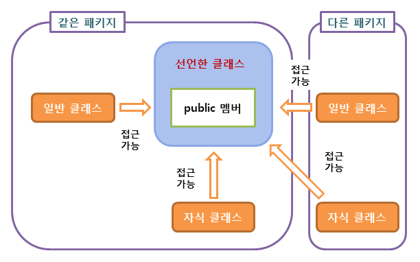

# 접근 제어자, final

# 1. 접근 제어자

접근 제어자(access modifier)를 사용하면 변수나 메서드의 사용 권한을 설정할 수 있다.

- private
- dafault
- protected
- public

**private < default < protected < public** 순으로 많은 접근을 허용한다.

## 1.1. 종류

### 1.1.1. private


private가 붙은 변수나 메서드는  해당 클래스 안에서만 접근이 가능하다.

```java
public class Sample {
    private String secret;
    private String getSecret() {
        return this.secret;
    }
}
```

- secret변수와 getSecret 매서드는 오직 Sample 클래스에서만 접근이 가능하고 다른 클래스에서는 접근이 불가능하다.

### 1.1.2. default


접근 제어자를 별도로 설정하지 않을 경우 자동으로 default로 설정된다.

동일한 패키지 안에서만 접근이 가능하다.

```java
/* house/HouseKim.java */
package house;  // 패키지가 동일하다.

public class HouseKim {
    String lastname = "kim";  // lastname은 default 접근제어자로 설정된다.
}
```

```java
/* house/HousePark.java */
package house;  // 패키지가 동일하다.

public class HousePark {
    String lastname = "park";

    public static void main(String[] args) {
        HouseKim kim = new HouseKim();
        System.out.println(kim.lastname);  // HouseKim 클래스의 lastname 변수를 사용할 수 있다.
    }
}
```

```
kim
```

- 동일패키지를 사용하고 있으므로, HousePark 클래스에서 default 접근 제어자로 설정된 HouseKim의 lastname 변수에 접근이 가능하여 kim이 출력된다.

### 1.1.3. protected


protected가 붙은 변수나 메서드는 동일 패키지의 클래스 또는 해당 클래스를 상속받은 클래서에서만 접근 가능하다.

```java
/* house/HousePark.java */
package house;  // 패키지가 서로 다르다.

public class HousePark {
    protected String lastname = "park";
}
```

```java
/* house/person/EungYongPark.java */
package house.person;  // 패키지가 서로 다르다.

import house.HousePark;

public class EungYongPark extends HousePark {  // HousePark을 상속했다.
    public static void main(String[] args) {
        EungYongPark eyp = new EungYongPark();
        System.out.println(eyp.lastname);  // 상속한 클래스의 protected 변수는 접근이 가능하다.
    }
}
```

```
park
```

- 패키지는 다르지만, EungYongPark 클래스는 HousePark 클래스를 상속했다.
- HousePark의 lastname 변수가 protected이기때문에 eyp.lastname과 같은 접근이 가능하다.
- 만약 lastname의 접근 제어자가 protected가 아닌 default였다면 eyp.lastname 문장은 컴파일 오류가 발생할 것이다.

### 1.1.4. public



public 접근 제어자가 붙은 변수나 메서드는 어떤 클래스에서도 접근이 가능하다.

```java
package house;

public class HousePark {
    protected String lastname = "park";
    public String info = "this is public message.";
}
```

```java
import house.HousePark;

public class Sample {
    public static void main(String[] args) {
        HousePark housePark = new HousePark();
        System.out.println(housePark.info);
    }
}
```

```
this is public message.
```

## 1.2 접근 범위 요약

| 접근 제어자 | 같은 클래스의 멤버 | 같은 패키지의 멤버 | 자식 클래스의 멤버 | 그 외의 영역 |
| --- | --- | --- | --- | --- |
| public | ○ | ○ | ○ | ○ |
| protected | ○ | ○ | ○ | X |
| default | ○ | ○ | X | X |
| private | ○ | X | X | X |

# 2. final

final은 자료형에 값을 단 한 번만 설정할 수 있게 강제하는 키워드다.

- 변수, 메소드, 클래스에 대해 사용할 수 있다.
- 데이터를 ReadOnly로 만들어, 객체 내부에서 값의 변환이나 가공을 하지 않겠다고 선언하여 데이터를 지킬 때 사용됩니다.

## 2.1 변수

변수에 final을 붙이면 이 변수는 수정할 수 없다는 의미이다.

- 수정될 수 없으므로 초기화가 필수이다.
- 수정 범위는 그 변수의 값에 한정된다.
    - 다른 객체를 참조하거나 할때는 참조하는 객체의 내부 값은 변경할 수 있다.

```java
public class Sample {
    public static void main(String[] args) {
        final int n = 123;  // final로 설정하면 값을 바꿀 수 없다.
        n = 456;  // 컴파일 오류 발생
    }
}
```

```java
public class Service {

  public void variableFinal() {

    final int value = 2;
    final Person person = new Person("사바라다", 29);

    System.out.println("value = " + value);
    System.out.println("person_1 = " + person);

    // value = 2; // 컴파일 에러
    person.setAge(10);
    person.setName("사바라");

    System.out.println("person_2 = " + person);
    // person = new Person("염광호", 29); // 컴파일 에러
  }
}

class Person {

  private String name;

  private int age;

  //.. get, set, toString 메서드 존재하나 길이상 생략
}
---------------------------------------------------------
value = 2
person_1 = Person{name='사바라다', age=29}
person_2 = Person{name='사바라', age=10}
```

## 2.2. 메서드 method

메서드에 final을 선언하면 override를 제한한다.

```java
class Person {

  private final String name;

  private final int age;

  public Person(String name, int age) {
    this.name = name;
    this.age = age;
  }

  public void speech() {
    System.out.println("나는 " + name + " 입니다.");
  }
}

class Korean extends Person {

  public Korean(String name, int age) {
    super(name, age);
  }

  @Override
  public void speech() {
    System.out.println("나는 " + name + " 이며, " + age + " 입니다.");
  }
}
```

- person에서 정한 speech메소드를 나라별로 바꾸는걸 방지하고 싶으면 public final void speech()로 바꾸면 된다.

## 2.3 클래스 Class

final을 class에 붙이면 상속 불가능 클래스가 된다.

클래스 설계시 재정의를 불가능하게 하고 싶으면 final로 등록하는게 추후 유지보수차원에서 좋다.

```java
public final class Integer extends Number implements Comparable<Integer> {

}
```


## 2.4. final과 비슷하게 생긴 finally, finalize()
결론 -> 이름만 비슷하고 직접적 관련은 없다.

### 2.4.1. finally

- try-catch 블록 뒤에 둘 수 있는 선택적인 블록
- try-catch문이 끝나기전에 항상 꼭 실행되어야하는 로직이 있을 경우 finally절에 두면된다.
- try-catch블록과 함께 사용되며 예외가 던져지더라도 항상 실행될 코드를 지정하기 위해 사용된다. 
- finally블록은 try와 catch블록이 전부!!! 실행된 후, 그리고 제어 흐름이 원래 지점으로 돌아가기 전에 실행된다.
- 각 블록안에 return이 정의 될 경우
  - try 안 : 정상종료
  - catch 안 : 정상종료는 맞으나, 예외 내용을 return 받는다..? 권장되는 방법은 아님.
  - finally 안 : 예외가 발생해도 발생하지 않은 것으로 간주된다.

```
try{
  예외 발생 가능성이 있는 문장들;
}catch(예외타입1 매개변수명){
  예외타입1의 예외가 발생할 경우 처리문장들;
}catch(예외타입n 매개변수명){
  예외타입n의 예외가 발생할 경우 처리문장들;
}finally{
  항상 수행할 필요가 있는 문장들;
}

```

### 2.4.2. finalize()

- java garbage collector가 더 이상 참조가 존재하지 않는 객체를 발견한 순간 호출하는 메서드이다. 
- Object 클래스의 메서드이기 때문에 커스텀 한 클래스에 오버라이딩하여 해당 클래스의 객체가 GC에 의해 정리될 때 특정 동작을 수행하도록 할 수 있다.


```java
class Test {
	
	int idx;
	
	public Test(int idx) {
		this.idx = idx;
	}
	
	@Override
	protected void finalize() throws Throwable {
		System.out.println(getClass() + " "  + idx + " finalize() 메서드 실행");
	}
}

public class Main {
	
	public static void main(String[] args) {
		Test test;
		for (int i = 1; i <= 10; ++i) {
			test = new Test(i);
		}
		test = null;

		System.gc(); //GC 수행
	}
}
```


- test 변수가 null값을 가지게 되어 더 이상 참조되지 않은 Test객체들이 메모리에서 GC에 의해 정리당해 finalize() 메서드를 호출하는 것을 확인 할 수 있음.
- 제거되는 객체의 순서는 알 수 없으며, 메모리 상황에 따라 일부 객체만 GC에 의해 수행될 수 도 있다.


# 3. 불변 객체 Immutable Object

final은 불변객체를 만드는 방법이다.

불변 객체란, 객체 생성 이후 내부의 상태가 변하지 않는 객체이다. 

- read-only 메서드만을 제공하고, 내부상태를 제공하는 메서드를 제공하지 않거나, 방어적 복사를 통해 제공한다.

## 불변객체와 final을 사용해야하는 이유

1. Thread-Safe하여 병렬 프로그래밍에 유용하며, 동기화를 고려하지 않아도 된다.
2. 실패 원자적인(Failure Atomic) 메소드를 만들 수 있다.
3. Cache나 Map 또는 Set 등의 요소로 활용하기에 더욱 적합하다.
4. 부수 효과(Side Effect)를 피해 오류가능성을 최소화할 수 있다.
5. 다른 사람이 작성한 함수를 예측가능하며 안전하게 사용할 수 있다.
6. 가비지 컬렉션의 성능을 높일 수 있다.

### 1. ⭐ Thread-Safe하여 병렬 프로그래밍에 유용하며, 동기화를 고려하지 않아도 된다.

멀티 쓰레드 환경에서 동기화 문제가 발생하는 이유는 공유 자원에 동시에 쓰기(Write) 때문이다. 

하지만 만약 공유 자원이 불변이라면 더 이상 동기화를 고려하지 않아도 될 것이다. 왜냐하면 항상 동일한 값을 반환할 것이기 때문이다. 

이는 안정성을 보장할 뿐만 아니라 동기화를 하지 않음으로써 성능상의 이점도 가져다준다.

### 2. ⭐실패 원자적인(Failure Atomic) 메소드를 만들 수 있다.

가변 객체를 통해 작업을 하는 도중 예외가 발생하면 해당 객체가 불안정한 상태에 빠질 수 있고, 불안정한 상태를 갖는 객체는 또 다른 에러를 유발할 수 있다. 

하지만 불변 객체라면 어떠한 예외가 발생하여도 메소드 호출 전의 상태를 유지할 수 있을 것이다. 

그리고 예외가 발생하여도 오류가 발생하지 않은 것 처럼 다음 로직을 처리할 수 있다.

### 3. Cache나 Map 또는 Set 등의 요소로 활용하기에 더욱 적합하다.

만약 캐시나 Map, Set 등의 원소인 가변 객체가 변경되었다면 이를 갱신하는 등의 부가 작업이 필요할 것이다. 

하지만 불변 객체라면 한 번 데이터가 저장된 이후에 다른 작업들을 고려하지 않아도 되므로 사용하는데 용이하게 작용할 것이다.

### 4. 부수 효과(Side Effect)를 피해 오류가능성을 최소화할 수 있다.

부수 효과란 변수의 값이나 상태 등의 변화가 발생하는 효과를 의미한다. 

만약 객체의 수정자(Setter)를 통해 여러 객체들에서 값을 변경한다면 객체의 상태를 예측하기 어려워질 것이다. 

바뀐 상태를 파악하기 위해서는 메소드들을 살펴보아야 하고, 이는 유지보수성을 상당히 떨어뜨린다. 

그래서 이러한 부수효과가 없는 순수 함수들을 만드는 것이 상당히 중요한데, 객체가 불변이라면 어떻게 될까?

불변 객체는 기본적으로 값의 수정이 불가능하기 때문에 변경 가능성이 적으며, 객체의 생성과 사용이 상당히 제한된다. 

그렇기 때문에 메소드들은 자연스럽게 순수 함수들로 구성될 것이고, 다른 메소드가 호출되어도 객체의 상태가 유지되기 때문에 안전하게 객체를 다시 사용할 수 있다. 

이러한 불변 객체는 오류를 줄여 유지보수성이 높은 코드를 작성하도록 도와줄 것이다.

### 5. ⭐다른 사람이 작성한 함수를 예측가능하며 안전하게 사용할 수 있다

불변성(Immutability)은 협업 과정에서도 도움을 주는데, 불변성이 보장된 함수라면 다른 사람이 개발한 함수를 위험없이 이용할 수 있다. 

마찬가지로 다른 사람도 내가 작성한 메소드를 호출하여도, 값이 변하지 않음을 보장받을 수 있다. 

그렇기에 우리는 변경에 대한 불안없이 다른 사람의 코드를 이용할 수 있다. 

### 6. 가비지 컬렉션의 성능을 높일 수 있다.

객체를 생성하기 위해서는, 객체를 가지는 또 다른 컨테이너 객체(ImmutableHolder)도 존재한다는 것인데, 당연히 불변의 객체(Object value)가 먼저 생성되어야 컨테이너 객체가 이를 참조할 수 있을 것이다. 

즉, 컨테이너는 컨테이너가 참조하는 가장 젊은 객체들보다 더 젊다는 것(늦게 생성되었다는 것)이다. 이를 정리하면 다음과 같다.

1. Object 타입의 value 객체 생성
2. ImmutableHolder 타입의 컨테이너 객체 생성
3. ImmutableHolder가 value 객체를 참조

이러한 점은 GC가 수행될 때, 가비지 컬렉터가 컨테이너 객체 하위의 불변 객체들은 Skip할 수 있도록 도와준다. 왜냐하면 해당 컨테이너 객체(ImmutableHolder)가 살아있다는 것은 하위의 불변 객체들(value) 역시 처음에 할당된 상태로 참조되고 있음을 의미하기 때문이다.

---

# 면접질문

- 접근 제어자에 대해 설명해주세요.
    - 변수 또는 메소드의 접근 범위를 설정해주기 위해서 사용하는 Java의 예약어를 의미하며, 총 4 가지 종류가 있습니다.
    - public 은 접근 제한이 없어 같은 프로젝트 내 어디서든 사용 가능합니다.
    - protected는 해당 패키지 내, 다른 패키지에서 상속받아 자손 클래스에서 접근 가능합니다.
    - default는 해당 패키지 내에서만 접근 가능하고
    - private는 해당 클래스에서만 접근 가능합니다.
- 접근 제어자를 사용하는 이유가 무엇인가요?
    - 객체지향 프로그래밍이란 객체들 간의 상호작용을 코드로 표현하는 것인데요.
    - 이때 객체들간의 관계에 따라서 접근 할 수 있는 것과 아닌 것, 권한을 구분할 필요가 생깁니다.
    - 접근 제어자를 사용하여 외부 객체의 무분별한 접근으로부터 내부 데이터를 보호할 수 있습니다.(데이터 무결성)
- 불변 객체가 무엇인지 설명하고 대표적인 JAVA의 예시를 설명해주세요
    - 불변 객체는 객체 생성 이후 내부 상태가 변하지 않는 객체를 말합니다.
    - JAVA에서는 필드가 원시타입인 경우 final 키워드를 사용해 불변 객체를 만들 수 있고,
    - 참조 타입일 경우엔 추가적인 작업이 필요합니다.
- 불변 객체나 final을 굳이 사용해야하는 이유가 있을까요?

# 출처

**접근제어자**

- [https://wikidocs.net/232](https://wikidocs.net/232)
- [https://www.tcpschool.com/java/java_modifier_accessModifier](https://www.tcpschool.com/java/java_modifier_accessModifier)’

**final**

- [https://wikidocs.net/158529](https://wikidocs.net/158529)
- [https://sabarada.tistory.com/148](https://sabarada.tistory.com/148)
- [https://mangkyu.tistory.com/131](https://mangkyu.tistory.com/131)

**질문**

- [https://dev-coco.tistory.com/153](https://dev-coco.tistory.com/153)
- [https://thalals.tistory.com/314](https://thalals.tistory.com/314)
- [https://wjheo.tistory.com/entry/final-finally-finalize-%EC%B0%A8%EC%9D%B4%EC%A0%90](https://wjheo.tistory.com/entry/final-finally-finalize-%EC%B0%A8%EC%9D%B4%EC%A0%90)
- [https://medium.com/@logishudson0218/java-final-finally-finalize%EC%9D%98-%EC%B0%A8%EC%9D%B4-ae04a58188fa](https://medium.com/@logishudson0218/java-final-finally-finalize%EC%9D%98-%EC%B0%A8%EC%9D%B4-ae04a58188fa)