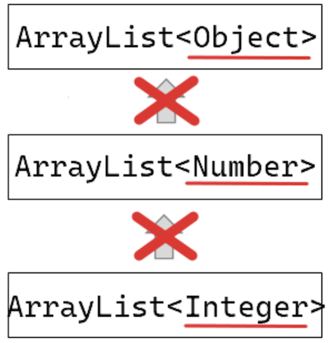
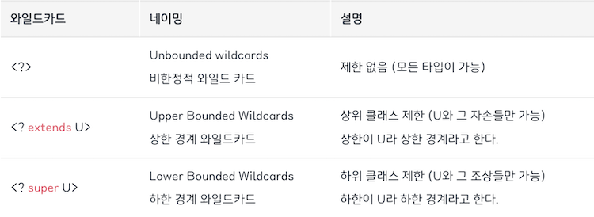

# 제네릭(Generics)_와일드카드
## 제네릭의 필요성
- 제네릭을 쓰지 않으면 필요시 형 변환을 해야함
- 또한, 자료형과 관련된 프로그래머의 실수가 컴파일 과정에서 드러나지 않음

```java
class Apple {
    public String toString() {
        return "I am an apple";
    }
}

class Orange {
    public String toString() {
        return "I am an orange";
    }
}

// 무엇이든 담을 수 있는 상자 
class Box {
    private Object ob;

    public void set(Object o) {
        ob = o;
    }

    public Object get() {
        return ob;
    }
}

class FruitAndBox {
    public static void main(String[] args) {
        Box aBox = new Box();   // 상자 생성 
	Box oBox = new Box();   // 상자 생성 
				
	/* 1번 문제점 */
	aBox.set(new Apple());   // 상자에 사과를 담음 
	oBox.set(new Orange());   // 상자에 오렌지를 담음 
			 
	// 번거로운 형 변환이 필요하다
	Apple ap = (Apple)aBox.get();   // 상자에서 사과를 꺼냄 
	Orange og = (Orange)oBox.get();   // 상자에서 오렌지를 꺼냄 


	/* 2번 문제점 */
	aBox.set("Apple");   // 무엇이든 담을 수 있기 때문에 문자열을 담음 
	oBox.set("Orange");
				
	// 컴파일 과정에서는 드러나지 않는 에러!
	// 상자에 과일은 없고 문자열만 있는데 과일을 꺼내려고 한다 
	Apple ap = (Apple)aBox.get();   // 형 변환 과정에서 예외 발생 
	Orange og = (Orange)oBox.get();  
    }
}
```
<br></br>
## 제네릭이란
데이터 타입을 매개변수로 지정하는 것 → 자료형에 의존적이지 않은 클래스를 정의할 수 있게 됨      
객체의 타입을 컴파일 시에 체크하기 때문에 객체의 타입 안정성을 높이고 형 변환의 번거로움이 줄어듦 

- **타입 매개변수**: 실행 시 인자로 전달하는 타입(Box<T>에서 T)
    - 타입 매개변수의 이름은 짓기 나름이지만, 보통 대문자 한 문자로 짓는다
    - 보편적으로 자주 사용하는 타입 매개변수 이름: **E**(Element), **K**(Key), **N**(Number), **T**(Type), **V**(Value)
- **타입 인자**: 타입 매개변수로 전달되는 값(Box<Apple>에서 Apple)
- **매개변수화 타입(제네릭 타입)**: Box\<Apple\>
    - 매개변수화 타입을 타입 인자로 전달할 수 있음
        - `Box<Box<String>> wBox = new Box<Box<String>>()`

```java
class Box<T> {
    private T ob;

    public void set(T o) {
        ob = o;
    }

    public T get() {
        return ob;
    }
}

Box<Apple> aBox = new Box<Apple>();  // T를 Apple로 결정하여 인스턴스 생성 
Box<Orange> oBox = new Box<Orange>();  // T를 Orange로 결정하여 인스턴스 생성

aBox.set(new Apple());
oBox.set(new Orange());

// get 메소드의 반환형도 Apple과 Orange로 결정되어 형 변환이 불필요해짐 
Apple ap = aBox.get();
Orange og = oBox.get();
```
<br></br>
둘 이상의 타입 매개변수에 대한 제네릭 클래스도 정의할 수 있음 

```java
class DBox<L, R> {
    private L left;
    private R right;

    public void set(L o, R r) {
        left = o;
	right = r;
    }

    @Override
    public String toString() {
        return left + " & " + right;
    }
}

DBox<String, Integer> box = new DBox<String, Integer>();
box.set("Apple", 25);
```

<br></br>

## 제네릭의 문법
### 타입 인자의 생략
컴파일러는 프로그래머가 작성하는 제네릭 관련 문장에서 자료형의 이름을 추론하는 능력을 갖고 있음 

- `Box<Apple> aBox = new Box<>()`로 쓸 수 있음
- <>를 다이아몬드 기호라고 부름

<br></br>
### 타입 인자 제한하기
extends 키워드를 사용해서 제네릭 클래스의 타입 인자를 제한할 수 있음

- `class Box<T extends Number> {…}`
    - 인스턴스 생성 시 타입 인자로 Number 또는 이를 상속하는 클래스만 올 수 있음
- 타입 인자를 인터페이스의 이름으로도 제한할 수 있음
- 하나의 클래스와 하나 이상의 인터페이스에 대해 동시에 제한 할 수 있음
    - `class Box<T extends Number & Eatable> {…}`
- 타입 인자를 제한하면, 하위 클래스의 메소드를 안전하게 사용할 수 있음

```java
class Box<T extends Number> {
    private T ob;
	
    public int toIntValue() {
        return ob.intValue();  
	// ob가 참조하는 인스턴스는 intValue 메소드를 가지고 있음을 보장하기 때문
    }
}
```

<br></br>
### 제네릭 메소드
클래스 전부가 아닌 일부 메소드에 대해서만 제네릭으로 정의하는 것도 가능함 

- 제네릭 메소드는 인스턴스 메소드 뿐만 아니라 클래스 메소드에 대해서도 정의가 가능함
- 메소드 호출 시에 자료형이 결정됨
- 제네릭 메소드도 extends 키워드를 이용해 타입 인자를 제한할 수 있음

```java
class BoxFactory {
    // 타입 매개변수가 T이고, 반환형이 Box<T>인 제네릭 메소드의 정의 
    public static <T> Box<T> makeBox(T o) {
        Box<T> box = new Box<T>();
	box.set(o);
	return box;
    }
}

class GenericMethodBoxMaker {
    public static void main(String[] args) {
        // Box<String> sBox = BoxFactory.<String>makeBox("Sweet")도 가능
	Box<String> sBox = BoxFactory.makeBox("Sweet");
	System.out.println(sBox.get());

	Box<Double> dBox = BoxFactory.makeBox(7.59);
	System.out.println(dBox.get());
    }
}
```

<br></br>

## 와일드카드
### 자바의 공변성
**변성**이란 타입의 상속 계층 관계에서 서로 다른 타입 간에 어떤 관계가 있는지 나타내는 개념으로, 변성에는 3가지 종류가 있음 

- **공변성(covariant)** - S가 T의 서브타입이면, C\<S\>는 C\<T\>의 서브타입이다(C는 Class)
- **반공변성(contravariant)** - S가 T의 서브타입이면, C\<T\>는 C\<S\>의 서브타입이다
- **무공변성(invariant)** - S가 T의 서브타입이지만, C\<T\>는 C\<S\>와 아무 관계가 아니다

**자바는 제네릭 타입에 대해서 무공변의 성질을 지닌다!**



```java
public static void print(List<Object> arr) {
    for (Object e : arr) {
        System.out.println(e);
    }
}

public static void main(String[] args) {
    List<Integer> integers = Arrays.asList(1, 2, 3);
    print(integers);  // Error!
}
```
<br></br>
즉 List<Integer>과 List<Object>는 별개의 타입이기 때문에, 위의 코드처럼 작성이 불가능하다
결국 아래와 같이 비효율적인 코드를 작성해야 한다

```java
public static void print(List<Integer> arr) {
}

public static void print(List<Double> arr) {
}

public static void print(List<Number> arr) {
}
```

이를 해결하기 위해 제네릭 와일드카드가 등장했다

<br></br>
### 와일드카드란
와일드카드는 물음표 ?로 표시하며 자바에서 unknown type, 즉 어떤 타입이든 될 수 있음     
단순히 <?>로 사용하면 Object 타입과 차이가 없어지므로, 보통 제네릭 타입 한정 연산자와 함께 쓰임



- **상한 경계 와일드카드**
    - `Box<? extends Number> box`라고 선언하면, Box<T> 인스턴스의 T는 Number 또는 이를 상속하는 하위 클래스(Integer, Double 등)여야 함
- **하한 경계 와일드카드**
    - `Box<? super Integer> box`라고 선언하면, Box<T> 인스턴스의 T는 Integer 또는 Integer가 상속하는 클래스(Number, Object)여야 함

<br></br>
<br></br>

### 면접질문
1. 제네릭에 대해서 설명해주세요
2. Java의 제네릭(Generic)과 C++의 템플릿(Template)의 차이에 대해서 설명해주세요

<br></br>
### 출처
도서 ‘윤성우의 열혈 Java 프로그래밍’      
[https://slow-and-steady-wins-the-race.tistory.com/104](https://slow-and-steady-wins-the-race.tistory.com/104)     
[https://inpa.tistory.com/entry/JAVA-☕-제네릭-와일드-카드-extends-super-T-완벽-이해](https://inpa.tistory.com/entry/JAVA-%E2%98%95-%EC%A0%9C%EB%84%A4%EB%A6%AD-%EC%99%80%EC%9D%BC%EB%93%9C-%EC%B9%B4%EB%93%9C-extends-super-T-%EC%99%84%EB%B2%BD-%EC%9D%B4%ED%95%B4)
