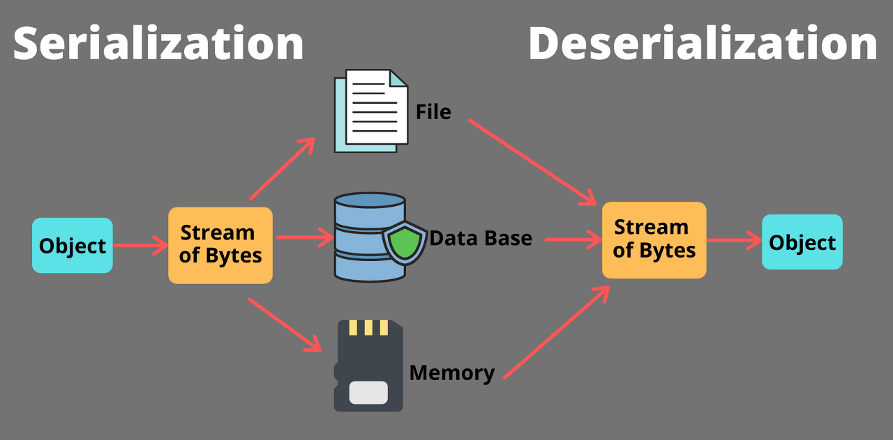
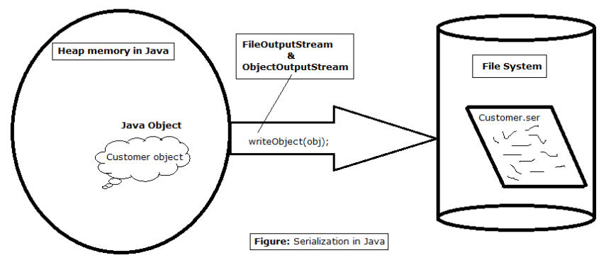
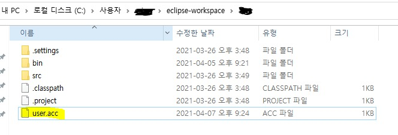
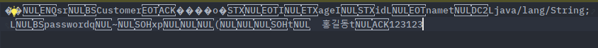
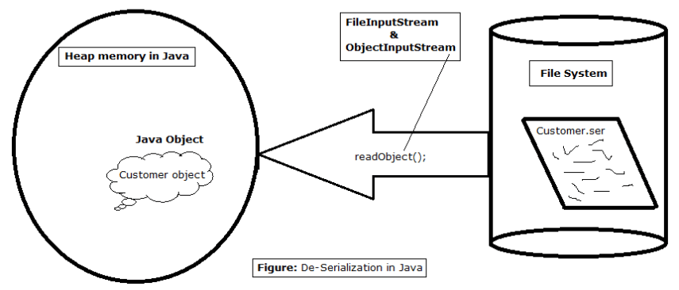
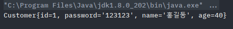
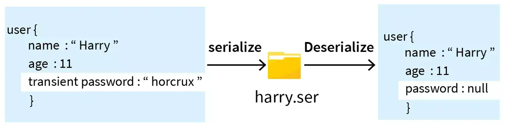
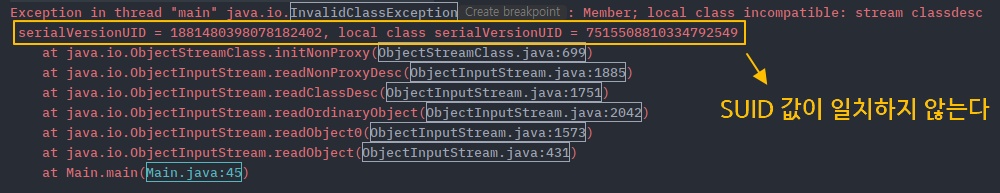
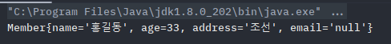

# 직렬화, 역직렬화



# 1. 직렬화 Serialize

**직렬화 :** 자바 시스템 내부에서 사용되는 객체 또는 데이터를 외부의 자바 시스템에서도 사용할 수 있도록 바이트 스트림(stream of bytes)형태로 연속적인(serial)데이터로 변환하는 포맷 변환 기술

**역직렬화(Deserialize) :** 직렬화의 반대 개념으로, 바이트로 변환된 데이터를 원래대로 자바 시스템의 object 또는 Data로 변환하는 기술.

→ 간단하게, 외부파일이나 네트워크를 통해 클라이언트간 객체 데이터를 주고 받을 때 사용되는 포맷 기술

→(직렬화를 해야 역직렬화를 할 수 있으므로, 넓은 의미의 직렬화가 역직렬화를 포함하는 개념)

- 시스템적으로 JVM의 Runtime Data Area(Heap 또는 Stack영역)에 상주하고 있는 객체 데이터를 바이트 형태로 변환하여 DB나 파일같은 외부 저장소에 저장하고, 외부(다른 컴퓨터)에서 이 파일을 가져와 역직렬화를 통해 자바 객체로 변환하여 JVM메모리에 적재하여 사용하는 것을 의미한다.

> 바이트 스트림 : 
> - 스트림 : client나 server간에 출발지 목적지로 입출력을 하기 위한 데이터가 흐르는 경로
> - 자바는 스트림의 기본 단위를 바이트로 사용한다.
> - 따라서 network, db로 전송하기 위해 최소단위인 바이트 스트림으로 변환하여 처리한다.
> 

## 1- 1) 직렬화 사용처
- 파일을 전송할 때

- 휘발성 있는 캐싱 데이터의 영구 저장이 필요할 때도 사용할 수 있다.
    - JVM메모리서만 상주하는 객체 데이터가 시스템이 종료되어도 재사용될 수 있을 때 사용.

### 서블릿 세션 (Servlet Session)

- 서블릿 : 자바를 이용하여 웹을 만들기 위해 필요한 기술 (Spring 관련 개념)
- [세션](https://github.com/psyStudy/CS_study/blob/main/Network/%EC%BF%A0%ED%82%A4%EC%99%80%20%EC%84%B8%EC%85%98.md) : 일정 시간동안 같은 클라이언트로 부터 들어오는 일련의 도구를 하나의 상태로 보고 이를 일정하게 유지 시키는 기술
- 자바 웹 기술인 서블릿에서 세션을 공유하기 위해 자바에 최적화된 포맷인 직렬화를 사용.
    - 세션 데이터를 저장&공유 할때 
    - 세션 데이터를 DB에 저장할 때
    - 톰캣의 세션 클러스터링을 통해 각 서버간 데이터 공유가 필요할 때
        - 톰캣 : 서블릿과 상호작용하는 웹 어플리케이션 서버의 구성요소(서블릿 개념에서 참조)
        - 세션 클러스터링 : 2 대 이상의 서버를 사용할 때 로드밸런싱, 장애 대비를 위해 세션을 공유하는 것

### 캐시 Cache

- DB로 부터 조회한 객체 데이터를 다른 모듈에서도 필요할 때 재차 DB를 조회하는 것이 아닌, 객체를 직렬화하여 메모리나 외부파일에 저장해 두었다가 역직렬화를 사용하는 캐시데이터로서 이용 가능.
- 캐시를 저장하는데 직렬화방식만 사용하는 것은 아니지만,  자바 시스템에서 만큼은 구현이 가장 간편하기 때문에 많이 사용됨.
- (요즘은 Redis, Memacached 같은 캐시DB를 많이 사용)

### 자바 RMI(Remote Method Invocation)

- 자바RMI는 원격 시스템 간의 메시지 교환을 위해 사용하는 자바 지원 기술.
- 이 메세지에 객체 데이터를 직렬화하여 송신.
- 최근에는 소켓을 이용하기 때문에 잘 안쓰이는 기술.

## 1-2) 직렬화 장점

- 자바의 고유 기술인 만큼 자바 시스템 개발에 최적화 되어 있다.
- 자바의 광활한 레퍼런스 타입에 제약없이 외부에 내보낼 수 있다.

→ 만약, 자바의 컬렉션, 클래스, 인터페이스 등을 JSON과 같은 단순 파일 포맷으로 내보낼 경우 별도의 파싱이 필요하다. 직렬화를 사용하면 별다른 파싱이 필요없음.

## 1-3) 직렬화 단점

- 오직 자바에서만 사용가능하다.
- 용량이 크다. 값뿐만아니라, 타입정보, 클래스 메타 정보 등을 갖기 때문
    - 같은정보를 JSON에 저장하는 것과 거의 2배이상의 용량 차이
    - DB, 캐시 등을 외부에 저장할 때 장시간 동안 저장하는 정보는 직렬화를 지양
- 버그와 보안에 취약함.
    - 역직렬화과정에서 ObjectInputStream 의 readObject()메서드를 호출하면, 모든 타입의 객체를 만들어 내게 되는데, 해당 객체안의 모든 코드를 수행할 수 있게 되어 프로그램의 전체 코드가 공격 범위에 들어가게 됨.
    - 자바는 객체를 생성자를 통해 만드는게 기본인데, 역직렬화는 이를 우회하여 객체를 바로 생성 (역직렬화가 숨은 생성자 역할)
    - 어느 객체가 생성자를 통해 인스턴스화 할 때 불변식이나 허가되지 않은 접근을 설정했을 때도 무시하고 생성됨.
    - 따라서 신뢰할 수 없는 데이터는 역직렬화하면 안됨.
    
    ```java
    class Member implements Serializable {
        private static final long serialVersionUID = 1L;
        private String name;
        private int age;
    
        public Member(String name, int age) {
            if(age < 0){ // Member객체를 직렬화/역직렬화 할 경우 age에 음수 값이 들어가도 걸러낼 수 없음. -> 직렬화 프록시 패턴으로 극복해야함
                throw new IllegalArgumentException();
            }
            this.name = name;
            this.age = age;
        }
    }
    ```
    

## 1-4) 직렬화 구현전 고려할 사항

1. 릴리즈 후 수정이 어렵다.
    - 클래스가 직렬화를 구현하면 직렬화된 바이트 스트림 인코딩 등 도 하나의 공개 API가 되는 것.
    - 직렬화를 구현한 클래스가 널리 퍼지면 그 직렬화 형태를 영원히 유지해야함.
2. 클래스 캡슐화가 깨진다.
    - 직렬화할 클래스에 private멤버가 있어도, 직렬화를 하면 그대로 외부에 노출.
    - (직렬화를 제외하려면 transient 설졍이 별도로 필요)
3. 새로운 버전을 릴리즈할  때 테스트 요소가 많아짐. (1번과 연결 : 구 버전직렬화가 신버전 역직렬화가 가능한지 테스트 해야함)
4. 클래스 설계에 드는 이득과 비용 고려하여 구현해야함
    - ex) 값 클래스는 직렬화 o, 동작 객체는 직렬화 x
5. 상속용 클래스와 인터페이스의 직렬화 구현에 주의햐야함 (위험성 높음)
    - 클래스의 직렬화와 확장이 모두 가능하게 하고 싶다면?
        - 인스턴스 필드의 값 중에 불변식을 보장해야할 게 있다면 반드시 하위 클래스에서 Object 클래스의 finalize 메서드를 재정의하지 못하게 해야한다. (finalize를 재정의하면서 final 키워드를 붙여서 선언)
        - 인스턴스 필드중 기본값 int는 0, Object는 null 등으로 설정되면 위배되는 불변식이 있다면,readObjectNoData 메서드를 반드시 추가해야함.
6. 내부 클래스는 직렬화 x
    - 직렬화 형태가 불분명하기 때문, 정적 내부 클래스는 직렬화를 구현해도 상관없음.

# 2. 직렬화 사용법

## 2-1) 객체 직렬화 , 역직렬화 하기

### 1단계 ㅣ Serializable 인터페이스 선언하기

- 객체를 직렬화하려면, java.io.Serializable 인터페이스를 implements 해야함.
- Serializable인터페이스는 아무 내용 없는 마커 인터페이스로, 직렬화를 고려하여 작성한 클래스인지를 판단하는 기준이 된다.

```java
import java.io.Serializable;

class Customer implements Serializable { // 직렬화 하겠다는 의도를 표시
    int id; // 고객 아이디
    String name; // 고객 닉네임
    String password; // 고객 비밀번호
    int age; // 고객 나이

    public Customer(int id, String name, String password, int age) {
        this.id = id;
        this.name = name;
        this.password = password;
        this.age = age;
    }

    @Override
    public String toString() {
        return "Customer{" +
                "id=" + id +
                ", password='" + password + '\'' +
                ", name='" + name + '\'' +
                ", age=" + age +
                '}';
    }
}
```

### 2단계 : ObjectOutputStream 객체 직렬화

- 직렬화(=스트림에 객체를 “출력”)에 ObjectOutputStream 사용.
- 오직 객체의 인스턴스 필드 값만을 저장. static필드,static메서드는 직렬화 저장 x
- 예제 : 외부파일에 객체를 직렬화하여 저장

```java
public static void main(String[] args) {
    // 직렬화할 고객 객체
    Customer customer = new Customer(1, "홍길동", "123123", 40);

    // 외부 파일명
    String fileName = "Customer.ser";

    // 파일 스트림 객체 생성 (try with resource)
    try (
            FileOutputStream fos = new FileOutputStream(fileName);
            ObjectOutputStream out = new ObjectOutputStream(fos)
    ) {
        // 직렬화 가능 객체를 바이트 스트림으로 변환하고 파일에 저장
        out.writeObject(customer);

    } catch (IOException e) {
        e.printStackTrace();
    }
}
```



- 위 코드를 실행하면 Customer.ser 파일이 생성됨. (직렬화 파일을 명시하기 위해 .ser 또는 .obj로 주로 지정함)
- 현재 프로젝트의 working directory에 저장된다. (아래 사진의 경우 user.acc가 직렬화 파일)
    
- 해당 파일은 사람이 읽을 수 없는 문자 형태로 되어 있음
    
    
    

### 3단계 : ObjectInputStream 객체 역직렬화

- 역직렬화(=스트림으로부터 객체를 입력)는 ObjectInputStream 사용
- 직렬화 대상이 된 객체의 클래스가 외부 클래스라면, 클래스 경로에 존재해야하며 import된 상태여야한다.
- 예제 : 외부 파일을 읽어 역직렬화하여 다시 자바 객체화

```java
public static void main(String[] args) {
    // 외부 파일명
    String fileName = "Customer.ser";

    // 파일 스트림 객체 생성 (try with resource)
    try(
            FileInputStream fis = new FileInputStream(fileName);
            ObjectInputStream in = new ObjectInputStream(fis)
    ) {
        // 바이트 스트림을 다시 자바 객체로 변환 (이때 캐스팅이 필요)
        Customer deserializedCustomer = (Customer) in.readObject();
        System.out.println(deserializedCustomer);

    } catch (IOException | ClassNotFoundException e) {
        e.printStackTrace();
    }
}
```



- 생성자로 객체 초기화없이 바로 객체에 정보를 가져와 인스턴스화 하여 사용할 수 있다.
    
    
    

## 2-2) 직렬화 요소 제외

객체의 모든 인스턴스를 직렬화하기에는 너무 무겁거나 혹은 중요한 정보는 외부에 노출시키고 싶지 않은 경우, 직렬화할 요소를 직접 선택할 수 있다.

### transient 키워드

- 변수 정의문 옆에 transient 키워드를 명시해주면 직렬화 대상에서 제외 할 수 있다.
- transient가 붙은 인스턴스 변수의 값은 그 타입의 기본값으로 직렬화 된다.
    - Primitive 타입 : 각 타입의 디폴트 값 (int는 0)
    - Reference 타입 : null
- 직렬화 대상에서 제외시, 그 데이터가 객체에 실제로 필요가 없는지, 제외하였을 경우에 서비스 장애에 이상이 없는지에 대한 고려를 해야한다.

```java
class Customer implements Serializable {
    int id; 
    String name; 
    transient String password; // 직렬화 대상에서 제외
    int age; 

    public Customer(int id, String name, String password, int age) {
        this.id = id;
        this.name = name;
        this.password = password;
        this.age = age;
    }
    
    ...
}
```



## 2-3) 직렬화 버전 관리

### SerialVersionUID

- Serializable 인터페이스를 구현하는 모든 직렬화된 클래스는 serialVersionUID라는 고유식별번호를 부여 받음.
- 이 ID는 클래스를 직렬화~역직렬화하는 과정에서 동일한 특성을 갖는 지 확인하는데 사용된다.
- 클래스 내부 구성이 수정될 경우 기존 직렬화 ID와 현재 클래스의 ID버전이 다르므로 InvalidClassException을 발생시켜 값 불일치 현상을 방지할 수 있다.
- serialVersionUID값 명시는 필수가 아니며, 명시하지 않으면 시스템이 런타임에 클래스의 이름, 생성자 등과 같이 클래스의 구조를 이용해 암호 해시함수를 적용해 자동으로 클래스안에 생성한다.
    - 협업하는 경우 클래스가 조금이라도 바뀌면 모든 사용자에게 재배포해야하므로 프로그램관리가 어려움.
        
        
        
- 따라서 **직접 명시하여 클래스 버전을 수동으로 관리하는 것을 강력 권장함.**
    - serialVersionUID를 직접 명시해주면 클래스의 내용이 변경되어도, 클래스의 버전이 시스템이 자동 생성된 값으로 변경되지 않는다.
    - 런타임에 serialVersionUID를 생성하는 시간도 많이 잡아먹는데 이를 줄일 수 있다.

```java
class Member implements Serializable {
    // serialVersionUID 꼭 명시 할 것
    private static final long serialVersionUID = 123L;
    
    private String name;
    private int age;
    private String address;
    
    private String email; // 새로 추가한 클래스 구성 요소

    ...
}
```



- serialVersionUID가 바뀌지 않아 역직렬화를 할 수 있고, email 필드가 새로 추가되어 자동으로 null로 초기화 되었다.

### serialVersionUID 유의사항

- 단순히 필드 변수 하나 추가정도는 괜찮지만, 필드 타입을 변경하는 등의 상황은 serialVersionUID를 명시한다고 예외를 막을 수 없다.
    1. 멤버 변수를 추가할 때 (영향 없음 - 기본값으로 설정)
    2. 멤버 변수가 삭제될 때 (영향 없음)
    3. 멤버 변수의 이름이 바뀔 때 (영향 없음 - 값이 할당되지 않음)
    4. 멤버 변수의 접근 제어자 변경 (영향 없음)
    5. ⭐**멤버 변수의 타입이 바뀔 때 (영향 있음)**
    6. 멤버 변수에 static 와 transient 추가 (영향 없음)
- 자주 변경될 소지가 있는 클래스는 직렬화를 사용하지 않는 것이 좋다.

---

# 면접질문

- 직렬화에 대해 설명해 주세요.
- SerialVersionUID를 선언해야 하는 이유에 대해 설명해주세요.
    - JVM은 직렬화와 역직렬화를 하는 시점의 클래스에 대한 버전 번호를 부여하는데, 만약 그 시점에 클래스의 정의가 바뀌어 있다면 새로운 버전 번호를 할당하게 됩니다. 그래서 직렬화할 때의 버전 번호와 역직렬화를 할 때의 버전 번호가 다르면 역직렬화가 불가능하게 될 수 있기 때문에 이런 문제를 해결하기 위해 SerialVersionUID를 사용합니다.
    - 만약 직렬화할 때 사용한 SerialVersionUID의 값과 역직렬화 하기 위해 사용했던 SVUID가 다르다면 InvalidClassException이 발생할 수 있다.

# 출처

- [https://inpa.tistory.com/entry/JAVA-☕-직렬화Serializable-완벽-마스터하기#객체_직렬화__역직렬화_하기](https://inpa.tistory.com/entry/JAVA-%E2%98%95-%EC%A7%81%EB%A0%AC%ED%99%94Serializable-%EC%99%84%EB%B2%BD-%EB%A7%88%EC%8A%A4%ED%84%B0%ED%95%98%EA%B8%B0#%EA%B0%9D%EC%B2%B4_%EC%A7%81%EB%A0%AC%ED%99%94__%EC%97%AD%EC%A7%81%EB%A0%AC%ED%99%94_%ED%95%98%EA%B8%B0)
- [https://velog.io/@whitebear/자바-직렬화-확실히-알고-가기](https://velog.io/@whitebear/%EC%9E%90%EB%B0%94-%EC%A7%81%EB%A0%AC%ED%99%94-%ED%99%95%EC%8B%A4%ED%9E%88-%EC%95%8C%EA%B3%A0-%EA%B0%80%EA%B8%B0)
- [https://dev-coco.tistory.com/153](https://dev-coco.tistory.com/153)
- [https://reakwon.tistory.com/160](https://reakwon.tistory.com/160)