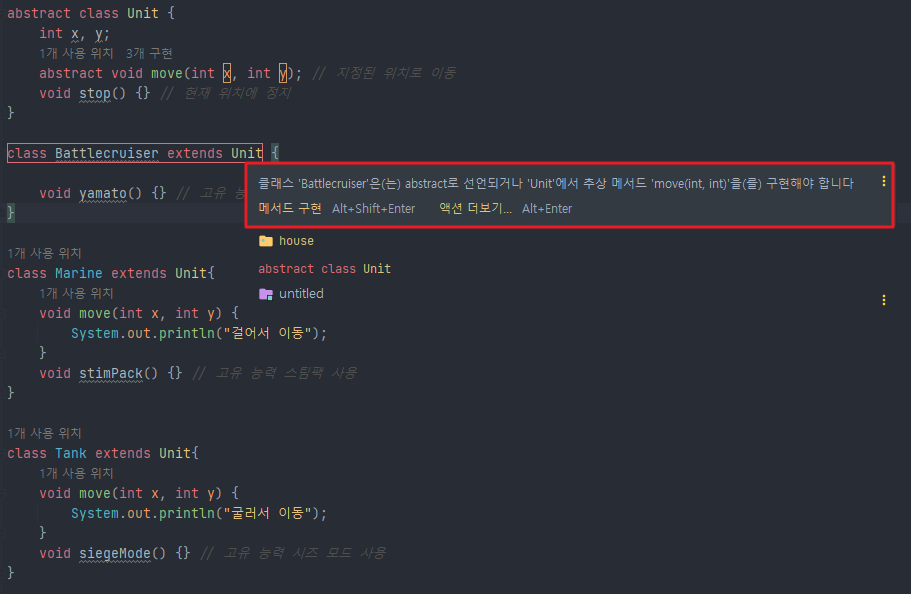
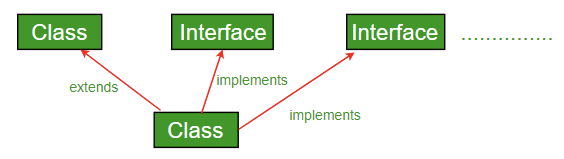
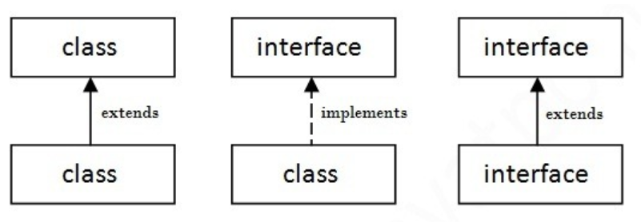
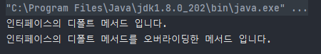
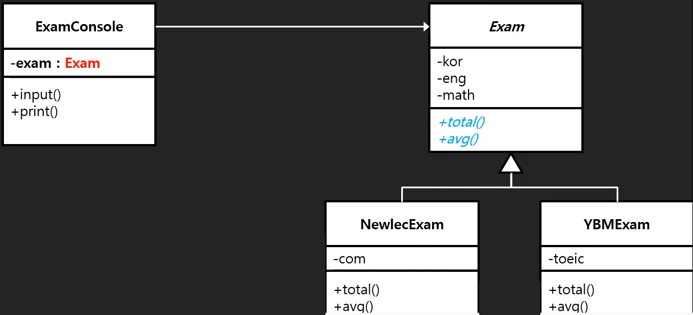
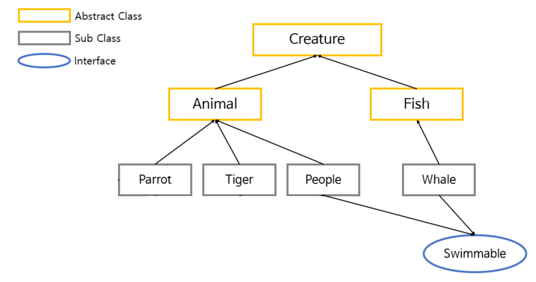
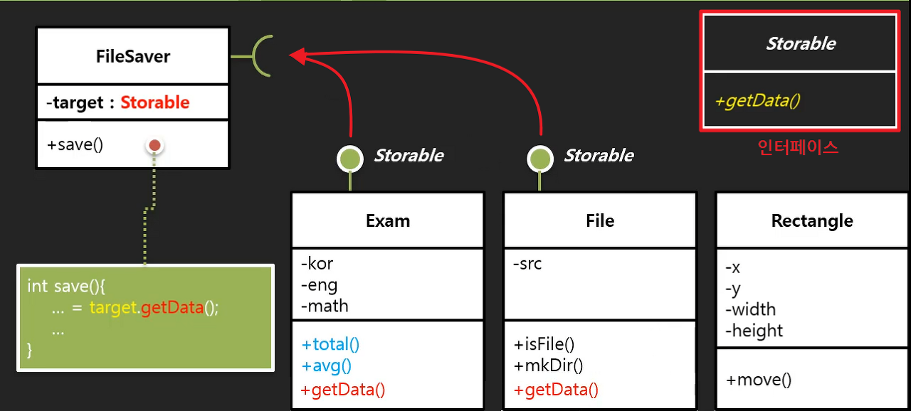

# 추상 클래스와 인터페이스

> upcasting  업캐스팅 : 자식 클래스 객체가 부모 클래스 타입으로 형변환 되는 것.
> 

```java
class Person{
	String name;
	Person(String name){
		this.name = name;
	}
}

class Student extends Person{
	String check;
	Student(String name){
		super(name);
	}
}

public class Main{
	public static void main(String[] args){
		Student s = new Student("홍길동");
		Person p = s;	// 업캐스팅
		p.name = "이름이다.";

		p.check = "컴파일 에러 발생";	// 컴파일 에러 발생
	}
}
```

> downcasting 다운 캐스팅 : 업캐스트팅된 것을 다시 원상태로 돌리는 것. 하위 클래스로 다운 캐스팅 할 때는 타입을 명시적으로 지정해줘야한다.
> 

```java
class Person{
	String name;
	Person(String name){
		this.name = name;
	}
}

class Student extends Person{
	String check;
	Student(String name){
		super(name);
	}
}

public class Main{
	public static void main(String[] args){
		Person p = new Student("홍길동");
        
		Student s = (Student)p;	// 다운캐스팅
		s.name = "김유신";
		s.check = "check!";
	}
}
```

# 1. 추상 클래스와 추상 메소드

쉽게 말해 미완성 설계도!

## 1.1. 추상 메소드 abstract method

- 선언은 되어 있으나 코드가 구현되어 있지 않음 메소드.
- abstract 키워드를 선언하는 선언부만 존대하고, 구현부는 작성하지 않고 사용한다.

```java
//abstract 반타입 메소드명();
public abstract String getSubject(); // 구현부가 없다는 의미로 선언부에 바로 ;을 붙인다.

public abstract String fail(){ return "Hi" } //컴파일 오류
```

## 1.2. 추상 클래스 abstract class

- 하나 이상의 추상 메소드를 포함하느 클래스.
- 목적 : 추상 클래스를 상속받는 **자식 클래스가 “반드시” 이 추상 메소드를 구현하도록 하기 위함.**
    1. 공통된 필드 이름과 공통된 메서드 이름을 사용하여 통일할 수 있다.
        - 추상 메소드는 추상 클래스에서 선언되고, 자식 클래스에서 반드시 오버라이딩 해야하만 사용할 수 있다.
        - 일반 메소드로 구현되어 있으면, 사용자에 따라 해당 메소드를 구현할 수도 안 할수도 있기 때문.
        - 인스턴스를 만드려면 추상 메소드를 구현해야하고, 공통된 필드 이름과 공통된 메서드 이름을 사용하여 유지보수성을 높일 수 있다.
    2. 실체 클래스 구현시 시간절약을 할 수 있다. (일반 개발자 입장에서)
        - 처음 부터 설계하는 것이 아니라, 강제로 주어지는 필드와 메서드를 가지고 구현만 하면 됨.
        - EX) 안로이드 개발시 구글이 미리 만들어둔 안드로이드 SDK에서 제공하는 추상클래스를 상속받아 개발자는 내부동작만 구현하면 된다!
    3. 규격에 맞는 실체 클래스를 구현할 수 있다.
- 반드시 사용되야하는 메소드를 추상클래스안에 추상 메소드로 선언해 놓으면, 이 클래스를 상속받는 모든 클래스에서는 이 추상 메소드를 반드시 재정의 해야한다.
- ※ JAVA는 클래스의 다중상속을 지원하지 않기때문에 여러개의 추상 클래스를 상속할 수 없다.

### 1.2.1. 추상 클래스 사용법

```java
abstract class 클래스이름{
...
	abstract 반환타입 추상메소드이름();
...
}
```

- 추상 클래스는 동작의 정의되지 않은 추상메소드를 포함하므로, 인스턴스를 생성할 수 없다.
- 상속을 통해 자식 클래스를 만들고, 만든 자식 클래스에서 추상 클래스의 추상 모든 추상 메소드를 오버라이딩 하고 나서야 비로소 자식 클래스의 인스턴스를 생성할 수 있다.

>
>💡 추상 클래스는 추상 메소드를 포함하고 있다는 점을 제외하면, 일반 클래스와 모든 점이 같다. → 생성자, 필드, 일반 메소드도 포함할 수 있다.
>
>

**예제1**

```java
abstract class Animal { abstract void cry(); }
class Cat extends Animal { void cry() { System.out.println("냐옹냐옹!"); } }
class Dog extends Animal { void cry() { System.out.println("멍멍!"); } }

public class Polymorphism02 {

    public static void main(String[] args) {
        // Animal a = new Animal(); // 추상 클래스는 인스턴스를 생성할 수 없음.
        Cat c = new Cat();
        Dog d = new Dog();
        c.cry();
        d.cry();
    }
}
```

```
//실행결과
냐옹냐옹!
멍멍!
```

**예제2 - 공통 멤버의 통합으로 중복제거(인터페이스는 불가)**

```java
//원래 흩어져 있던 클래스들
class Marine {
    int x, y;
    void move(int x, int y) {} // 지정된 위치로 이동
    void stop() {} // 현재 위치에 정지
    void stimPack() {} // 고유 능력 스팀팩 사용
}

class Tank {
    int x, y;
    void move(int x, int y) {} // 지정된 위치로 이동
    void stop() {} // 현재 위치에 정지
    void siegeMode() {} // 고유 능력 시즈 모드 사용
}

class DropShip {
    int x, y;
    void move(int x, int y) {} // 지정된 위치로 이동
    void stop() {} // 현재 위치에 정지
    void loadUnload() {} // 고유 능력 탑승 사용
}
```

```java
//변경 후
abstract class Unit {
    int x, y;
    abstract void move(int x, int y); // 지정된 위치로 이동
    void stop() {} // 현재 위치에 정지
}

class Marine extends Unit{
    void move(int x, int y) {
        System.out.println("걸어서 이동");
    }
    void stimPack() {} // 고유 능력 스팀팩 사용
}

class Tank extends Unit{
    void move(int x, int y) {
        System.out.println("굴러서 이동");
    }
    void siegeMode() {} // 고유 능력 시즈 모드 사용
}

class DropShip extends Unit{
    void move(int x, int y) {
        System.out.println("날아서 이동");
    }
    void loadUnload() {} // 고유 능력 탑승 사용
}
```


**예제3 - 구현 강제성을 통한 기능 보장(인터페이스도 가능)**

```java
//Unit 클래스는 예제2 코드와 동일
public class Test1 {
    public static void main(String[] args) {
        Unit[] group = new Unit[3];
        group[0] = new Marine();
        group[1] = new Tank();
        group[2] = new DropShip();

        for(Unit u : group) {
            u.move(100, 200);
        }
    }
}

class Battlecruiser extends Unit {
    void yamato() {} // 고유 능력 야마토 사용
	//move는 깜빡하고 구현 안함!
}

class Marine extends Unit { ... }

class Tank extends Unit { ... }

class DropShip extends Unit { ... }
```



- 에러를 띄워주므로 큰 문제가 발생하지 않았다!
- 추상 메소드가 없었으면 버그 발생 가능성이 높아진다!
    - 직접 *move()* 메소드를 정의해 놓지 않으면, 호출 됬을때 결국 부모 클래스의 *move()* 메소드가 실행 될 것이고 이는 잘못된 동작이 나타나게 하거나 아예 동작 자체가 안되는 심각한 게임 버그 현상이 일어나게 된다. 미리 에디터에서 알려주면 좋겠으려만 실제 프로그램을 구동하고 유닛을 조종해 봐야 일어날 수 있는 버그 현상이라 디버깅으로도 찾기 매우 힘든 부분이다.

---

# 2. 인터페이스

interface : 상호 테이터를 주고 받을 수 있는 규격이라는 의미로 사용되고 있다.

java인터페이스도 소프트웨어를 규격화된 모듈로 만들고 모듈을 조립하듯이 응용 프로그램을 작성하드록 만들어 졌다.

다른 클래스를 작성할 때 기본이 되는 틀을 제공하면서, 다른 클래스 사이의 중간 매개 역할까지 담당한다.

## 2.1 인터페이스 특징

- 다중 상속이 가능함.
- 인터페이스는 오직 추상메소드와 상수만 포함할 수있다. (java8 이전, java8이후는 뒤에 다시 설명)
    - (추상 클래스는 생성자, 필드, 일반 메소드를 포함할 수 있음.)
    - 따라서 추상 클래스 처럼 추상 메서드 오버라이딩이 필수다.
- 정형화된 개발을 위한 표준화 가능
- 클래스 작성과 인터페이스 구현을 동시에 할 수 있으므로 개발 시간을 단축할 수 있음.
- 클래스와 클래스간의 관계를 인터페이스로 연결하면 클래스마다 독립적인 프로그래밍이 가능함.

## 2.2 인터페이스 사용법

### 1) 정의

> [접근제어자와  final (click!)](https://github.com/psyStudy/CS_study/blob/main/Java/%EC%A0%91%EA%B7%BC%20%EC%A0%9C%EC%96%B4%EC%9E%90%2C%20final.md) 
[static과  non-static (click!)](https://github.com/psyStudy/CS_study/blob/main/Java/%ED%81%B4%EB%9E%98%EC%8A%A4%EC%99%80%20%EA%B0%9D%EC%B2%B4%20%EB%B0%8F%20%EC%9D%B8%EC%8A%A4%ED%84%B4%EC%8A%A4%2C%20static%2C%20%EC%9B%90%EC%8B%9C%ED%83%80%EC%9E%85%EA%B3%BC%20%EC%B0%B8%EC%A1%B0%ED%83%80%EC%9E%85.md)
> 
- 접근 제어자와 함께 interface 키워드를 사용한다.
- 모든 필드는 public static final(=상수)이어야 한다.
- 모든 메소드는 public abstract 여야한다.
    - (다만, 모든 인터페이스에 공통으로 적용되므로 생략해서 적을 수 있으며 컴파일시 자바 컴파일러가 자동으로 추가함.)

```java
접근제어자 interface 인터페이스이름 {
    public static final 타입 상수이름 = 값;
    ...
    public abstract 메소드이름(매개변수목록);
    ...
}
/*------------------------------------*/

interface TV {
    int MAX_VOLUME = 10; // public static final 생략 가능
    int MIN_VOLUME = 10;

    void turnOn(); // public abstract 생략 가능
    void turnOff();
    void changeVolume(int volume);
    void changeChannel(int channel);
}
```

### 2) 구현

- 추상 클래스와 마찬가지로 직접 인스턴스를 생성할 수 없다.
- 구현부를 만들어주는 클래스에 구현(상속)되어야 사용할 수 있다.
- 어떤 클래스에 인터페이스를 구현(상속)하려면, implements 키워드를 쓴 후 인터페이슬 나열한다. 그 후 인터페이스가 포함한 추상 메소드를 구체적으로 구현한다.
- 클래스간 상속(extends)와 인터페이스 구현(implements)가 동시에 가능하다.
    
    
    
    
    

>
>💡 인터페이스도 따지고 보면 상속이지만 implements(구현하다)라는 키워드를 사용하는 이유는, 상속은 클래스간 부모-자식 관계를 연관 시키는 의미가 중점이라면, 인터페이스는 클래스를 확장시켜 다양히 이용하는게 중점이기때문이다.
>

>
>💡 인터페이스의 추상 메소드는 기본적으로 public abstract가 생략된 상태이기 때문에 반드시 자식 클래스에서 구현할 때 제어자를 public으로 해야한다. (부모보다 넓은 범위의 접근 제어자를 지정해야)
>

```java
interface Animal { 
	public abstract void cry(); 
}

interface Pet { 
	public abstract void play(); 
}

class Tail {
	// ...
}

class Cat extends Tail implements Animal, Pet { 
// 자식 클래스 Cat은 부모 클래스 Tail 인터페이스 Animal, Pet을 동시에 상속
    public void cry() { //Animal인터페이스의 cry 구현
        System.out.println("냐옹냐옹!");
    }

    public void play() {//Pet 인터페이스의 play 구현
        System.out.println("쥐 잡기 놀이하자~!");
    }
}
```

```
//실행결과
냐옹냐옹!
쥐 잡기 놀이하자~!
```

### 3) 인터페이스 일부 구현 (추상 클래스)

- 만일 (자식)클래스가 인터페이스의 메서드 일부만 구현하면 abstract를 붙여 추상 클래스로 구현해야한다.
- 나머지 메서드는 구현이 안되어 있으므로 추상 메서드를 가진 추상 클래스가 되기 때문

```java
interface Animal {
    void walk();
    void run();
    void breed();
}

// Animal 인터페이스를 일부만 구현하는 포유류 추상 클래스
abstract class Mammalia implements Animal {
    public void walk() { ... }
    public void run() { ... }
    // public void breed() 는 자식 클래스에서 구체적으로 구현하도록 일부로 구현하지 않음 (추상 메서드로 처리)
}

class Lion extends Mammalia {
    @Override
    public void breed() { ... } 
}
```

### 4) 인터페이스 자체 상속

- 인터페이스 자체를 확장 시킬때, **extends**를 통해 인터페이스끼리 상속할 수 있다.
- 인터페이스 끼리도 다중 상속이 가능하다.
    - 메소드 구현부가 없으니, 충돌 가능성이 없기 때문이다.ㅑ
- 클래스 상속과 마찬가지로 자식 인터페이스는 부모 인터페이스에 정의된 모든 멤버를 상속받는다.
- 하지만 필드의 경우 기본적으로 static이기 때문에 구현체를 따라가지 않는다. (독립 상수 이다.)
- 인터페이스에 클래스를 상속할 수 는 없다.

```java
interface Changeable{
    /* 채널을 바꾸는 기능의 메서드 */
    void change();
}

interface Powerable{
    /* 전원을 껐다 켰다 하는 메서드 */
    void power(boolean b);
}

// 채널 기능과 전원 기능을 가진 인터페이스들을 하나의 인터페이스로 통합 상속
interface Controlable extends Changeable, Powerable { 
	// 인터페이스끼리 다중 상속하면 그대로 추상 멤버들을 물려 받음
}

// 클래스에 통합된 인터페이스를 그대로 상속
class MyObject implements Controlable {
	public void change() {
        System.out.println("채널을 바꾸는 기능의 메서드");
    }
    public void power(boolean b) {
        System.out.println("전원을 껐다 켰다 하는 메서드");
    }
}

public class Main {
	public static void main(String[] args) {
        // 인터페이스 다형성 (인터페이스를 타입으로 취급해서 업캐스팅 가능)
        Controlable[] o = { new MyObject(), new MyObject() };
        o[0].change();
        o[0].power(true);
        
        // 각각 단일 인터페이스로도 타입으로 사용이 가능하다. (그러나 지니고 있는 추상 메서드만 사용이 가능하다)
        Changeable inter1 = new Changeable();
        inter1.change(); 

        Powerable inter2 = new Powerable();
        inter2.power(true);
    }
}
```

### 5) 인터페이스 상수 필드 상속 관계

- 인터페이스 필드들은 모두 public static final 이므로, 서로 상속해도 독립적으로 운용된다.

```java
interface Iflower {
    int ex = 10; // 각각 public static final
}

interface IPlant extends Iflower {
    int ex = 20; // 각각 public static final
}

class Tulip implements IPlant {
    int ex = 30; // 그냥 인스턴스 변수
}

public class Main {
	public static void main(String[] args) {
        // 클래스 타입 객체로 ex 멤버에 접근하면, 클래스 인스턴스 변수로 접근
        Tulip t =  new Tulip();
        System.out.println(t.ex); // 30

        // 인터페이스 타입 객체로 멤버에 접근하면, 인터페이스 static 상수로 접근
        Iflower a = new Tulip();
        System.out.println(a.ex); // 10 - 좋지않은 방법
        System.out.println(Iflower.ex); // 10 - 클래스 static 처럼 '인터페이스.멤버' 로 접근

        IPlant b = new Tulip();
        System.out.println(b.ex); // 20 - 좋지않은 방법
        System.out.println(IPlant.ex); // 20 - 클래스 static 처럼 '인터페이스.멤버' 로 접근
    }
}
```

### 6) 마터 인터페이스

- 일반적인 인터페이스와 동일하지만, 사실상 아무 메소드도 선언하지 않은 빈 껍데기 인터페이스.
- 객체 타입과 관련된 정보만을 제공해주는 역할이다.

```java
//마커 인터페이스 사용전
class Animal {
    public static void born(Animal a) {
        if(a instanceof Lion) { // 새끼를 낳는지 어쩐지 구분하려고 하나하나 instance of 연산자로 구분해야함
            System.out.println("새끼를 낳았습니다.");
        } else if(a instanceof Chicken) {
            System.out.println("알을 낳았습니다.");
        } else if(a instanceof Snake) {
            System.out.println("알을 낳았습니다.");
        }
        // ...
    }
}

class Lion extends Animal { }
class Chicken extends Animal { }
class Snake extends Animal { }
```

```java
// 새끼를 낮을 수 있다는 표식 역할을 해주는 마커 인터페이스 (단순히 타입 체크)
interface Breedable {}

class Animal {
    public static void born(Animal a) {
        if(a instanceof Breedable) {
            System.out.println("새끼를 낳았습니다.");
        } else {
            System.out.println("알을 낳았습니다.");
        }
    }
}

class Lion extends Animal implements Breedable { }
class Chicken extends Animal { }
class Snake extends Animal { }
```

## 2.3 Java8 인터페이스 구현 메소드

- 원래 인터페이스 메소드는 직접 구현부를 가질 수 없었다.
- **자바8 부터 default method와 static method를 통해 추상클래스 처럼 구현부를 가질 수 있게 되었다. → 이 기능으로 추상 클래스와 차이점이 거의 사라짐!**
- 이는 이전에 개발된 인터페이스를 사용하여 java8의 람다 표현식 기능을 활용할 수 있도록 하위 호완성을 위해 추가된 것이다.
    - EX) java8부터 새로 추가된 스트림이나 람다 같은 함수형 프로그래밍을 collection 클래스에서 사용하기 위해, 기존에 만들어 놓았던 인터페이스들을 구현하고 있는 collection 클래스들의 구조에서 특정한 기능을 추가해야하는 상황이 오게 되었다.

### 1) default method

- 앞에 default 키워드를 붙이며, 일반 메서드처럼 구현부가 있어야 한다.
- 접근제어자가 public 이며 생략 가능하다.
- 자식 클래스(구현체)에서 default 메소드를 오버라이딩 하여 재정의 가능하다.
- 보통 인터페이스를 구현한 이후, 수정과정에서 인터페이스의 모든 구현체에게 수정없이 광역으로 함수를 만들어 주고 싶을 때 사용한다.
    - 대신 모든 구현체가 원하는 값을 return 하게 보장하기 위해 @implspec 자바 doc 태그를 이용해 문서화 해줘야 한다.
- 인터페이스는 object 클래스의 상속을 받지 않기 때문에, object가 제공하는 equals, hasCode는 기본 메소드로 제공할 수 없다. 따라서 구현체가 직접 재정의 해줘야한다.
- 인터페이스의 디폴트 메서드를 호출하려면, 객체의 타입을 반드시 인터페이스 타입으로 업캐스팅 해줘야한다.

```java
interface Calculator {
    int plus(int i, int j); //추상메소드
    int multiple(int i, int j);//추상메소드

    // default로 선언함으로 메소드를 구현할 수 있다.
    default int sub(int i, int j){      
        return i - j;
    }
}

// Calculator인터페이스를 구현한 MyCalculator클래스
class MyCalculator implements Calculator {
    // 추상 메서드만 구현해줌
    @Override
    public int plus(int i, int j) { return i + j; }
    @Override
    public int multiple(int i, int j) { return i * j; }
}

public class Main {
    public static void main(String[] args){
        MyCalculator mycal = new MyCalculator();
        
        // 인터페이스 타입으로 업캐스팅
        Calculator cal = (Calculator) mycal; // 괄호 생략해도 됨

        // 인스턴스의 인터페이스 디폴트 메서드 호출
        int value = cal.sub(5, 10);
        System.out.println(value); // -5
    }
}
```

### 1-●) @ implSpec 주석문서

- 디폴트 메서드는 보통 인터페이스 구현 후, 수정과정에서 인터페이스 모든 구현체에게 수정 없이 광역으로 함수를 만들어 주고 싶을 때 사용한다.
- 이는 컴파일 에러가 아니더라도 런타임 에러가 발생할 수 있는 리스크가 존재합.
- 대신 모든 구현체가 원하는 값을 return 하게 보장하기 위해 @implSpec 자바 dog 태그를 사용해 문서화 해야한다.
- 주석에 @implSpec 을 통해 해당 method가 어떤 역할로 사용하는지 작성해주면 된다.

```java
interface IJson {
    String printJson(); // 추상 메서드

    /**
     * @implSpec 
     * printJson()의 결과를 대문자 변환하는 메서드
     */
    default void uppperString() { // default 메서드
        // 구현 로직상, 추상 메서드인 printJson()의 반환 값이 정상적인 값이 될수도 있고 null이되서 예외 오류가 발생할 수 있으니 @impspec 문서화를 한다.
        String text = printJson().toUpperCase();
        System.out.println(text);
    }
}
```

### 1-●) defult 메소드 다중 상속 문제

다이아몬드 현상 때문에 클래스 다중 상속을 금지 시켰더니, 인터페이스 디폴트 메서드 때문에 같은 문제가 발생!

- 규칙을 정했다!
1. 다중 인터페이스 간 디폴트 메서드 충돌
    - 애초에 똑같은 디폴트 메서드를 가진 두 인터페이스를 하나의 클래스에 구현하고, 아무런 조치를 취하지 않으면 컴파일 자체가 되지 않음.
    - 인터페이스를 구현한 클래스에서 디폴트 메서드를 오버라이딩 하여 하나로 통합한다.
    
    ```java
    interface A1{
        public void styleA();
    
        // 메소드 시그니처가 같은 디폴트 메서드
        default public void styleSame(){
            System.out.println("A1 인터페이스의 디폴트 메서드 입니다.");
        }
    }
    
    interface B1{
        public void styleB();
    
        // 메소드 시그니처가 같은 디폴트 메서드
        default public void styleSame(){
            System.out.println("B1 인터페이스의 디폴트 메서드 입니다.");
        }
    }
    
    class MultiInterface implements A1, B1 {
        @Override
        public void styleA() {}
        @Override
        public void styleB() {}
    
        // 두 인터페이스 디폴트 메서드중 A1 인터페이스의 디폴트 메서드를 오버라이딩 하여 구현
        default public void styleSame(){
            System.out.println("A1 인터페이스의 디폴트 메서드 입니다.");
        }
    }
    
    public class Main {
        public static void main(String[] args) {
            MultiInterface m1 = new MultiInterface();
            m1.styleSame(); // "A1 인터페이스의 디폴트 메서드 입니다."
        }
    }
    ```
    
2. 인터페이스의 디폴트 메서드와 부모 메스드 간의 충돌   
- 자식 클래스에서 인터페이스와 부모 클래스를 동시에 extends / implement 하였을 때 디폴드 메서드와 인스턴스 메서드 간의 충돌
- 부모 클래스의 메서드가 상속되고 디폴트 메서드는 무시된다.
- 인터페이스 쪽 디폴드 메서드를 사용해야한다면, 필요한 쪽의 메서드와 같은 내용으로 오버라이딩 한다.

```java
interface A1{
    public void styleA();

    // C1 클래스와 메소드 시그니처가 같은 디폴트 메서드
    default public void styleSame() {
        System.out.println("A1 인터페이스의 디폴트 메서드 입니다.");
    }
}

abstract class C1 {
    // A1 인터페이스와 메소드 시그니처가 같은 인스턴스 메서드
    public void styleSame() {
        System.out.println("C1 클래스의 인스턴스 메서드 입니다.");
    }
}

// 메서드 시그니처가 같은 두 추상화들을 동시에 상속
class MultiClassInterface extends C1 implements A1 {
    @Override
    public void styleA() {}
}

public class Main {
    public static void main(String[] args) {
        MultiClassInterface m1 = new MultiClassInterface();
        m1.styleSame(); // "C1 클래스의 인스턴스 메서드 입니다." - 클래스의 메서드 시그니처가 우선되어 적용됨

        // 마찬가지로 인터페이스 타입으로 다운캐스팅 해도 클래스 인스턴스 메서드로 호출 됨
        ((A1) m1).styleSame(); // "C1 클래스의 인스턴스 메서드 입니다."
    }
}
```

```java
// 메서드 시그니처가 같은 두 추상화들을 동시에 상속
class MultiClassInterface extends C1 implements A1 {
    @Override
    public void styleA() {}

    // 클래스의 인스턴스 메서드를 무시하고 인터페이스의 디폴트 메서드를 사용하기 위해 그대로 오버라이딩
    public void styleSame() {
        System.out.println("A1 인터페이스의 디폴트 메서드 입니다.");
    }
}

public class Main {
    public static void main(String[] args) {
        MultiClassInterface m1 = new MultiClassInterface();
        m1.styleSame(); // "A1 인터페이스의 디폴트 메서드 입니다."
    }
}
```

1. default 메소드의 super
- (상위 클래스를 상속하고 상위의 메소드를 오버라이딩하여 재정의하였을때, 만일 부모 메서드를 호출할 일이 생긴하면 super 키워드를 통해 부모 메서드를 호출할 수 있다.)
- 인터페이스도 디폴트 메서드를 구현한 클래스에서 오버라이딩 하였을때, super 키워드를 통해 인터페이스의 원래의 디폴트 메서드를 호출이 가능하다.
- 인터페이스의 super는 다음과 같은 구성으로 호출된다. **인터페이스명.super.디폴트메서드**

```java
interface IPrint{
    default void print(){
        System.out.println("인터페이스의 디폴트 메서드 입니다.");
    }
}

class MyClass implements IPrint {
    @Override
    public void print() {
        IPrint.super.print(); // 인터페이스의 super 메서드를 호출
        System.out.println("인터페이스의 디폴트 메서드를 오버라이딩한 메서드 입니다.");
    }
}

public class Main {
    public static void main(String[] args) {
        MyClass cls = new MyClass();
        cls.print();
    }
}
```



### 2) static 메소드

- 인스턴스 생성과 상관없이 인터페이스 타입으로 접근해 사용할 수 있는 메서드
- 일반 클래스의 static 메소드와 똑같이 취급한다.
- 해당 타입 관련 헬퍼 또는 유틸리티 메소드를 제공할 때, 인터페이스에 스태틱 메소드로 제공하기도 한다.

```java
interface Calculator {
    public int plus(int i, int j);
    public int multiple(int i, int j);

    // 디폴트 메서드
    default int sub(int i, int j){
        return i - j;
    }

    // 스태틱 메서드
    public static void explain(){
        System.out.println("interface static 메서드 입니다. 이 인터페이스는 pluc, multipe, sub 기능을 제공하는 메서드를 지니고 있습니다. (설명)");   
    }
}

class MyCalculator implements Calculator {
    @Override
    public int plus(int i, int j) {  return i + j; }
    @Override
    public int multiple(int i, int j) { return i * j; }
}

public class Main {
    public static void main(String[] args){
        // 클래스 처럼 static 메소드 호출 하면 된다.
        Calculator.explain(); // "interface static 메서드 입니다. 이 인터페이스는 pluc, multipe, sub 기능을 제공하는 메서드를 지니고 있습니다. (설명)"
    }
}
```

### 3) private 메소드

- 자바9 버전에 추가된 메서드
- 인터페이스에 default, static 메소드가 생긴 이후, 이러한 메소드들의 로직을 공통화하고 재사용하기 위해 생긴 메소드
- private 메소드도 구현부를 가져야한다.
- 단, private 메소드는 인터페이스 내부에서만 돌아가는 코드이다. (인터페이스를 구현한 클래스에서 사용하거나 재정의 할 수 없음)
- 따라서 인터페이스 내부에서 private 메소드를 호출할때, default 메소드 내부에서 호출해야 하며,만일 private ~~static~~ 키워드를 붙인 메소드는 static 메소드에서만 호출이 가능하다.
- (상수는 private로 만들 수 없다. 자동으로 public static final)

```java
interface Calculator {
    public int plus(int i, int j);
    public int multiple(int i, int j);

    // private 메서드
    private void printf() {
        System.out.println("private 메서드는 default 내부에서만 호출이 가능합니다.");
    }

    // private 스태틱 메서드
    private static void printfStatic() {
        System.out.println("private static 메서드는 static 메서드 내부에서만 호출이 가능합니다.");
    }

    // 디폴트 메서드
    default void callPrivate() {
        printf(); // private 메서드 호출
    }

    // 스태틱 메서드
    static void callPrivateStatic() {
        printfStatic(); // private 스태틱 메서드 호출
    }
}

class MyCalculator implements Calculator {
    @Override
    public int plus(int i, int j) {  return i + j; }
    @Override
    public int multiple(int i, int j) { return i * j; }
}

public class Main {
    public static void main(String[] args){
        // 인터페이스 디폴트 메서드를 통한 private 메서드 호출
        Calculator c = new MyCalculator(); // 인터페이스 타입으로 업캐스팅
        c.callPrivate(); // "private 메서드는 default 내부에서만 호출이 가능합니다."

        // 인터페이스 스태틱 메서드를 통한 private static 메서드 호출
        Calculator.callPrivateStatic(); // "private static 메서드는 static 메서드 내부에서만 호출이 가능합니다."
    }
}
```

# 3. 인터페이스와 추상 메소드 비교

## 3.1 특징으로 비교

### 공통점

1. 추상 메소드를 가지고 있어야 한다.
2. 인스턴스화 할 수 없다 (new 생성자 사용 X)
3. 인터페이스 혹은 추상 클래스를 상속받아 구현한 구현체의 인스턴스를 사용해야 한다.
4. 인터페이스와 추상클래스를 구현, 상속한 클래스는 추상 메소드를 반드시 구현하여야 한다.

### 차이점

|  | 추상 클래스 | 인터페이스 |
| --- | --- | --- |
| 사용 키워드 | abstract | interface |
| 사용 가능 변수 | 제한 없음 | static final (상수) |
| 사용 가능 접근 제어자 | 제한 없음 (public, private, protected, default) | public |
| 사용 가능 메소드 | 제한 없음 | abstract method, default method, static method, private method |
| 상속 키워드 | extends | implements |
| 다중 상속 가능 여부 | 불가능 | 가능 (클래스에 다중 구현, 인터페이스 끼리 다중 상속) |

## 3.2 사용처 비교

사용 목적에 따라 포인트를 두고 봐야한다.

- 추상 클래스 : 자신의 기능을 하위 클래스로 확장 시키는 느낌 : extends
- 인터페이스 : 인터페이스에 정의된 메서드를 각 목적에 맞게 기능을 구현하는 느낌 implements

### 추상 클래스를 사용하는 경우
- non-static, non-final 필드 선언이 필요한 경우(각 인스턴스에서 상태 변경을 위한 메소드가 필요한 경우 )
- 명확한 계층 구조를 추상화 할 경우
    - 인터페이스나 추상 메소드를 이용한 구현 원칙을 강제한다는 점은 같지만, 추상클래스는 '클래스로서' 클래스와 의미있는 연관 관계를 구축할때 사용된다라고 보면 된다.
- 논리적 다형성
    
    
    

### 인터페이스를 사용하는 경우

- 어플리케이션의 기능을 정의해야 하지만 그 구현 방식이나 대상에 대해 추상화 할 때
- **서로 관련성이 없는 클래스들을 묶어 주고** 싶을 때 (형제 관계)
    
    
    
- **다중 상속(구현)**을 통한 추상화 설계를 해야할때
- 특정 데이터 타입의 행동을 명시하고 싶은데, 어디서 그 행동이 구현되는지는 신경쓰지 않는 경우
- 클래스와 별도로 **구현 객체가 같은 동작을 한다는 것을 보장**하기 위해 사용
- 자유로운 다형성
    
    
    
- 마커 인터페이스

## [참고]인터페이스+추상 클래스 조합

결국 둘이 같이 조합되어 많이 사용됨. 추상 클래스의 중복 멤버 조합과 인터페이스의 다중 상속을 동시에 사용하기 위해서. 

이 둘을 같이 사용하는 여러 코드 패턴이 나왔고, 이것이 디자인 패턴의 근간이 되었다!

---

# 면접질문

- 추상 클래스와 인터페이스를 설명해주시고, 차이에 대해 설명해주세요.

# 출처

업캐스팅/다운캐스팅

- [https://computer-science-student.tistory.com/335](https://computer-science-student.tistory.com/335)

자바 인터페이스

- [https://coding-factory.tistory.com/867](https://coding-factory.tistory.com/867)
- [https://www.tcpschool.com/java/java_polymorphism_interface](https://www.tcpschool.com/java/java_polymorphism_interface)
- [https://inpa.tistory.com/entry/JAVA-☕-인터페이스Interface의-정석-탄탄하게-개념-정리](https://inpa.tistory.com/entry/JAVA-%E2%98%95-%EC%9D%B8%ED%84%B0%ED%8E%98%EC%9D%B4%EC%8A%A4Interface%EC%9D%98-%EC%A0%95%EC%84%9D-%ED%83%84%ED%83%84%ED%95%98%EA%B2%8C-%EA%B0%9C%EB%85%90-%EC%A0%95%EB%A6%AC)
- [https://velog.io/@cho876/JAVA8-인터페이스-변화](https://velog.io/@cho876/JAVA8-%EC%9D%B8%ED%84%B0%ED%8E%98%EC%9D%B4%EC%8A%A4-%EB%B3%80%ED%99%94)

추상메소드와 추상 클래스 

- [https://www.tcpschool.com/java/java_polymorphism_abstract](https://www.tcpschool.com/java/java_polymorphism_abstract)
- [https://limkydev.tistory.com/188](https://limkydev.tistory.com/188)
- [https://inpa.tistory.com/entry/JAVA-☕-추상-클래스Abstract-용도-완벽-이해하기#추상_클래스의_활용](https://inpa.tistory.com/entry/JAVA-%E2%98%95-%EC%B6%94%EC%83%81-%ED%81%B4%EB%9E%98%EC%8A%A4Abstract-%EC%9A%A9%EB%8F%84-%EC%99%84%EB%B2%BD-%EC%9D%B4%ED%95%B4%ED%95%98%EA%B8%B0#%EC%B6%94%EC%83%81_%ED%81%B4%EB%9E%98%EC%8A%A4%EC%9D%98_%ED%99%9C%EC%9A%A9)
- [https://inpa.tistory.com/entry/JAVA-☕-인터페이스-vs-추상클래스-차이점-완벽-이해하기](https://inpa.tistory.com/entry/JAVA-%E2%98%95-%EC%9D%B8%ED%84%B0%ED%8E%98%EC%9D%B4%EC%8A%A4-vs-%EC%B6%94%EC%83%81%ED%81%B4%EB%9E%98%EC%8A%A4-%EC%B0%A8%EC%9D%B4%EC%A0%90-%EC%99%84%EB%B2%BD-%EC%9D%B4%ED%95%B4%ED%95%98%EA%B8%B0)
