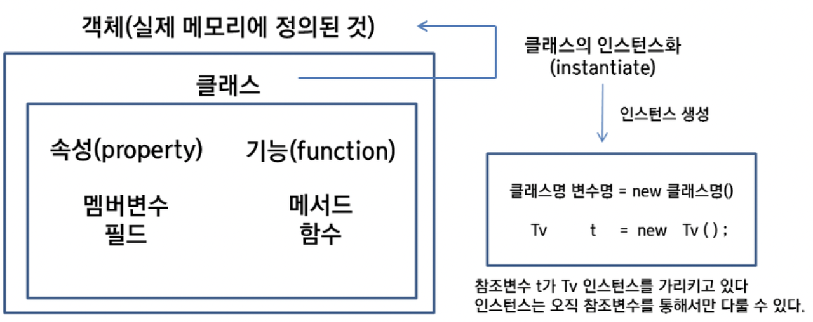
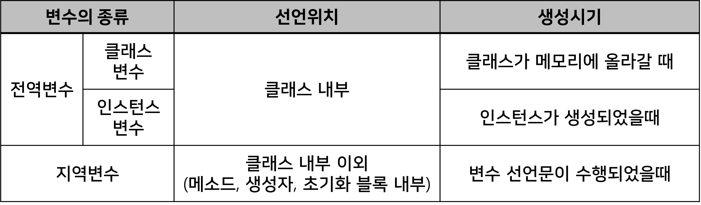
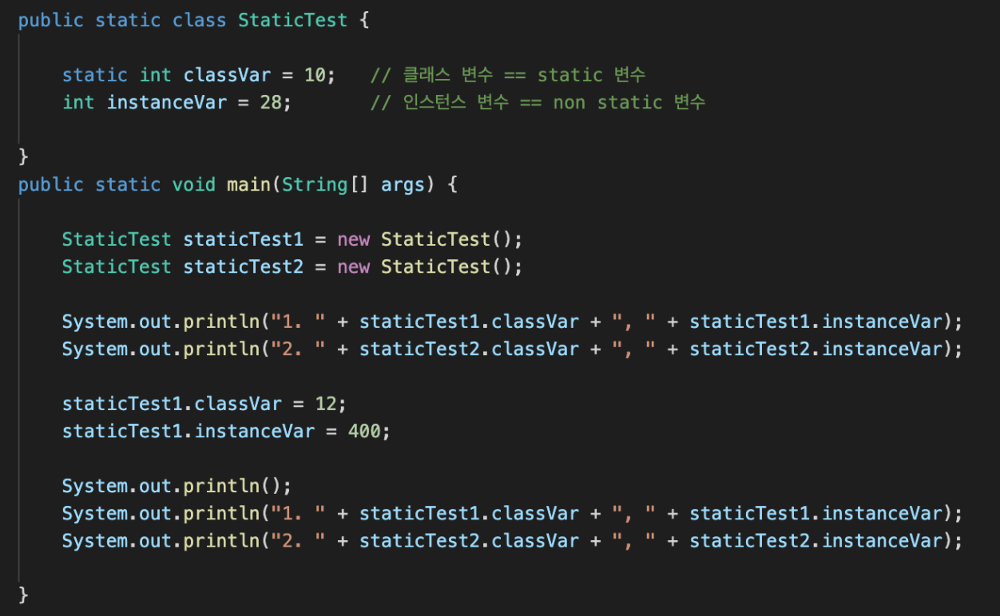
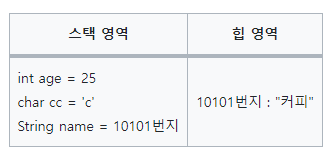

# 클래스/객체/인스턴스, static과 non-static, 원시타입/참조타입

# 1. 클래스 vs 객체 vs 인스턴스



## 1.a. 클래스 Class

객체를 만들어 내기 위한 설계도, 틀

연관되어 있는 변수와 메서드의 집합.

- 속성(필드,변수)와 동작(메서드)는 생략될 수도, 하나 이상 작성될 수도 있다.

- JVM메모리의 메소드 영역(=클래스 영역=static영역)에 로드
    - 메소드 영역은 클래스 정보, static변수, 변수 정보(데이터 타입, 접근 제어자), 메소드 정보(메소드 명, 리턴타입, 파라미터, 접근제어자), final class, constant pool 등이 저장되는 영역이다.
      
    - jvm이 동작해서 클래스가 로딩될때 생성되고 jvm이 종료될 때까지 유지된다.

## 1.b. 객체 Object

소프트웨어에서 구현할 대상

클래스에 선언된 모양 그대로 생성된 실체

- 클래스의 인스턴스(instance)라고도 부름.
- 객체는 모든 인스턴스를 대표하는 포괄적 의미를 갖는다.
- oop(객체지향프로그래밍)관점에서 클래스 타입으로 선언되었을때 ‘객체’라고 부름.

## 1.c. 인스턴스 Instance

설계도를 바탕으로 소프트웨어에서 구현된 구체적인 실체

- 객체를 소프트웨어에 실체화하면 그것을 인스턴스라고 한다.
- 실체화된 인스턴스는 메모리에 할당된다.
- 인스턴스는 객체에 포함되는 개념
- oop의 관점에서 객체가 메모리에 할당되어 실제 사용될 때 ‘인스턴스’라고 부른다.
- 클래스를 사용하여 힙영역에 새로운 인스턴스를 생성
- 추상적은 개념(또는 명세)과 구체적인 객체 사이의 관계에 초점을 맞출 경우 사용.
- 객체는 클래스의 인스턴스
- 객체 간 링크는 클래 간의 연간관계의 인스턴스
- 실행 프로세스는 프로그램의 인스턴스
- 어떤 원본(추상적 개념)으로 부터 생성된 복제본

## 1.d. 예시

```java
/* 클래스 */
public class Animal {
  ...
}
/* 객체와 인스턴스 */
public class Main {
  public static void main(String[] args) {
    Animal cat, dog; // '객체'

    // 인스턴스화
    cat = new Animal(); // cat은 Animal 클래스의 '인스턴스'(객체를 메모리에 할당)
    dog = new Animal(); // dog은 Animal 클래스의 '인스턴스'(객체를 메모리에 할당)
  }
}
```

## 1.e. 요약

### 클래스 vs 객체

- 클래스는 ‘설계도’, 객체는 ‘설계도로 구현한 모든 대상’을 의미한다.

### 객체 vs 인스턴스

- 클래스의 타입으로 선언되었을 때 객체라고 부르고, 그 객체가 메모리에 할당되어 실제 사용될 때 인스턴스라고 부른다.
- 객체는 현실 세계에 가깝고, 인스턴스는 소프트웨어 세계에 가깝다.
- 객체는 ‘실체’, 인스턴스는 ‘관계’에 초점을 맞춘다.
- 객체를 ‘클래스의 인스턴스’라고도 부른다.
- 객체 : 모든 인스턴스를 대표하는 포괄적 의미
- 인스턴스 : "어떤 클래스"로부터 만들어진 것인지를 강조하는 구체적 의미

---

## 2. Static 과 non-Static

java에서 static을 사용하는 것은 메모리에 한 번 할당되어 프로그램이 종료될 때 해제되는 것을 의미한다.

## 2.a. 클래스 변수 = static 멤버(변수)

- 클래스 내에서 static 키워드로 선언된 변수
- 처음 JVM이 실행되어 클래스가 메모리에 올라갈 때 ~ 프로그램이 종료될 때까지 유지(메소드 영역=클래스 영역=static 영역에 저장된다.)
- 클래스가 여러 번 생성되어도 static 변수는 처음 딱 한 번만 생성된다.
- 동일한 클래스의 모든 객체들에 의해 공유됨.
- 객체를 생성하지 않고 static 자원에 접근가능 (stack 메모리 영역에 존재하므로)

### ☑️ static 변수 사용시 주의점

- Static 변수는 모든 객체에서 공유되므로, 하나의 객체에서 값이 변경되면, 다른 객체에서도 변경된 값을 공유하게 됩니다. 따라서, 공유된 값이 예기치 않게 변경되는 상황을 방지하기 위해, 변경 가능한 데이터는 Static 변수보다는 인스턴스 변수로 선언하는 것이 좋습니다.
- java Static 변수는 클래스가 로딩될 때 초기화되므로, 다른 Static 변수의 값을 사용하려면, 해당 변수가 먼저 초기화되어 있어야 합니다.
- 그래서 전역변수 (=static 변수, 인스턴스 변수)를 초기화 안하면 자료형에 맞게 자동으로 값이 할당되게 된다.
    - 지역 변수는 초기화 안한 쓰레기 값이 들어있다.


## 2.b. 인스턴스 변수 = non-static 멤버(변수)

- 클래스 내에 ‘static’없이 선언된 변수
- 객체 생성 시마다 매번 새로운 변수가 생성됨
- 클래스변수(static멤버)와 달리 공유되지 않음.

### 전역변수, 지역변수와 클래스변수, 인스턴스 변수 차이 구분



- 선언위치에 따라 전역변수와 지역변수로 나눌 수 있다.
    - 전역변수 : 어디서든 호출이 가능함 (쉽게, method 밖에 있는 변수 객체 전체에서 사용가능함 변수)
    - 지역변수 : 특정구역{}안에서만 생성되어 그 구역 안에서만 사용할 수 있음.
- 전역변수를 2가지로 구분할 수 있음
    - 클래스 변수 : 인스턴스화 없이 사용가능
    - 인스턴스 변수 : 인스턴스화를 시켜야만 사용가능

```java
class Ex_variables{

int global_int;           // 전역변수(인스턴스 변수) : 같은 객체 내에서 호출 가능

static int global_statuc_int; // 전역변수(클래스변수) : 다른 객체 에서도 호출 가능

void method()

{

int local_int = 0;  //지역변수 { }안에 생성되며 { }를 벗어나면

}                //method() 라는 메소드가 끝나는 시점에 바로 삭제

}

```

## 2.c. static 멤버와 non-static 멤버 예시



```
// 출력 결과
1. 10, 28
2. 10, 28
  
1. 12, 400
2. 12, 28
```

- 클래스변수인 classVar는 처음 한 번만 생성되고 동일 객체를  staticTest1과2가 공유하기 때문에 양쪽이 동시에 바뀐다.
- instanceVar은 객체 생성시마다 새로 할당되어 staticTest1.instanceVar만 변경됨.

## static 메서드

객체의 생성 없이 호출이 가능한 메소드. 
객체 생성 후에도 호출가능 하지만 지양하는 것이 좋다.

> 이유 : 일단, static을 사용하는 것 자체가 객체 지향적 관점에서 좋은 방법이 아니다. 캡슐화 원칙에 위배되기 때문.
> 
> 그런데 굳이 static변수 만을 사용하는 static 메소드를 생성하는 것은 유틸리티 클래스(상태를 갖지않는 클래스-ex.java.lang.Math) 유용성 등의 이유 때문인데
> 
> 인스턴스 생성 후에도 사용할 것이라면, 애초에 static으로 선언하지 않는 게 바람직하다.
> 
> [참고 : 왜 자바에서 static의 사용을 지양해야 하는가?](https://unabated.tistory.com/1041)

- non-static 변수에 접근이 불가능하다.
- 일반적으로는 유틸리티 관련 함수들은 여러 번 사용되므로 static 메소드로 구현을 하는 것이 적합하다.
    - static 메소드를 사용하는 대표적인 Util Class로는 java.uitl.Math가 있다.

```java
public class Test {
    private String name1 = "MangKyu";
    private static String name2 = "MangKyu";
 
    public static void printMax(int x, int y) {
        System.out.println(Math.max(x, y)); // max함수를 초기화 없이 사용가
    }
         
    public static void printName(){
       // System.out.println(name1); 불가능한 호출 -> name1은 static이 아니니까
       System.out.println(name2);
    }
}
```

### ☑️ static 메서드를 사용할 때 주의할 점

- Static 메서드는 객체와 관련된 작업이 아닌, 클래스에서 공통으로 사용되는 작업을 수행할 때 사용합니다. 따라서, 객체의 상태를 변경하거나, 인스턴스 변수를 사용하는 작업은 Static 메서드에서 수행하지 않는 것이 좋습니다.
- Static 메서드는 다형성을 지원하지 않기 때문에, 오버라이딩할 수 없습니다.

### ☑️ 다형성

- 하나의 객체가 여러 가지 타입을 가질 수 있는 것.
- Static 메서드는 실행 시점에서 호출되는 메서드가 이미 결정되어 있으므로, 객체의 타입에 따라 동작이 달라지지 않는다.
- Non-Static 메서드는 실행 시점에서 객체의 타입에 따라 호출되는 메서드가 결정되므로, 객체의 타입에 따라 동작이 달라질 수 있다. (Non-Static 메서드는 다형성을 지원한다.)

## 요약

|  | static 멤버 | non-static 멤버 |
| --- | --- | --- |
| From | 클래스에 속하는 멤버 | 객체에 속하는 멤버 |
| 초기화 시점 | 클래스가 로딩될 때 초기화되며, 프로그램 종료까지 메모리에 유지 | 객체가 생성될 때 초기화되며, 객체가 삭제될 때까지 메모리에 유지 |
| 생성 타이밍 | 클래스를 로딩할 때 생성되며,클래스의 인스턴스를 생성하지 않고도 사용 O | 클래스의 인스턴스를 생성해야 사용 |
| Value | 클래스마다 공유되는 값 | 객체마다 다른 값 |
| 용도 | 유틸리티 메서드 등을 표현, 상수 값을 저장하는 데 사용 | 객체의 상태를 표현,객체 간의 관계를 나타내는 데 사용 |
| ex | 데이터베이스의 연결 정보나, 프로그램에서 공유해야 할 상수 값 | 학생 객체를 생성하면서 학생의 이름, 학번, 성적 등의 정보 |

|  | Static 메서드 | Non-Static 메서드 |
| --- | --- | --- |
| 호출 방법 | 객체를 생성하지 않고도 클래스 이름으로 직접 호출 | 객체를 생성한 후, 객체 이름을 사용하여 호출 |
| From | 클래스에 속하는 메서드 | 객체에 속하는 메서드 |
| 객체 상태에 대한접근 여부 | Static 메서드는 객체 상태에 접근 X | Non-Static 메서드는 객체의 상태에 접근 O |
| 객체 생성 여부 | 객체를 생성하지 않고도 호출할 수 있기 때문에, 객체 생성 전에도 호출 O | 메서드는 객체를 생성해야만 호출 O |
| 다형성 | 다형성X | 다형성O |
| 용도 | - 객체와 관계없는 작업을 수행- 객체를 생성하기 전에 사용해야 하는 작업을 수행할 때 사용 | 객체의 상태에 따라 동작하는 작업을 수행할 때 사용 |

---

# 3. 원시타입과 참조타입

## 3.a. 원시타입 Primitive Type

- 정수, 실수, 문자, 논리 리터럴 등의 **실제 데이터 값을 저장하는 타입**
- null 을 담을 수 없다.
- 제너릭 타입에서 사용할 수 없다. ## 다시조사

```java
int i = null ; //불가능
List<int> list ; // 불가능
```

| 종류 | 데이터형 | 크기(byte / bit) | 표현 범위 |
| --- | --- | --- | --- |
| 논리형 | boolean | 1 / 8 | true 또는 false |
| 문자형 | char | 2 / 16 | '\u0000' ~ 'uFFFF' (16비트 유니코드 문자 데이터) |
| 정수형 | byte | 1 / 8 | -128 ~ 127 |
| 정수형 | short | 2 / 16 | -32768 ~ 32767 |
| 정수형 | int | 4 / 32 | -2147483648 ~ 2147483647( -21억 ~ + 21억) |
| 정수형 | long | 8 / 64 | -9223372036854775808 ~ 9223372036854775807(-100경 ~ + 100경) |
| 실수형 | float | 4 / 32 | 1.4E-45 ~ 3.4028235E38 |
| 실수형 | double | 8 / 64 | 4.9E-324 ~ 1.7976931348623157E308 |

## 3.b. 참조타입 Reference Type

- 메모리 주소값을 통해 객체를 참조하는 타입.
- **원시 타입을 제외한 타입 모(문자열, 배열, 열거, 클래스, 인터페이스)**을 말한다.
- Integer, Double, Boolean …
- null 을 담을 수 있다.
- 제너릭 타입에서 사용할 수 있다.

```java
Integer integer  = null; //가능
List<Integer> list; //가능
```

- Java에서 **`실제 객체`는 `힙 영역`에 저장**되며 **`참조 타입 변수`는 `스택 영역`에 실제 객체들의 주소를 저장**하여, 객체를 사용할때 마다 **참조 변수에 저장된 객체의 주소를 불러와 사용하는 방식**이다.



## 3.c. Boxing, Unboxing

- Boxing : 원시타입을 참조타입으로 변환시키는 것
- Unboxing : 참조타입을 원시타입으로 변화시키는 것
- JDK 1.5 (=java 1.5)부터 auto boxking/unboxing이 추가되어 명시적으로 원시타입을 참조타임을 감싸주지 않아도 자동으로 boxing/unboxing해준다. (하지만 메모리 누수의 원인이 될 수 있음)

## 3.d. 원시타입 vs 참조타입 성능상 이점

### 1. 접근속도

**원시타입은 `'스택' 메모리`에 값이 존재한다.**

반면에 **참조타입은 하나의 인스턴스이기 때문에 `'스택' 메모리`에는 참조값만** 있고, **실제 값은 `힙 메모리`에 존재**한다.

그리고 **값을 필요로 할 때마다 언박싱 과정을 거쳐야 하니 원시타입과 비교해서 접근 속도가 느려지게 된다.**

(*예외적으로 엄청 큰 숫자를 복사해야 한다면, 참조값만 넘길 수 있는 참조타입이 좋을 수 도 있다.)*

### 2. 메모리 양

원시 타입보다 **참조 타입이 사용하는 메모리양이 압도적으로 높다.**

따라서 **메모리 사용적으로도 원시 타입이 참조 타입보다 효율적으로 사용**할 수 있다.

| 원시타입이 사용하는 메모리 | 참조타입이 사용하는 메모리 |
| --- | --- |
| boolean - 1bit | Boolean – 128 bits |
| byte - 8bits | Byte - 128bits |
| short, cagr - 16bits | Short, Charater - 128bits |
| int, float - 32bits | Integer, Float - 128bits |
| long, double - 64bits | Long, Double - 196bits |

---

# 면접질문

- 클래스, 객체, 인스턴스의 차이를 설명해보세요.
- **Java의 non-static 멤버와 static 멤버의 차이**
    - n**on-static멤버**는 **인스턴스멤버**라고 부르며 객체 생성시 heap영역에 생성되고 객체마다 별도로 존재합니다.
    - 객체 생성시에 생성되며 객체가 사라지게 되면 인스턴스 멤버도 사라지게 됩니다.
    - 인스턴스멤버는 객체 내에 각각의 공간을 유지하여 다른 객체와 공유되지 않습니다.
    - **static멤버**는 **클래스멤버**라고 부르며 객체 내부가 아닌 컴파일시 static영역에 생성됩니다.
    - 객체를 생성하지 않아도 이미 생성되어있기 때문에 객체 생성없이 사용이 가능하며 프로그램이 종료될 때 사라지게 됩니다.
    - 클래스멤버는 동일한 모든 클래스의 모든 객체들에 의해 공유됩니다.
    - static은 공통속성으로 사용되는 클래스변수에 붙이거나 인스턴스멤버를 사용하지 않는 메서드일 때 사용하게 됩니다. -> 인스턴스멤버는 객체를 생성해야 사용할 수 있으므로
- Java의 main 메서드가 static인 이유
    - **public static void main(String[] args){}의 의미**
    - main()메서드는 프로그램이 실행되는 시작과 끝이되는 지점입니다. JRE는 프로그램 안에 main()메서드가 있는지 확인한 후 main()메서드를 실행하게 됩니다. main()메서드가 끝나면 JRE는 JVM을 종료하고 JRE자체도 메모리에서 사라지게됩니다.
    - 이런 특성을 기반으로 선언문을 하나씩 뜯어보면
    - **public**: 어디에서나 접근이 가능해야합니다.
    - **static** : 프로그램 실행 순간에 메모리에 할당되어야 합니다. 가비지 컬렉터의 정리 대상이 되어서는 안되기 때문입니다.
    - **void** : main()메소드가 끝나게 되면 프로그램도 종료되므로 리턴값을 사용할 호출자가 없기 때문입니다.
    - **main()** : 관례적으로 프로그램의 시작점을 main으로 사용하고 있습니다.
    - **String[] args** : 프로그램 실행시에 첫 스레드인 main에게 데이터를 넘겨주고 싶을 때를 위한 파라미터입니다.
- 원시타입과 참조타입의 차이를 설명하라.
    - 성능 관점
        - 원시 타입은 스택 영역에 존재한다. 반면 참조 타입은 스택 영역에는 참조 값만 있고, 실제 값은 힙 영역에 존재한다. 참조 타입은 최소 2번 메모리 접근을 해야 하고, 일부 타입의 경우 값을 필요로 할 때 언박싱 과정(ex. Double → double, Integer → int)을 거쳐야 하므로 원시 타입과 비교해서 접근 속도가 느린 편이다.
    - 메모리 관점
        - 원시 타입보다 참조 타입이 사용하는 메모리 양이 압도적으로 높다. 이외의 참조 타입은 최근 들어 64 비트의 JVM을 많이 사용하므로 일반적으로 64 bits를 차지한다고 한다.
    - NULL 관점
        - 원시 타입은 null을 담을 수 없지만, 참조 타입은 null을 담을 수 있다. 이것은 원시 타입의 경우, 값이 없으면 디폴트 값을 반환하기 때문이다. (ex. int은 0, boolean은 false)
    - 제네릭 관점
        - 원시 타입은 제네릭 타입에서 사용할 수 없지만, 참조 타입은 가능하다.

# 출처

- [https://gmlwjd9405.github.io/2018/09/17/class-object-instance.html](https://gmlwjd9405.github.io/2018/09/17/class-object-instance.html)
- [https://velog.io/@dongvelop/Java-클래스-객체-인스턴스의-차이](https://velog.io/@dongvelop/Java-%ED%81%B4%EB%9E%98%EC%8A%A4-%EA%B0%9D%EC%B2%B4-%EC%9D%B8%EC%8A%A4%ED%84%B4%EC%8A%A4%EC%9D%98-%EC%B0%A8%EC%9D%B4)
- [https://whatisthenext.tistory.com/36](https://whatisthenext.tistory.com/36)
- [https://peonyf.tistory.com/entry/JAVA-Static과-NonStatic](https://peonyf.tistory.com/entry/JAVA-Static%EA%B3%BC-NonStatic)
- [https://velog.io/@gillog/원시타입-참조타입Primitive-Type-Reference-Type](https://velog.io/@gillog/%EC%9B%90%EC%8B%9C%ED%83%80%EC%9E%85-%EC%B0%B8%EC%A1%B0%ED%83%80%EC%9E%85Primitive-Type-Reference-Type)
- [https://steady-coding.tistory.com/606](https://steady-coding.tistory.com/606)
- [https://velog.io/@ka0ka0ka/1-3d8vtbh5](https://velog.io/@ka0ka0ka/1-3d8vtbh5)
- [https://sujinhope.github.io/2021/03/03/Java-클래스변수,-인스턴스-변수-차이(Static변수와-Non-Static변수).html](https://sujinhope.github.io/2021/03/03/Java-%ED%81%B4%EB%9E%98%EC%8A%A4%EB%B3%80%EC%88%98,-%EC%9D%B8%EC%8A%A4%ED%84%B4%EC%8A%A4-%EB%B3%80%EC%88%98-%EC%B0%A8%EC%9D%B4(Static%EB%B3%80%EC%88%98%EC%99%80-Non-Static%EB%B3%80%EC%88%98).html)
- [https://mangkyu.tistory.com/47](https://mangkyu.tistory.com/47)
- [https://velog.io/@rik963/JAVA-JVM-%EA%B5%AC%EC%A1%B0-%EB%B0%8F-%EB%A9%94%EB%AA%A8%EB%A6%AC-%EC%98%81%EC%97%AD-Class-Heap-Stack-Area](https://velog.io/@rik963/JAVA-JVM-%EA%B5%AC%EC%A1%B0-%EB%B0%8F-%EB%A9%94%EB%AA%A8%EB%A6%AC-%EC%98%81%EC%97%AD-Class-Heap-Stack-Area)
- [https://velog.io/@cyhse7/%EC%A7%80%EC%97%AD%EB%B3%80%EC%88%98-%EC%A0%84%EC%97%AD%EB%B3%80%EC%88%98](https://velog.io/@cyhse7/%EC%A7%80%EC%97%AD%EB%B3%80%EC%88%98-%EC%A0%84%EC%97%AD%EB%B3%80%EC%88%98)
- [https://java119.tistory.com/20](https://java119.tistory.com/20)
- [https://thaud153.tistory.com/68](https://thaud153.tistory.com/68)
- [https://dev-coco.tistory.com/175](https://dev-coco.tistory.com/175)
- [https://unabated.tistory.com/1041](https://unabated.tistory.com/1041)
