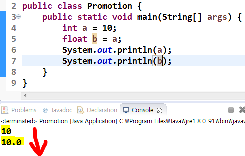
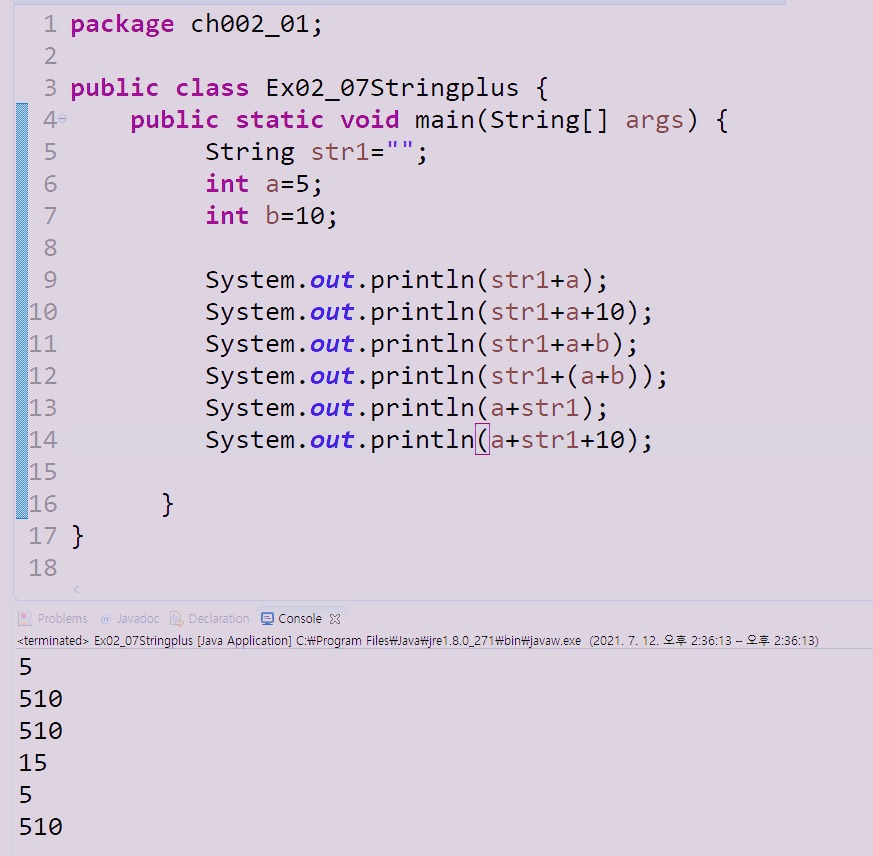
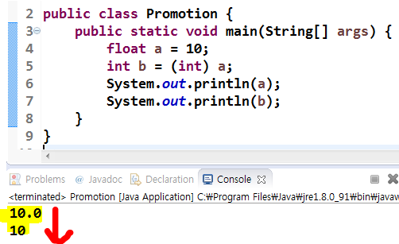

# 형 변환 Promotion, Casting

# 1. 프로모션(= 자동 형 변환, 업캐스팅)
Range가 더 작은 타입을 더 큰 타입에 대입할 때, 자동으로 큰 타입으로 변환되는 현상

- 크기(range)는 단순히 메모리 크기 뿐아니라 해당 자료형이 표현할 수 있는 숫자의 범위를 의미한다.
- [(원시타입의 메모리 크기와 표현 범위 살펴보기 click!)](https://github.com/psyStudy/CS_study/blob/main/Java/%ED%81%B4%EB%9E%98%EC%8A%A4%EC%99%80%20%EA%B0%9D%EC%B2%B4%20%EB%B0%8F%20%EC%9D%B8%EC%8A%A4%ED%84%B4%EC%8A%A4%2C%20static%2C%20%EC%9B%90%EC%8B%9C%ED%83%80%EC%9E%85%EA%B3%BC%20%EC%B0%B8%EC%A1%B0%ED%83%80%EC%9E%85.md)

```java
public class main{
    public static void main(String[] args){
        int a = 10;
        float b = a; //오류없이 자동으로 변환
        System.out.println(a);
        System.out.println(b);
    }
}
```



## 정수 연산에서 프로모션

- 피연산자 모두 int이하 range라면, 모두 int로 형변환 
- 피연산자 중 하나라도 long이 존재하면, 모두 long으로 형변환 <

-> 따라서, 특별한 이유가 없다면 변수를 int 또는 long으로 선언하는 것이 런타임 성능 향상에 도움된다.

## 실수 연산에서 프로모션

- 피연산자 타입이 모두 같으면 해당 타입으로 연산 그대로 진행
- 하나라도 double타입이면, 다른 피연산자 모두 double로 프로모션
- int와 double 연산 → double로 프로모션

## 문자열 연산에서 프로모션

- ‘+’연산에서 하나 이상의 피연산자가 String타입인 경우 다른 모든 피연산자도 String타입으로 프로모션 되고,
- ‘+’도 덧셈(1+1=2)이 아닌 접합(Concatenation;1+1+=11)연산으로 수행됨.



# 2. 캐스팅 Casting (= 명시적 형 변환, 다운캐스팅)
크기가 더 큰 타입을 더 작은 타입에 대입할 때, 타입을 명시하여 강제로 형변환 시키는 것.
→ 데이터 손실이나 변형이 발생할 수 있음

- ()를 이용한다.

```java
public class test{
	public static void main(String[] args){
		float a = 10;
		//int b = a; //오류가 발생한다.
		int b = (int) a; //명시적으로 알려줘야함.
	}
}
```



소수점 데이터가 손실되는 것을 확인할 수 있음.

# 클래스 타입의 형 변환 
프로모션과 캐스팅을 객체에서도 사용할 수 있다 = [업캐스팅과 다운캐스팅](https://github.com/psyStudy/CS_study/blob/main/Java/%EC%B6%94%EC%83%81%20%ED%81%B4%EB%9E%98%EC%8A%A4%EC%99%80%20%EC%9D%B8%ED%84%B0%ED%8E%98%EC%9D%B4%EC%8A%A4.md)

```java
class Person{
    String name;
    Person(String name){
        this.name = name;
    }
}

class Student extends Person{
    String check;
    Student(String name){
        super(name);
    }
}

public class Main{
    public static void main(String[] args){
        Student s1 = new Student("홍길동");
        Person p1 = s1;	  // 업캐스팅 
        p1.name = "이름이다.";

        Person p2 = new Student("홍길동");
        Student s2 = (Student)p2;   // 다운캐스팅 
        s2.name = "김유신";
    }
}
```

---

# 면접질문

- pass

# 출처

- [https://m.blog.naver.com/haejoon90/220781157092](https://m.blog.naver.com/haejoon90/220781157092)
- [https://dad-rock.tistory.com/1060](https://dad-rock.tistory.com/1060)
- [https://sf2020.tistory.com/38](https://sf2020.tistory.com/38)
