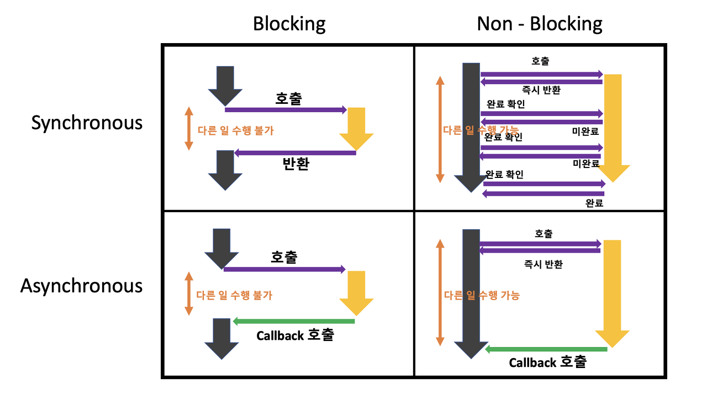
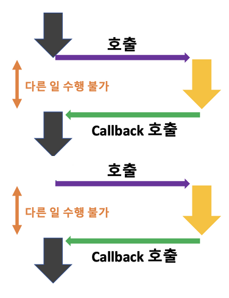

# Synchronous/Asynchronous, Blocking/Non-blocking

# 1. Synchronous / Asynchronous 동기와 비동기

syn : 함께 + chorono : 시간 = 작업을 함께 맞춰 실행한다.

**■ Synchronous 동기**

작업을 맞춰 실행한다 = 요청한 작업에 대해 완료 여부를 따져 순차대로 처리한다.

**■ Asynchronous 비동기**

요청한 작업에 대해 완료 여부를 따지지 않고 작업을 수행한다.


sync는 작업 B가 완료 되야 작업 A가 실행되고, async는 B의 작업 완료 여부와 관계없이 A의 작업이 수행됨.

## ♠ Sync와 Async의 작업 순서 차이

Sync는 요청 작업에 대한 완료 응답을 받아야 다음 작업 처리 = **작업 순서가 지켜짐**

Async는 응답이 필요 없음 = **작업의 순서가 지켜지지 않을 수 있다.**


Sync 방식은 A→B→C로 작업 순서가 지켜진다.


Async방식은 어떤 순서로 작업이 끝날 지 알 수 없다.

## ♠ Async의 성능 상 이점

완료 여부 신경 X = I/O와 같은 느린 작업 중 기다리지 않고 멀티태스킹을 진행할 수 있다.

→ 전반적인 시스템 성능 향상에 도움을 준다.


```
예시) 웹에서 DB 쿼리를 수행할 경우 sync로 처리하면?
DB에서 응답이 올 때까지 기다림 -> 다른 요청을 처리할 수 없음
-> 대규모 트래픽이 발생할 경우 웹 성능이 저하된다.
! async로 처리하면 응답을 기다리는 동안 다른 요청을 동시에 처리할 수 있다.
```

- 멀티태스킹, 동시처리 라는 개념은 두 개 이상이 동시에 실행되는 것을 의미하며, 멀티 스레드, 멀티 프로세싱 등으로 구현될 수 있다.

---

# 2. Blocking / Non-Blocking

다른 요청의 작업을 처리하기 위해 현재 작업을 block(차단,대기)할 수 있냐, 아니냐의 유무를 나타내는 프로세스 실행방식이다.

- 프로세스A가 실행중일 때 프로세스B의 요청이 들어오면,
    
    **Blocking :** A는 중단 및 대기하고 B가 완료된 후 다시 A를 실행한다.
    
    **Non-Blocking :**  A를 다 처리하지 않아도 B를 실행할 수 있다.
    


## ♠[참고] Callback 함수

비동기, 논블로킹에서 다른 작업의 완료여부 또는 결과에 대한 후처리를 위해 이용되는 방식

비동기, 논블로킹을 구현하는 하나의 기술. 

콜백이 비동기 또는 논블로킹을 구현하는 하나의 방법이고, 직접적인 관련은 없다.

```jsx
/* 콜백 함수 방식으로 구현한 비동기 + 논블로킹 서버 요청 작업 */

$.ajax({
  url: 'https://jsonplaceholder.typicode.com/todos/1', 
  type: 'GET', 
  dataType: 'json', 
  success: function(data) { // 요청이 성공하면 호출될 콜백 함수
    console.log(data); 
  },
  error: function(err) { // 요청이 실패하면 호출될 콜백 함수
    throw err;
  }
});

// 요청을 보내는 동시에 다른 작업을 수행할 수 있습니다.
console.log('Hello');
```

## ♠ Non-Blocking vs Async

> 💡 **이런 의문이 생기는 이유**
> 자바스크립트를 처음 배울 때 많은 서적이나 강의에서 setTimeout함수를 ‘비동기 함수’라고 지칭하고 외우기 때문
> → 이후 병렬 실행~ 비동기..? 라는 잘못된 개념이 형성되는 경우가 있음


**결론 : 엄연히 나타내는 의미는 다르지만, 관점에 따른 이론적 개념이라 실제 코드에서 경계를 구분하기에는 애매할 수 있다.**

- Async(와 sync)는 출력 순서와 관련된 개념이다.
- Non-Blocking(와 blocking)은 병렬 실행과 관련된 개념이다.
- 자바스크립트의 setTimeout 함수는 비동기 함수이면서, 논블로킹 함수이다.

```jsx
console.log("시작");

setTimeout(() => {
  console.log("1초 후에 실행됩니다!");
}, 1000);

console.log("끝");
```


1. 출력 순서와 정의된 코드라인 순서가 맞지 않음 = Async
    - 원인 : setTimeout 함수에 대해 타이머 작업을 완료 여부를 신경 쓰지 않고 바로 그 다음 콘솔 작업을 수행했기 때문.
2. 메인 함수 작업에 대해 setTimeout 함수는 자신의 타이머 작업을 수행하기 위해 메인 함수를 블락하지 않고 백그라운드에서 별도 처리 = Non-Blocking

### [참고]제어권

일부 책에서 blockingnon-blocking과 sync/async 개념을 구분하기 위해 제어권이라는 용어를 사용한다. 코드나 프로세스의 실행흐름을 제어할 수 있는 권리를 의미한다.

- 블로킹/논블로킹은 호출된 함수(callee)가 호출한 함수(caller)에게 제어권을 주느냐, 안주느냐로 구분되고, 제어권이 넘어가면 해당 스레드는 블로킹 된 것이다.


**Blocking**

1. A 함수가 B 함수를 호출하면 B에게 제어권이 넘어간다.
2. 제어권을 넘겨받은 B는 함수를 실행한다.
3. 이때 A는 B에게 제어권을 넘겨주었기 때문에 A 함수 실행을 잠시 멈춘다. (Block)
4. B 함수가 실행이 끝나면 자신을 호출한 A에게 제어권을 돌려준다.
5. 제어권을 다시 받은 A 함수는 그다음 작업을 실행한다.


**Non-Blocking**

1. A 함수가 B 함수를 호출한다.
2. 호출된 B 함수는 실행되지만, 제어권은 A 함수가 그대로 가지고 있는다.
3. A 함수는 계속 제어권을 가지고 있기 때문에 B 함수를 호출한 이후에도 자신의 코드를 계속 실행한다.

---

# [참고] 3. 두 개념 조합해서 사용하기

프로그래밍에 어떤 요소를 조합하느냐에 따라 성능과 효율성을 높일 수 있다.

1. Sync Blocking (동기 + 블로킹)
2. Async Blocking (비동기 + 블로킹)
3. Sync Non-Blocking (동기 + 논블로킹)
4. Async Non-Blocking (비동기 + 논블로킹)
    
    
    
    - 예1) node.js에서 비동기+논블로킹방식을 이용하면
        - 비동기 방식으로 파일을 읽거나 네트워크 요청을 보낼 때, 작업이 완료될 때까지 다른 작업을 수행할 수 있다.
    - 예2) node.js에서 동기+블로킹 방식을 이용하면
        - 코드 실행 시점을 늦춰주거나 순차적인 의존성이 있는 작업을 처리할 때 작업의 순서와 타이밍 제어에 도움이 된다.
    
    ## Sync+Blocking
    
    
    
    다른 작업이 진행되는 동안 자신의 작업을 처리하지 않고 (Blocking), 다른 작업의 완료 여부를 바로 받아 순차적으로 처리하는 (Sync) 방식.
    
    다른 작업의 결과가 자신의 작업에 영향을 주는 경우에 활용할 수 있다.
    
    - 일반적으로 작업이 간단하거나 작업량이 적은 경우에 사용
    - 작은 데이터를 처리하거나 파일 하나를 읽고 쓰는 경우에는 Sync Blocking 방식이 더 간단하고 직관적일 수 있음
    - 하지만 작업량이 많거나 시간이 오래 걸리는 작업을 처리해야 하는 경우 Async Non-Blocking 방식을 사용하여 작업을 처리하는 것이 좋다.
    - 사용 예) C나 JAVA의 코드 실행 후 커맨드에서 입력을 받는 경우
    
    ```jsx
    //파일을 읽고 내용을 처리하는 로
    const fs = require('fs'); // 파일 시스템 모듈 불러오기
    
    // 동기적으로 파일 읽기
    const data1 = fs.readFileSync('file1.txt', 'utf8'); // file1을 sync으로 read 함
    console.log(data1); // 파일 내용 출력하고 적절한 처리를 진행
    
    const data2 = fs.readFileSync('file2.txt', 'utf8'); 
    console.log(data2); 
    
    const data3 = fs.readFileSync('file3.txt', 'utf8'); 
    console.log(data3);
    ```
    
    
    

## Async + Non-Blocking


다른 작업이 진행되는 동안에도 자신의 작업을 처리하고 (Non Blocking), 다른 작업의 결과를 바로 처리하지 않아 작업 순서가 지켜지지 않는 (Async) 방식이다. 

다른 작업의 결과가 자신의 작업에 영향을 주지 않은 경우에 활용할 수 있다.

- 작업량이 많거나 시간이 오래 걸리는 작업을 처리해야 하는 경우에 적합
- 사용 예) 웹 브라우저의 파일 다운로드
    
    
    

```jsx
// 비동기적으로 파일 읽기
const fs = require('fs'); // 파일 시스템 모듈 불러오기

fs.readFile('file.txt', 'utf8', (err, data) => { // 파일 읽기 요청과 콜백 함수 전달
  if (err) throw err; // 에러 처리
  console.log(data); // 파일 내용 출력
});

fs.readFile('file2.txt', 'utf8', (err, data) => {
  if (err) throw err; 
  console.log(data);
});

fs.readFile('file3.txt', 'utf8', (err, data) => { 
  if (err) throw err; 
  console.log(data);
});

console.log('done'); // 작업 완료 메시지 출력
```


## Sync + Non-Blocking


다른 작업이 진행되는 동안에도 자신의 작업을 처리하고 (Non Blocking), 다른 작업의 결과를 바로 처리하여 작업을 순차대로 수행 하는 (Sync) 방식이다.

- 사용 예) 게임에서의 맵 이동 상황
    - 멥 데이터를 모두 다운로드하는 동안 화면에는 로딩 스크린(로딩바가 채워지는 프로그램)이 실행되고 있다.
    - 로딩바 프로그램은 제어권도 있고, 자신의 일을 수행하면서 끈임없이 다른 작업과의 동기를 위해 작업이 끝났는지 조회하고 있다.


## Async + Blocking



다른 작업이 진행되는 동안 자신의 작업을 멈추고 기다리는 (Blocking), 다른 작업의 결과를 바로 처리하지 않아 순서대로 작업을 수행하지 않는 (Async) 방식이다.

- Async-blocking 의 경우는 실무에서 잘 마주하기 쉽지 않아 다룰일이 거의 없다. 그래서 그냥 넘어가도 크게 문제는 없다.
- sync-blocking과 수행그림과 차이가 없어보이고, 실제로도 성능적 차이가 미미하다.
- 개발자가 async-nonblocking으로 처리하려다 실수하는 경우 또는 자기도 모르게 블로킹 작업을 실행하는 의도치 않은 경우 사용된다….
- 사용 예) node.js + mySQL조합 사용시
    - node.js는 비동기로 DB에 접근하므로 Async지만
    - MySQL DB에 접근하기 위한 MySQL 드라이버가 블로킹으로 작동된다.
    - 하지만 결국 혼동을 일으킬 수 있으므로 보통 실무에서는 node.js 서버 프로그램시 asysnc/await으로 동기처리를 한다.


---

# 면접질문

- JS에서 블로킹/넌블로킹 과 sync/async의 차이에 대해 설명하세요
    
    Blocking/Non-Blocking은 프로세스의 제어권과 관련된 개념이고, sync/async는 작업 완료 여부에 대한 개념입니다.
    
    blocking은 특정 작업이 실행될 때, 제어권을 함께 넘겨주며 작업이 끝나야 제어권을 돌려받고, Non-Blocking은 특정 작업에게 실행 명령만 내리고, 제어권은 곧바로 다시 돌려받습니다.
    
    sync는 순차적으로 작업을 수행하기 때문에, 특정 작업이 완료될 때까지 대기하며 결과를 받은 뒤에 다음 작업을 수행합니다. 반면, async는 특정 작업의 완료 여부와 상관없이 다음 작업을 수행하며, 완료 순서가 보장되지 않습니다.
    

# 출처

- [https://inpa.tistory.com/entry/👩‍💻-동기비동기-블로킹논블로킹-개념-정리](https://inpa.tistory.com/entry/%F0%9F%91%A9%E2%80%8D%F0%9F%92%BB-%EB%8F%99%EA%B8%B0%EB%B9%84%EB%8F%99%EA%B8%B0-%EB%B8%94%EB%A1%9C%ED%82%B9%EB%85%BC%EB%B8%94%EB%A1%9C%ED%82%B9-%EA%B0%9C%EB%85%90-%EC%A0%95%EB%A6%AC)
- [https://youngkyonyou.github.io/interview/2021/12/23/Interview-interview-07.html](https://youngkyonyou.github.io/interview/2021/12/23/Interview-interview-07.html)
