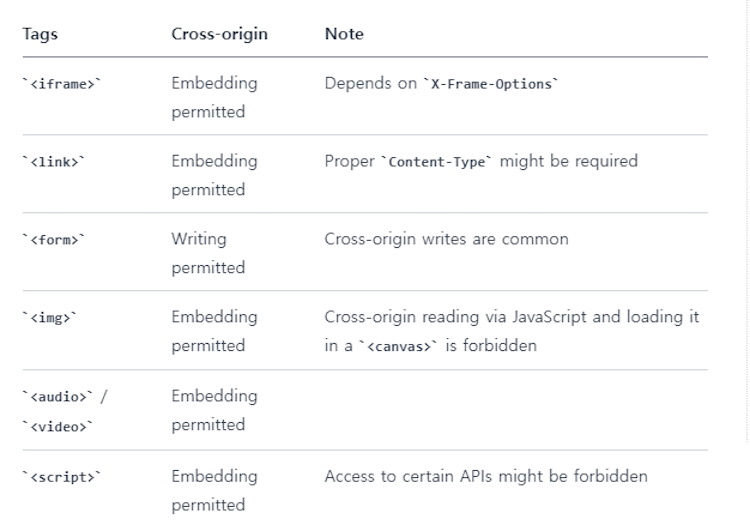
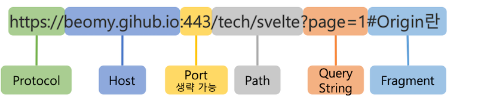
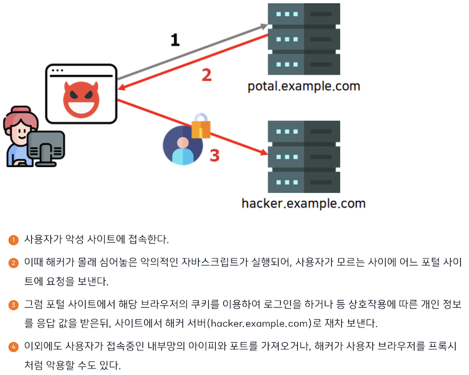
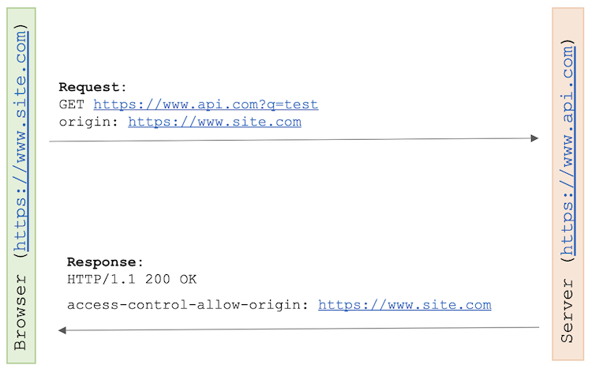
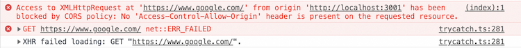
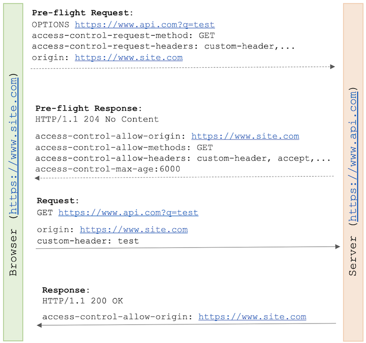
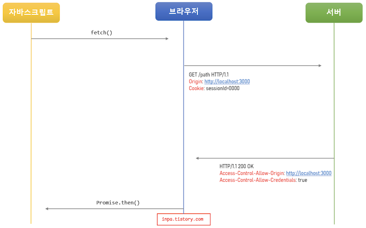

# CORS
## SOP(Same Origin Policy, 동일 출처 정책)이란
동일 출처 간의 요청과 응답만 허용하는 정책

- 다른 출처로부터 조회된 자원들의 읽기 접근을 막아 다른 출처 공격을 예방함
- 단, HTML 태그를 경유하는 글꼴, 이미지, CSS, 스크립트 등 출처를 경유하여 리소스를 임베드하는 것은 제한하지 않음



<br></br>
### 출처란



위의 URL 구성요소 중에서 **Protocol + Host + Port** 3가지가 같으면 동일 출처라고 한다!

```sql
http://Example.com:80
http://example.com
-> ⭕️호스트는 대소문자를 구분하지 않음, 기본 포트 80이 생략되어 있으므로 동일 출처

http://example.com/app1
https://example.com/app2
-> ❌프로토콜이 다르므로 다른 출처
```

<br></br>
### 다른 출처 요청의 위험성
출처가 다른 애플리케이션에 자유롭게 접근할 수 있다면, 해커가 CSRF(Cross-Site Request Forgery)나 XSS(Cross-Site Scripting) 등의 방법을 이용해 악성 코드를 실행시킬 수 있음



<br></br>

## CORS(Cross-Origin Resource Sharing, 교차 출처 리소스 공유)란
추가 HTTP 헤더를 사용하여, 한 출처에서 실행 중인 웹 애플리케이션이 **다른 출처의 선택된 자원에 접근할 수 있는 권한을 부여하도록** 브라우저에 알려주는 메커니즘

- 서로 다른 출처 간 요청과 응답이 가능하게 함
- 웹 애플리케이션은 리소스가 자신의 출처(도메인, 프로토콜, 포트)와 다를 때 CORS HTTP 요청을 실행함
- CORS 요청 방식 종류로는 Simple Request, Preflighted Request, Credential Request이 있음

<br></br>
### Simple Request (단순 요청)



1. **조건**

다음 조건을 만족하면, 브라우저는 해당 CORS 요청을 Simple Request로 처리함

- HTTP Method가 GET, POST, HEAD 중 하나인 경우
- Content-Type 헤더가 다음 중 하나인 경우
    - application/x-www-form-urlencoded
    - multipart/form-data
    - text/plain
- CORS-safelisted request-header를 포함하는 경우(Fetch spec)
- XMLHttpRequest.upload 에 이벤트 핸들러, 리스너가 등록되지 않은 경우
- ReadableStream 객체가 포함되지 않은 경우
<br></br>
2. **동작방식**
- 1) 사용자가 요청 헤더에 자신의 Origin을 실어서 서버로 요청을 보냄
- 2) 서버는 요청 헤더의 Origin을 확인함
- 3) CORS 요청이 유효하다면, 서버는 응답 헤더에 Access-Control-Allow-Origin 헤더를 추가해 사용자에게 다시 전송함
- 4) 유효하지 않다면, 브라우저는 응답을 차단함
    
    
    
<br></br>
조건이 까다롭기 때문에, 위 조건을 모두 만족되어 단순 요청이 일어나는 상황은 드물다!
→ 대부분 HTTP API 요청은 text/xml 이나 application/json 으로 통신하기 때문에 Content-Type 조건이 위반되기 때문

<br></br>

### Preflighted Request (프리 플라이트)



- Preflight Request는 Simple Request의 조건을 만족하지 못할 시 브라우저가 자동으로 생성함
- 클라이언트가 OPTIONS 메서드로 HTTP 요청을 미리 보내, 서버가 실제 요청이 전송하기에 안전한지 확인함
- 브라우저는 보낸 프리플라이트 요청과 서버가 응답해준 정책을 비교하여, 해당 요청이 안전한지 확인하고 본 요청을 보내게 됨
- 실제 요청에 걸리는 시간이 늘어나게 되어 애플리케이션 성능에 영향을 미치는 단점이 있음

```sql
요청 헤더
- access-control-request-method: 실제 요청이 보낼 HTTP 메서드
- access-control-request-headers: 실제 요청에 포함된 header

응답 헤더
access-control-allow-origin: 서버가 허용하는 출처
access-control-allow-methods: 서버가 허용하는 HTTP 메서드 리스트
access-control-allow-headers: 서버가 허용하는 header 리스트
access-control-max-age: 프리 플라이트 요청의 응답을 캐시에 저장하는 시간
```

<br></br>
### Credential Request (인증된 요청)



- 인증된 요청은 클라이언트에서 서버에게 자격 인증 정보(Credential)를 실어 요청할때 사용되는 요청
- 자격 인증 정보란 세션 ID가 저장되어있는 쿠키 혹은 Authorization 헤더에 설정하는 토큰 값 등을 말함
  
<br></br>
기본적으로 브라우저가 제공하는 요청 API 들은 별도의 옵션 없이 브라우저의 쿠키와 같은 인증과 관련된 데이터를 함부로 요청 데이터에 담지 않도록 되어 있음

- 이때 요청에 인증과 관련된 정보를 담을 수 있게 해주는 옵션이 바로 credentials 옵션
- 서버에 인증된 요청을 보내는 방법으로는 fetch 메소드, axios 라이브러리, jQuery 라이브러리 등을 사용하는 것

```jsx
// fetch 메서드
fetch("https://example.com:1234/users/login", {
	method: "POST",
	credentials: "include",  // credentials 옵션
    body: JSON.stringify({
        userId: 1,
    }),
})
```
```jsx
// axios 라이브러리
axios.post('https://example.com:1234/users/login', { 
    profile: { username: username, password: password } 
}, { 
	withCredentials: true  // credentials 옵션
})
```
```jsx
// jQuery 라이브러리
$.ajax({
	url: "https://example.com:1234/users/login",
	type: "POST",
	contentType: "application/json; charset=utf-8",
	dataType: "json",		
	xhrFields: { 
    	withCredentials: true  // credentials 옵션
    },
	success: function (retval, textStatus) {
		console.log( JSON.stringify(retval));
	}
});
```

<br></br>
<br></br>

### 면접질문
1. CORS란 무엇이며 이것에 대해서 설명해보세요 → 꼬리질문     
⭐️⭐️ 실제 면접장에서 질문 받았다는 사람들이 많음!!!!!

<br></br>
### 출처
[https://ko.wikipedia.org/wiki/동일-출처_정책](https://ko.wikipedia.org/wiki/%EB%8F%99%EC%9D%BC-%EC%B6%9C%EC%B2%98_%EC%A0%95%EC%B1%85)     
[https://escapefromcoding.tistory.com/724](https://escapefromcoding.tistory.com/724)     
[https://inpa.tistory.com/entry/WEB-📚-CORS-💯-정리-해결-방법-👏#📜_동일_출처_정책이_필요한_이유](https://inpa.tistory.com/entry/WEB-%F0%9F%93%9A-CORS-%F0%9F%92%AF-%EC%A0%95%EB%A6%AC-%ED%95%B4%EA%B2%B0-%EB%B0%A9%EB%B2%95-%F0%9F%91%8F#%F0%9F%93%9C_%EB%8F%99%EC%9D%BC_%EC%B6%9C%EC%B2%98_%EC%A0%95%EC%B1%85%EC%9D%B4_%ED%95%84%EC%9A%94%ED%95%9C_%EC%9D%B4%EC%9C%A0)     
[https://yoo11052.tistory.com/139](https://yoo11052.tistory.com/139)
