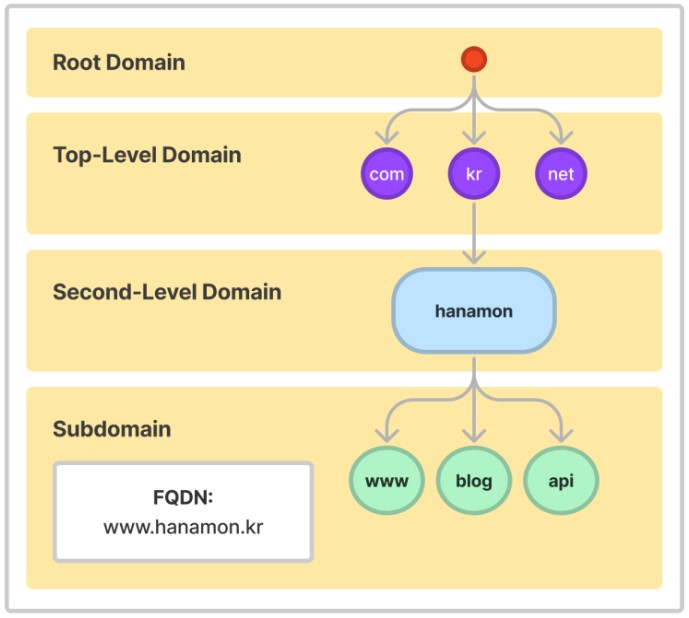
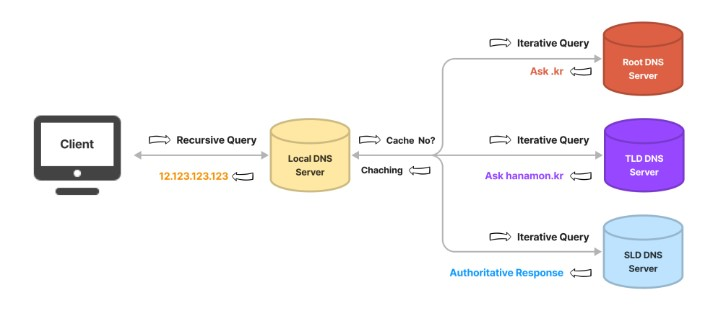
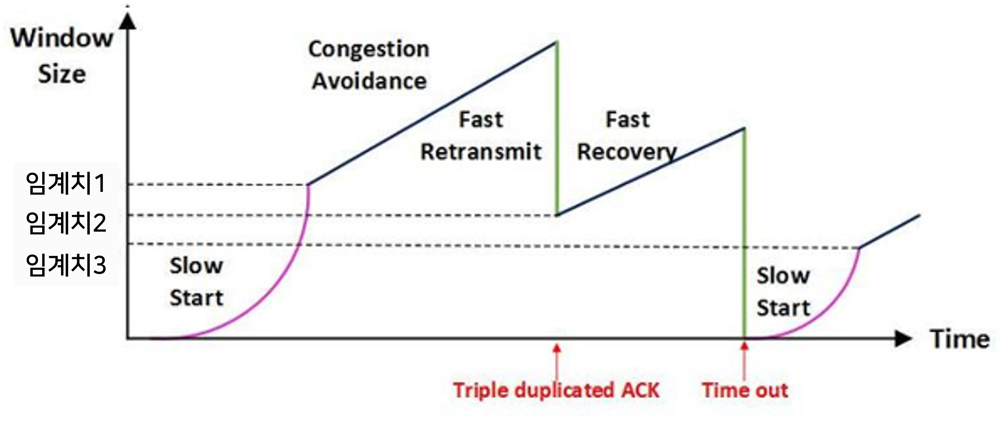

# DNS / TCP 혼잡제어,흐름제어

상태: 이슈 내용 업데이트하기
생성 일시: 2023년 8월 21일 오전 1:01
최종 편집 일시: 2023년 8월 27일 오후 4:59

# 1. DNS

Domain Name System.

사람이 읽는 도메인 이름([www.](www.amazon.com)amazon.com)을 컴퓨터가 읽는 IP주소(192.0.2.44.)으로 변환해주는 시스템.

- IP주소 및 기타 데이터를 저장하고 이름별로 쿼리할 수 있게 해주는 계층형 분산 DB
    - **분산 DB** : 논리적으로 동일한 시스템에 속하지만, 컴퓨터 네트워크를 통해 물리적으로 분산되어 있는 데이터 들의 모임.
    - DB를 연결하는 빠른 네트워크 환경을 이용하여 DB를 여러 지역 여러 노드로 위치시켜 사용성/성능 등을 극대화 시킨 데이터 베이스
- 전화번호부 같은 역할

## 1.1. DNS 서비스 유형

DNS 서버는 도메인 이름의 데이터베이스를 저장하고 네트워크의 클라이언트에서 오는 DNS쿼리를 기반으로 도메인 이름을 처리한다.

### 신뢰할 수 있는 DNS = 권한 서버 = Name Server

개발자가 퍼블릭 DNS 이름을 관리하는 데 사용하는 업데이트 매커니즘을 제공

이를 통해 DNS는 DNS쿼리에 응답하고 도메인이름을 IP주소로 변환한다.

도메인에게 최종 권한이 있으며 재귀적 DNS 서버에 IP주소가 담긴 답을 제공할 책임이 있다.

- A, AAAA, CNAME 등의 DNS 이름 레코드를 보유하는 서버
    
    **레코드**
    
    - DNS 리소스와 도메인 이름 간의 매핑.
    - 각 개별 DNS 레코드에는 유형(이름 및 번호), 만료 시간(수명), 유형별 데이터가 있다.
    
    ```
    A : 호스트 이름을 IPv4 주소에 매핑하는 레코드
    AAAA: 호스트 이름을 IPv6 주소에 매핑하는 IPv6 주소 레코드
    CNAME: 별칭 이름을 지정하는 표준 이름 레코드
    MX: 요청을 메일 서버로 라우팅하는 데 사용되는 메일 교환 레코드
    NS: 권한 서버에 DNS 영역을 위임하는 네임서버 레코드
    PTR: IP 주소와 연결된 이름을 정의하는 포인터 레코드
    SOA: 권한 시작(Start Of Authority)을 나타내며, 기본 네임서버와 영역을 담당하는 관리자를 지정하는 데 사용됩니다. DNS 서버에서 호스팅되는 각 영역에는 SOA(권한 시작) 레코드가 있어야 합니다. 필요에 따라 레코드를 수정할 수 있습니다(예: 날짜 기반 버전 관리를 지원하기 위해 일련번호를 임의의 숫자로 변경 가능).
    ```
    

### 재귀적 DNS  = (재귀) Resolver = ISP의 로컬 서버 = Recursor

대게 Client는 신뢰할 수 있는 DNS에 직접 쿼리를 수행하는 것 대신 resolver(재귀적 DNS)에 연결하는 경우가 일반적이다.

DNS레코드를 소유하고 있지 않지만 사용자를 대신하여 DNS정보를 가져올 수 있는 중간자의 역할을 한다.

재귀적 DNS가 일정기간 캐시된(저장된) DNS 참조를 가지고 있는 경우, 소스나 IP정보를 제공하여 DNS 쿼리에 답을 한다.

또는 해당 정보를 찾기 위해 쿼리를 하나 이상의 신뢰할 수 있는 DNS 서버에 전달한다.

- 예를 들어 `google.com.`이라는 이름을 확인할 때 재귀 리졸버는 `.`에 대한 권한이 누구에게 있는지 먼저 확인해야 합니다(DNS의 루트 영역). 그런 후 `.com.` 권한이 누구에게 있는지 네임서버에 묻습니다. 마지막으로 `google.com.`에 대한 권한이 누구에게 있는지 네임서버에 묻습니다. 그런 후 A 레코드에 대한 rdata가 클라이언트에 반환됩니다.

## 1.2. Domain Name Space 도메인 네임 스페이스



- DNS는 전세계적인 거대한 분산 시스템이다.
- 도메인 네임 스페이스는 이러한 DNS가 저장 관리하는 계층적 구조를 의미한다.
- 도메인 네임 스페이스는 최상위에 루트 DNS 서버가 존재하고 그 하위로 연결된 모든 노드가 연속해서 이어진 계층 구조로 되어있다. (폴더 구조와 비슷하다.)

## 1.3. DNS 동작 방식 (아이디어 이해)

[[참고] 웹에 google.com을 치면 일어나는 일 (click!)](https://github.com/psyStudy/CS_study/blob/main/Network/%EC%9B%B9%EC%97%90google.com%EC%9D%84%EC%B9%98%EB%A9%B4.md)

1. 웹 브라우저는 해결사(recursor/resolver) 서버에게 요청한다.
    ◦ “www.hanamon.kr의 IP 주소를 알려주세요.
2. ”해결사 서버는 최상위 기관에서 관리하는 네임 서버에게 요청한다.
    ◦ ”.kr 이라는 도메인 있나요?”
3. 최상위 기관에서 관리하는 네임 서버는 응답한다.
    ◦ “.kr 한국 국가 도메인 입니다. .kr 네임 서버로 가보세요~”
4. 해결사 서버는 이제는 .kr 네임 서버에게 요청한다.
    ◦ “[hanamon.kr](https://hanamon.kr/) 있나요?”
5. .kr 네임 서버는 응답한다.
    ◦ “네 가비아로 가세요~”
    ◦ (”[hakunamatata.kr](http://hakunamatata.kr/) 있나요?” 라고 물어봐도 “네 가비아로 가세요~”라고 응답한다.)
6. 해결사 서버는 가비아 네임 서버에게 요청한다.
    ◦ “[www.hanamon.kr](http://www.hanamon.kr/) 있나요?”
7. 가비아 네임 서버는 응답한다.
    ◦ 네 12.345.678.900 으로 가세요!”
8. 해결사(re) 서버는 웹 브라우저에게 알려준다.
    ◦ 네 12.345.678.900 으로 가세요!”

## 1.4. DNS 동작 과정 전체



### DNS Query

- DNS 클라이언트와 DNS 서버는 DNS 쿼리를 교환한다.
- DNS 쿼리는 Recursive(재귀적) 또는 Iterative(반복적)으로 구분된다.

### Recursive Query 재귀적 쿼리(질의)

- 결과물(IP 주소)를 돌려주는 작업이다. (결과적으로 Recursive 서버가 Recursive 쿼리를 웹 브라우저 등에게 돌려주는 역할을 한다.)
- Recursive 쿼리를 받은 Recursive 서버는 Iterative 하게 권한 있는 네임 서버로 Iterative 쿼리를 보내서 결과적으로 IP 주소를 찾게 되고 해당 결과물을 응답한다.

### Iterative Query 반복적 쿼리

- Recursive DNS 서버가 다른 DNS 서버에게 쿼리를 보내어 응답을 요청하는 작업이다.
- Recursive 서버가 권한 있는 네임 서버들에게 반복적으로 쿼리를 보내서 결과물(IP 주소)를 알아낸다.
- Recursive 서버에 이미 IP 주소가 캐시 되어있다면 이 과정은 건너 뛴다.

### 예시

1. 웹 브라우저에 www.hanamon.kr을 입력한다.
2. 웹 브라우저는 이전에 방문한적 있는지 찾는다.
    - 브라우저 캐시 확인
    - OS 캐시 확인
    - 라우터 캐시 확인
    - ISP 캐시 확인 (Recursive DNS Server)
3. ISP에서 DNS Iterative하게 쿼리를 날린다.
4. ISP는 Authoritative DNS 서버(권한있는 서버, 네임서버, 신뢰할 수 있는 서버)에서 최종적으로 IP 주소를 응답받는다.
5. ISP는 해당 IP 주소를 캐시한다.
6. 웹 브라우저에게 응답한다.

---

# 2. TCP 흐름 제어 / 혼잡 제어

[[참고] TCP (click!)](https://github.com/psyStudy/CS_study/blob/main/Network/TCPandUDP.md)

### 공통점

송신자의 전송 속도를 제어함으로써 데이터 전송 속도를 제어함으로써 오류를 줄이는 기능

### 차이점

흐름제어는 송-수신 측 사이에 패킷 수를 제어하는 기능

혼잡제어는 네트워크 내의 패킷 수를 조절하는 기능

## 2.1. 흐름 제어 Flow control

송신측과 수신측 사이의 데이터 속도 차이를 해결하기 위한 기법

수신측이 패킷을 지나치게 많이 받지 않도록 조절하는 것

송신측 전송량이 수신측 수신량보다 클 경우 전송된 패킷은 수신측의 큐를 넘어 손실 될 수 있기 때문에 송신측의 패킷 전송량을 제어해야한다.

### 2.1.1. Stop and Wait


- **매번 전송한 패킷에 대한 응답을 받아야 그 다음 패킷을 전송할 수 있다.**
- 확인 응답을 받기 때문에 비효율적
- Give & Take 방식

### 2.1.2. Sliding Window (Go Back N ARQ)

- **수신측에서 설정한 윈도우 크기 만큼 송신측에서 확인 응답 없이 세그먼트를 전송할 수 있게 하여 데이터 흐름을 동적으로 조절하는 기법.**
    - **윈도우** : 송신, 수신 스테이션 양쪽에서 만들어진 버퍼의 크기
    - 윈도우 크기 결정 : 수신 측 원도우와 혼잡 윈도우 크기 중 작은 것
    
    ```
    - 송신 윈도우 : 수신측의 확인 응답 없이, 한 번에 전달 할 수 있는 바이트 사이즈
    - 수신 윈도우 : 수신측에서 수신할 수 있는 바이트 사이즈(수신 버퍼에 저장할 수 있는 바이트 사이즈)
    윈도우 크기는 "윈도우 알고리즘 + 송신 윈도우 변수 + 수신 윈도우 변수 + 혼잡 윈도우 변수"에 의해 결정된다.
    
    - rwnd(Receive Window) - 수신 윈도우 변수 (수신측 흐름 제어와 관련된 변수이다, rwnd = buffer size - number of wating bytes to be pulled)
    - cwnd(Congestion Window) - 혼잡 윈도우 변수 (본문 아래의 설명하겠지만 혼잡 제어와 관련된 변수이다)
    - awnd(Acutal Window) - 실제 계산되고 전송 가능한 송신 윈도우 변수 (awnd = minimum(rwnd, cwnd))
    awnd = minimum(rwnd, cwnd)
    
    [출처] https://roka88.dev/114
    ```
    
- Stop and Wait의 비효율성을 개선한 기법이다.
- 송신측에서는 Ack 프레임을 수신하지 않더라도 여러 개의 프레임을 연속적으로 전송할 수 있다.
    
    
    

```
- 송신측에서 0,1,2,3,4,5,6을 보낼 수 잇는 프레임을 가지고 있고, 0,1을 보냄
- 슬라이딩 윈도우 구조는 2,3,4,5,6으로 변함
- 수신측에서 ACK프레임을 받으면 송신측은 수신측이 0,1을 정상적으로 받았음을 알게되고
송신측의 슬라이딩 윈도우는 ACK프레임에 따른 프레임 수만큼 오른쪽으로 경계 확장
```

## 2.2. 혼잡 제어 Congestion control

송신측의 데이터 전달과 네트워크의 데이터 처리 속도 차이를 해결하기 위한 기법

- 흐름제어가 송신측과 수신측 사이의 전송속도를 다루는데 반해, 혼잡제어는 호스트와 라우터를포함한 보다 넓은 관점에서 전송 문제를 다루게 된다.
- 송신측의 데이터는 지역망이나 인터넷으로 연결된 대형 네트워크를 통해 전달된다.
- 만약 한 라우터에 데이터가 몰릴 경우, 자신에게 온 데이터를 모두 처리할 수 없게 된다.
- 이런 경우 호스트들은 또 다시 재전송을 하게되고 결국 혼잡만 가중시켜 오버플로우나 데이터 손신을 발생시키게 된다.
- 따라서 이러한 **네트워크의 혼잡을 피하기 위해 송신측에서 보내는 데이터의 전송속도를 강제로 줄이게 되는데, 이러한 작업을 혼잡제어**라고 한다.

### 혼잡제어 시나리오

- 기본적으로 AIMD와 SlowStart를 적절히 섞어서 사용하고, 각 임계치를 넘으면 다른 방식들을 사용하게 된다.
- 임계치1까지만 Slow start를 사용한다.
- 임계치1을 지나면, 혼잡으로 간주하고 혼잡회피를 사용한다.
    - cwnd 가 선형적으로 증가하여 혼잡 예방(slow start 보다 느리게 증가하니까)
- 혼잡회피를 사용하다가 Triple Duplicated ACK 가 발생하면, 빠른 재전송을 사용
    - **Triple Duplicated ACK :** 즉, 송신측이 3번 이상 중복된 승인 번호를 받은 상황 또는 정상적으로 데이터가 전송된 상황이 아님 = 패킷 손실
    - 따라서 이 경우 Time out이 안되었어도 빠른 재전송을 해줘야함!
    - 빠른 재전송 기법을 사용하지 않으면 Timeout이후 재전송한다.
- 빠른 회복 : 빠른 재전송 이후 혼잡회피 상태에서 계속해서 데이터를 전송한다.
    - 여러 패킷 손실 시 패킷 하나씩 복구 되므로 모든 패킷 ACk수신까지 대기한다.
- 모두 복구 되거나 Timeout이 발생하면 Slow Start로 다시 전환.
    - Time out : 여러가지 요인으로 송신 측이 보낸 데이터 자체가 유실되거나, 수신 측이 응답으로 보낸 ACK가 유실되는 경우.
        - 패킷이 Time out 시점까지 도착하지 않으면  실패로 간주 -> 다시 처음부터 전송
        - → 이 경우 패킷을 다시 전송해야함 = Slow Start
    
    
    

### 2.2.⭐. AIMD (Additive Increse, Multiplicative Decrease)

- 처음에 패킷을 하나씩 보내고 이것이 문제없이 도착하면 window 크기(단위 시간 내에 보내는 패킷의 수)를 1씩 증가시켜가며 전송하는 방법
- 패킷 전송에 실패하거나 일정 시간을 넘으면 패킷의 보내는 속도를 절반으로 줄인다.
- 공평한 방식으로, 여러 호스트가 한 네트워크를 공유하고 있으면 나중에 진입하는 쪽이 처음에는 불리하지만, 시간이 흐르면 평형상태로 수렴하게 되는 특징이 있다.
- 문제는, 초기에 네트워크의 높은 대역폭을 사용하지 못하여 오랜 시간이 걸리게 되고, 네트워크가 혼잡해지는 상황을 미리 감지하지 못한다.
- 즉, 네트워크가 혼잡해지고 나서야 대역폭을 줄이는 방식이다.

### 2.2.1. Slow Start (느린 시작)

- AIMD 방식이 네트워크의 수용량 주변에서는 효율적으로 작동하지만, 처음에 전송 속도를 올리는데 시간이 오래 걸리는 단점이 존재했다.
- Slow Start 방식은 AIMD와 마찬가지로 패킷을 하나씩 보내면서 시작하고, 패킷이 문제없이 도착하면 각각의 ACK 패킷마다 window size를 1씩 늘려준다.
    - 즉, 한 주기가 지나면 window size가 2배로 된다.
- 전송속도는 AIMD에 반해 지수 함수 꼴로 증가한다. 대신에 혼잡 현상이 발생하면 window size를 1로 떨어뜨리게 된다.
- 처음에는 네트워크의 수용량을 예상할 수 있는 정보가 없지만, **한번 혼잡 현상이 발생하고 나면 네트워크의 수용량을 어느 정도 예상할 수 있다.**
- 그러므로 혼잡 현상이 발생하였던 window size의 절반까지는 이전처럼 지수 함수 꼴로 창 크기를 증가시키고 그 이후부터는 완만하게 1씩 증가시킨다.

### 2.2.2. Congestion Avoidance (혼잡 회피)

- 윈도우의 크기가 임계 값에 도달한 이후에는 데이터의 손실이 발생할 확률이 높다
- 따라서 이를 회피하기 위해 **윈도우 크기를 선형적으로 1씩 증가시키는 방법**이다.
- 수신측으로부터 일정 시간 동안까지 ACK를 수신하지 못하는 경우 (다시수정)
    - 타임 아웃의 발생 : 네트워크 혼잡이 발생했다고 인식
    - 혼잡 상태로 인식된 경우
        
         --> 윈도우의 크기 세그먼트의 수를 1로 감소시킨다. 
        
         --> 동시에 임계값을 패킷 손실이 발생했을 때의 윈도우 크기의 절반으로 줄인다.
        

### 2.2.3. Fast Retransmit (빠른 재전송)

- 빠른 재전송은 TCP의 혼잡 조절에 추가된 정책이다.
- 패킷을 받는 쪽에서 먼저 도착해야할 패킷이 도착하지 않고 다음 패킷이 도착한 경우에도 ACK 패킷을 보내게 된다.
- 단, 순서대로 잘 도착한 마지막 패킷의 다음 패킷의 순번을 ACK 패킷에 실어서 보내게 되므로, 중간에 하나가 손실되게 되면 송신 측에서는 순번이 중복된 ACK 패킷을 받게 된다. 이것을 감지하는 순간 문제가 되는 순번의 패킷을 재전송 해줄 수 있다.
- 중복된 순번의 패킷을 3개 받으면 재전송을 하게 된다. 약간 혼잡한 상황이 일어난 것이므로 혼잡을 감지하고 window size를 줄이게 된다.

### 2.2.4. Fast Recovery(빠른 회복)

- 혼잡한 상태가 되면 window size를 1로 줄이지 않고 반으로 줄이고 선형증가시키는 방법이다.
- 이 정책까지 적용하면 혼잡 상황을 한번 겪고 나서부터는 slow start 으로 동작하게 된다.

---

# 면접질문

- DNS에 대해 설명하세요
- TCP의 흐름제어와 혼잡제어를 설명하세요
- 흐름제어와 혼잡제어의 차이를 설명하세요
    - 

# 출처

- [https://aws.amazon.com/ko/route53/what-is-dns/](https://aws.amazon.com/ko/route53/what-is-dns/)
- [https://cloud.google.com/dns/docs/dns-overview?hl=ko](https://cloud.google.com/dns/docs/dns-overview?hl=ko)
- [https://www.cloudflare.com/ko-kr/learning/dns/what-is-dns/](https://www.cloudflare.com/ko-kr/learning/dns/what-is-dns/)
- [https://hanamon.kr/dns란-도메인-네임-시스템-개념부터-작동-방식까지/](https://hanamon.kr/dns%EB%9E%80-%EB%8F%84%EB%A9%94%EC%9D%B8-%EB%84%A4%EC%9E%84-%EC%8B%9C%EC%8A%A4%ED%85%9C-%EA%B0%9C%EB%85%90%EB%B6%80%ED%84%B0-%EC%9E%91%EB%8F%99-%EB%B0%A9%EC%8B%9D%EA%B9%8C%EC%A7%80/)
- [https://gyoogle.dev/blog/computer-science/network/흐름제어 & 혼잡제어.html](https://gyoogle.dev/blog/computer-science/network/%ED%9D%90%EB%A6%84%EC%A0%9C%EC%96%B4%20&%20%ED%98%BC%EC%9E%A1%EC%A0%9C%EC%96%B4.html)
- [https://rok93.tistory.com/entry/네트워크-TCP-흐름제어혼잡제어](https://rok93.tistory.com/entry/%EB%84%A4%ED%8A%B8%EC%9B%8C%ED%81%AC-TCP-%ED%9D%90%EB%A6%84%EC%A0%9C%EC%96%B4%ED%98%BC%EC%9E%A1%EC%A0%9C%EC%96%B4)
- 분산DB : [https://dataonair.or.kr/db-tech-reference/d-guide/sql/?mod=document&uid=336](https://dataonair.or.kr/db-tech-reference/d-guide/sql/?mod=document&uid=336)
- 슬라이딩 윈도우 : [https://blog.skby.net/슬라이딩-윈도우sliding-window/](https://blog.skby.net/%EC%8A%AC%EB%9D%BC%EC%9D%B4%EB%94%A9-%EC%9C%88%EB%8F%84%EC%9A%B0sliding-window/)
- [https://evan-moon.github.io/2019/11/26/tcp-congestion-control/](https://evan-moon.github.io/2019/11/26/tcp-congestion-control/)
- [https://blog.skby.net/tcp-혼잡제어/](https://blog.skby.net/tcp-%ED%98%BC%EC%9E%A1%EC%A0%9C%EC%96%B4/)
- [참고] [https://steady-coding.tistory.com/507](https://steady-coding.tistory.com/507)
