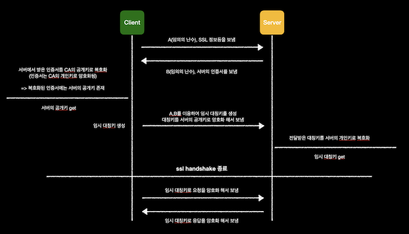
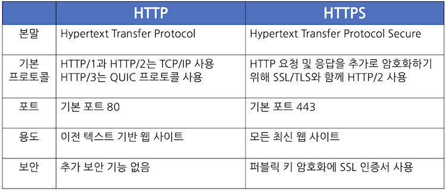

# HTTP_HTTPS
## HTTP(HyperText Transfer Protocol)란
HTML 문서와 같은 리소스들을 가져올 수 있도록 해주는 프로토콜

- 웹에서 이루어지는 모든 데이터 교환의 기초임
- HTML, TEXT / 이미지, 음성, 영상, 파일 / JSON, XML → 거의 모든 형태의 데이터 전송 가능
- 서버 간에 데이터를 주고 받을 때도 대부분 HTTP를 사용함


### HTTP의 역사
- HTTP/0.9 (1991년) - GET 메소드만 지원, HTTP 헤더 X
- HTTP/1.0 (1996년) - 메소드, 헤더 추가
- HTTP/1.1 (1997년) - 가장 많이 사용, HTTP 대부분의 기능이 담겨 있음
- HTTP/2 (2015년) - 성능 개선
- HTTP/3 (진행중) - TCP 대신에 UDP 사용, 성능 개선

<br></br>
### HTTP의 특징
- **단순한 프로토콜 → 쉽게 확장 가능**
- **클라이언트-서버 구조**
    - Request-Response 구조
    - 클라이언트는 서버에 요청을 보내고, 응답을 대기함
    - 서버가 요청에 대한 결과를 만들어서 응답함

- **무상태 프로토콜(Stateless), 비연결성**
    
    ```sql
    고객: 이 노트북 얼마인가요?
    점원: 100만원 입니다
    
    고객: 2개 구매하겠습니다
    점원: ? 무엇을 2개 구매하시겠어요?
    
    고객: 신용카드로 구매하겠습니다
    점원: ? 무슨 제품을 몇 개 신용카드로 구매하시겠어요?
    ```
    
    - 서버가 클라이언트의 상태를 보존하지 않음
    - 장점 - 서버 확장성 높음(스케일 아웃) → 갑자기 클라이언트 요청이 증가해도 서버를 대거 투입할 수 있음, 서버 자원 효율적으로 사용 가능
    - 단점 - 클라이언트가 추가 데이터를 전송하기 힘듦
    - ➡️ 웹 애플리케이션을 설계할 때는 최대한 Stateless로 설계하고 필요한 경우(로그인 등)에만 Stateful로 설계해야 함
<br></br>
- **HTTP 메시지**
  


1. **시작 라인**
    - 요청) HTTP 메소드(GET) + 요청 대상(/search?q=hello&hl=ko) + HTTP 버전
    - 응답) HTTP 버전 + 상태 코드 + 이유 문구
    - 상태 코드: 200(성공), 400(클라이언트 요청 오류), 500(서버 내부 오류) → 아래에자세히 기술
2. **HTTP 헤더** - HTTP 전송에 필요한 모든 부가 정보
3. **HTTP 메시지 바디** - 실제 전송할 데이터

<br></br>

## HTTP 메소드 종류
### 1. GET
리소스 조회    

    


- 서버에 전달하고 싶은 데이터는 query(쿼리 파라미터, 쿼리 스트링)을 통해서 전달
- 메시지 바디를 사용해서 데이터를 전달할 수 있지만, 지원하지 않는 곳이 많아서 권장하지 않음
<br></br>
### 2. POST
요청 데이터 처리, 주로 등록에 사용   

     
     
     

- 메시지 바디를 통해 서버로 요청 데이터 전달
- 서버는 요청 데이터를 처리
- 주로 전달된 데이터로 신규 리소스 등록, 프로세스 처리에 사용
<br></br>
### 3. PUT
리소스를 대체, 해당 리소스가 없으면 생성 → 즉 덮어버림

     

<br></br>
### 4. PATCH
리소스 부분 변경 → PATCH가 지원 안되는 서버의 경우 POST를 쓰면 됨

      

<br></br>
### 5. DELETE
리소스 삭제

---

### 6. HEAD
GET과 동일하지만 메시지 부분을 제외하고, 상태 줄과 헤더만 반환

### 7. OPTIONS
대상 리소스에 대한 통신 가능 옵션을 설명 (주로 CORS에서 사용)

### 8. CONNECT
대상 리소스로 식별되는 서버에 대한 터널을 설정

### 9. TRACE
대상 리소스에 대한 경로를 따라 메시지 루프백 테스트를 수행

---

### HTTP 메소드의 속성


- **안전**
    - 호출해도 리소스를 변경하지 않음
- **멱등**
    - 한 번 호출하든 100번 호출하든 결과가 똑같음, f(f(x)) = f(x)
    - GET - 한 번 조회하든, 두 번 조회하든 결과가 똑같음 (외부 요인에 의한 리소스 변경은 고려하지 않음)
    - PUT - 결과를 대체함 → 같은 요청을 여러 번 해도 최종 결과는 같음
    - DELETE - 결과를 삭제함 → 같은 요청을 여러 번 해도 삭제된 결과는 똑같음
    - POST - 멱등이 아님! 두 번 호출하면 같은 결제가 중복해서 발생할 수 있음
- **캐시 가능**
    - 응답 결과 리소스를 캐시해서 사용해도 되는지
    - GET, HEAD, POST, PATCH 캐시 가능 → 실제로는 GET, HEAD 정도만 캐시로 사용
    - POST, PATCH는 본문 내용까지 캐시 키로 고려해야 하는데, 구현이 쉽지 않음

<br></br>

## HTTP 상태 코드
**클라이언트가 보낸 요청의 처리 상태를 응답에서 알려주는 기능**
### 1xx (Informational)
요청이 수신되어 처리 중 → 거의 사용되지 않음

<br></br>
### 2xx (Successful)
요청 정상 처리     
- **200 OK**
- **201 Created** - 요청이 성공해서 새로운 리소스가 생성됨
- **202 Accepted** - 요청이 접수되었으나 처리가 완료되지 않았음(배치 처리 등에서 사용)
- **204 No Content** - 서버가 요청을 성공적으로 수행했지만, 응답 페이로드 본문에 보낼 데이터가 없음 (save 버튼의 결과로 아무 내용도 없어도 됨)

<br></br>
### 3xx (Redirection)
요청을 완료하기 위해 유저 에이전트의 추가 조치가 필요함

- **영구 리다이렉션 - 301, 308**
    - 리소스의 URI가 영구적으로 이동되었을 경우
    - **301 Moved Permanently** - 리다이렉트 시 요청 메소드가 GET으로 변하고, 본문이 제거될 수 있음 (실무에서는 홈피를 업뎃하면 전달해야 하는 내용도 바뀌는 경우가 많기 때문)
    - **308 Permanent Redirect** - 리다이렉트 시 요청 메소드와 본문 유지
- **일시적인 리다이렉션 - 302, 307, 303**
    - 리소스의 URI가 일시적으로 변경되었을 경우
    - ex) POST로 주문 후에 주문 결과 화면을 GET 메소드로 리턴 → 중복 주문 방지
    - **302 Found** - 리다이렉트 시 요청 메소드가 GET으로 변하고, 본문이 제거될 수 있음
    - **307 Temporary Redirect** - 리다이렉트 시 요청 메소드와 본문 유지
    - **303 See Other** - 리다이렉트 시 요청 메소드가 GET으로 변경
- **기타 리다이렉션 - 300, 304**
    - **300 Multiple Choices** - 안씀
    - **304 Not Modified** - 캐시를 목적으로 사용(클라이언트에게 리소스가 수정되지 않았음을 알려주며 캐시로 리다이렉트함)

<br></br>
### 4xx (Client Error)
**클라이언트 오류**, 잘못된 문법 등으로 서버가 요청을 수행할 수 없음

- **401 Unauthorized** - 클라이언트가 해당 리소스에 대한 인증이 필요함
- **403 Forbidden** - 서버가 요청을 이해했지만 승인을 거부함(관리자 권한 페이지에 접근 등)
- **404 Not Found** - 요청 리소스를 찾을 수 없음

<br></br>
### 5xx (Server Error)
**서버 오류**, 서버가 정상 요청을 처리하지 못함

- **503 Service Unavailable** - 서버가 일시적인 과부하 또는 예정된 작업으로 잠시 요청을 처리할 수 없음

<br></br>

## HTTPS
HTTP는 암호화되지 않은 데이터를 전송하기 때문에, 브라우저에서 전송된 정보를 제3자가 가로채서 읽을 수 있음 → 통신에 보안 계층을 추가하기 위해 HTTPS로 확장

- HTTPS 웹사이트는 독립된 인증 기관에서 SSL/TLS 인증서를 획득해야 함
- 데이터를 교환하기 전에 브라우저와 인증서를 공유함

---

1. 사용자 브라우저의 주소 표시줄에 [https://URL](https://URL) 형식을 입력하여 HTTPS 웹 사이트 방문
2. 브라우저는 서버의 SSL 인증서를 요청하여 사이트의 신뢰성을 검증하려고 시도함
3. 서버는 퍼블릭 키가 포함된 SSL 인증서를 회신으로 전송함
4. 웹 사이트의 SSL 인증서는 서버 아이덴티티를 증명함
5. 브라우저에서 인증되면, 브라우저가 퍼블릭 키를 사용하여 비밀 세션 키가 포함된 메시지를 암호화하고 전송함
6. 웹 서버는 프라이빗 키를 사용하여 메시지를 해독하고 세션 키를 검색함
7. 세션 키를 암호화하고 브라우저에게 승인 메시지를 전송함
8. 이제 브라우저와 웹 서버 모두 동일한 세션 키를 이용하여 메시지를 안전하게 교환하도록 전환함

### 대칭키, SSL 공부한 이후에 내용 추가하겠음

<br></br>
<br></br>

### 면접질문
1. HTTP와 HTTPS의 차이점에 대해서 설명해보세요
2. HTTP 메소드와 이것이 하는 역할에 대해서 설명해보세요
3. HTTP의 요청 헤더, 응답 헤더에 대해서 설명해보세요
4. HTTP와 HTTPS의 동작 과정에 대해서 설명해보세요

<br></br>
### 출처
모든 개발자를 위한 HTTP 웹 기본 지식_김영한       
[https://aws.amazon.com/ko/compare/the-difference-between-https-and-http/](https://aws.amazon.com/ko/compare/the-difference-between-https-and-http/)
