# IP
## IP(Internet Protocol)란
지정된 IP 주소에 데이터를 전달하며, 패킷이라는 통신 단위로 데이터를 전달한다

- **IP 주소** - 네트워크 통신에서, 각각의 통신기기(컴퓨터, 노트북, 스마트폰 등)에 할당된 식별번호
- **IP 패킷** - 데이터에 출발지 IP주소, 목적지 IP주소가 포함된 헤더를 붙여서 IP 패킷으로 만듦

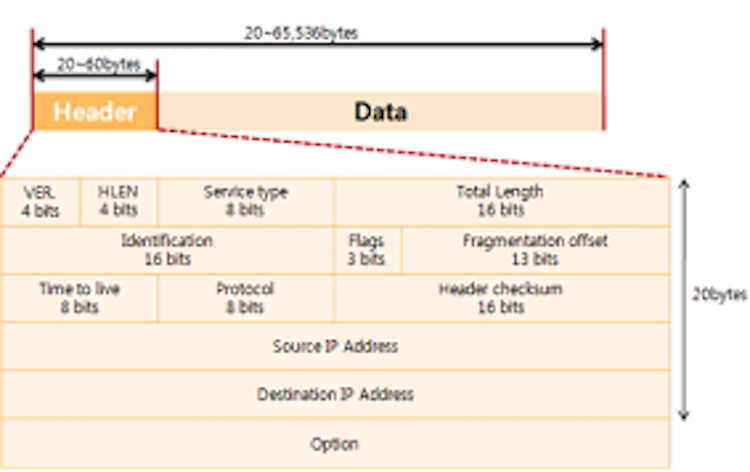

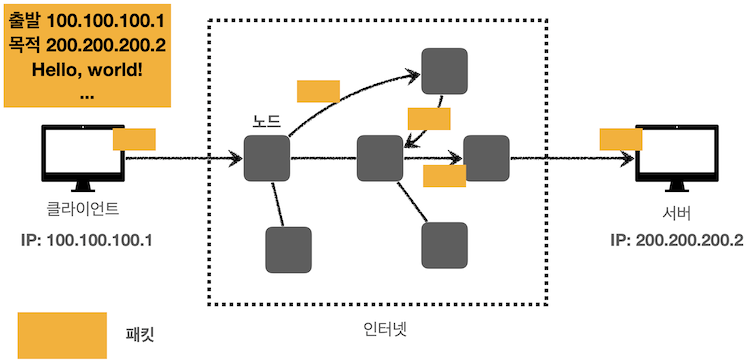

<br></br>

### 💡 IP 주소 vs MAC 주소
둘 다 네트워크 통신에서 통신기기의 식별번호를 나타낸다는 공통점
- IP 주소는 네트워크에 있는 장치에 대한 연결(SW)을 식별하지만, MAC 주소는 네트워크에 참여하는 장치(HW)를 식별함
	- IP 주소 체계는 변경 가능하고, 효과적인 라우팅을 위한 논리적인 주소이기 때문에, 라우팅 기법을 통해 IP 주소를 추적해 패킷을 보낸 뒤 IP 주소를 MAC 주소로 변환(ARP 프로토콜)하여 데이터를 전송함

	- 공유기는 공유기는 공인 IP 하나를 사설 IP 여러 개로 나눠 공유기에 연결된 각각의 PC가 인터넷에 연결할 수 있게 해주는 장치
		- 사설 IP를 받은 PC가 외부 네트워크에 접속하면 외부에서는 해당 PC의 IP 주소를 공유기로 들어간 공인 IP로 인식하게 됨 -> 만약 공유기에 연결된 다른 PC가 동시에 외부 네트워크에 접속하면 같은 공인 IP가 중복됨
		- 이때 MAC 주소를 통해 각각의 PC를 구분할 수 있음
   	  
- IP 주소는 32비트(IPv4) 또는 128비트(IPv6)이지만, MAC 주소는 48비트
- IP 주소는 네트워크 관리자 또는 인터넷 서비스 공급자(ISP)가 할당하지만, MAC 주소는 인터페이스 하드웨어 제조업체가 지정함(제품의 시리얼 넘버)
  
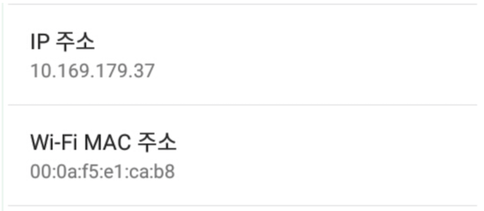
 
<br></br>

## IP주소의 클래스
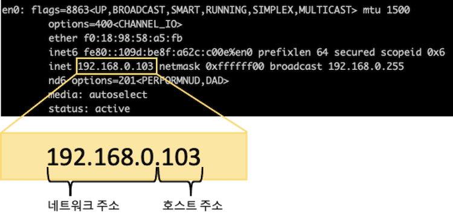

하나의 IP는 네트워크 부분 + 호스트 부분으로 구성되어 있음

- 하나의 네트워크에 있는 IP끼리 통신하기 위해서는 네트워크 부분이 같아야 함
- 네트워크 부분이 다르다면 라우터나 게이트웨이 같은 통신장비를 통해 통신할 수 있음

```sql
'서울시 중랑구 면목동 A아파트 B동 건물의 301호'에 있는 사람이 '서울시 중랑구 면목동 A아파트 B동 
건물의 505호'에 있는 사람을 찾아가려고 한다면 현재 그 사람이 위치해 있는 건물을 나갈 필요가 없음
-> 쓸데없이 같은 건물에 있는 사람을 찾기 위해 건물 밖을 나갔다 온다든가 하는 불필요한 짓 없이도 
 효율적인 네트워크 통신과, 브로드캐스팅을 위해 장치들을 일정한 규칙에 따라 하나의 그룹(서브넷)으로 묶음

그러나 건물 밖의 대상(=같은 서브넷에 속하지 않은 호스트)을 찾아가고자 한다면?
목적지가 같은 서울시 중랑구 면목동 A아파트라고 하더라도, B동이 아니라 바로 옆 건물 C동만 되어도 
일단 B동 건물 출입구를 통해 먼저 밖으로 나가야 한다. 이때 이 건물 출입구가 바로 '게이트웨이'인 것이다
```
<br></br>
**클래스는 하나의 IP 주소에서 네트워크 영역과 호스트 영역을 나누는 방법이자 약속**

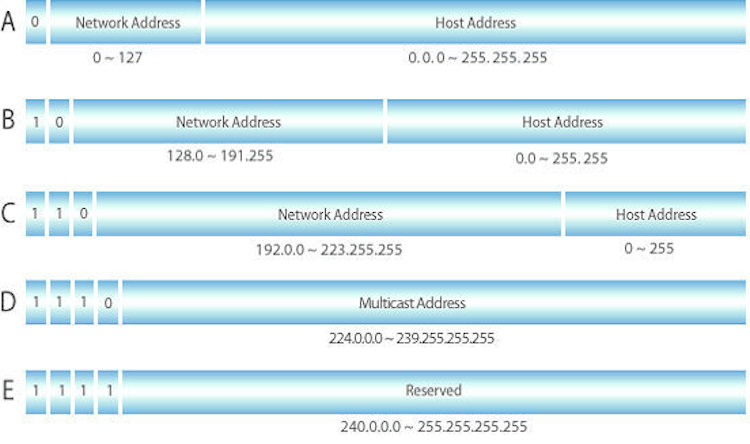

IP주소 클래스의 종류는 네트워크 크기에 따라 5가지로 분리됨

- **클래스 A**
    - 하나의 네트워크가 가질 수 있는 호스트 수가 제일 많은 클래스 → 국가 이상의 큰 통신망에서 사용됨
    - IP주소를 32자리 2진수로 표현했을 때, 맨 앞자리 수가 0인 경우
    - 0000 0000. 0000 0000. 0000 0000. 0000 0000 ~ 0111 1111. 1111 1111. 1111 1111. 1111 1111 (0.0.0.0 ~ 127.255.255.255)
- **클래스 B** - 학교 등 중대규모 통신망에서 사용됨
- **클래스 C** - 소규모 회사나 ISP업체의 통신망에서 사용됨
- **클래스 D** - 멀티캐스트 시에만 특수 사용하는 클래스
- **클래스 E** - 연구용, 테스트용으로 존재하는 클래스이고 사용되지 않음

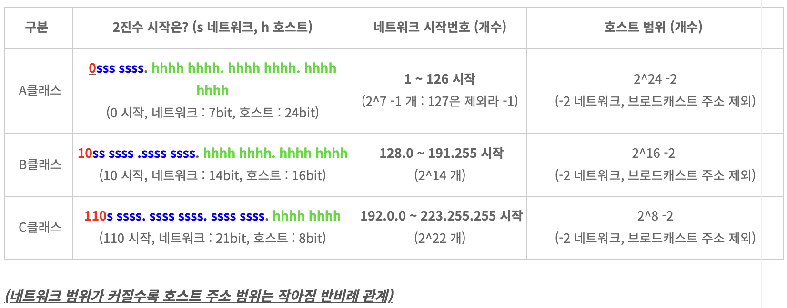

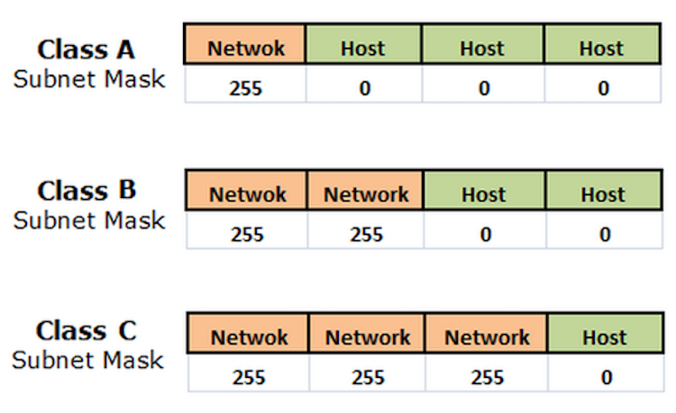

<br></br>

## 서브넷마스크
32비트의 숫자로 0의 비트는 호스트 부분을 나타내고 1의 비트는 네트워크 부분을 나타냄

- 이런 방식으로 서브넷 마스크는 IP 주소를 네트워크 및 호스트 주소와 분리함
- 서브넷 마스크를 어떤 범위로 하냐에 따라 로컬 네트워크의 범위가 넓어질 수도, 좁아질 수도 있음
- IP 주소 클래스마다 서브넷 마스크가 다름 -> 클래스마다 주소 범위가 정해져 있어서 앞자리만 보고도 어느 클래스인지 판별할 수는 있긴 하지만 보다 쉽게 구분하기 위해서 서브넷 마스크로 구분함

```sql
IP주소 192.168.123.132/24 혹은 서브넷 마스크 255.255.255.0일 때,
/24(CIDR 표기법)와 255.255.255.0은 같은 것을 나타냄
-> 255.255.255.0을 이진수로 쓰면 1111 1111.1111 1111.1111 1111.0000 0000
 즉 앞에서부터 연속된 1의 개수만 나타낸 것이 /24인 것

1로 채우는 필드가 네트워크 부분이고, 0으로 채우는 필드가 호스트 부분이다
```

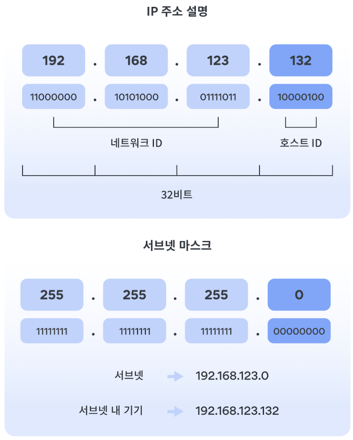

<br></br>
### 서브넷팅
네트워크 관리자가 네트워크 성능을 향상시키기 위해 자원을 효율적으로 분배하는 것
즉, 네트워크 영역과 호스트 영역을 분할하는 것 
- 서브넷팅을 하면 IP 할당 범위를 더 작은 단위로 나눌 수 있게 됨
- 만일 호스트를 50개만 사용하는 기업이 192.168.10.0/24 아이피 주소를 사용한다면 가정하면(C클래스, 총 256개의 주소), 이 256개를 절반으로 나누고(128개) 또 절반으로 나눈(64개) 주소를 기업에게 할당하고 남는 네트워크 주소는 다른 사용처로 할당할 수 있음    
-> 이 경우 서브넷 마스크가 8의 배수가 아니라 다양해 지는 것 

<br></br>

## IP주소의 종류
### IPv4, IPv6

전 세계적으로 인터넷 사용자 수가 급증하면서 IPv4 주소가 고갈될 위기 → IPv6 등장

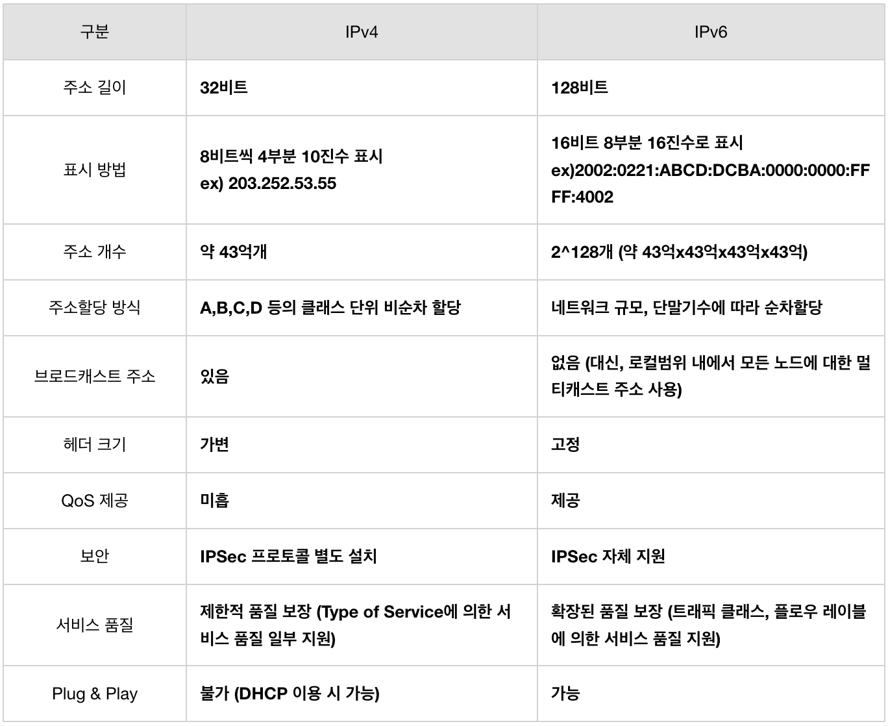

```sql
- 브로드캐스트: 네트워크에 연결되어 있는 모든 시스템에게 데이터 전송(1대 다수, 불특정 다수)
	모든 시스템에게 패킷이 전송되므로 트래픽이 증가한다는 단점 
- 멀티캐스트: 네트워크에 연결되어 있는 일부 시스템(멀티캐스트 그룹에 속하는)에게 데이터 전송(1대 다수, 특정 집단)

- QoS(서비스 품질): 네트워크상에 흐르는 데이터의 중요도를 분류하여, 이를 기반으로 우선순위를 부여함
	우선순위가 높을수록 빠르고 안전하게 전송이 보장됨 
- Plug&Play: 임의의 자동 생성, 특정 서버가 없어도 라우터 등에서 자동으로 호스트의 IP 구성이 가능
	DHCP서버(IP주소 분배해주는 서버)가 없어도 네트워크에 연결하기만 하면 자동으로 주소 생성
```

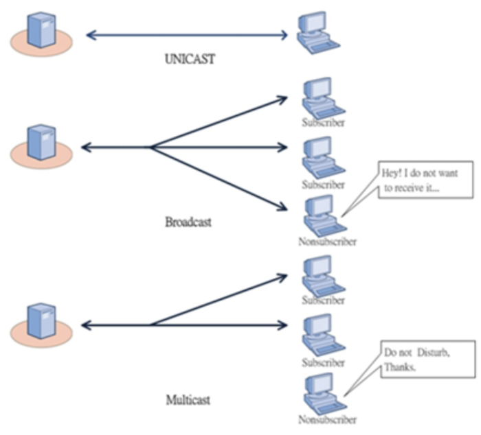

<br></br>
### 고정 IP, 유동 IP
- **고정 IP**
    - 변하지 않고 컴퓨터에게 고정적으로 부여된 IP주소
    - 한번 부여되면 IP주소를 반납하기 전까지는 다른 장비에 부여할 수 없는 고유의 IP로 보안성이 우수함
    - 속도가 빠르고 안정적임
- **유동 IP**
    - 인터넷 사용자 모두에게 고정 IP 주소를 부여해주기 힘들기 때문에, 일정한 주기 또는 사용자들이 인터넷에 접속하는 매 순간마다 사용하고 있지 않은 IP 주소를 임시로 발급해줌

IP 주소의 개수는 한정적이기 때문에, 고정 IP 주소를 사용하려면 추가 요금을 지불해야 함    
-> 보통 일반 가정에서는 고정 IP를 사용하지 않고, 서버 운영이 필요한 사업장에서 고정 IP 주소를 사용함 

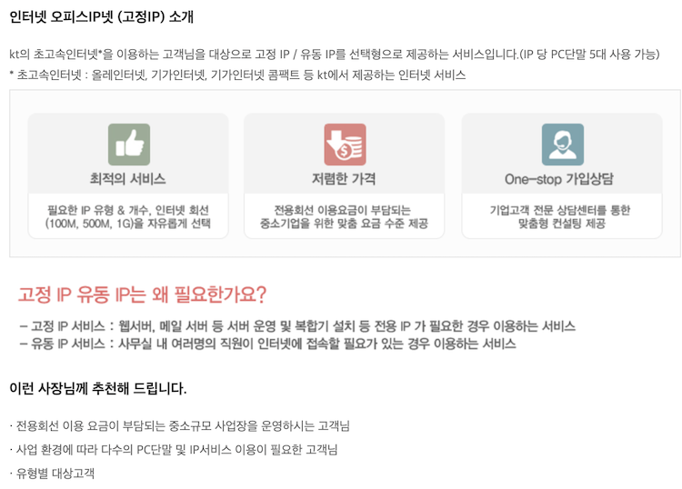        
http://kt-center.co.kr/new2/sp_internet/sp_04.php

<br></br>
### 공인 IP, 사설 IP
- **공인 IP**
    - 인터넷 사용자의 로컬 네트워크를 식별하기 위해 ISP(인터넷 서비스 공급자)가 제공하는 IP 주소
    - 외부에 공개되어 있기 때문에, 인터넷에 연결된 다른 PC가 접근할 수 있음
    - 공인 IP는 전세계에서 유일한 IP 주소임
- **사설 IP**
    - 일반 가정이나 회사 내에서 할당된 네트워크의 IP 주소(라우터에 의해 로컬 네트워크 상의 PC나 장치에 할당됨)
    - IPv4의 주소 부족으로 인해 서브넷팅된 IP 주소
    - 공인 주소 영역에서 일부 주소 블록을 사설 주소를 위해 할당 → 사설 네트워크에서 내부적으로만 사용 가능, 인터넷 상에서 무시됨

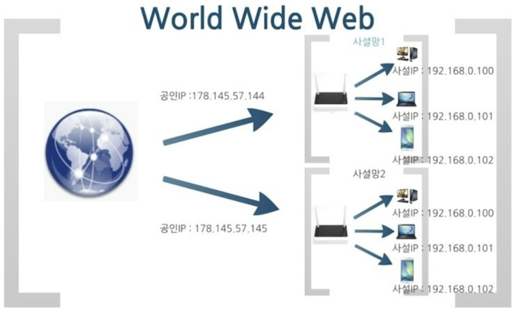

💻→🌏 : 사설 IP를 할당받은 스마트폰 혹은 개인 PC가 데이터 패킷을 인터넷으로 전송하면, 라우터(공유기)가 해당 사설 IP를 공인 IP로 바꿔서 전송함

🌏→💻 : 인터넷에서 오는 데이터 패킷의 목적지도 해당하는 사설 IP로 변경한 후 개인 스마트폰 혹은 PC에 전송함
<br></br>
- **사설 IP 주소 범위**
    - 전체 IP 공간 중 사설 IP 주소로 사용되는 대역은 미리 정해져 있음
    - **클래스 A** - 10.0.0.0 ~ 10.255.255.255
    - **클래스 B** - 172.16.0.0 ~ 172.31.255.255
    - **클래스 C** - 192.168.0.0 ~ 192.168.255.255

<br></br>

## IP 프로토콜의 한계
- **비연결성** - 패킷을 받을 대상이 없거나 서비스 불능 상태여도(목적지 PC가 꺼져 있어도) 패킷을 전송함
- **비신뢰성** - 중간에 패킷이 사라지거나, 패킷이 순서대로 안 갈수도 있음
- **프로그램 구분** - 같은 IP를 사용하는 서버에서 통신하는 애플리케이션이 둘 이상이라면?      
→ 이 문제점을 해결하기 위해 TCP/UDP 프로토콜을 함께 사용함

<br></br>
<br></br>

### 면접질문
1. IP란?
2. 공인 IP와 사설 IP의 차이?
- IP는 면접에서 잘 안 물어보는 것 같음

<br></br>
### 출처
모든 개발자를 위한 HTTP 웹 기본 지식_김영한      
[https://m.blog.naver.com/PostView.naver?isHttpsRedirect=true&blogId=hai0416&logNo=221566797342](https://m.blog.naver.com/PostView.naver?isHttpsRedirect=true&blogId=hai0416&logNo=221566797342)   
[https://m.blog.naver.com/wnrjsxo/221250742423](https://m.blog.naver.com/wnrjsxo/221250742423)    
[https://namu.wiki/w/QoS](https://namu.wiki/w/QoS)     
[https://www.datanet.co.kr/news/articleView.html?idxno=25169](https://www.datanet.co.kr/news/articleView.html?idxno=25169)    
[https://study-recording.tistory.com/7](https://study-recording.tistory.com/7)    
[https://velog.io/@hidaehyunlee/공인Public-사설Private-IP의-차이점](https://velog.io/@hidaehyunlee/%EA%B3%B5%EC%9D%B8Public-%EC%82%AC%EC%84%A4Private-IP%EC%9D%98-%EC%B0%A8%EC%9D%B4%EC%A0%90)    
[https://blog.naver.com/PostView.nhn?blogId=sbd38&logNo=50194584566](https://blog.naver.com/PostView.nhn?blogId=sbd38&logNo=50194584566)     
[https://limkydev.tistory.com/166](https://limkydev.tistory.com/166)       
[https://namu.wiki/w/서브넷 마스크](https://namu.wiki/w/%EC%84%9C%EB%B8%8C%EB%84%B7%20%EB%A7%88%EC%8A%A4%ED%81%AC)    
[https://nordvpn.com/ko/blog/what-is-subnet-mask/](https://nordvpn.com/ko/blog/what-is-subnet-mask/)     
https://inpa.tistory.com/entry/WEB-IP-%ED%81%B4%EB%9E%98%EC%8A%A4-%EC%84%9C%EB%B8%8C%EB%84%B7-%EB%A7%88%EC%8A%A4%ED%81%AC-%EC%84%9C%EB%B8%8C%EB%84%B7%ED%8C%85-%EC%B4%9D%EC%A0%95%EB%A6%AC
