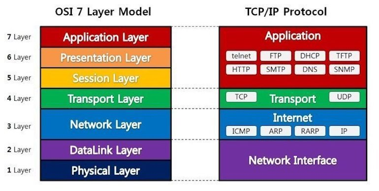
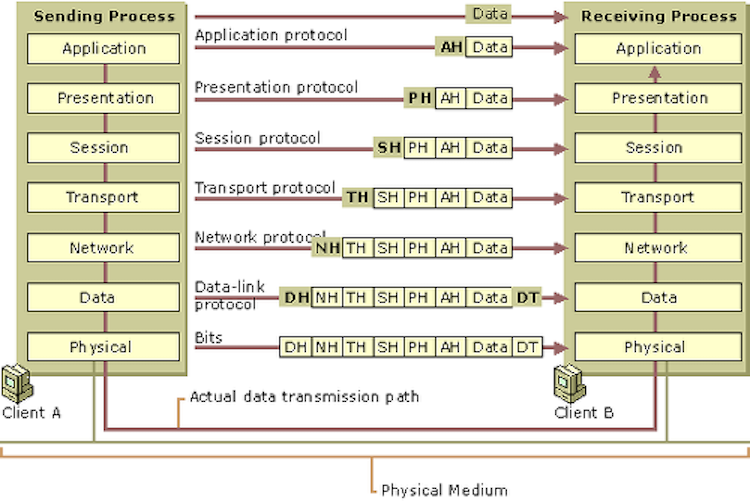
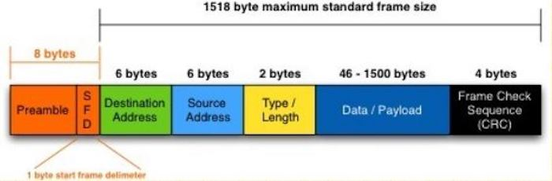
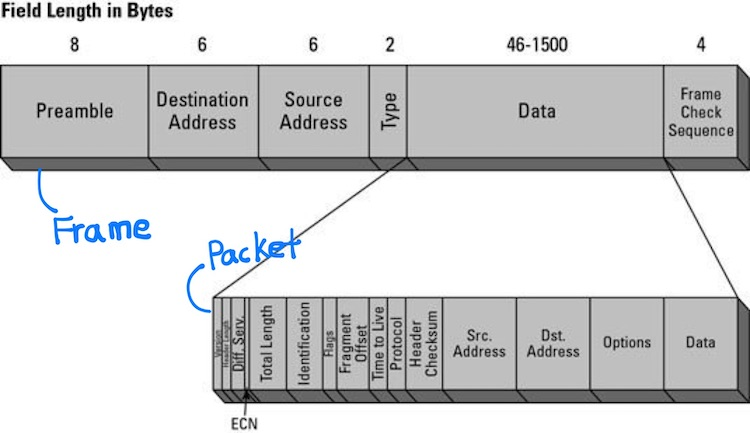
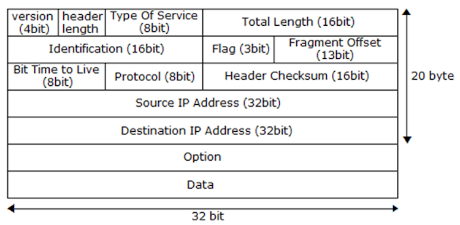
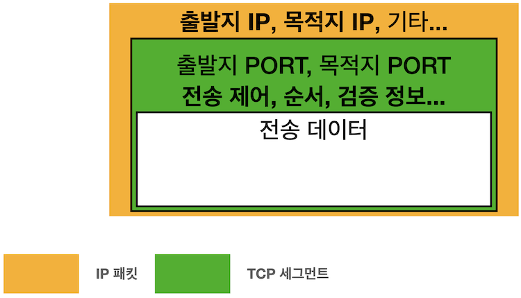
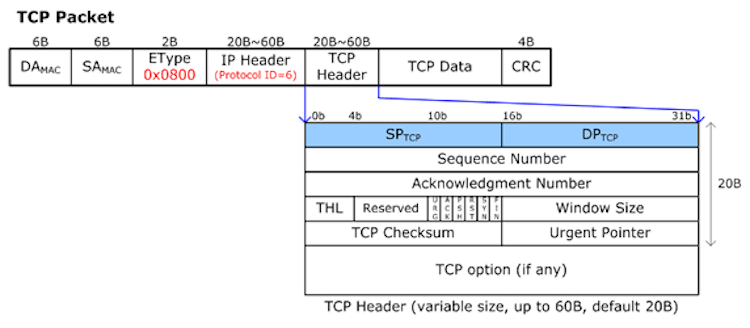
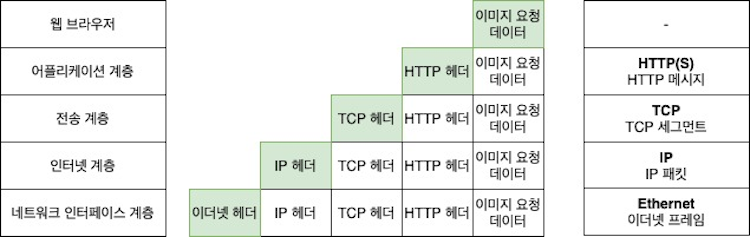

# OSI 7계층_TCP/IP 4계층

## OSI 7계층
네트워크에서 통신이 일어나는 과정을 7단계로 나눈 것 

- 통신이 일어나는 과정을 단계별로 파악할 수 있음 (흐름을 한 눈에 알아보기 쉬움, 이해하기 쉬움)
- 7계층 중 특정한 곳에 이상이 생기면 다른 단계의 장비 및 소프트웨어를 건들이지 않고 이상이 생긴 단계만 고칠 수 있음
- 다른 계층끼리는 데이터의 전달 과정을 구체적으로 알 필요가 없기 때문에, 데이터의 캡슐화와 은닉이 가능함

### 1계층 - 물리계층(Physical Layer)
주로 전기적/기계적/기능적인 특성을 이용해서 통신 테이블로 데이터를 전송함

- **단지 데이터만 전달할 뿐**, 전송하려는(받으려는) 데이터가 무엇인지, 어떤 에러가 있는지 등은 전혀 신경쓰지 않음 (단지 데이터를 전기적인 신호로 변환해서 주고받는 기능만 할 뿐)
- 통신 단위 - **비트(1,0)**
- 대표적인 장비 - 통신 케이블, 리피터, 허브
  
  
### 2계층 - 데이터 링크 계층(DataLink Layer)
물리계층을 통해 송수신되는 정보의 오류와 흐름을 관리하여 안전한 정보의 전달을 수행할 수 있도록 도와줌

- 물리적인 장치를 식별하는 데 사용할 수 있는 **주소 지정 체계**를 제공함
    - MAC(Media Access Control) 주소는 사람의 이름처럼 네트워크 카드마다 붙는 고유의 이름임
    - 패킷에 헤더, 트레일러, MAC 주소를 추가해 프레임을 만듦 (프레임들을 구별할 수 있도록)
- 포인트 투 포인트 간의 신뢰성 있는 전송을 보장하며, **오류 제어와 흐름제어**를 수행함
    - 데이터가 전송되는 도중 노이즈로 인해 1을 0으로 인식하고, 0을 1로 인식하는 에러를 검출함
    - 패리티 검사, CRC/체크섬, 해밍코드 이용해서 검출 ([https://junboom.tistory.com/32](https://junboom.tistory.com/32))
- 통신 단위 - **프레임(Frame)**
- 대표적인 장비 - 브릿지, 스위치, 이더넷 등

  
### 3계층 - 네트워크 계층(Network Layer)
데이터를 목적지까지 가장 안전하고 빠르게 전달해줌(라우팅)

- **라우팅** - 어떤 네트워크 안에서 통신 데이터를 짜여진 알고리즘에 의해 최대한 빠르게 보낼 최적의 경로를 선택하는 과정
- 데이터 스트림을 더 작은 단위로 분할하고 경우에 따라 오류를 감지해 처리함
- 라우팅, 흐름제어, 세그먼테이션, 오류제어, 인터네트워킹(네트워크 간 연결) 등을 수행함
- 통신 단위 - **패킷(Packet)**
- 대표적인 장비 - 라우터 (요즘엔 L3 스위치로 라우팅을 수행하는 추세)

  
### 4계층 - 전송 계층(Transport Layer)
하위 계층에 신뢰할 수 있는 데이터 전송 서비스를 제공함 

- 컴퓨터와 컴퓨터 간에 신뢰성 있는 데이터를 서로 주고받을 수 있도록 해주어, 상위 계층들이 데이터 전달의 유효성이나 효율성을 생각하지 않도록 해줌
- 오류 검출 및 복구와 흐름제어, 중복검사 등을 수행함
- 통신 단위 - **TCP(Segment), UDP(Datagram 방식)**
- 대표적인 장비 - 방화벽, 프록시 서버

  
### 5계층 - 세션 계층(Session Layer)
두 컴퓨터 간의 대화나 세션을 관리함 

- 모든 통신 장치 간에 연결을 설정하고, 관리 및 종료하고, 연결이 전이중인지 반이중인지 확인함
- 체크 포인팅과 유휴, 재시작 과정 등을 수행하며 호스트가 갑자기 중지되지 않고 정상적으로 호스트를 연결하는데 책임이 있음
- TCP/IP 세션을 만들고, 없애고, 통신하는 사용자를 동기화해, 통신을 하기 위한 세션을 확립/유지/중단하는 작업을 수행함
- 통신 단위 - Data

  
### 6계층 - 표현 계층(Presentation Layer)
응용 계층으로부터 전달받은 데이터를 읽을 수 있는 형식으로 변환함 

- 응용 계층으로부터 전송받거나 응용 계층으로 전달해야 할 데이터의 인코딩과 디코딩이 이루어짐 → 유니코드(UTF-8)로 인코딩 되어 있는 문서를 ASCII로 인코딩 된 문서로 변환하려 할 때
- 데이터를 안전하게 사용하기 위해서 암호화와 복호화를 함
- 통신 단위 - Data

  
### 7계층 - 응용 계층(Application Layer)
응용 프로세스와 직접 관계하여 일반적인 응용 서비스를 수행함 

- 사용자가 네트워크 자원에 접근하는 방법을 제공함
- 최종적으로 사용자가 볼 수 있는 유일한 계층으로 모든 네트워크 활동의 기반이 되는 인터페이스를 제공하는데, 사용자가 실행하는 응용 프로그램들이 응용 계층에 속한다고 보면 됨
- 예시 - 텔넷(가상 터미널), 크롬, 이메일 등
- 통신 단위 - Data

---

### 프레임(Frame)
- 데이터 링크 계층(2계층)에서 전송되는 단위
- 전송 프레임에는 상위 계층에서 보낸 전송 데이터의 오류 확인을 위한 체크섬, 송수신 호스트의 주소 등의 정보가 포함됨
- 프레임을 전송받은 호스트는 체크섬 에러를 확인하고, 에러 검출 시 재전송을 요구하여 복구 과정을 거침

  
### 패킷(Packet)
- 네트워크를 통해 전송하기 쉽도록 자른 데이터의 전송 단위 → 소포(package) + 덩어리(bucket)
- 보통 3계층과 4계층의 데이터 단위는 패킷이라고 하고, 1계층과 2계층의 데이터 단위는 프레임이라고 함

- IP 패킷(IP에 의해 전송되는 데이터 묶음)의 구조

  
### 세그먼트(Segment)

- **TCP 세그먼트 = 세그먼트 헤더(TCP 헤더) + 데이터**
- (데이터 섹션의 길이) = (전체 IP 데이터그램의 길이) - (TCP 헤더) - (캡슐화된 IP 헤더의 길이)
- TCP 헤더 구조

  
### 데이터그램(Datagram)
- TCP/IP 인터넷에서 기본 전송 단위(데이터그램은 ‘패킷’ 대신 쓸 수 있는 용어라고 함)
- 패킷교환에서 각각 독립적으로 취급되는 각각의 패킷
- **데이터그램 방식** - 패킷 교환에서 비연결형 서비스를 이용해 패킷을 독립적으로 전송하는 방식(UDP)

  

## TCP/IP 4계층
TCP/IP 프로토콜 통신 과정에 초점을 맞추어, OSI 7계층을 좀 더 단순화시킨 계층

### 4계층 - 애플리케이션 계층(Application Layer)
- 사용자와 가장 가까운 계층으로, 사용자-소프트웨어 간 소통을 담당함
- 데이터 단위 - Data/Message
- HTTP, HTTPS, FTP, SSH, Telnet, DNS, SMTP와 같은 프로토콜이 사용됨
  
### 3계층 - 전송 계층(Transport Layer)
- 통신 노드 간 신뢰성 있는 데이터 전송을 보장하는 계층
- 데이터 단위 - Segment
- TCP, UDP, RTP, RTCP와 같은 프로토콜이 사용됨
  
### 2계층 - 인터넷 계층(Internet Layer)
- 패킷을 최종 목적지까지 라우팅하는 계층
- 데이터 단위 - 패킷
- IP, ARP, ICMP, RARP, OSPF와 같은 프로토콜이 사용됨
  
### 1계층 - 네트워크 액세스 계층(Network Access Layer)
- Network Interface 계층이라고 하기도 함
- 데이터를 전기신호로 변환한 뒤, MAC 주소를 이용해 알맞은 기기로 데이터를 전달하는 계층
- 데이터 단위 - 프레임
- Ethernet, Wi-Fi, PPP, Token Ring과 같은 프로토콜이 사용됨

  

### 면접질문
1. OSI 7계층에 대해 설명해주세요
2. OSI 7계층으로 나눈 이유?
3. 물리 계층이 하는 일?
4. TCP/IP 4계층에 대해 설명해주세요

  
### 출처
[https://shlee0882.tistory.com/110](https://shlee0882.tistory.com/110)    
[http://wiki.hash.kr/index.php/OSI_7_계층](http://wiki.hash.kr/index.php/OSI_7_%EA%B3%84%EC%B8%B5)     
[https://leejoongwon.tistory.com/31](https://leejoongwon.tistory.com/31)    
[https://velog.io/@wlsdnjs156/프레임Frame과-패킷Packet](https://velog.io/@wlsdnjs156/%ED%94%84%EB%A0%88%EC%9E%84Frame%EA%B3%BC-%ED%8C%A8%ED%82%B7Packet)     
[https://nogan.tistory.com/20](https://nogan.tistory.com/20)      
[http://wiki.hash.kr/index.php/패킷](http://wiki.hash.kr/index.php/%ED%8C%A8%ED%82%B7)      
[http://www.ktword.co.kr/test/view/view.php?m_temp1=634](http://www.ktword.co.kr/test/view/view.php?m_temp1=634)      
[https://www.cloudflare.com/ko-kr/learning/network-layer/what-is-a-packet/](https://www.cloudflare.com/ko-kr/learning/network-layer/what-is-a-packet/)      
[https://wooono.tistory.com/507](https://wooono.tistory.com/507)
