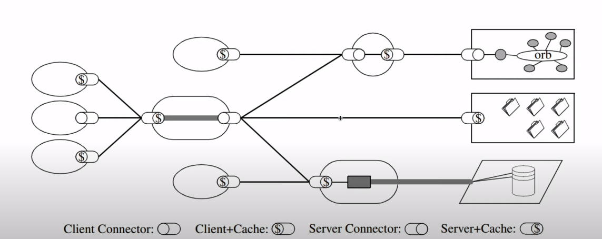

# REST, RESTful, REST API
# 1. REST

## 1.1 REST 정의

Representational State Transfer : 자원을 이름으로 구분하여 해당 자원의 상태(정보)를 주고 받는 것.

1. 자원(resource)의 표현(representation)에 의한 상태 전달
    - 자원 : 해당 소프트웨어가 관리하는 모든것.
        - 문서, 그림, 데이터, 해당 소프트웨어 자체 등
    - 자원의 표현 : 그 자원을 표현하기 위한 이름
        - DB의 학생 정보가 자원일 때, ‘students’를 자원의 표현으로 정함
    - 상태 전달 : 데이터가 요청되는 시점에 자원 상태를 전달함.
        - JSON, XML을 통해 데이터를 주고 받음
2. 월드 와이드 웹(www)과 같은 분산 하이퍼미디어 시스템을 위한 소프트웨어 개발 아키텍처의 한 형식.
    - REST는 기본적으로 웹의 기존 기술과 HTTP 프로토콜을 그대로 활용하기 때문에 웹의 장점을 최대한 활용할 수 있는 아티텍처 스타일.
    - REST는 네트워크 상에서 Client와 Server사이의 통신 방식 중 하나.
3. **HTTP URI(Uniform Resource Identifier)를 통해 자원을 명시하고, HTTP Method(POST, GET, PUT, DELETE)를 통해 해당 자원에 대한 CRUD Operation을 적용하는 것을 의미한다.**
    - REST는 자원 기반의 구조(ROA, Resource Oriented Architecture) 설계의 중심에 Resource가 있고 HTTP Method를 통해 Resource를 처리하도록 설계된 아키텍쳐를 의미한다.
    - 웹 사이트의 이미지, 텍스트, DB 내용 등의 모든 자원에 고유한 ID인 HTTP URI를 부여한다.
    
    > **CRUD Operation ?**
    대부분의 소프트웨어가 가지는 기본적인 데이터 처리 기능인 Create, Read, Update, Delete를 묶어서 일컫는 말. REST에서는 아래와 같다.
    > 
    
    ```
    Create : 데이터 생성 (POST)
    Read : 데이터 조회 (GET)
    Update : 데이터 수정 (PUT, PATCH)
    Delete : 데이터 삭제 (DELETE)
    ```
    

## 1.2 REST가 필요한 이유

애플리케이션이 분리 및 통합 되고 다양한 클라이언트가 등장하면서

최근 서버 프로그램은 다양한 브라우저와 안드로이드폰, 아이폰과 같은 모바일 디바이스에서도 통신 할 수 있어야함.

멀티 플랫폼에 대한 지원을 위해 서비스 자원에 대한 아키텍처를 세우고 이용하는 방법을 모색한 결과 REST에 관심을 가지게 됨.

## 1.3 REST 구성요소

1. 자원(Resource) : HTTP URI
    - 모든 자원에 고유한 ID가 존재하고, 이 자원은 Server에 존재한다.
    - 자원을 구별하는 ID는 ‘/groups/:group_id’와 같은 HTTP URI 다.
    - Client는 URI를 이용해서 자원을 지정하고 해당 자원의 상태(정보)에 대한 조작을 Server에 요청한다
2. 자원에 대한 행위(Verb) : HTTP Method
    - HTTP 프로토콜의 Method 사용.
    - HTTP 프로토콜은 GET, POST, PUT, DELETE 와 같은 메서드 제공
3. 자원에 대한 행위의 내용 (Representations) : HTTP Message PayLoad
    - Clienet가 자원의 상태에 대한 조작을 요청하면 Serever는 이에 적잘한 응답(representation)을 보냄.
    - REST에서 자원은 JSON, XML, TEXT, RSS 등 여로 형태의 representation으로 나타남.

## 1.4 REST 특징

### A. Server-Client(서버-클라이언트 구조)

- 자원이 있는 쪽이 Server, 자원을 요청하는 쪽이 Client가 된다.
    - REST Server: API를 제공하고 비즈니스 로직 처리 및 저장을 책임진다.
    - Client: 사용자 인증이나 context(세션, 로그인 정보) 등을 직접 관리하고 책임진다.
- 서로 간 의존성이 줄어든다.

### B. Stateless(무상태)

- HTTP 프로토콜은 Stateless Protocol이므로 REST 역시 무상태성을 갖는다.
- Client의 context를 Server에 저장하지 않는다.
    - 즉, 세션과 쿠키와 같은 context 정보를 신경쓰지 않아도 되므로 구현이 단순해진다.
- Server는 각각의 요청을 완전히 별개의 것으로 인식하고 처리한다.
    - 각 API 서버는 Client의 요청만을 단순 처리한다.
    - 즉, 이전 요청이 다음 요청의 처리에 연관되어서는 안된다.
    - 물론 이전 요청이 DB를 수정하여 DB에 의해 바뀌는 것은 허용한다.
    - Server의 처리 방식에 일관성을 부여하고 부담이 줄어들며, 서비스의 자유도가 높아진다.

### C. Cacheable(캐시 처리 가능)

- 웹 표준 HTTP 프로토콜을 그대로 사용하므로 웹에서 사용하는 기존의 인프라를 그대로 활용할 수 있다.
    - 즉, HTTP가 가진 가장 강력한 특징 중 하나인 캐싱 기능을 적용할 수 있다.
    - HTTP 프로토콜 표준에서 사용하는 Last-Modified 태그나 E-Tag를 이용하면 캐싱 구현이 가능하다.
- 대량의 요청을 효율적으로 처리하기 위해 캐시가 요구된다.
- 캐시 사용을 통해 응답시간이 빨라지고 REST Server 트랜잭션이 발생하지 않기 때문에 전체 응답시간, 성능, 서버의 자원 이용률을 향상시킬 수 있다.

### D. Layered System(계층화)

- Client와 Server사이에 부하분산을 위한 중간 서버가 있음
- 클라이언트는 이 중간서버(계층)은 몰라도 됨
- 예를들어, REST Server는 다중 계층으로 구성될 수 있다.
    - API Server는 순수 비즈니스 로직을 수행하고 그 앞단에 보안, 로드밸런싱, 암호화, 사용자 인증 등을 추가하여 구조상의 유연성을 줄 수 있다.
    - 또한 로드밸런싱, 공유 캐시 등을 통해 확장성과 보안성을 향상시킬 수 있다.
- 예2) PROXY, 게이트웨이 같은 네트워크 기반의 중간 매체를 사용할 수 있다.
- 클라이언트←———중간 서버들————>서버



### E. Code-On-Demand(optional)

- Server로부터 스크립트를 받아서 Client에서 실행한다.
- 반드시 충족할 필요는 없다.

### F. Uniform Interface(인터페이스 일관성)

- URI로 지정한 Resource에 대한 조작을 통일되고 한정적인 인터페이스로 수행한다
- HTTP 표준 프로토콜에 따르는 모든 플랫폼에서 사용이 가능하다.
    - 특정 언어나 기술에 종속되지 않는다.

## 1.5 REST 장단점

### 장점

- HTTP 프로토콜의 인프라를 그대로 사용하므로 REST API 사용을 위한 별도의 인프라를 구출할 필요가 없다.
- HTTP 프로토콜의 표준을 최대한 활용하여 여러 추가적인 장점을 함께 가져갈 수 있게 해 준다.
- HTTP 표준 프로토콜에 따르는 모든 플랫폼에서 사용이 가능하다.
- Hypermedia API의 기본을 충실히 지키면서 범용성을 보장한다.
- REST API 메시지가 의도하는 바를 명확하게 나타내므로 의도하는 바를 쉽게 파악할 수 있다.
- 여러 가지 서비스 디자인에서 생길 수 있는 문제를 최소화한다.
- 서버와 클라이언트의 역할을 명확하게 분리한다.

### 단점

- HTTP Method 형태가 제한적이다.
- 브라우저를 통해 테스트할 일이 많은 서비스라면 쉽게 고칠 수 있는 URL보다 Header 정보의 값을 처리해야 하므로 전문성이 요구된다.
- 구형 브라우저에서 호환이 되지 않아 지원해주지 못하는 동작이 많다.(익스플로어)

# 2. REST API

## 2.1 정의

### API(Application Programming Interface)

데이터와 기능의 집합을 제공하여 컴퓨터 프로그램간 상호작용을 촉진하며, 서로 정보를 교환가능 하도록 하는 것

**API와 라이브러리 차이점 → 구현 로직 유무**

- **라이브러리** : 우리가 자주 사용하는 로직들을 재사용하기 편하도록 만들어놓은 **코드의 집합 , 도구 그 자체 = 구현 로직이 있다.**
- API는 응용 프로그램을 만드는데 필요한 연결장치, 매개체, 말 그대로 인테페이스 이다.
    - 실제로 어떻게 구현하는지 알 필요가 없다. 구현로직이 없음

### REST API

REST 기반으로 서비스 API를 구현한 것

- 최근 OpenAPI, 마이크로 서비스등을 제공하는 업체 대부분은 REST API를 제공한다.
    - 마이크로 서비스 : 하나의 큰 애플리케이션을 여러 개의 작은 애플리케이션으로 쪼개어 변경과 조합이 가능하도록 만든 아키텍처

## 2.2 특징

- 사내 시스템들도 REST 기반으로 시스템을 분산해 확장성과 재사용성을 높여 유지보수 및 운용을 편리하게 할 수 있다.
- REST는 HTTP 표준을 기반으로 구현하므로, HTTP를 지원하는 프로그램 언어로 클라이언트, 서버를 구현할 수 있다.
- 즉, REST API를 제작하면 델파이 클라이언트 뿐 아니라, 자바, C#, 웹 등을 이용해 클라이언트를 제작할 수 있다.

## 2.3 설계 기본 규칙 (naming)

1.  (계층)관계를 나타내기 위해 슬래시(/)를 사용하세요
2. URI 마지막에 슬래시(/)를 붙이지 마세요
    - URI에 포함되는 모든 글자는 리소스의 유일한 식별자로 사용되어야 하며 URI가 다르다는 것은 리소스가 다르다는 것이고, 역으로 리소스가 다르면 URI도 달라져야 한다.
    - REST API는 분명한 URI를 만들어 통신을 해야 하기 때문에 혼동을 주지 않도록 URI 경로의 마지막에는 슬래시(/)를 사용하지 않는다.
3. 가독성을 위해 하이픈(-)를 사용하세요
    - 불가피하게 긴 URI경로를 사용하게 된다면 하이픈을 사용해 가독성을 높인다.
4. 언더바(_)를 사용하지 마세요
    - 텍스트 viewer 어플리케이션들(브라우저, 에디터, 등등)은 종종 URI에 클릭할수 있다는 시각적 힌트를 주기위해 밑줄을 사용합니다.
    - 어플리케이션의 폰트에 따라 언더바(_) 문자는 밑줄로 인해 부분적으로 보이지 않거나 완전히 가려질 수 있습니다.
    - 이러한 혼란을 피하기 위해 언더바(_) 대신 하이픈(-)을 사용하세요
5. URI에는 소문자가 적합하다.
    - RFC 3986(URI 문법 형식)은 URI 스키마와 호스트를 제외하고는 대소문자를 구별하도록 규정하기 때문
    - 1) **[http://api.example.com/my-folder/my-doc](http://api.example.com/my-folder/my-doc)**
    - 2) **[HTTP://API.EXAMPLE.COM/my-folder/my-doc](http://api.example.com/my-folder/my-doc) (전체 대문자)**
        - 위의 uri는 괜찮습니다. RFC 3986에서는 1번 URI와 같은 것으로 인식합니다.
    - 3) **[http://api.example.com/My-Folder/my-doc](http://api.example.com/My-Folder/my-doc)**
        - URI는 1번, 2번과 같지 않습니다. 불필요한 혼란을 가져올 수 있습니다.
6. URI에 파일 확장자를 사용하지 마세요
    - REST API에서는 메시지 바디 내용의 포맷을 나타내기 위한 파일 확장자를 URI 안에 포함시키지 않는다.
    - Accept header를 사용한다.
        - Ex) [http://restapi.example.com/members/soccer/345/photo.jpg](http://restapi.example.com/members/soccer/345/photo.jpg) (X)
        - Ex) GET / members/soccer/345/photo HTTP/1.1 Host: [restapi.example.com](http://restapi.example.com/) Accept: image/jpg (O)
7. 리소스 간에는 연관 관계가 있는 경우(복수형을 사용하세요(?))
    - 하나의 인스턴스를 복수형으로 표시하는게 문법적으로 맞지 않겠다고 생각할수 있지만 URI의 형식을 복수형으로 사용하는 것이 실무에서 많이 사용되고 있다.
    - [http://api.college.com/students/3248234/courses](http://api.college.com/students/3248234/courses)
    - /리소스명/리소스 ID/관계가 있는 다른 리소스명
    - Ex) GET : /users/{userid}/devices (일반적으로 소유 ‘has’의 관계를 표현할 때)

8. 행위를 포함하지 않는다.

- ❌ POST http://cocoon1787.tistory.com/users/post/1
- ⭕ DELETE http://cocoon1787.tistory.com/users/1
- 자원에 대한 행위는 HTTP Method로 표현합니다.(GET, POST, DELETE, PUT)
1. 자원에는 형용사, 동사가 아닌 명사를 사용하며, 컨트롤 자원을 의미하는 경우 예외적으로 동사를 사용한다.
    - URL은 자원을 표현하는데 중점을 두기 때문에 동사, 형용사보다는 명사를 사용하여야 합니다.
    - ❌ http://cocoon1787.tistory.com/duplicating
    - ⭕ http://cocoon1787.tistory.com/duplicate
2. C**RUD 함수명을 사용하지 마라**
    - URI는 어떤 동작이 수행되는 지 가르키는 게 아니라, 리소스를 가르키는 것이다.
    - 리소스에 대한 작업은 HTTP Method를 이용하도록 한다.
3.  **필터를 위해 쿼리 파라미터를 사용해라**
    - Resource(or Reperesentation)에 대한 정렬, 필터링, 페이징은 신규 API를 생성하지 않고 쿼리 파라미터를 활용해라.

# 3. RESTful

## 3.1 개념

- RESTful은 일반적으로 REST라는 아키텍처를 구현하는 웹 서비스를 나타내기 위해 사용되는 용어이다.
    - ‘REST API’를 제공하는 웹 서비스를 ‘RESTful’하다고 할 수 있다.
- RESTful은 REST를 REST답게 쓰기 위한 방법으로, 누군가가 공식적으로 발표한 것이 아니다.
    - 즉, REST 원리를 따르는 시스템은 RESTful이란 용어로 지칭된다.

## 3.2 목적

- 이해하기 쉽고 사용하기 쉬운 REST API를 만드는 것
- RESTful한 API를 구현하는 근본적인 목적이 성능 향상에 있는 것이 아니라 일관적인 컨벤션을 통한 API의 이해도 및 호환성을 높이는 것이 주 동기이니, 성능이 중요한 상황에서는 굳이 RESTful한 API를 구현할 필요는 없다.

## 3.3 RESTful 하지 못한 경우

- Ex1) CRUD 기능을 모두 POST로만 처리하는 API
- Ex2) route에 resource, id 외의 정보가 들어가는 경우(/students/updateName)

---

# 면접질문

- REST 및 REST API에 대해 설명하세요
    - REST란 자원을 이름으로 구분하여 해당 자원의 상태를 주고 받는 것 입니다. HTTP URI을 통해 자원을 명시하고, HTTP 메소드인 GET, PUT, POST, DELETE 등을 통해 해당 자원에 대한 CRUD를 적용하는 것을 의미합니다.
    - 이런 REST를 기반으로 서비스 API를 구현한 것이 REST API입니다.
- RESTful에 대해 설명하세요.
    - REST API의 설계 규칙을 따라 웹 서비스를 제공할 때 RESTful 하다고 합니다.
    - REST API 설계 규칙을 지키지 못한 대표적인 예는 CRUD를 POST로 처리하는 API를 구현했거나 URI규칙을 지키지 않은 API는 RESTful 하지 못한 시스템이라고 할 수 있습니다.
- RESTful API에서의 URL과 일반적인 HTTP에서의 URL의 차이는?
    - 일반적인 HTTP URL : 기능에 중점을 두어 설계, 예) 회원 정보 호출 - ‘/getUser’
    - Restful API : 자원에 중점을 두고 설계, 예) ‘/user’ 하위에 기능에 대한 구분을 추가, POST, GET, DELETE, PUT 등의 HTTP 메서드를 사용

# 출처

- [https://gmlwjd9405.github.io/2018/09/21/rest-and-restful.html](https://gmlwjd9405.github.io/2018/09/21/rest-and-restful.html)
- [https://khj93.tistory.com/entry/네트워크-REST-API란-REST-RESTful이란](https://khj93.tistory.com/entry/%EB%84%A4%ED%8A%B8%EC%9B%8C%ED%81%AC-REST-API%EB%9E%80-REST-RESTful%EC%9D%B4%EB%9E%80)
- [https://dkrnfls.tistory.com/218](https://dkrnfls.tistory.com/218)
- [https://cocoon1787.tistory.com/540](https://cocoon1787.tistory.com/540)
- [https://prohannah.tistory.com/156](https://prohannah.tistory.com/156)
- [질문] [https://baebalja.tistory.com/443](https://baebalja.tistory.com/443)
- [질문] [https://hyonee.tistory.com/136](https://hyonee.tistory.com/136)