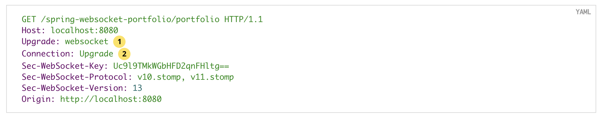
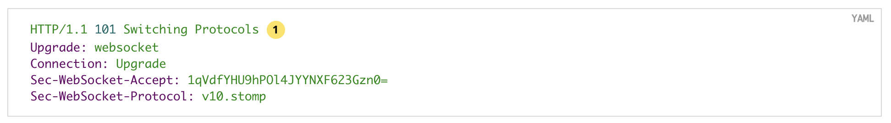

# Socket.io와 WebSocket의 차이
# 1. WebSocket

**서버와 클라이언트 간의 메시지 교환을 위한 통신규약(프로토콜)이다.** 

웹의 한계에서 벗어나 실시간으로 상호작용하는 웹 서비스를 만든다.

- http 프로토콜을 사용할 경우 주소가 http://~이듯이
- websocket 프로토콜을 사용하면 주소가 ws://~ 된다.

### 등장배경

HTTP 는 단방향 통신이다.

웹 소켓 이전에는 실시간 웹을 구현하기 위해 Polling, Streaming 등의 방식을 사용했다.

이는 각 브라우저마다 구현 방법이 달라 개발이 어려운 문제점이 있음.

이를 위해 HTML5 표준의 일부로 WebSocket이 등장.

## 1.1 특징

- **양방향(전이중) 통신(Full-Deplex)**
    - 통상적인 HTTP통신은 Client가 요청을 보낸경우에만 Server가 응답하는 하는 단방향 통신이지만, 웹소켓은 양방향 통신이 가능하다.
- **실시간 네트워킹** : 웹 환경에서 연속된 데이터를 빠르게 노출하는 것. ex)채팅, 주식
- 기존의 요청-응답 관계 방식보다 더 쉽게 데이터를 교환할 수 있다.
- http request를 그대로 지원하기 때문에 기존의 80,433 포트로 접속하므로 추가로 방화벽을 열지 않고 양방향 통신이 가능하다.
- HTTP 규격인 CORS적용이나 인증 등의 과정을 기존과 동일하게 사용할 수 있다.

## 1.2 문제점

- 아직 확정상태가 아니라 브라우저 별로 지원하는 버전이 다르고, 예전 브라우저는 지원하지 않음. (아직 완벽한 상용화x)
- 프로그램 구현에 보다 많은 복잡성을 초래한다.
    - 웹 소켓은 HTTP와 달리 Stateful protocol이기 때문에 서버와 클라이언트 간의 연결을 항상 유지해야 하며 만약 비정상적으로 연결이 끊어졌을때 적절하게 대응해야 한다. 이는 기존의 HTTP 사용시와 비교했을때 코딩의 복잡성을 가중시키는 요인이 될 수 있다.
- 서버와 클라이언트간의 Socket 연결을 유지하는 것 자체가 비용이 든다.

## 1.3 동작방식

웹 소켓은 전이중 통신이므로, 연속적인 데이터 전송의 신뢰성을 보장하기 위해 Handshake 과정을 진행한다.

기존의 다른 TCP 기반의 프로토콜은 TCP layer에서의 Handshake를 통해 연결을 수립하는 반면, 웹 소켓은 HTTP 요청 기반으로 Handshake 과정을 거쳐 연결을 수립한다.

1. 웹 소켓은 연결을 수립하기 위해 `Upgrade 헤더`와 `Connection 헤더`를 포함하는 HTTP 요청을 보낸다.

2. 통상적인 상태 코드 200 대신, 웹 소켓 서버의 응답은 다음과 같다.
    
    
    
    - `101 Switching Protocols`: Handshake 요청 내용을 기반으로 다음부터 WebSocket으로 통신할 수 있다.
    - `Sec-WebSocket-Accept`: 보안을 위한 응답 키
3. Handshake 과정을 통해 연결이 수립되면 응용 프로그램 계층 프로토콜이 HTTP에서 웹 소켓으로 업그레이드가 된다.
4. 업그레이드가 되면 HTTP는 사용되지 않고, 웹 소켓 연결이 닫힐 때까지 두 끝 점에서 웹 소켓 프로토콜을 사용하여 데이터를 주고 받게 된다.
5. 웹 소켓 연결은 주로 새로고침이나 창 닫기 등의 이벤트 발생 시 닫힌다.

## 1.4 대표적인 사용예시

- 페이스북과 같은 SNS APP
- LOL 같은 멀티플레이어 Game
- 위치 기반 APP
- 증권 거래 정보 사이트 및 APP
- 화상 채팅 APP
- 구글 Doc 같이 여러 명이 동시 접속해서 수정할 수 있는 Tool

# 2. Socket.io

웹소켓은 HTML5의 기술이기 때문에 오래된 버전의 웹 브라우저는 웹 소켓을 지원하지 않는다.
이를 해결하기 위해 나온 기술 중 하나가 Socket.io이다.

- **양방향 통신을 하기 위해 웹 소켓 기술을 활용하는 Node.js 라이브러리.**
- 웹소켓, 폴링, 스트리밍 등 다양한 방법을 하나의 API로 추상화한 것이다.
- 자바스크립트를 이용하여 브라우저 종류에 상관 없이 실시간 웹을 구현할 수 있다.
- HTTP Long Polling 또는 자동 재연결하는 Fallback과 같은 추가 보장을 제공한다.
- 편의성이 좋다.
- 방 개념을 이용하여 일부 클라이언트에게만 데이터를 전송하는 브로드 캐스팅이 가능함.
    - (편의성과 같은 맥락인데 제대로 이해못했음. 추가조사 필요 ([https://jangstory.tistory.com/12](https://jangstory.tistory.com/12)))
    - [https://velog.io/@fejigu/Socket.IO-client](https://velog.io/@fejigu/Socket.IO-client)

# 3. WebSocket vs Socket.io

## WebSocket

- HTML5 웹 표준 기술로, 서버와 클라이언트 간의 메시지 교환을 위한 통신규약이자만 완전 상용화단계는 아님
- 작동이 매우 빠르고 통신할 때 아주 적은 데이터를 사용한다.
- 이전 브라우저와 호환이 잘 안될 수 있다.

## Socket.io

- 프로토콜이 아닌 라이브러리이다.
- 모든 브라우저에서 사용할 수 있다.
- 같은 기능을 구현할 때, socket.io가 약간 느리지만, 편의성이 좋다.

# 4. 어떤 걸 사용할까?

- 서버에서 연결된 소켓(사용자)들을 세밀하게 관리해야하는 경우 브로드캐스팅이 있는 socket.io가 유지보수 측면에서 이점이 많을 수 있다. (편의성)
- 가상화폐 거래소처럼 데이터 전송이 많은 경우 빠르고 비용이 적은 WebSocket을 사용하는게 바람직 할 수 있다. (대용량데이터 처리 실시간)
- case by case다.
    
    → 웹 개발자가 프로젝트 개발시, 둘 중 하나를 사용했을때, 왜 사용했는지 등을 물어보는 것 같다. (socket.io를 사용했는데, 대용량 메시지가 들어오면 어떻게 처리할 건지 )
    

# 5. TCP/IP 소켓과 웹소켓 차이

<aside>
💡 issue : 웹소켓의 소켓이 TCP/IP소켓과 직접적으로 관련이 있는가? (이름 유사성)

</aside>

- Socket : 네트워크상에서 동작하는 프로그램 간 통신의 종착점. 1대1 통신의 경우 양측 다 소켓이 존재해야 통신이 가능. 현재 대부분의 통신은 TCP/UDP에 기반하므로 대부분의 네트워크 소켓은 인터넷 소켓이다.

## 5.1 결론
완전히 상반된 개념도 아니므로 완벽하게 차이를 비교하기도 힘들다.

## 5.2 차이점

### 동작 계층

- **소켓**은 인터넷 프로토콜에 기반하므로 TCP, UDP 가 속한 4계층(전송계층)에 위치한다.
- **웹 소켓**은 TCP에 의존하기는 하지만 7계층(응용계층)에 위치한다.

### 데이터 형식

- **소켓**은 4계층(전송계층)기반이므로, 단순히 바이트 스트림을 통한 데이터 전송이이므로 바이트로 이루어진 데이터를 다룬다.
- **웹소켓**은 7계층(응용계층)에서 기반하므로 메시지(데이터)형식 데이터를 다룬다.

---

# 면접질문

- socket.io와 websocket의 차이점을 설명해주세요.
    - [socket.io](http://socket.io/) 는 상용화되어 있으며 브라우저의 종류에 상관없이 다양한 방법의 웹 기술을 실시간으로 구현할 수 있도록 한 기술입니다 web socket 은 사용할 수 있는 웹 브라우저의 종류에 제약이 있으며 미래의 기술로 아직 인터넷 기업에서 상용화 되어있진 않습니다.

# 출처

- [https://www.peterkimzz.com/websocket-vs-socket-io/](https://www.peterkimzz.com/websocket-vs-socket-io/)
- [https://doozi0316.tistory.com/entry/WebSocket이란-개념과-동작-과정-socketio-Polling-Streaming](https://doozi0316.tistory.com/entry/WebSocket%EC%9D%B4%EB%9E%80-%EA%B0%9C%EB%85%90%EA%B3%BC-%EB%8F%99%EC%9E%91-%EA%B3%BC%EC%A0%95-socketio-Polling-Streaming)
- [https://choseongho93.tistory.com/266](https://choseongho93.tistory.com/266)
- [https://tecoble.techcourse.co.kr/post/2021-08-14-web-socket/](https://tecoble.techcourse.co.kr/post/2021-08-14-web-socket/)
- [https://gusrb3164.github.io/web/2021/10/28/websocket-socket/](https://gusrb3164.github.io/web/2021/10/28/websocket-socket/)

# 같이 보면 좋을 내용

- [websocket이전 HTTP기반 통신 방식 Polling, Long Polling, Streaming](https://github.com/psyStudy/CS_study/blob/main/Network/http%EC%9D%98%20%EC%8B%A4%EC%8B%9C%EA%B0%84%20%ED%86%B5%EC%8B%A0%EC%9D%84%20%EC%9C%84%ED%95%9C%20%EB%B0%A9%EB%B2%95.md)
