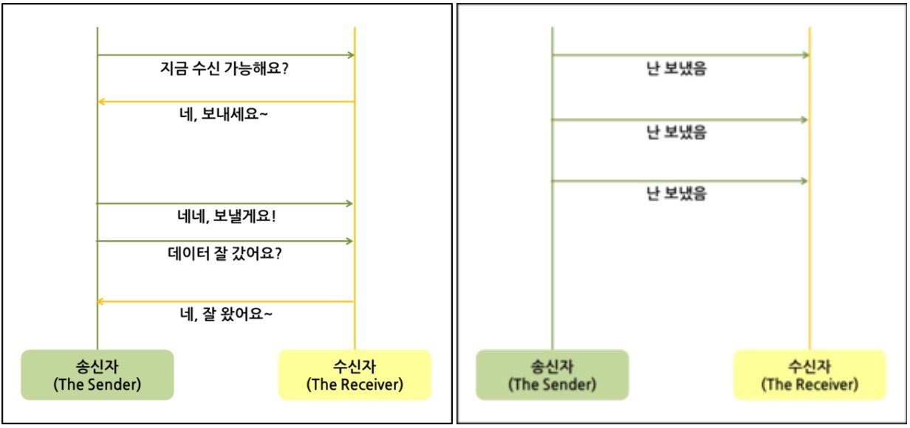

# TCP와 UDP

# 0. 개요

TCP와 UDP는 OSI 7계층의(~TCP/IP계층)의 전송 계층에서 사용되는 프로토콜이다.

- 전송 계층은 송신자와 수신자를 연결하는 통신서비스를 제공한다.
- 데이터의 전달을 담당하여 전달되는 패킷의 오류를 검사하고 재전송 요구를 하는 등의 제어를 담당한다.

# 1. TCP ; Transmission Control Protocal

TCP는 연결 지향적 프로토콜이다.

※ 연결 지향적 프로토콜 : 클라이언트와 서버가 연결된 상태에서 데이터를 주고 받는 프로토콜

- 장치들 사이에 논리적인 접속을 성립하기 위해 연결을 설정해 **신뢰성을 보장하는 연결형 서비스**.
  
- 연속성보다 신뢰성있는 전송이 중요한 경우(ex-파일전송)에 사용된다.
  
- 네크워크에 연결된 컴퓨터에서 실행되는 프로그램 간의 일련의 옥텟(데이터, 메시지, 세그먼트라는 블록단위)를 **안정적으로, 순서대로, 에러없이 교환할 수 있게 함.**
    - 옥텟 : octet, 컴퓨팅에서 8개의 비트가 한데 모인 것. 8비트를 명확하게 정의하기 위한 용어.(초기 컴퓨터는 1바이트가 항상 8비트를 의미한 것은 아니었음.)

## 1.1 특징

1. 연결형 서비스로 가상회선 방식을 제공한다.
   
    - 가상회선방식을 제공하는 것 = 발신지와 수신지를 연결하여 패킷을 전송하기 위한 논리적 경로를 배정하는 것
      
    - 3-way handshaking 과정을 통해 연결을 설정하고, 4-way hankshaking 과정을 통해 연결을 해제한다.
      
        - 3-way handshaking과정은 발신지와 수신지 사이에 논리적 접속(세션)을 성립하는 과정을 의미한다.
          
2. 흐름 제어(Flow control)
   
    - 데이터 처리 속도를 조절하여 수신자의 버퍼 오버플로우를 방지한다.
      
3. 혼잡 제어(Congestion control)
   
    - 네트워크 내의 패킷 수가 과도하게 증가하지 않도록 방지
      
4. 높은 신뢰성 보장
   
    - 신뢰성이 높은 전송을 하기 때문에 UDP보다 속도가 느리다.
      
5. 전이중(Full-Duplex), 점대점(Point to Point)방식

    - 전이중 : 전송이 양방향으로 동시에 가능
      
    - 점대점 : 각 연결이 정확히 2개의 종단점을 가지고 있음 = 멀티캐스트,브로드캐스트트는 불가

*※ TCP의 흐름제어와 혼잡제어 자세하게*

## 1.2 TCP 연결/해제

### 1.2.1 용어(?

- **SYN** : Synchronize sequence numbers : 연결 확인을 보내는 무작위의 숫자 값 = 내 말 들려?
- **ACK** : Acknowledgements : Client나 Sever로 부터 받은 SYN에 1을 더해 SYN을 잘 받았다는 응답 = 잘 들려!

### 1.2.2 TCP 연결 과정 (3-way handshaking)

```
1. Client → Server : 내 말 들려?
2. S → C : 어 잘 들려! 매 말은 들려?
3. C → Server : 잘 들려!

```
#### 상태 (연결시)

- **CLOSED** : 연결 수립을 시작하기 전의 기본 상태 (연결 없음)
- **LISTEN** : 포트가 열린 상태로 연결 요청 대기 중
- **SYN-SENT** : SYN을 요청한 상태
- **SYN-RECEIVED** : SYN요청을 받고 상대방의 응답을 기다리는 중
- **ESTABLISHED** : 연결 수립이 완료된 상태, 서로 데이터를 교환할 수 있다.


1. 먼저 Open 한 클라이언트가 **SYN**를 보내고 **SYN_SENT** 상태로 대기한다.

2. 서버는 **SYN-RECEIVED** 상태로 바꾸고 **SYN**과 응답 **ACK**를 보낸다.

3. **SYN**과 응답 **ACK**를 받은 클라이언트는 **ESTABLISHED** 상태로 변경하고 서버에게 응답 **ACK**를 보낸다.

4. 응답 **ACK**를 받은 서버는 **ESTABLISHED** 상태로 변경한다.

### 1.2.4 TCP 해제 과정 (4-way handshaking)

```
1. Client → Server : 나는 다 보냈어! 이제 끊자!
2. S → C : 알겠어! 잠시만~
3. S → C : 나도 끊을게!
4. C → S : 알았어!
```

#### 상태 (해제 시)
- **ESTABLISHED** : 연결 수립이 완료된 상태, 서로 데이터를 교환할 수 있다.
- **FIN-WAIT-1** : 자신이 보낸 FIN에 대한 ACK를 기다리거나 상대방의 FIN을 기다린다.
- **FIN-WAIT-2** : 자신이 보낸 FIN에 대한 ACK를 받았고, 상대방의 FIN을 기다린다.
- **CLOSE-WAIT** : 상대방의 FIN(종료 요청)을 받은 상태. 상대방 FIN에 대한 ACK를 보내고 어플리케이션에 종료를 알린다.
- **LAST-ACK** : COLSE-WAIT 상태를 처리 후 자신의 FIN 요청을 보낸 후 FIN에 대한 ACK를 기다리는 상태.
- **TIME-WAIT** : 모든 FIN에 대한 ACK를 받고 연결 종료가 완료된 상태. 새 연결과 겹치지 않도록 일정 시간 기다린 후 CLOSED로 전이 한다.


1. 먼저 close를 실행한 클라이언트가 **FIN**(연결 끊자!)을 보내고 **FIN-WAIT-1** 상태로 대기한다.

2. 서버는 **CLOSE**-**WAIT**으로 바꾸고 응답 **ACK**(알겠어! 잠시만~)를 전달한다. 동시에 해당 포트에 연결되어 있는 애플리케이션에게 close를 요청한다.

3.  **ACK**를 받은 클라이언트는 상태를 **FIN-WAIT-2**로 변경한다.

4. close 요청을 받은 서버 애플리케이션은 종료 프로세스를 진행하고 **FIN**(나도 끊을게!)을 클라이언트로 보내 **LAST_ACK** 상태로 바꾼다.

5. FIN**을** 받은 클라이언트는 **ACK**(알겠어!)를 서버에 다시 전송하고 **TIME-WAIT**으로 상태를 바꾼다. 
TIME-WAIT에서 일정 시간이 지나면 CLOSE 된다. ACK를 받은 서버도 포트를 CLOSED로 닫는다.

*※ TIME-WAIT : 먼저 연결을 끊는 쪽에서 생성되는 소켓으로, 혹시 모를 전송 실패에 대비하기 위해 존재하는 소켓이며,*
*TIME-WAIT이 없다면, 패킷의 손실이 발생하거나 통신자 간 연결 해제가 제대로 되지 않을 수 있다.*

#### issue 왜 해제는 4번 할까?
[참고링크](https://velog.io/@yhm8622/TCP-4-way-Handshake)
재편집

# 2. UDP ; User Datagram Protocol

UDP는 비연결형 프로토콜이다.

※ 연결을 위해 할당되는 논리적인 경로가 없고, 각각의 패킷은 다른 경로로 전송되며, 독립적인 관계를 지닌다.

- 신뢰성보다는 연속성있는 전송이 필요할 때(ex-실시간 스트리밍 서비스) 사용하는 프로토콜

#### issue 실시간 스트리밍인데 패킷이 바뀌면 안되지 않나요?
- 123456으로 보낸게 124536으로 오면 그대로 12456으로 스트리밍 되는 것.
- 극단적으로654321로 오지는 않는다.
- UDP는 전송 프로토콜이고, RTP등의 프로토콜에서 이를 해석할 때 처리해준다.
- '연속성'을 강조한 특징을 설명하는 예시로, 모든 스트리밍 서비스가 UDP를 사용하는 것은 아니다.
- 서비스가 추구하는 특징에 따라 그에 알맞은 프로토콜을 사용한다.
  - [EX) 넷플릭스는 TCP를 사용한다. (품질 중요시)](https://victoria-k.tistory.com/entry/%EC%99%9C-%EB%84%B7%ED%94%8C%EB%A6%AD%EC%8A%A4%EB%8A%94-%EB%B9%84%EB%94%94%EC%98%A4-%EC%8A%A4%ED%8A%B8%EB%A6%AC%EB%B0%8D%EC%97%90-UDP-%EB%8C%80%EC%8B%A0-TCP%EB%A5%BC-%EC%93%B0%EB%8A%94%EA%B0%80)


## 2.1 특징

**1. 비연결형 서비스로 데이터그램 방식을 제공한다.**

- 데이터의 전송 순서가 바뀔 수 있다.

**2. 데이터 수신 여부를 확인하지 않는다.**

- TCP의 3-way handshaking과 같은 연결을 설정하고 해제하는 과정이 존재하지 않는다.

**3. 신뢰성이 낮다.**

- 흐름 제어/혼잡제어가 없어서 제대로 전송되었는지, 오류가 없는지 확인할 수 없다.

**4. TCP보다 속도가 빠르다.**

- (2)연결 할당/해제,(3)흐름/혼잡 제어가 없기때문에 속도가 빠르고 네트워크 부하가 적다.

**5. 1:1 & 1:N & N:N 통신이 가능하다.**

# 3. TCP 와 UDP 비교



| 프로토콜 종류 | TCP | UDP |
| --- | --- | --- |
| 연결 방식 | 연결형 서비스 | 비연결형 서비스 |
| 패킷 교환 방식 | 가상 회선 방식 | 데이터그램 방식 |
| 전송 순서 | 전송 순서 보장 | 전송 순서가 바뀔 수 있음 |
| 수신 여부 확인 | 수신 여부를 확인함 | 수신 여부를 확인하지 않음 |
| 통신 방식 | 1:1 통신 | 1:1 OR 1:N OR N:N 통신 |
| 신뢰성 | 높다. | 낮다. |
| 속도 | 느리다. | 빠르다. |

---

# 면접질문

- TCP와 UDP의 차이점을 설명해 주세
- 3 way-handshaking 얘기 해주셨는데, TCP 통신은 종료시에도 3 way-handshaking을 사용하나요?
    - TCP는 3 way-handshaking 과정을 통해 연결을 설정하고, 4 way-handshaking 과정을 통해 연결을 해제합니다.
- 3 way-handshake와 4 way-handshake를 설명해주세요.
- UDP는 항상 신뢰성을 보장하지 않나요?
    - UDP자체에서 보장하지 않는 것 뿐이지, 개발자가 직접 신뢰성을 보장하도록 할 수 있습니다.
    - HTTP/3의 경우 UDP기반의 QUIC라는 프로토콜을 사용하는데, UDP자체는 신뢰성을 보장하지 않지만, 추가적인 정의를 통해 신뢰성을 보장 받을 수 있습니다.
- TCP의 흐름제어와 혼잡제어를 설명하세요.
    - 흐름 제어 방법으로는 Stop and wait과 Sliding window가 있습니다. Stop and wait은 데이터 전송 후 매번 ACK을 통해 잘 도착했음을 확인하고 다음 데이터를 보내는 방식입니다. Sliding window는 버퍼가 사용되어서 window크기만큼 ACK 없이 데이터를 보낼 수 있는 방식입니다.
    - 혼잡 제어 방법으로는 Stop and Wait ARQ, Go-Back-N ARQ, Selective-Repeat ARQ가 있습니다. Stop and wait ARQ는 수신 측에서 NACK을 전송하거나 주어진 시간 안에 수신 측에서 ACK을 보내지 않으면 송신 측에서 데이터를 재전송하는 방식입니다. Go back N ARQ는 송신 측에서 데이터를 순차적으로 보내면 수신 측에서 지금까지 받은 데이터에 대한 ACK을 한 번만 보내는 방식입니다. 만약 NACK을 받으면 이전에 보낸 데이터들을 모두 다시 보냅니다. Selective repeat ARQ는 Go back N ARQ와 비슷하지만 NACK을 받은 데이터만 다시 보낸다는 차이점이 있습니다.

# 출처

- [https://dev-coco.tistory.com/144](https://dev-coco.tistory.com/144)
- [https://dev-coco.tistory.com/161](https://dev-coco.tistory.com/161)
- [https://baebalja.tistory.com/443](https://baebalja.tistory.com/443)
- [https://medium.com/pplink/%EC%8B%A4%EC%8B%9C%EA%B0%84-%EC%8A%A4%ED%8A%B8%EB%A6%AC%EB%B0%8D-%EC%96%B4%EB%96%BB%EA%B2%8C-%EC%A0%84%EC%86%A1%ED%95%98%EB%8A%94%EA%B1%B0%EC%95%BC-a3e38716e06d](https://medium.com/pplink/%EC%8B%A4%EC%8B%9C%EA%B0%84-%EC%8A%A4%ED%8A%B8%EB%A6%AC%EB%B0%8D-%EC%96%B4%EB%96%BB%EA%B2%8C-%EC%A0%84%EC%86%A1%ED%95%98%EB%8A%94%EA%B1%B0%EC%95%BC-a3e38716e06d)

# 추천

- TCP의 흐름제어,혼잡제어 : [https://rok93.tistory.com/entry/네트워크-TCP-흐름제어혼잡제어](https://rok93.tistory.com/entry/%EB%84%A4%ED%8A%B8%EC%9B%8C%ED%81%AC-TCP-%ED%9D%90%EB%A6%84%EC%A0%9C%EC%96%B4%ED%98%BC%EC%9E%A1%EC%A0%9C%EC%96%B4)
- [https://gyoogle.dev/blog/computer-science/network/흐름제어 & 혼잡제어.html](https://gyoogle.dev/blog/computer-science/network/%ED%9D%90%EB%A6%84%EC%A0%9C%EC%96%B4%20&%20%ED%98%BC%EC%9E%A1%EC%A0%9C%EC%96%B4.html)
