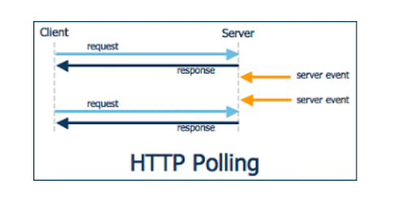
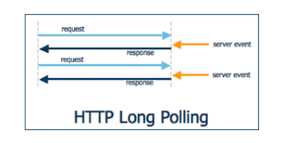
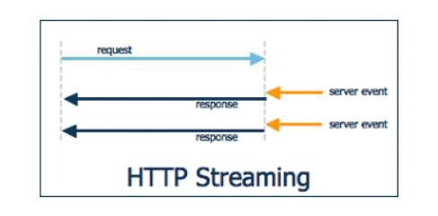

# http의 실시간 통신을 위한 방법

Http통신은 클라이언트에서 서버로의 단방향 통신을 위해 만들어진 기술로, Web Socket이 나오기전 실시간 통신을 위해 약간의 트릭을 통해 실시간인 것 처럼 작동하게 하는 기술을 만들었다.

(http에서 서버는 클라이언트로 요청할 수 없다.)

→ Polling / Long Poling / Streaming

# 1. Polling

**가장 기본적인 데이터 처리방식으로, 특정 주기를 가지고 서버에 http request하는 방식이다.**

- 언제 통신이 발생할지 예측이 불가능하기 때문에 클라이언트가 평범한 http request를 일정한 주기로 서버에 요청하여 이벤트 내용을 전달받는다.
- 간단하지만, 예측이 불가능하다는 점에서 클라이언트가 계속적으로 요청을 하므로 클라이언트가 많아지면 서버의 부담이 급증한다.
- 실시간 통신이라고 부르기는 하지만, 실시간 정도의 빠른 응답은 어렵다.

## 특징

- 주기적으로 물어보므로 응답 간격을 일정하게 할 수 있음
- 주기적으로 몰아서 물어보는게 가능하므로 일괄처리되어 db튜닝 효과가 있음
    - 그래프를 그리거나 대용량 데이터를 처리해야한다면 오히려 매우 간단하고 최적화된 방식이다.
- 보낼 데이터가 없어도 계속 데이터를 줘야하므로 서버의 리소스가 낭비됨

# 2. Long Polling

Polling과 비슷한 기법으로, 실시간 데이터 처리가 가능하다. 

클라이언트에서 서버로 http request를 보내고, 이 상태로 계속 기다리다가 서버에서 해당 클라이언트로 전달한 이벤트가 있다면 그 순간 response 메시지를 전달하며 연결이 종료된다.

- 간단하게 말하면, 일단 보내보고 timeout이 될 때까지 무한정 기다린다. 이후 끊기면 다시 연결하고 또 무한정 기다린다.
- 해당 작업이 완료된 이후에는 클라이언트에서 곧바로 다시 http request를 보내 서버의 다음 이벤트를 기다리게 된다.
- Polling과 비교했을때 서버의 부담이 줄어든다.
- 하지만, 클라이언트에게 동시에 많은 양의 메시지가 올 경우 Polling과 별 차이 없게되며,
- 다수의 클라이언트에게 동시에 이벤트가 발생할 경우 곧바로 다수의 클라이언트가 서버로 접속을 시도하게 되어 서버의 부담이 급증한다.

## 특징

- 항상 연결이 유지되어있다.
- 변경에 매우 민감아게 반응하며 사실상 실시간으로 통신가능하다.
- 데이터가 주어지는 즉시 바로바로 반응하고 보내므로 요청간격이 줄어들면 polling보다 훨씬 데이터를 많이 보낸다.

# 3. Streaming

**일반적은 TCP Connection과 비슷하며, 클라이언트와 서버간 연결 된 연결 통로로 데이터를 보내는 방식.**

- Long Polling과 마찬가지로 처음에는 클라이언트에서 서버로 http request를 보냄.
- 서버에서 클라이언트로 이벤트를 전달할 때, 해당 요청을 끊지 않고 필요한 메시지만 보내기를 반복하는 방식이다.
- 서버에서 메시지를 보내고 나서 다시 http request연결을 하지 않아도 되어 Long Polling 보다 부담이 덜 하다.
- 서버에게 연결요청을 보내고 계속 응답 데이터를 다운로드함. 이벤트가 발생하면 그 응답도 보냄.
- 클라이언트가 서버에 데이터 보내기 힘들어 질 수 있다.

# 4. 한계와 해결책

세 가지 방법 모두 http 통신이므로 요청,응답 시 header가 불필요하게 커지는 단점이 있다.

Long Polling, Streaming의 경우 서버에서 클라이언트로 메시지를 보낼 수 는 있지만, 클라이언트에서 서버로 보낼때는 조금 어럽다는 문제가 있다.

따라서 정식으로 클라이언트와 서버간 어려움없이 양방향 통신을 가능하게 하기 위해 [Web Socket](https://github.com/psyStudy/CS_study/blob/main/Network/Socket%20io%EC%99%80%20WebSocket%EC%9D%98%20%EC%B0%A8%EC%9D%B4.md)이 만들어졌다.

웹 소켓이 완전히 상용화된 것이 아니므로 여전히 종종 사용하고 있다.

---

# 면접질문

- Long Polling
- http에서는 양방향 통신을 어떻게 했나요?
- Websocket을 메인으로 이전에는 어떻게 통신했는지..? 물어볼 수 있다.

# 출처

- [https://velog.io/@hahan/Polling-Long-Polling-Streaming](https://velog.io/@hahan/Polling-Long-Polling-Streaming)
- [https://forward-movement.tistory.com/129](https://forward-movement.tistory.com/129)
