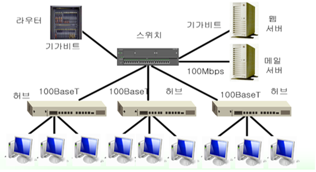

# 네트워크 기기
허브, 스위치, 라우터 등

# A. 1계층 장비

pysical layer : 실제 장비들을 연결

### A.1 허브 Hub⭐

- 여러 대의 컴퓨터를 연결하여 네트워크로 보내거나,
- 하나의 네트워크로 수신된 정보를 여러 대의 컴퓨터로 송신하기 위한 장비
- 연결된 모든 장치들에게 모두 보냄( 그래서 가정용이 아니고서는 잘 사용안함)

### A.2 리피터 Reaperter

- 디지털 신호를 증폭시켜주는 역할
- 신호가 약해지지 않고, 컴퓨터로 수신되도록 하는 장비

# B. 2계층 장비

DataLink layer : 오류와 흐름제거 → 신뢰성 있는 데이터 전송

### B.1 브릿지 Bridge

- 두 개의 근거리 통신망(LAN)을 서로 연결해주는 통신망 연결장치
- 스위치가 나오기 전 브릿지가 주로 사용

### B.2 L2 스위치⭐

💡[L2,L3,L4 스위치는 OSI 중 어떤 계층에서 수행되는가에 따라 구분](#💡스위치)

- 느린 전송속도의 브릿지, 허브의 단점을 개선하기 위한 장치 → 원하는 목적지로 전송
- 출발지에서 들어온 frame 을 목적지 MAC주소 기반으로 빠르게 전송시키는 통신장치
- 3가지 방식 중 하나 사용
    - Store and Fowarding : 데이터를 전부 받은 후 다음 처리를 하는 방식
    - Cut Through : 데이터의 목적지 주소만 확인 후 바로 전송 처리하는 방식
    - Fragment Free : 프레임의 앞 64바이트만 읽어 에러를 처리하고, 목적지 포트로 전송하는 방식

### B.3  NIC; Network Interface Card

- 외부 네트워크와 접속하여 가장 빠른 속도로 데이터를 주고 받을 수 있게 컴퓨터 내에 설치되는 장치

### B.3 스위칭 허브

- 스위치 기능을 가진 허브 (사용되는 대부분의 허브는 스위칭 허브임)

# C. 3계층 장비

Network layer : 올바른 경로 선택 지원

### C.1 라우터 Router⭐

- LAN과 LAN을 연결하거나 LAN과 WAN을 연결하기 위한 인터넷 네트워킹 장비
- **최종 목적지에 가기 위하여 거쳐야하는 많은 경로들 중에 적절한 통신 경로를 결정하기 위하여 한 통신망에서 다른 통신망으로 데이터 패킷을 전송하는 장치**
- 패킷의 위치를 추출하여, 그 위치에 대한 최적의 경로 지정
- 그 경로를 따라 데이터 패킷을 다음 장치로 전송시킴
- 라우팅 프로토콜은 경로 설정을 하여, 원하는 목적지까지 지정된 데이터가 안전하게 전달되도록 한다.

### C.2 게이트 웨이 Gateway

- 프로토콜을 서로 다른 통신망에 접속할 수 있게 해주는 장치
- LAN에서 다른 네트워크에 데이터를 보내거나, 다른 네트워크로부터 데이터를 받아들이는 출입구 역할

### C.3 L3 스위치

- 3계층에서 네트워크 단위들을 연결하는 통신 장비
- IP레이어에서의 스위칭을 수행하여 외부로 전송
- 라우터와의 경계가 모호함
- 백본 스위치의 역할을 대신 하기도

### C.4 유무선 인터넷 공유기

- 외부로부터 들어오는 인터넷 라인을 연결하여 유선으로 여러 대의 기계를 연결 or 무선 신호로 송출
- 여러 대의 컴퓨터가 하나의 인터넷 라인을 공유할 수 있도록 하는 네트워크 장비

### C.5 망(백본) 스위칭 허브

- 광역 네트워크를 커버하는 스위칭 허브
- ex) 경남권 스위칭, 부산권 스위칭 등 대단위 지역 커버

# D. 4계층 장비

전송 계층 : 송신, 수신 프로세스 간의 연결

### D.1 L4 스위치

- 4계층에서 네트워크 단위들을 연결하는 통신장비
- TCP/UDP 등의 스위칭 수행
- FTP, HTTP 등을 구분하여 스위칭 하는 로드 밸런싱 가능
- 정교한 로드 밸런싱 불가 (애플리케이션 레이어에서 파악이 가능한 이메일 내용 등)
- 4계층 정보인 TCP/UDP 포트번호를 분석하여 포워딩을 결정하고, QoS와 GLB/SLB 기능을 제공하는 스위치
    - QoS;Quality of Service : 응용 프로그램, 사용자, 데이터 흐름 등에 우선 순위를 정하여 데이터 전송에 특정 수준의 성능을 보장하기 위한 능력
    - GLB; Gateway Load Balancing : AWS 로드밸런서 서비스 타입중 하나로 외부에서 유입돼는 트래픽과 외부로 나가는 트래픽을 다른 네트워크(VPC)의 게이트웨이 역할로 가상어플라이언스로 라우팅할 수 있도록 해주는 서비스 입니다
    - SLB; Serever Load Balancing : 여러 대의 서버를 마치 하나의 서버처럼 동작시킴으로써 성능을 쉽게 확장하게 하고, 서버의 장애 발생 시에도 타 서버로 운영이 가능하게 하여 신뢰성을 향상시키기 위한 방법.

# 💡스위치

## 1. 정의

- 허브의 확장된 개념으로 기본 기능은 허브와 동일하지만, 전송 중 패킷 충돌이 일어나지 않도록 패킷의 목적지로 지정할 포트를 직접 전송함.
- 스위치에서 패킷의 목적지 주소를 기준으로 보내는 곳과 받는 곳을 계산하여, 해당 포트를 1:1로 연결 = 스위칭 switching
- 스위칭은 정보 전달의 수단과 회선의 효율적 운용을 위해 입출력 사태를 감시하며, 전송로의 장애 발생 시 현재 상태에서 예비 상태로 전환한다.

## 2. 특징

- 패킷을 보내는 노드와 받는 노드를 1:1로 연결 = 충돌이 발생x,  빠른 속도 전송
- 두 개의 노드가 통신하는 동안 다른 노드들도 서로간의 통신이 가능하며, 이더넷에서 높은 효율을 갖는다.
- 노드의 수가 증가해도 속도의 저하가 일어나지 않으며, 패킷의 감청이 어려운 구조이므로 보안성이 높다.
- 기본적으로 Processor, RAM, OS를 탑재하므로 많은 부가 기능을 갖는다.

## 3. 장점

- 완전 이중화 Fault-Tolerant 구성이 가능, 대역폭 비용이 낮아짐.
    - Fault-Talerant(장애 허용 시스템) : 컴퓨터 시스템이란 시스템내의 어느 한 부품 또는 어느 한 모듈에 Fault (장애)가 발생하더라도 시스템운영에 전혀 지장을 주지 않도록 설계된 컴퓨터 시스템이다.
- 트래픽 제어가 상대적으로 높고, 포트 당 속도가 일정하게 보장
- 여러 노드에서 동시 통신을 할 때 속도 저하가 없고, 성능이 향상
- 전이중 통신 모드로 네트워크상의 불필요한 패킷의 흐름을 막으며, 충돌이 발생하지 않아 빠른 속도의 전송이 가능.
- 각 데이터 단말 장치(DTE;Data terminal equipment)는 스위치를 몰라도 데이터 전송에는 상관 없으며, 많은 부가 기능이 있다.

## 4. 계층별 스위치

‘어떤 주소’를 가지고 스위칭 하느냐에 따라 L2,L3,L4로 구분

L2-MAC 주소, L3-프로토콜 주소, L4-세션주소

### 4.1 Layer2 스위치

- L2 스위치로 가장 흔히 볼수 있는 스위칭 방식이며, 다른 방식에 비해 저렴하다.

- 패킷의 MAC 주소를 읽어 스위칭을 하고, MAC이 OSI 계층 중 2 계층에 해당하기 때문에 Layer 2 스위치라 한다.

- 기본적인 동작은 브리지나 스위칭 허브는 모든 자료를 보내는 곳으로 수신 번지를 전송한다.

- 브리지는 어떤 포트에서 받은 데이터를 다른 모든 포트로 전송하나 L2 스위치 허브에서는 여러개의 포트 중 특정 포트로만 전송한다.

>☑️ **<동작 원리>**
>
>- 다른 스위치처럼 프로세서,메모리,펌웨어(운영체제)가 담겨 있는 FLASH ROM으로 이루어져 있다.
>
>- 부팅이 되면 L2스위치는 각 포트별로 연결되어 있는 노드의 상태를 확인한다.
>
>- 각 노드의 MAC 주소를 알아내서 이것을 메모리에 적재하게 되고 , 패킷이 전달될 때 이 정보를 바탕으로 스위칭하게 된다.
>
>. 스위치의 운영 체제가 적재되거나 스위칭을 할 때 각 포트별 주소 정보가 저장된다. - 스위칭 허브 메모리
>
>- 스위칭 허브를 선택할 때 스위칭 허브가 얼마만큼의 메모리와 어느 정도의 주소 테이블을 저장할 수 있는지를 확인한다.
>
>- 보통의 스위치는 메모리 용량 이상의 주소가 저장될 경우(연결 노드가 많은 경우) 스위칭 기능이 중지되고, 더미 허브와 같은 방식으로 동작한다.
>
>**장점** : 구조가 간단하며, 신뢰성이 높다. / 가격이 저렴하고, 성능이 높다.
>
>**단점** : Broadcast 패킷에 의해 성능 저하가 발생한다. - 라우팅이 불가능 / 상위 레이어 프로토콜을 이용한 스위칭이 불가능 하다.

### 4.2 Layer 3 스위치

L3 스위치로 포트간 패킷 스위칭을 위해 패킷의 IP나 IPX 주소를 읽어서 스위칭을 하며, 통신 경로를 한 번만 설정한다.

- 해당 프로토콜을 쓰는 패킷에 대해 스위칭이 가능하며, IP나 IPX 주소가 OSI 7 계층 중 3 계층에 해당하기 때문에 Layer 3 스위치라 한다.

- L2 스위치에 라우팅(Routing) 기능을 추가하고, 대부분의 고성능 하드웨어를 기초로 하였다. - 기본 구성은 L2와 동일

>☑️ **<동작원리>**
>
>- 부팅 시 각 포트로 연결된 노드의 상태를 확인하고, 노드의 주소를 테이블의 메모리에 적재하여 패킷이 전달될 때 이 정보를 바탕으로 스위칭을 한다.
>
>- L3은 L2에 비해 고급 기능을 지원하므로 L2는 일부 고급 기종에서만 스위치에 IP주소를 할당하지만 L3은 기본적으로 스위치 자체에 IP 주소를 할당한다.
>
>- 각 포트별 IP 주소 할당 내역 등을 설정하여 스위칭 할 때 설정된 값을 이용한다. - 기본 설정 모드를 지원
>
>**장점** : Broadcast 트래픽으로 전체 성능 저하를 막을 수 있다. / 트래픽 체크, 가상 랜 등의 많은 부가 기능을 갖고 있다.
>
>**단점** : 특정 프로토콜을 이용해야 스위칭을 할 수 있다. / 대부분의 트래팩이 서브텟의 한계를 넘는다.

### 4.3 Layer 4 스위치

L3과 같이 프로토콜을 기반으로 하며, 어플리케이션별로 우선 순위를 두어 스위칭이 가능하다.

- 여러대의 서버를 1대처럼 묶을 수 있는 부하 분산 (Load Balancing) 기능을 제공한다. - 많은 양의 트래픽을 여러 서버로 분산 가능

- 각 제조 업체별로 설정 방법 및 제공 기능이 다르므로 , 특별한 표준을 지정하기가 힘들다.

>☑️ **<동작원리>**
>
>- L3 스위치와 유사한 구조와 동작 원리를 갖고 있지만 가상 랜 기능과 그룹화, 부하 분산 등의 고급 설정이 추가로 포함되는 점이 다르다.
>
>- TCP/IP 포로토콜을 기반으로 동작하는 것이 대부분이며, 포트 번호를 이용한 스위칭 까지도 가능하다.
>
>- 포트 번호는 수신 컴퓨터에서 IP 패킷의 형태로 결정하여 상위 계층으로 전달한다.
>
>**장점** : 보안성이 높고 고급 스위칭 설정이 가능하다. - 상황에 적절한 설정 / 용량에 관계 없이 네트워크의 성능 개선에 기여한다.
>
>**단점** : 프로토콜에 의존적이며, 설정이 복잡하다. / 고가의 장비로 L2,L3 스위치와 적절한 혼합 배치가 필요하다.

---

# 면접질문

- 스위치와 허브의 차이점은?(+라우터 까지)
    - https://velog.io/@yanghl98/CS-%EB%A9%B4%EC%A0%91%EC%A7%88%EB%AC%B8-%EB%8C%80%EB%B9%84-%EB%84%A4%ED%8A%B8%EC%9B%8C%ED%81%AC

# 출처

- https://gaebom.tistory.com/62
- https://yys630.tistory.com/27
- [https://kkamagistory.tistory.com/205](https://kkamagistory.tistory.com/205)
- [https://jaynamm.tistory.com/entry/네트워크-네트워크-장비브릿지-스위치-라우터](https://jaynamm.tistory.com/entry/%EB%84%A4%ED%8A%B8%EC%9B%8C%ED%81%AC-%EB%84%A4%ED%8A%B8%EC%9B%8C%ED%81%AC-%EC%9E%A5%EB%B9%84%EB%B8%8C%EB%A6%BF%EC%A7%80-%EC%8A%A4%EC%9C%84%EC%B9%98-%EB%9D%BC%EC%9A%B0%ED%84%B0)

# 참고

- 허브와 스위치 차이 : [https://blog.naver.com/newyks/150183058388](https://blog.naver.com/newyks/150183058388)
- 장애허용시스템 : [https://m.blog.naver.com/PostView.naver?isHttpsRedirect=true&blogId=unsa94&logNo=140016461423](https://m.blog.naver.com/PostView.naver?isHttpsRedirect=true&blogId=unsa94&logNo=140016461423)
- SLB : [https://net-gate.tistory.com/15](https://net-gate.tistory.com/15)
