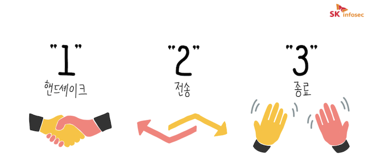

# 대칭키_공개키_TSL_SSL
## 대칭키


암호화 키와 복호화 키가 동일하기 때문에, 어떠한 정보가 대칭키를 통해 암호화되었다면 똑같은 키를 갖고 있는 사용자가 아니면 해당 정보를 확인할 수 없음 

```sql
ex)
부산에 살고 있는 철수는 A라는 열쇠로만 열 수 있는 보물상자를 서울에 있는 영희에게 안전하게 전달하고 싶음
-> 철수는 보물상자를 영희에게 보내는 것은 물론이고, 이 상자를 열 수 있는 A 열쇠도 안전하게 전달해야 함
-> 보물상자와 함께 열쇠를 보내면 중간에 다른 사람이 가로채 상자를 열어볼 수 있기 때문에, 열쇠는 보물상자와는 다른 경로로 안전하게 영희에게 전달되어야 함 
```

- 장점
    - 공개키 암호화 방식에 비해서 속도가 빠름
- 단점
    - 키를 교환(배송)하는 도중 키가 탈취될 수 있음
    - 관리해야 할 키가 방대하게 많아질 수 있음
- 해결방법
    - 키의 사전 공유 → 안전한 방법으로 키를 사전에 건네줌(직접 전달 등)
    - 키 배포센터(KDC)에 의한 배송 → 송신자와 키 배포센터 사이에서만 키를 사전에 공유하고, 통신 때마다 세션(임시) 키 생성해서 수신자와 공유 
    키 배포센터의 부하 발생 가능, 키 배포센터가 공격 받을 수 있다는 문제
        
        
        
    
    - Diffie-Hellman 키 교환에 의한 해결 ([https://ko.wikipedia.org/wiki/디피-헬먼_키_교환](https://ko.wikipedia.org/wiki/%EB%94%94%ED%94%BC-%ED%97%AC%EB%A8%BC_%ED%82%A4_%EA%B5%90%ED%99%98))
        
        ```sql
        앨리스와 밥이 공개된 통신망에서 디피-헬먼 키 교환을 하기 위해서는 다음과 같은 절차를 거침
        
        1. 앨리스가 소수 p, 그리고 1부터 p-1까지의 정수 g를 선택하여 사전에 밥과 공유함
        2. 앨리스가 정수 a를 선택함. 이 정수는 외부에 공개되지 않으며, 밥 또한 알 수 없음
        3. 앨리스가 'g^a를 p로 나눈 나머지(A)'를 계산함
        4. 밥이 마찬가지로 정수 b를 선택하여 'g^b를 p로 나눈 나머지(B)'를 계산함
        5. 앨리스와 밥이 서로에게 A와 B를 전송함
        6. 앨리스가 B^a mod p를, 밥이 A^b mod p를 계산함
        
        마지막 단계에서 
        B^a mod p = (g^b)^a mod p = g^ab mod p, 
        A^b mod p = (g^a)^b mod p = g^ab mod p이며 
        따라서 앨리스와 밥은 g^ab mod p라는 공통의 비밀 키를 공유하게 됨
        앨리스와 밥 이외의 인물은 a와 b를 알 수 없음
        ```
        
        → 충분히 안전하지 못한 난수 생성 알고리즘을 사용할 경우, 공격자가 예측할 수 있다는 단점
        
    - 공개키 암호화에 의한 해결

<br></br>

## 공개키(비대칭키)
모든 사람이 접근 가능한 공개키와 자신만이 가지고 있는 개인키를 가지며, 공개키로 암호화를 하는지 개인키로 암호화를 하는지에 따라 사용 분야가 달라짐

1. **공개키로 암호화를 하면 데이터 보안에 중점을 둔 것**
    
    
    

1. **개인키로 암호화를 하면 인증 과정에 중점을 둔 것**
    
    암호화된 데이터가 공개키로 복호화 된다는 것은 공개키와 쌍을 이루는 개인키에 의해서 암호화되었다는 것을 의미! 즉 데이터 제공자의 신원 확인이 보장된다는 것
    
    
    

- 공개키는 키가 공개되어 있기 때문에 따로 키 교환이나 분배를 할 필요가 없어짐
- 공개키로 암호화를 하는 경우 → 중간 공격자가 B의 공개키를 얻는다고 해도, B의 개인키로만 복호화가 가능하기 때문에 기밀성을 제공함
- 속도가 느리다는 단점
  
---
<br></br>
## SSL/TLS


기존 OSI 7계층에서, 응용 계층과 전송 계층 사이에 ‘보안 계층’이라는 독립적인 프로토콜 계층을 만듦

- **SSL(Secure Sockets Layer)과 TLS(Transport Layer Security)가 보안 계층에 속하는 프로토콜**
- HTTPS는 SSL 또는 TLS 위에 HTTP 프로토콜을 얹어 보안된 HTTP 통신을 하는 것
- TLS는 SSL의 후속 버전이지만, SSL이 일반적으로 더 많이 사용되는 **용어**



- SSL은 TCP 기반 프로토콜이기 때문에, 먼저 TCP 3-way Handshake를 수행하고 SSL Handshake를 수행함
- SSL Handshake를 통해 협상이 완료(어떤 데이터를 주고 받을지, 어떤 방법을 사용할지)되면, SSL 세션이 생성되고 클라이언트와 서버는 원하는 데이터를 주고받게 됨
- 데이터 전송의 끝을 서로에게 알리며 세션을 종료함(사용된 대칭키를 폐기함)

<br></br>
### TLS
인터넷에서 정보를 암호화해서 송수신하는 프로토콜, SSL의 후속 버전

- 흔히 SSL이라고 부르는 것은 대부분 TLS이다!
- SSL은 POODLE, DROWN 등의 취약점이 발견되어 현재에는 거의 사용되지 않음
    - POODLE - SSL3.0으로 연결한 뒤 패딩 오라클 공격을 통해 암호화된 통신내용을 복호화하는 공격 기법
    - DROWN - SSL2.0을 사용하는 서버에 악성패킷을 보내 인증서 키 값을 알아내고 키 값을 이용해 암호화된 통신 내용을 복호화해 주요 정보를 탈취

<br></br>
### SSL 인증서
HTTPS 프로토콜을 사용하기 위해서는 인증기관(CA)로부터 SSL 인증서를 발급받아야 함

1. (서버) 서버의 공개키와 개인키를 생성함
2. (서버→CA) 인증서를 발급받기 위해, 서버는 CA에게 공개키와 서버의 각종 정보를 전달함
3. (CA) 서버로부터 받은 정보(서버의 공개키 포함)들을 담아 SSL 인증서를 발급함
4. (CA) 인증서를 암호화하기 위해, CA의 공개키와 개인키를 생성함
5. (CA) CA의 개인키를 이용해 SSL 인증서를 암호화함
6. (CA→서버) 암호화된 SSL 인증서를 다시 서버한테 전달함

<br></br>
### TLS(SSL) Handshake의 동작 과정


위 그림에서 노란색 플로우가 SSL Handshake 과정임

1. **Client Hello** (Client → Server 연결을 시도함)
    - 클라이언트에서 서버로 패킷을 전송함
    - 전송되는 패킷에는 자신이 사용 가능한 cipher suite 목록, 세션 ID, SSL 프로토콜 버전 등이 포함됨
        - cipher suite - 어떤 프로토콜(TLS/SSL)을 사용할지, 인증서 검증/데이터를 어떤 방식으로 암호화할지

1. **Server Hello** (Server → Client 응답)
    - Client Hello 패킷에 대해 서버가 응답함
    - 서버의 응답은 클라이언트에서 받은 cipher suite 목록 중 선택한 1개의 cipher suite, SSL 프로토콜 버전 등이 포함됨

1. **Certificate, (Server Key Exchange), Server Hello Done**
    - Server Hello 패킷 외에 Certificate라는 내용의 패킷(**서버의 SSL 인증서 내용**이 포함)을 전송함
    - 만약 Certificate 패킷 내에 **서버의 공개키**가 없는 경우, 서버가 직접 전달함
    - 서버가 행동을 마쳤다는 의미로 Server Hello Done을 보냄

1. **클라이언트에서 서버의 SSL 인증서 검증**
    - **서버의 SSL 인증서**는 CA의 공개키를 이용해서 복호화할 수 있음
    - 클라이언트가 CA의 공개키를 이용해 인증서를 복호화했을 때, 복호화가 되었다는 것은 인증서는 해당 CA에서 발급되었다는 것을 검증하는 것
    - 클라이언트가 웹 브라우저/모바일 기기일 경우에는, 인증서를 발급하는 주요 인증기관(CA)의 리스트와 공개키를 가지고 있음 → 리스트에 없다면 외부 인터넷을 통해 인증기관의 정보와 공개키를 확보함

1. **Client Key Exchange, Change Ciper Spec**
    - 클라이언트와 서버 서로의 신원 검증 완료! 이제 클라이언트가 서버와 데이터를 안전하게 주고받기 위해 전달하려는 데이터를 암호화해야 함
    - 클라이언트는 데이터를 암호화하기 위한 **대칭키**를 생성함
    - 대칭키를 탈취당하지 않고 서버에 안전하게 전달하기 위해, **서버의 공개키로 암호화**해서 서버에게 전달함 → Client Key Exchange
    - 클라이언트는 Change Ciper Spec을 통해 SSL Handshake의 완료를 알림

1. **Change Ciper Spec**
    - 대칭키는 공개키로 암호화되었기 때문에, 서버의 비밀키로 복호화해서 얻을 수 있음
    - 이제 서버와 클라이언트 모두 동일한 대칭키를 가지고 있기 때문에, 통신할 수 있게 됨!
    - 서버도 Change Ciper Spec을 통해 SSL Handshake의 완료를 알림

<br></br>
<br></br>

### 면접질문
1. SSL Handshake란?
2. 대칭 키와 비대칭 키에 대해 설명해보세요
3. SSL Handshake 과정을 손으로 그려 보세요
4. HTTPS와 SSL은 같은 것일까? SSL하고 TLS는 어떤 점에서 다른가?

<br></br>
### 출처
[https://www.uname.in/129](https://www.uname.in/129)      
[https://universitytomorrow.com/22](https://universitytomorrow.com/22)      
[https://whitehatstory.tistory.com/72](https://whitehatstory.tistory.com/72)     
[https://ko.wikipedia.org/wiki/디피-헬먼_키_교환](https://ko.wikipedia.org/wiki/%EB%94%94%ED%94%BC-%ED%97%AC%EB%A8%BC_%ED%82%A4_%EA%B5%90%ED%99%98)      
[https://brunch.co.kr/@artiveloper/24](https://brunch.co.kr/@artiveloper/24)      
[https://nuritech.tistory.com/25](https://nuritech.tistory.com/25)      
[https://blog.naver.com/skinfosec2000/222135874222](https://blog.naver.com/skinfosec2000/222135874222)      
[https://brownbears.tistory.com/402](https://brownbears.tistory.com/402)       
[https://www.cloudflare.com/ko-kr/learning/ssl/what-happens-in-a-tls-handshake/](https://www.cloudflare.com/ko-kr/learning/ssl/what-happens-in-a-tls-handshake/)
