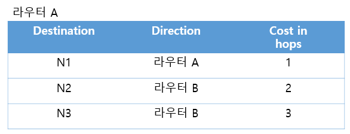
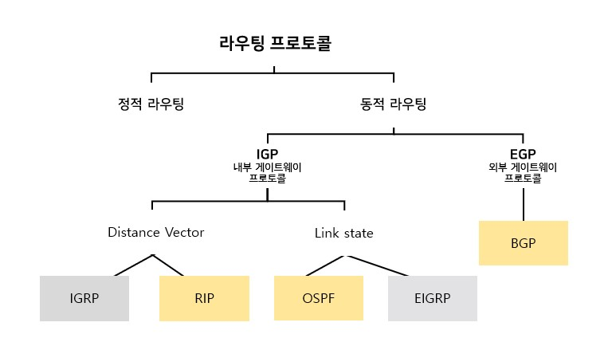
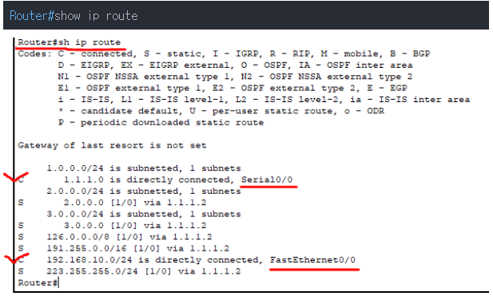
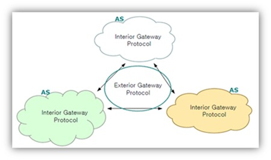
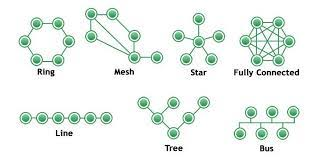

# 1. 라우팅 프로토콜

### 라우팅 Routing

패킷을 전송하기 위해 송신측에서 목적지까지의 경로를 정하고 정해진 경로를 따라 패킷을 전달하는 과정



### 라우팅 프로토콜

패킷이 목적지까지 가는 방법을 결정해주는 프로토콜.

최적의 패킷 교환 경로를 결정한다.

### 분류 요약



# 2. 분류

## 2.1 정보 갱신 방식에 따라

### 정적 라우팅 프로토콜 Static Routing Protocol

- 관리자가 직접 테이블을 설정하는 방식
    - 관리 부담이 증가
    - 외부에 경로를 알리지 않아 보안에 강함
- 네트워크 변화에 수동적이며, 라우팅 추가, 변경, 회선 등 자동 인지 설정이 불가함.
- 구성이 매우 간단하고 원하는 경로로 패킷을 보낼 수 있다.
- 테이블을 교환하지 않고 라우팅하므로 네트워크 대역폭을 줄일 수 있다.
- 경로에 문제가 생길 경우 대처가 어려움
- 단일 경로에 적합하여, 주로 Stub network에 적용함.
    - **stub network** : stub=토막, 하나의 네트워크에서 외부의 네트워크로 나가고 들어오는 경로가 오직 하나 뿐인 경우. **외부에서 들어와 결국은 종료되는 네트워크를 말함.**
- [정적 라우팅 실습 예시 (click!)](https://0215it.tistory.com/entry/2-%EB%9D%BC%EC%9A%B0%ED%8C%85-%EC%A0%95%EC%A0%81-%EB%9D%BC%EC%9A%B0%ED%8C%85-Static-Routing)

```
/*목적지가 1.1.1.1인 IP는 2.1.1.1을 통해 나가라.*/
ip route 1.1.1.1 255.0.0.0 2.1.1.1 
/*라우터로 들어오는 모든IP는 2.1.1.1을 통해 나가라.*/
ip route 0.0.0.0 0.0.0.0 2.1.1.1 
```



### 동적 라우팅 프로토콜 Dynamic Routing Protocal

- 정보 변화에 따라 능동적으로 대처하는 방식
    - 라우터가 판단하여 가장 효율적인 방법으로 패킷을 전송함.
- 네트워크 변화에 자동적으로 인지하여 정보 전송경로를 재구성한다.

## 2.2 위치에 따라



### 내부 게이트웨이 프로토콜 IGP;Interior Gateway Protocol

- AS 내에서의 라우팅을 담당하는 프로토콜
- AS; Autonoumous System : 일정 규모의 한 네트워크. 관리자의 관리하에 있는 라우터의 집합.

### 외부 게이트웨이 프로토콜 EGP;Exterior Gateway Protocol

- 서로 다른 AS 사이에서 사용되는 프로토콜
- 게이트 웨이간 라우팅에 사용

## 2.3 테이블 관리 방식에 따라

### 거리 벡터 알고리즘 Distance Vector Algorithm

- 방향을 사용하여 테이블에 목적지까지 가는데 필요한 Routing 테이블을 기록
- 주기적으로 라우팅 테이블을 교환하고, 라우터간 Full-Routing-table을 교환

### 링크 상태 알고리즘 Link State Algorithm

- 대역폭(bandwidth) 이나 delay와 같은 링크의 세부 정보를 체크하고, 전체적인 토폴로지를 참고하여 라우팅을 결정함.
    - **토폴로지** : 컴퓨터 네트워크 요소들을 물리적으로 연결해 놓은것, 그런 연결 방식.드
        
        
        
- 라우터가 목적지까지 가는 경로를 모든 라우팅 테이블에 기록함.

### Hybrid Routing Protocol

- 거리벡터와 링크 상태의 복합기능을 사용하는 라우팅방식
- 시스코에서 독자 개발
- 대표적으로 EIGRP, BGP

### [참고] 거리벡터 vs 링크 상태

| 구분 | 거리 벡터 라우팅 | 링크 상태 라우팅 |
| --- | --- | --- |
| 주요 매트릭 | Hop Count | Symbolic Length |
| 경로 설정 | 라우터 간 거리를 더하여 계산 | 다른 라우터까지 Shortest Path 계산 |
| 경로 알고리즘 | 벨만-포드(Bellman-Ford) 알고리즘 | 다익스트라(Dijkstra) 알고리즘 |
| 업데이트 범위 | 인접 라우터 | Area내 모든 라우터 |
| 업데이트 시점 | 일정주기 | Link 변화 발생시 |
| 라우팅 테이블 | 이웃 라우팅 정보 | 네트워크 전체 |
| 대표 프로토콜 | RIP, IGRP | OSPF, EIGRP |
| 컨버전스 타임 | 느림, 주기적인 정보 교환 | 빠름, 변경 발생시 정보 교환 |

컨버전스 타임 : 토폴로지 변화가 일어났을 때 이를 반영하여 네트워크가 재구성될 때까지 소요되는시간

# 3. 대표적인 프로토콜

## 3.1 RIP ; Routing Information Protocol

- 분류 : Dynamic - 내부 게이트웨이 프로토콜 - 거리 벡터 알고리즘
- [라우팅 테이블 갱신 과정 (click!)](https://laststar020203.tistory.com/15)
- 최소 Hop Count를 파악하여 라우팅 하는 프로토콜.
- **최단거리(홉 카운트)가 가장 적은 경로를 선택하여 라우팅함.**
- **최대 홉 카운트는 15로, 거리가 짧기 때문에 내부용(IGP)로 많이 이용됨. (소규모 네트워크 환경에 적합)**
- 표준 라우팅 프로토콜에 사용
- 라우터 메모리를 적게 사용하고 30초마다 라우팅 정보를 업데이트
    - 180초 이내 정보가 수신되지 않으면 해당경로를 이상 상태로 간주
    - 🟢구조가 간단하여 프로세스 부담이 적음.
- 🟢 경로 변화에 민감하게 반응하여 라우팅 정보를 갱신.
- 라우팅 테이블에 인접 라우터 정보를 저장하여 경로를 결정함.
- 단순히 홉을 카운트하여 경로를 결정하므로 경로의 네트워크 속도는 판단하지 않음.
    - ❌비효율적인 경로로 패킷을 전달할 가능성 있음
- ❌ 거리벡터 알고리즘으로 네트워크 변화에 대처하는 시간(컨버전스 타임)이 느림.
- ❌ 브로드캐스팅 방식이므로 네트워크에 부하 줄 수 있음.
- 최단 경로 탐색에 Bellman Ford 알고리즘 사용

### 벨먼-포드 알고리즘

- 한 노드에서 다른 노드까지 최단 거리를 구하는 알고리즘
- 간선의 가중치가 음수일 때도 최단거리를 구할 수 있다.
- 매 단계 모든 간선을 전부 확인하면서 모든 노드간 최단 거리를 구함.
- 과정
    1. 출발 노드를 설정한다.
    2. 최단 거리 테이블을 초기화한다.
    3. 다음의 과정을 (V(=정점) - 1)번 반복한다.
        1. 모든 간선 E개를 하나씩 확인한다.
        2. 각 간선을 거쳐 다른 노드로 가는 비용을 계산하여 최단 거리 테이블을 갱신한다.
    - 만약 음수 간선 순환이 발생하는지 체크하고 싶다면 3번 과정을 한 번 더 수행한다.**->** 이때 최단 거리 테이블이 갱신된다면 음수 간선 순환이 존재하는 것이다.
- [과정 예시 자세히 보기 (click!)](https://8iggy.tistory.com/153)

## 3.2 OSPF ; Open Shortest Path First

- 분류 : Dynamic - 내부 게이트웨이 프로토콜 - 링크 상태 알고리즘
- RIP의 한계를 극복한 최단 경로 우선 프로토콜
- 최저 Cost(시간) 경로를 최적 라우팅 경로로 결정.
- 대규모 기업망에서 사용. (대규모 네트워크에 적합)
- 네트워크 변화에 신속하게 대처
- 최적 경로 탐색에 다익스트라 알고리즘 사용
- 멀티 캐스팅 지원, 네트워크에 변화가 있을 때만 갱신
    - 링크 상태에 변화가 있을 시 즉각적으로 flooding 해주기 때문에 컨버전스 타임이 매우 빠름.
- 🟢 연결 속도를 중심으로 가중치를 두므로 좀 더 지능적인 라우팅 가능
- ❌ 라우팅 알고리즘이 복잡하여 프로세서에 부담.
- Area라는 개념을 사용하여 전체 네트워크를 작은 영역으로 나눠 효율적을 관리함.
    - AREA : 라우터의 논리적 집합, 인터페이스의 논리적 집합.
    - 서로 다른 area와 통신하려면 area0을 통해서만 통신 가능 (백본 역할)
        - 백본네트워크 : 백본 네트워크는 소형 네트워크들을 묶어 대규모 파이프라인을 통해 극도로 높은 대역폭으로 다른 네트워크들의 집합과 연결되는 네트워크
    - 인터페이스는 오직 하나의 Area 망에서만 할당 가능하고, Area를 기준으로 LSDB를 생성, 관리한다.
        - LSDB : Link State Data Base
    
    <aside>
    💡 Area 개념은 OSPF만 자세하게 공부해야 이해하기 쉽다!
    일단은 라우터끼리의 논리적 단위이고, area별로 LSDB를 관리하여 테이블 크기와 경로를 감소시킬 수 있다까지 이해하면 될 것 같음!
    
    </aside>
    

## 3.3 BGP ; Border Gateway Protocol

- 분류 : Dynamic - 외부 게이트웨이 프로토콜 - 하이브리드
- EGP를 보완한 알고리즘
    - 인터넷이 확장될수록 라우팅 순환이 생기는 등의 심각한 문제들이 발생하여 이를 해결하기 위해 [경계 경로 프로토콜](http://word.tta.or.kr/dictionary/dictionaryView.do?subject=%EA%B2%BD%EA%B3%84+%EA%B2%BD%EB%A1%9C+%ED%94%84%EB%A1%9C%ED%86%A0%EC%BD%9C)([BGP](http://word.tta.or.kr/dictionary/dictionaryView.do?subject=%EA%B2%BD%EA%B3%84+%EA%B2%BD%EB%A1%9C+%ED%94%84%EB%A1%9C%ED%86%A0%EC%BD%9C))이 등장하였다.
    - (EGP가 라우팅 분류명이기도 하지만, 실제 프로토콜이기도 하다.)
    - 1980년대 중반부터 1990년대 중반까지 인터넷에서 [다양한](https://en.wikipedia.org/wiki/Internet) 자율 [시스템 을 연결하는 데 사용된](https://en.wikipedia.org/wiki/Autonomous_system_(Internet)) [라우팅 프로토콜로, BGP(](https://en.wikipedia.org/wiki/Routing_protocol) [Border Gateway Protocol](https://en.wikipedia.org/wiki/Border_Gateway_Protocol) )로 대체됨.
    - 현재는 BGP만이 유일한 국제 표준이다.
- 초기 연결시 전체 경로 테이블을 교환하고, 이후 변동 내역이 있을 때만 이를 교환한다.
- 외부 게이트웨이 프로토콜이 므로 AS간(=게이트웨이 ) 라우팅에 사용하는 프로토콜이다.
- Hybrid 방식
    - 거리 벡터 방식 : 최적의 라우팅 경로(next hop)을 얻기 위한 대표값으로 거리(distance, hop)을 사용
    - 링크 상태 방식 : 자신의 이웃 라우터와 neighbor를 맺고 상태를 상호 감시하고 필요시, 즉각적으로 업데이트

---

# 면접질문

- 라우팅 프로토콜에 대해 설명해주세요.
    - 라우팅 프로토콜은 근접해 있는 라우터 간의 네트워크 정보를 서로 교환하기 위한 규칙이다. 교환한 정보를 근거로 라우팅 테이블을 변경하는 것이다.
    - 라우팅 프로토콜에는 AS 간 라우팅용과 AS 내부 라우팅용 두 가지가 있다. 각각, EGP(Exterior Gateway Protocol), IGP(Interior Gateway Protocol)라고도 부른다.
    - 라우터는 근접해 있는 라우터 간의 네트워크 정보를 서로 교환한다. 그리고 정보교환을 언제 할지, 어떻게 할지, 누구에게 전송할지, 어떤 정보를 전송할지 같은 것을 라우팅 프로토콜이 결정하는 것이다.
    - 라우팅 프로토콜이 결정한 방식에 따라 정보를 교환해 컨버전스 상태에 도달한다. 이렇게 교환한 경로 정보를 기준으로 최적의 경로를 라우팅 테이블에 기재한다. 그렇게 해서 항상 최적의 경로가 사용 가능하게 된다.

# 출처

- [https://mindstation.tistory.com/172](https://mindstation.tistory.com/172)
- [https://m.blog.naver.com/PostView.naver?isHttpsRedirect=true&blogId=seungj1031&logNo=221012340470](https://m.blog.naver.com/PostView.naver?isHttpsRedirect=true&blogId=seungj1031&logNo=221012340470)
- [https://itwiki.kr/w/라우팅_프로토콜](https://itwiki.kr/w/%EB%9D%BC%EC%9A%B0%ED%8C%85_%ED%94%84%EB%A1%9C%ED%86%A0%EC%BD%9C)
- stub network : [http://www.ktword.co.kr/test/view/view.php?m_temp1=1955](http://www.ktword.co.kr/test/view/view.php?m_temp1=1955)
- 벨만포드 : [https://velog.io/@kimdukbae/알고리즘-벨만-포드-알고리즘-Bellman-Ford-Algorithm](https://velog.io/@kimdukbae/%EC%95%8C%EA%B3%A0%EB%A6%AC%EC%A6%98-%EB%B2%A8%EB%A7%8C-%ED%8F%AC%EB%93%9C-%EC%95%8C%EA%B3%A0%EB%A6%AC%EC%A6%98-Bellman-Ford-Algorithm)
- BGP : [https://m.blog.naver.com/taeheon714/222384978033](https://m.blog.naver.com/taeheon714/222384978033)