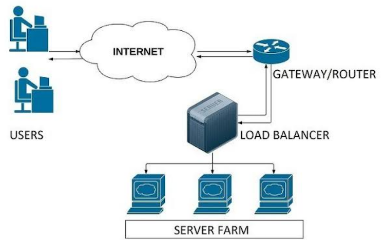

# 로드 밸런싱
## 로드 밸런싱이란
**서버에 가해지는 부하(=로드)를 분산(=밸런싱)해주는 장치 또는 기술**

사업의 규모가 확장되고, 클라이언트의 수가 늘어나게 되면 기존 서버만으로는 정상적인 서비스가 불가능하게 되는데, 이러한 증가한 트래픽에 대처할 수 있는 방법은 크게 두 가지임

- Scale Up: 서버 자체의 성능을 높이는 것
- Scale Out: 여러 대의 서버를 두는 것

Scale Out 방식은 여러 대의 서버로 트래픽을 균등하게 분산해주는 로드밸런싱이 반드시 필요함!
> 물리적인 서버에서 Scale Out하는 건 한계가 있음(메인보드에는 그래픽 카드를 최대 2개밖에 장착하지 못함)      
> -> 하지만 클라우드는 공간의 제약이 없기 때문에 Scale Out이 무한대로 가능함
>
> 💡 **AWS의 Auto Scaling**
> - Scale Out을 자동화해주는 서비스
> - 애플리케이션을 모니터링해서 용량을 자동으로 조절함(자동으로 Scale In/Out 해줌)
> - EC2 인스턴스들을 그룹으로 구성(=Auto Scaling 그룹)하고 최소/최대 인스턴스 수를 지정하면 이 범위 안에서 Scale In/Out이 일어남
> - Auto Scaling 그룹을 로드 밸런서에 연결할 수 있음

  

로드밸런서는 클라이언트와 서버풀(=서버팜, 분산 네트워크를 구성하는 서버들의 그룹) 사이에 위치함

  

## 로드 밸런싱 알고리즘
### 라운드로빈 방식(Round Robin)
서버에 들어온 요청을 순서대로 돌아가며 배정하는 방식

- 구현이 간단하고 효율적이기 때문에, 가장 많이 사용되는 로드밸런싱 알고리즘
- 모든 서버의 스펙이 동일하거나 비슷한 경우, 서버와의 연결이 오래 지속되지 않는 경우에 적합함

  
### 가중 라운드로빈 방식(Weighted Round Robin)
각 서버에 가중치를 매기고 가중치가 높은 서버에 요청을 우선적으로 배정하는 방식

- 서버의 트래픽 처리 능력이 다른 경우, 즉 특정 서버의 스펙이 더 좋을 경우 사용됨
    - A 서버(가중치 3)와 B 서버(가중치 1)가 있고, 로드밸런서가 클라이언트로부터 총 8개의 요청을 받았다면, A 서버와 B 서버에 각각 6개와 2개의 요청이 전달됨
- 가중치를 설정하는 과정에서 서버의 부하나 성능을 제대로 파악하지 못하면, 부하가 큰 서버에 더 많은 요청이 집중되어 서버의 부하가 더욱 심해질 수 있음

  
### IP 해시 방식(IP Hash)
클라이언트의 IP 주소를 특정 서버로 매핑하여 요청을 처리하는 방식

- 클라이언트가 항상 동일한 서버로 연결되는 것을 보장하므로, 일관된 세션을 유지할 수 있음
- 특정 서버에 부하가 집중되어 서비스의 안정성을 저해할 수 있음

  
### 최소 연결 방식(Least Connection)
요청이 들어온 시점에 가장 적은 연결 상태를 보이는 서버에 트래픽을 배정하는 방식

- 서버에 분배된 트래픽들이 일정하지 않은 경우에 적합함
- 대상 서버의 부하나 성능 상태를 고려하지 않고, 연결 수만 고려하기 때문에 불균형한 부하 분산이 발생할 수 있음

  
### 최소 응답 시간 방식(Least Response Time)
서버의 응답시간을 측정하여 가장 빠른 응답을 보인 서버에게 요청을 전달하는 방식

- 빠른 응답 속도와 안정적인 서비스 제공에 유용함
- 응답시간 측정에 의존하므로, 응답시간 측정이 부정확한 경우 부하 분산이 골고루 이루어지지 않을 수 있음
- 대상 서버의 응답시간이 자주 변동하는 경우, 부하분산이 불안정해질 수 있음

  

## 로드 밸런서의 종류
‘OSI 7계층을 기준으로 부하를 어떻게 분산할지’에 따라 종류가 나뉨

- 2, 3계층을 기준으로 부하를 분산하면 각각 L2, L3 종류인 것
- 상위 계층은 하위 계층의 데이터를 모두 가지기 때문에, 상위 계층일수록 섬세한 로드 밸런싱이 가능하고 하위 계층일수록 간단한 로드 밸런싱만 가능함

즉, 로드밸런서의 종류로는 L2, L3, L4, L7이 있고, 로드 밸런싱에는 L4와 L7이 가장 많이 사용됨

L4 로드밸런서부터 포트 번호를 바탕으로 로드를 분산하는 것이 가능하기 때문이고, 한 대의 서버에 각기 다른 포트 번호를 부여하여 다수의 서버 프로그램을 운영하는 경우라면 최소 L4 로드 밸런서 이상을 사용해야 함

  
### L4 로드 밸런서
4계층(네트워크 계층)이나 3계층(전송 계층)의 정보를 바탕으로 로드를 분산함 → IP 주소, 포트번호, MAC 주소, 전송 프로토콜 등에 따라 트래픽 분산 가능

- **장점**
    - 패킷의 내용을 확인하지 않고 로드를 분산하므로 속도가 빠르고 효율이 높음
    - 데이터의 내용을 복호화할 필요가 없어서 안전함
    - L7 로드밸런서보다 가격이 저렴함
- **단점**
    - 패킷의 내용을 살펴볼 수 없으므로, 섬세한 라우팅이 불가능함
    - 사용자의 IP가 수시로 바뀌는 경우라면, 연속적인 서비스를 제공하기 어려움

  
### L7 로드 밸런서
7계층(애플리케이션 계층)에서 로드를 분산하기 때문에, HTTP 헤더, 쿠키 등과 같은 사용자 요청을 기준으로 특정 서버에 트래픽 분산 가능

- L4 로드밸런서의 기능을 포함하며, 추가로 패킷의 내용을 확인하고 그 내용에 따라 로드를 특정 서버에 분배하는 것이 가능함
- 특정한 패턴을 지닌 바이러스를 감지해 네트워크 보호가 가능함
- Dos/DDos와 같은 비정상적인 트래픽 필터링이 가능함

- **방식**
    - URL 스위칭 방식: 특정 하위 URL들은 특정 서버로 처리함
        - '.../steven/image' => 이미지 처리 서버 / '.../steven/video' => 동영상 처리 서버
    - 컨텍스트 스위칭 방식: 클라이언트가 요청한 특정 리소스에 대해 특정 서버로 연결 가능
        - 이미지 파일에 대해서는 확장자를 참조하여, 별도로 구성된 이미지 파일이 있는 서버 or 스토리지로 직접 연결
    - 쿠키 지속성: 쿠키 정보를 바탕으로 클라이언트가 연결했었던 동일한 서버에 계속 할당해 주는 방식
- **장점**
    - 상위 계층에서 로드를 분산하기 때문에 훨씬 더 섬세한 라우팅이 가능함
    - 비정상적인 트래픽을 사전에 필터링할 수 있어 서비스 안정성이 높음
- 단점
    - L4 로드 밸런서에 비해 비쌈
    - 패킷의 내용을 복호화해야 하므로 더 높은 비용을 지불해야 함
    - 클라이언트가 로드 밸런서와 SSL 인증서를 공유해야 하기 때문에, 공격자가 로드 밸런서를 통해 클라이언트의 데이터에 접근할 수 있는 보안상의 위험성이 존재함

  
  

### 면접질문
1. 로드밸런싱에 대해 말해보세요
2. 서버 부하를 처리하기 위한 2가지 방법을 설명해주세요(Scale-Up, Scale-Out)

  
### 출처
[https://velog.io/@jisoo1170/Load-Balancing이란](https://velog.io/@jisoo1170/Load-Balancing%EC%9D%B4%EB%9E%80)     
[https://chunsubyeong.tistory.com/106](https://chunsubyeong.tistory.com/106)     
[https://co-no.tistory.com/22](https://co-no.tistory.com/22)     
[https://m.post.naver.com/viewer/postView.naver?volumeNo=27046347&memberNo=2521903](https://m.post.naver.com/viewer/postView.naver?volumeNo=27046347&memberNo=2521903)      
[https://velog.io/@lom/로드-밸런싱-알고리즘-별-장단점](https://velog.io/@lom/%EB%A1%9C%EB%93%9C-%EB%B0%B8%EB%9F%B0%EC%8B%B1-%EC%95%8C%EA%B3%A0%EB%A6%AC%EC%A6%98-%EB%B3%84-%EC%9E%A5%EB%8B%A8%EC%A0%90)     
https://inpa.tistory.com/entry/AWS-%F0%9F%93%9A-EC2-%EC%98%A4%ED%86%A0-%EC%8A%A4%EC%BC%80%EC%9D%BC%EB%A7%81-ELB-%EB%A1%9C%EB%93%9C-%EB%B0%B8%EB%9F%B0%EC%84%9C-%EA%B0%9C%EB%85%90-%EA%B5%AC%EC%B6%95-%EC%84%B8%ED%8C%85-%F0%9F%92%AF-%EC%A0%95%EB%A6%AC#%EC%8A%A4%EC%BC%80%EC%9D%BC_%EC%95%84%EC%9B%83scale_out
