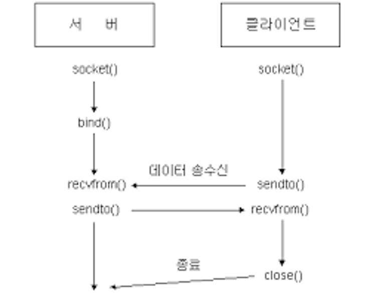

# 소켓
## 소켓이란
네트워크로 연결되어 있는 컴퓨터들 사이에서 데이터를 주고받을 때 사용하는 소프트웨어 장치로

- 즉 소켓은 네트워크 세계로 데이터를 내보내거나 받기 위한 창구 역할을 함!
    - 프로세스가 데이터를 보내거나 받기 위해서는 반드시 소켓을 열어서 데이터를 써보내거나 소켓으로부터 데이터를 읽어들여야 함
- 소켓 연결은 TCP와 UDP 방식으로 나눌 수 있고, 일반적인 프로그래밍에서는 대부분 TCP 연결을 사용
- 소켓의 역할에 따라 서버 소켓, 클라이언트 소켓으로 구분됨
- 주로 서버는 리눅스 운영체제 기반, 클라이언트는 윈도우 운영체제 기반으로 개발함

<br></br>

## 소켓통신의 흐름
### TCP 소켓


- 일대일 연결
- TCP 연결이기 때문에 상대 소켓과 연결할 때는 3-way handshaking, 연결을 종료할 때는 4-way handshaking 과정을 거치게 됨
    
    
    
    
    

<br></br>
### UDP 소켓



- 다대다 연결 (하나의 소켓으로 둘 이상의 호스트와 통신이 가능함)
    
    
    

<br></br>

## 소켓 구현 시 사용되는 함수
### socket()

- 소켓을 생성하는 함수
- 전화기의 구매에 비유 → 전화 통화를 하려면 송신자와 수신자 둘 다 전화기가 필요하다

```c
int socket(int domain, int type, int protocol)

// TCP소켓 생성
int tcp_socket = socket(PF_INET, SOCK_STREAM, IPPROTO_TCP(or 0))  
// UDP소켓 생성 
int udp_socket = socket(PF_INET, SOCK_DGRAM, IPPROTO_UDP(or 0))   
```

- domain은 프로토콜 체계
    - PF_INET = IPv4 인터넷 프로토콜 체계
    - PF_INET6 = IPv6 인터넷 프로토콜 체계
    - PF_LOCAL = 로컬 통신을 위한 UNIX 프로토콜 체계
    - PF_PACKET = Low Level 소켓을 위한 프로토콜 체계
    - PF_IPX = IPX 노벨 프로토콜 체계
- type는 소켓의 데이터 전송 방식
    - SOCK_STREAM = 연결 지향형 소켓
    - SOCK_DGRAM = 비 연결 지향형 소켓
- protocol
    - 소켓의 데이터 전송방식이 있으므로 굳이 안적어도 됨
    - 하나의 프로토콜 체계 안에 전송방식이 동일한 프로토콜이 둘 이상 존재하는 경우를 위해 필요한 매개변수

<br></br>
### bind()

- 서버 소켓에서 소켓에 IP 주소와 포트번호(주소 정보)를 할당해주기 위한 함수
- 전화기에 전화번호를 할당 → 송신자가 수신자의 전화번호를 알아야 전화를 걸 수 있다

```c
int bind(int sockfd, struct sockaddr *myaddr, sickle_t addrlen);

// sockfd: 주소정보를 할당할 소켓의 파일 디스크립터(별칭)
// myaddr: 할당하고자 하는 주소정보를 담은 구조체 변수의 주소값
// addrlen: 두 번째 인자로 전달된 구조체 변수의 길이정보
```

<br></br>
### (TCP) listen()

- 소켓을 연결 요청을 받을 수 있는 상태로 변경함
- 전화기가 전화 케이블에 연결되어 전화를 받을 수 있는 상태가 됨

```c
int listen(int sockfd, int backlog);
```

- sockfd - 연결요청 대기 상태에 두고자 하는 소켓의 파일 디스크립터(별칭) 전달, 이 함수의 인자로 전달된 디스크립터의 소켓이 서버 소켓이 됨
- backlog - 연결요청 대기 큐의 크기정보 전달, 5가 전달되면 큐의 크기가 5가 되어 클라이언트의 연결요청을 5개까지 대기시킬 수 있음
    
    
    
<br></br>
### (TCP) connect()

- 클라이언트 소켓이 연결을 요청함
- 전화를 건다

```c
int connect(int sockfd, struct sockaddr* serv_addr, socklen_t addrlen);

// sockfd: 클라이언트 소켓의 파일 디스크립터 전달
// servaddr: 연결요청 할 서버의 주소정보가 담긴 구조체의 주소 값 전달
// addrlen: 두 번째 매개변수 addr에 전달된 주소의 변수 크기
```

<br></br>
### (TCP) accept()

- 서버 소켓이 연결 요청을 수락함 (클라이언트 요청이 들어온 순서대로 연결 요청 수락)
- 수화기를 들어서 연결 요청을 수락함

```c
int accept(int sockfd, struct sockaddr* addr, socklen_t* addrlen);

// sockfd: 서버 소켓의 파일 디스크립터 전달
// addr: 연결요청 한 클라이언트의 주소정보가 담긴 구조체
// addrlen: 두 번째 매개변수 addr에 전달된 주소의 변수 크기

* accept 함수는 '소켓 생성 + 연결 요청을 한 클라이언트 소켓과 자동으로 연결' 작업이 포함되기 때문에 함수 실행 성공 시 생성된 소켓의 파일 디스크립터 리턴 
```

accept 함수 호출 성공 시 내부적으로 데이터 입출력에 사용할 소켓을 생성하고, 그 소켓의 파일 디스크립터를 반환함


즉, 다른 연결 요청들을 맞이하는 문지기 역할의 서버 소켓 뿐만 아니라 클라이언트와 데이터 송수신을 할 서버 소켓도 필요하기 때문에 accept 함수 호출의 결과로 소켓이 생성되는 것

**이제 서버에서 별도로 생성한 소켓과 클라이언트 소켓이 직접 연결되어 데이터를 송수신할 수 있음**

<br></br>
### (UDP) sendto()

- UDP 소켓은 연결 상태를 유지하지 않으므로, 데이터를 전송할 때마다 반드시 목적지의 주소 정보를 별도로 추가해야 함

```c
ssize_t sendto(int sockfd, void* buff, size_t nbytes, int flags, struct sockaddr* to, socklen_t addrlen);

// sockfd: 데이터 전송에 사용될 UDP 소켓의 파일 디스크립터
// buff: 전송할 데이터를 저장하고 있는 버퍼의 주소값
// nbytes: 전송할 데이터 크기를 바이트 단위로 전달
// flags: 옵션 지정에 사용되는 매개변수, 지정할 옵션이 없다면 0 전달
// to: 목적지 주소정보를 담고 있는 sockaddr 구조체의 주소
// addrlen: 매개변수 to로 전달된 주소 값의 구조체 변수 크기
```

<br></br>
### (UDP) recvfrom()

- UDP 데이터는 발신지가 일정치 않기 때문에 발신지 정보를 함께 반환함

```c
ssize_t recvfrom(int sockfd, void* buff, size_t nbytes, int flags, struct sockaddr* from, socklen_t addrlen);

// sockfd: 데이터 수신에 사용될 UDP 소켓의 파일 디스크립터
// buff: 데이터 수신에 사용될 버퍼의 주소값
// nbytes: 수신할 최대 바이트 수 전달 (buff가 가리키는 버퍼의 크기를 넘을 수 없음)
// flags: 옵션 지정에 사용되는 매개변수, 지정할 옵션이 없다면 0 전달
// from: 발신지 정보를 채워 넣을 sockaddr 구조체의 주소값 전달
// addrlen: 매개변수 from으로 전달된 주소값의 구조체 변수의 크기
```

<br></br>

## 소켓통신과 HTTP 통신 비교

- HTTP 통신은 클라이언트의 요청이 있을 때 서버가 응답하는 방식으로 단방향 통신임
- 소켓 통신은 클라이언트와 서버 양쪽에서 서로에게 데이터 전달을 하는 양방향 통신임

자주 데이터를 주고 받는 환경이 아닌 경우 HTTP 통신을 통해 받는 것이 유리하며, 자주 데이터를 주고 받아야 하는 환경에서는 소켓 통신이 유리함

> 참고로 HTTP 통신 또한 소켓 통신의 일종임. 한쪽에서만 요청에 대한 응답을 하는 웹 통신의 특성 상 HTTP가 하나의 중요한 프로토콜로 구분되었기 때문에 둘을 구분하게 된 것
> 

<br></br>
<br></br>

### 면접질문

1. 소켓이란?
2. Socket.io와 WebSocket의 차이

<br></br>

### 출처
도서 ‘윤성우의 열혈 TCP/IP 소켓 프로그래밍’     
[https://helloworld-88.tistory.com/215](https://helloworld-88.tistory.com/215)     
[https://dbehdrhs.tistory.com/88](https://dbehdrhs.tistory.com/88)      
[https://kotlinworld.com/75](https://kotlinworld.com/75)
