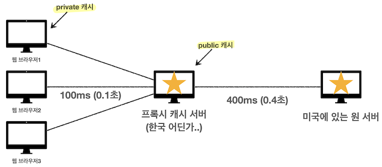
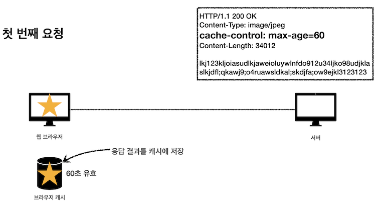
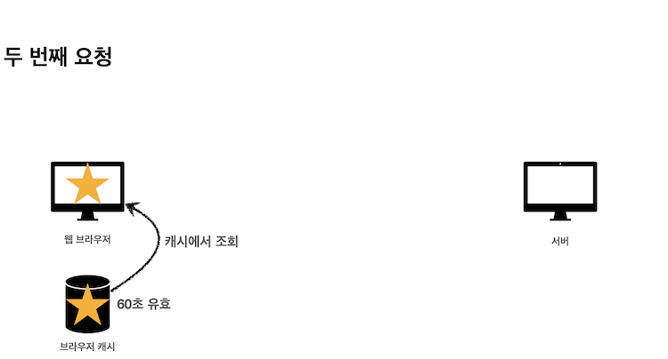
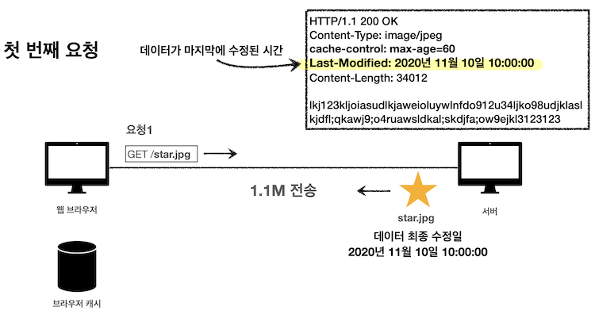
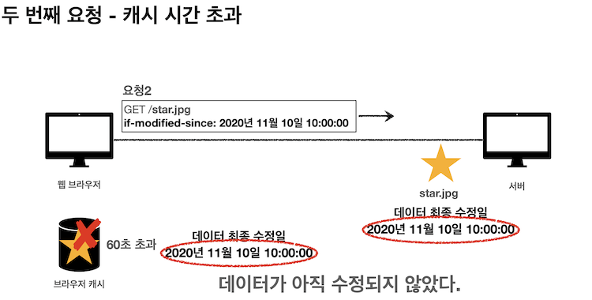
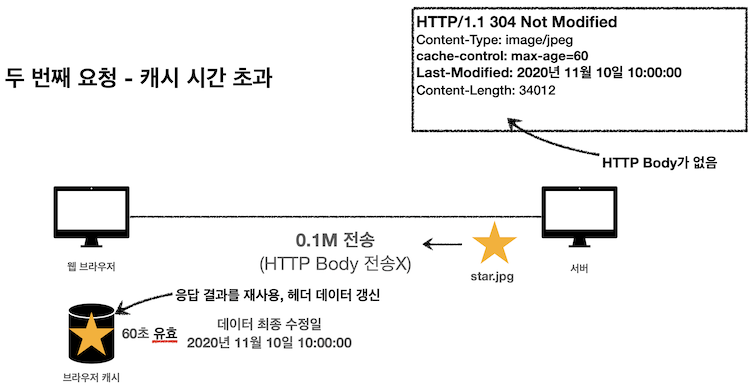
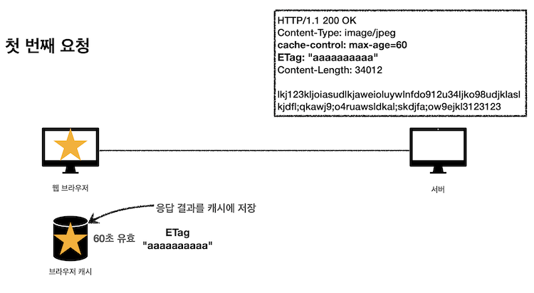
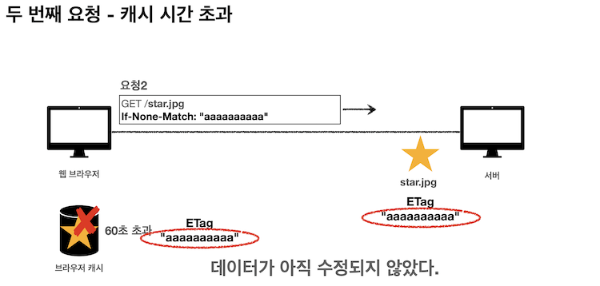
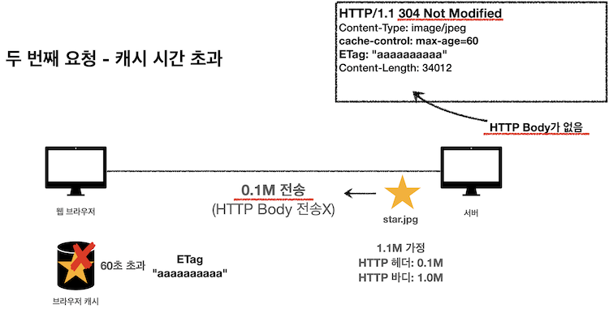

# 웹 캐시
## 웹 캐시란
사용자가 웹 사이트에 접속할 때, 정적 컨텐츠(이미지, JS, CSS 등)을 특정 위치에 저장하여, 웹 사이트 서버에 해당 컨텐츠를 매번 요청하여 받는 것이 아니라, 특정 위치에서 불러옴으로써 사이트 응답시간을 줄이고 서버 트래픽 감소 효과를 볼 수 있음

### 웹 캐시의 종류
- **브라우저 캐시(Browser Caches)**
    - 브라우저 또는 HTTP 요청을 하는 Client Application에 의해 내부 디스크에 캐시함
        - Chrome 캐시 위치 - C:Users₩사용자명₩App Data₩Local₩GoogleChrome₩User₩DataDefaultCache
    - 캐시된 리소스를 공유하지 않는 한 개인에 한정된 캐시임
    - 브라우저의 Back 버튼 또는 이미 방문한 페이지를 재방문하는 경우 효과가 극대화됨
    
- **프록시 캐시(Proxy Caches)**
    
    
    
    - 프록시(Proxy) = 클라이언트와 서버 사이에서 대리로 통신을 수행하는 것
    - 미국에 있는 원 서버와 한국에 있는 클라이언트 사이에 위치한 한국의 프록시 캐시 서버가 있다면 응답 시간을 줄일 수 있음(예시-유튜브 등)
    - 브라우저 캐시와 동일한 원리로 동작하며, 클라이언트나 서버가 아닌 네트워크 상에서 동작함
    - 보안, 캐싱을 통한 성능 강화, 트래픽 분산 등의 이점이 있음

  

## 브라우저 캐시

1. 서버에서 클라이언트에게 응답 헤더 값으로 cache-control의 max-age 값을 60으로 주어, 60초 동안 응답 값을 캐시해서 사용할 수 있도록 함 

2. 60초가 지나기 전에 클라이언트에게 요청이 들어오면 응답 값을 캐시에서 조회함
3. 캐시 요청 시간이 초과하면, 서버를 통해 데이터를 다시 조회하고 캐시를 갱신함 (다시 네트워크 다운로드 발생) → **비효율적!**

  
### 검증 헤더 **Last-Modified**

캐시 유효 시간이 초과해서 서버에 다시 요청하면, 다음 두 가지 상황이 나타남

- 서버에서 기존 데이터를 변경함 → 저장해두었던 캐시를 재사용할 수 있음
- 서버에서 기존 데이터를 변경하지 않음

  
1. 저장된 캐시의 데이터와 서버의 데이터가 같다는 것을 확인하기 위해 **Last-Modified라는 검증 헤더**를 추가함(데이터가 마지막에 수정된 시간이 기록됨)
    
    
    

2. 캐시 요청 시간이 초과했을 때 브라우저 캐시에 Last-Modified 검증 헤더가 있다면, 웹 브라우저가 서버에 요청을 보낼 때 **if-modified-since라는 조건부 요청 헤더**를 붙임
    
    
    

3. if-modified-since에서 전달된 날짜와 데이터의 최종 수정일이 같다면, 서버의 기존 데이터가 변경되지 않았다는 것을 의미
    - 304 Not Modified + 헤더 메타 정보만 응답 (바디 전송 X)
    - 클라이언트는 서버가 보낸 응답 헤더 정보로 캐시의 메타 정보를 갱신함
    
    
    

4. if-modified-since에서 전달된 날짜와 데이터의 최종 수정일이 같지 않다면, 서버의 기존 데이터가 변경되었다는 것을 의미
    - 200 OK + 모든 데이터 전송 (바디 포함)

  
### **Last-Modified** 단점

- 1초 미만(0.x초) 단위로 캐시 조정이 불가능함
- 날짜 기반의 로직 사용 → 데이터 수정을 하긴 했지만 결과적으로는 수정된 게 없을 경우에도 전체 데이터를 다시 다운로드함
- 서버에서 별도의 캐시 로직을 관리하고 싶은 경우에는 비효율적임
    - 스페이스나 주석처럼 크게 영향이 없는 변경에서 캐시를 유지하고 싶은 경우

---

### 검증 헤더 ETag

캐시용 데이터에 임의의 고유한 버전 이름을 달아둘 수 있음 (ETag: “v1.0” 등)

- 데이터가 변경되면 버전 이름을 바꾸어서 저장함
- **ETag만 보내서 같으면 유지, 다르면 다시 받기**
- 캐시 제어 로직을 서버에서 완전히 관리할 수 있음 (서버는 배타 오픈 기간인 3일 동안 파일이 변경되어도 ETag를 동일하게 유지하는 등)

  

## 캐시 지시어 Cache-Control

- Cache-Control: max-age
    - 캐시 유효 시간 나타냄, 초단위
- Cache-Control: no-cache
    - 데이터는 캐시해도 되지만, 검증 헤더를 사용해 항상 원 서버에 검증하고 사용
    - 원 서버 접근 실패 시, 캐시 서버 설정에 따라서 캐시 데이터를 반환할 수 있음 (오류보다는 오래된 데이터라도 보여주자)
- Cache-Control: must-revalidate
    - 캐시 만료 후 최초 조회 시 원 서버에 검증해야 함
    - 원 서버 접근 실패 시 반드시 오류를 발생시켜야 함 - 504 Gateway Timeout
- Cache-Control: no-store
    - 데이터에 민감한 정보가 있으므로 저장하면 안됨

---

- Cache-Control: public
    - 응답이 public 캐시에 저장되어도 됨
- Cache-Control: private
    - 응답이 해당 사용자만을 위한 것임, private 캐시에 저장해야 함(기본값)
    - 프록시 캐시에 저장되면 안됨
- Cache-Control: s-maxage
    - 프록시 캐시에만 적용되는 max-age

➕ Cache-Control 옵션은 1개 이상 사용 가능함 ex) Cache-Control: public, max-age=3600 (콤마로 구분)

  
  

### 면접질문
1. 브라우저 주소창에 [http://www.test.com](http://www.test.com/) 입력 후 엔터를 눌렀을 때부터 페이지가 렌더 링 되는 과정을 설명하세요
2. 쿠키와 세션, 캐시의 차이점 

⭐️ 네트워크 캐시에 대해 단독으로 질문하진 않는듯 (아마도..)

  
### 출처
모든 개발자를 위한 HTTP 웹 기본 지식_김영한      
[https://hahahoho5915.tistory.com/33](https://hahahoho5915.tistory.com/33)      
[https://velog.io/@gkrba1234/프록시-캐시Proxy-Cache에-대해-알아보자](https://velog.io/@gkrba1234/%ED%94%84%EB%A1%9D%EC%8B%9C-%EC%BA%90%EC%8B%9CProxy-Cache%EC%97%90-%EB%8C%80%ED%95%B4-%EC%95%8C%EC%95%84%EB%B3%B4%EC%9E%90)
