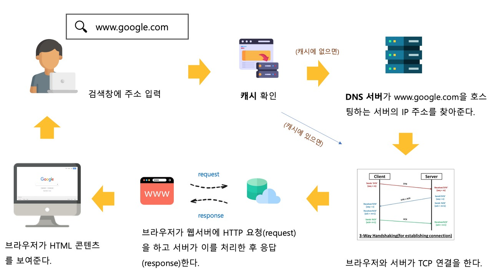
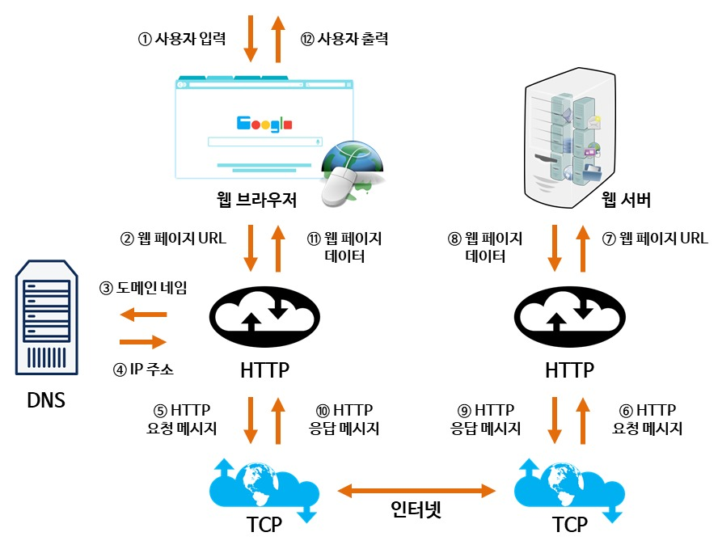
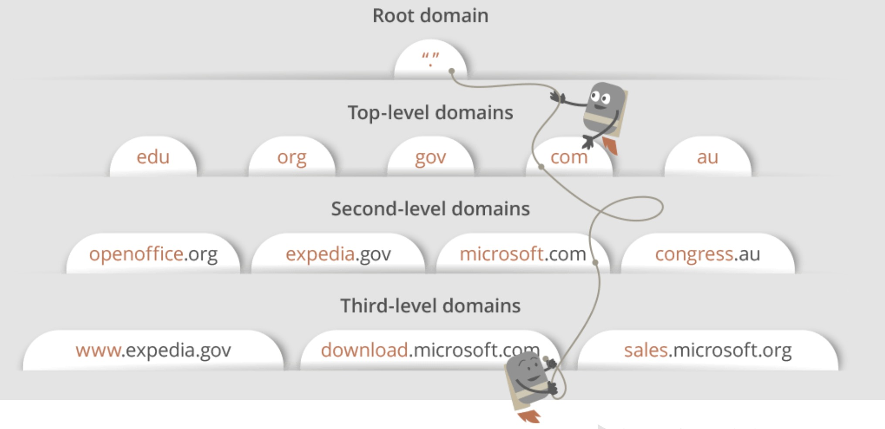
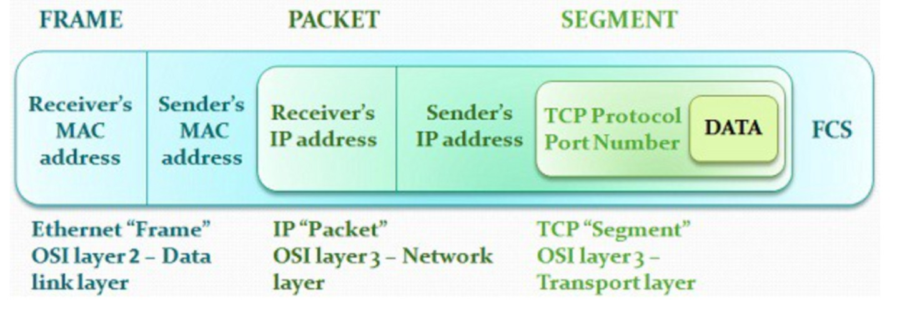
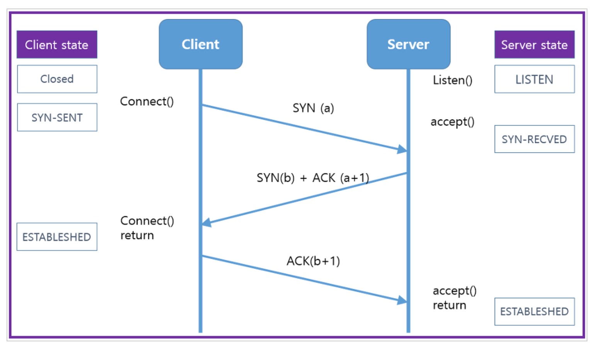
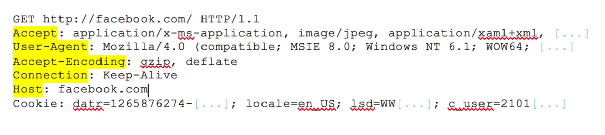

# 웹 브라우저에 google.com 치면 일어나는 과정

# 0. 전체 흐름

---

1. **브라우저에 검색창에 'www.google.com'을 입력 후. 엔터를 친다.**
2. **브라우저는 캐싱된 DNS 기록을 체크한다.**
    1. **요청한 URL이 캐시에 없으면, ISP의 DNS 서버에서 다른 DNS 서버를 DNS Query를 통해 검색하여 IP 주소를 찾는다.**
3. **브라우저가 서버와 TCP connection을 한다.**
4. **Browser가 웹서버에 HTTP 요청을 한다.**
5. **서버가 요청을 처리하고, response를 생성한다.**
6. **서버가 HTTP Response를 보낸다.**
7. **브라우저가 HTML content를 보여준다.**
  
# 1. 검책창에 주소 입력
- 웹 사이트에 접속하려면 ‘www.google.com’과 같은 **도메인 주소가 아닌** ‘127.0.0.1’과 같은 **IP주소**가 필요
  
- 도메인 주소를 IP주소로 변환하기 위해서 DNS를 체크해야함
    - DNS(Domain Name System) : URL의 이름과 IP주소를 저장하고 있는(그리고 변환하는) 데이터베이스 시스템
  
# 2. DNS 캐시 확인
- 캐시에 남아있는 DNS기록을 통해 google.com에 대응되는 IP주소가 있는지 검색
  
- 브라우저는 4가지 캐시를 확인한다. **Browser 캐시 → OS 캐시 → 라우터 캐시 → ISP 캐시**
  
    - **브라우저 캐시 확인** : 브라우저는 일정기간 유저가 방문한 사이트의 DNS정보를 기록하고 있다. 기존에 google.com을 방문했다면, 구글에 빠르게 접근할 수 있는 내용을 이곳에서 찾을 수 있음.
      
    - **OS 캐시 확인** : 운영체제 안에 있는 캐시로, 시스템 콜을 통해 캐시에 접근하여 OS에 기록된 DNS 기록을 확인함.
      
    - **라우터 캐시 확인** : 라우터에 남아 있는 DNS 내용 확인
      
    - **ISP 캐시 확인** : ISP는 DNS서버를 구축하고 있으므로 마지막으로 여기서 DNS 정보를 찾을 수 있다.
      
        - ISP(Internet Service Provider) : 인터넷 서비스 공급자로, SK, LG, KT등의 통신회사를 뜻한다. (미국에서는 Comcast , AT&T 등)
          
- 차례대로 캐시를 확인하여 IP주소를 찾아 네트워크 트랙픽 조절과 데이터 전송 시간을 줄일 수 있다.
  
## 2.1 ISP에서도 IP주소를 못 찾을 경우

- ISP가 DNS 서버들을 검색해 해당 도메인의 IP주소를 검색한다. (recursive search)
  
- **IP 주소를 찾을 때까지, DNS 서버에서 다른 DNS의 서버를 오가면서 반복 검색을 진행한다**
  
    - DNS 서버에 DNS 쿼리를 보냄 = 구글 ip 주소 아는 사람 나한테 알려줘. (DNS recursor 가 실행)
      
    
  
        - DNS recursor가 Root domain에 연락
  
        - → Top-level domain 인 .com DNS에 연락
  
        - → Second-level domain google.com name server 로 이동
  
        - → 이곳에서 기본이 되는 www의 ip주소를 DNS recursor에 보냄
  
        - → google.com = 142.250.189.238 ip주소라는 것을 알아낸다.
- 이 모든 과정은 패킷으로 전달. (TCP)
  
- 패킷 안에 DNS 쿼리, DNS recursor가 받은 IP주소가 포함된다.
  
- 패킷이 이동할 때 라우팅 테이블을 이용 → 최단 경로를 찾을 수 있음
  
- 패킷이 중간에 유실되면 request fail error 발생
  
# 3. **브라우저가 서버와 TCP connection**

- IP주소를 알았으니, TCP/IP를 사용해 서버에 연결하는 신호를 보냄.
  
- 아래 형식(이미지)을 사용해 TCP부분은 데이터를 잃지 않고 잘 보내는 방법을 담당하며, IP부분은 주소에 맞게 잘 보내는 역할 담당 (링크 TCP/IP)
    
  

- [TCP/IP three-way handshake](https://github.com/psyStudy/CS_study/blob/main/Network/TCPandUDP.md) 라는 프로세스를 통해 클라이언트 서버간 연결이 이뤄진다. (= 여러번 악수해서 클라이언트와 서버를 안전하게 잘 알아듣고 연결하자)
      
    
    - 처음에 클라이언트가 SYN신호를 보내면서 포트 좀 열어 달라고 물어본다.
      
    - 서버가 SYN과 ACK를 보냄 → 클라이언트가 내가 보낸 정보가 맞는 지 확인.
      
    - 클라이언트가 서버에게 잘 받았다고 다시 ACK 보냄
      
    - 서로 안전하게 정보를 교환할 수 있는 길 연결 완료!

## (참고) Firewall & Https/SSL

- TCP연결 중 Firewall이나 HTTPS/SSL이라는 접근 제한방법을 사용할 수 있다.

- Firewall은 특정 IP주소나 어떤 지역에서 접근해 오는 신호를 차단 할 수 있다.
  
- HTTPS/SSL은 클라이언트와 서버의 암호화를 통해 중간에 누가 패킷을 엿듣는 것을 차단한다.
  
# 4. **Browser가 웹서버에 HTTP 요청**

- 연결이 되면, 데이터를 전송한다.
- 클라이언트 브라우저는 HTTP 프로토콜로 GET 요청을 통해 서버에게 www.google.com의 웹 페이지 데이터를 요구한다.

  
# 5. **서버가 요청을 처리하고, response를 생성**

- 서버는 브라우저로 부터 request를 받아 처리하고 response를 생성하여 보내준다.
- request에서는 http요청을 통해 받아온 다양한 헤더 정보와 데이터들로 요청을 처리하고 response를 생성함.
    - response는 json, xml, html 등으로 작성됨
  
# 6. 서버가 http response를 보냄

- 서버의 response에는 HTTP 프로토콜에 따른 헤더 정보와 데이터들 보낸다.
- 이때 status code로 response상태를 표현함.
- response에는 요청한 웹페이지, 상태코드, 쿠키, 개인정보 등이 포함된다.
  
# 7. 브라우저가 html content를 보여준다.

- 브라우저는 html content를 단계적으로 랜더링(Critical Rendering Path)하여 노출
- 정적인 파일들은 브라우저에 캐싱되어 나중에 해당 페이지 재방문시 서버에 재요청하지 않게 한다.
- 마지막으로 ‘www.google.com’웹 페이지가 나타남.'

  ### Critical Rendering Path
  HTML, css, javascripts 등이 데이터를 실제 우리가 보는 화면(픽셀)로 그리기까지critical rendering path를 거져 진행된다.
  - 웹을 랜더링한다 = critical rendering path를 거친다.
  - 
 
1. [ HTML ] 서버에서 응답으로 받은 HTML 데이터를 파싱한다.
2. [ DOM Tree ] HTML을 파싱한 결과로 DOM Tree를 만든다. 👉 DOM(Document Object Model) 완성!!
3. [ CSS ] 파싱하는 중 CSS 파일 링크를 만나면 CSS 파일을 요청해서 받아온다.
4. [ CSSOM ] CSS 파일을 읽어서 CSSOM(CSS Object Model)을 만든다.
5. [ Render Tree ] DOM Tree와 CSSOM이 모두 만들어지면 이 둘을 사용해 Render Tree를 만든다.
6. [ Layout(reflow) ] Render Tree에 있는 각각의 노드들이 화면의 어디에 어떻게 위치할 지를 계산하는 Layout과정을 거친다
7. [ Paint ] 화면에 실제 픽셀을 Paint한다.

---

# 면접질문

- www.naver.com에 접속할 때 생기는 과정에 대해 설명해주세요.

# 출처

- [https://leeph.tistory.com/39](https://leeph.tistory.com/39)
- [https://velog.io/@doodream/google.com을-치면-일어나는-일](https://velog.io/@doodream/google.com%EC%9D%84-%EC%B9%98%EB%A9%B4%EC%9D%BC%EC%96%B4%EB%82%98%EB%8A%94-%EC%9D%BC)
- [https://velog.io/@dum6894/CS-%EB%B8%8C%EB%9D%BC%EC%9A%B0%EC%A0%80%EC%9D%98-%EB%8F%99%EC%9E%91-%EC%9B%90%EB%A6%ACCritical-Rendering-Path](https://velog.io/@dum6894/CS-%EB%B8%8C%EB%9D%BC%EC%9A%B0%EC%A0%80%EC%9D%98-%EB%8F%99%EC%9E%91-%EC%9B%90%EB%A6%ACCritical-Rendering-Path)
- [https://brunch.co.kr/@seungjoonlernnx/100](https://brunch.co.kr/@seungjoonlernnx/100)
- [https://yoondii.tistory.com/m/59](https://yoondii.tistory.com/m/59)
- [https://mangkyu.tistory.com/91](https://mangkyu.tistory.com/91)
