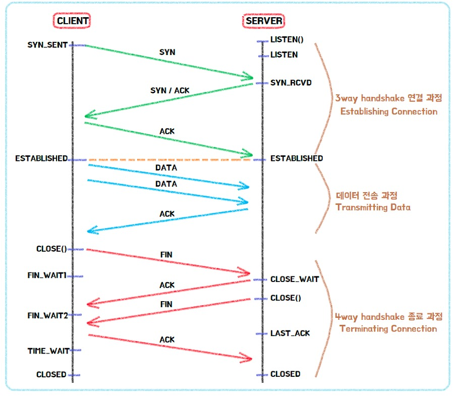

# 웹 브라우저에 google.com 치면 일어나는 과정

# 0. 전체 흐름

1. **브라우저에 검색창에 'www.google.com'을 입력 후. 엔터를 친다.**
2. **브라우저는 캐싱된 DNS 기록을 체크한다.**
    1. **요청한 URL이 캐시에 없으면, ISP의 DNS 서버에서 다른 DNS 서버를 DNS Query를 통해 검색하여 IP 주소를 찾는다.**
3. **브라우저가 서버와 TCP connection을 한다.**
4. **Browser가 웹서버에 HTTP 요청을 한다.**
5. **서버가 요청을 처리하고, response를 생성한다.**
6. **서버가 HTTP Response를 보낸다.**
7. **브라우저가 HTML content를 보여준다.**

# 1. 검책창에 주소 입력

- 웹 사이트에 접속하려면 ‘www.google.com’과 같은 도메인 주소가 아닌 ‘127.0.0.1’과 같은 IP주소가 필요
- 도메인 주소를 IP주소로 변환하기 위해서 DNS를 체크해야함.
    - DNS : Domain Name System : url의 이름과 ip주소를 저장하고 있는(그리고 변환하는) 데이터베이스 시스템

# 2. DNS 캐시 확인

- 캐시에 남아있는 DNS기록을 통해 google.com에 대응되는 IP주소가 있는지 검색
- 브라우저는 4가지 캐시를 확인한다. Browser캐시 → OS 캐시 (systemcall) → router 캐시 → ISP 캐시
    - **브라우저 캐시 확인** : 브라우저는 일정기간 유저가 방문한 사이트의 DNS정보를 기록하고 있다. 기존에 google.com을 방문했다면, 구글에 빠르게 접근할 수 있는 내용을 이곳에서 찾을 수 있음.
    - **OS캐시 확인** : 운영체제 안에 있는 캐시로, 시스템 콜을 통해 캐시에 접근하여 OS에 기록된 DNS 기록을 확인함.
    - **라우터 캐시 확인** : 라우터에 남아 있는 DNS 내용 확인
    - **ISP 캐시 확인** : ISP는 DNS서버를 구축하고 있으므로 마지막으로 여기서DNS 정보를 찾을 수 있다.
        - ISP : Internet Service Provider = 인터넷 서비스 공급자로, SK, LG, KT등의 통신회사를 뜻한다. (미국에서는 Comcast , AT&T 등)
- 차례대로 캐시를 확인하여 IP주소를 찾 네트워크 트랙픽 조절과 데이터 전송 시간을 줄일 수 있다.

## 2.1 ISP에서도 IP주소를 못 찾을 경우

- ISP가 DNS 서버들을 검색해 해당 도메인의 IP주소를 검색한다. (recursive search)
- IP주소를 찾을 때까지, DNS 서버에서 다른 DNS의 서버를 오가면서 반복 검색을 진행한다.
    - DNS 서버에 DNS 쿼리를 보냄 = 구글 ip 주소 아는 사람 나한테 알려줘. (DNS recursor 가 실행)
    
        - DNS recursor가 Root domain에 연락
        - → Top-level domain 인 >.com< DNS에 연락
        - → Second-level domain >google.com< name server 로 이동
        - → 이곳에서 기본이 되는 www의 ip주소를 DNS recursor에 보냄
        - → [google.com](http://google.com) = 142.250.189.238 ip주소라는 것을 알아낸다.
- 이 모든 과정은 패킷으로 전달.
- 패킷 안에 DNS 쿼리, DNS recursor가 받은 IP주소가 포함된다.
- 패킷이 이동할 때 라우팅 테이블을 이용 → 최단 경로를 찾을 수 있음
- 패킷이 중간에 유실되면 request fail error 발생

# 3. **브라우저가 서버와 TCP connection**

- IP주소를 알았으니, TCP/IP를 사용해 서버에 연결하는 신호를 보냄.
- 아래 형식(이미지)을 사용해 TCP부분은 데이터를 잃지 않고 잘 보내는 방법을 담당하며, IP부분은 주소에 맞게 잘 보내는 역할 담당 (링크 TCP/IP)
    

- [TCP/IP three-way handshake](https://github.com/psyStudy/CS_study/blob/main/Network/TCPandUDP.md) 라는 프로세스를 통해 클라이언트 서버간 연결이 이뤄진다. (= 여러번 악수해서 클라이언트와 서버를 안전하게 잘 알아듣고 연결하자)
    
    - 처음에 클라이언트가 SYN신호를 보내면서 포트 좀 열어 달라고 물어본다.
    - 서버가 SYN과 ACK를 보냄 → 클라이언트가 내가 보낸 정보가 맞는 지 확인.
    - 클라이언트가 서버에게 잘 받았다고 다시 ACK 보냄
    - 서로 안전하게 정보를 교환할 수 있는 길 연결 완료!

## (참고)컴퓨터간 신뢰성 있는 연결

- SYN, ACK 등의 데이터들은 OSI계층 순서대로 헤더 혹은 트레일러가 데이터에 붙여져지며 캡슐화와 역캡슐화가 일어난다.
- 이러한 TCP헤더에 들어가는 데이터이다. ( 데이터와 TCP헤더가 붙은 것을 세그먼트라고 부름.)
- 이 TCP 헤더 중 코드 비트라는 곳에 6개 비트중에 하나이다.
- 데이터를 주고 받을 때는 하늘색 과정, 연결을 끊을 때는 빨간색과정이 일어납니다.
- 연결을 요청할때는 SYN, ACK가 1로 활성화, 종료할때는 FIN, ACK가 1로 활성화 됩니다.
- (TCP, UDP 링크)

## (참고) Firewall & Https/SSL

- TCP연결 중 Firewall이나 HTTPS/SSL이라는 접근 제한방법을 사용할 수 있다.
- Firewall은 특정 IP주소나 어떤 지역에서 접근해 오는 신호를 차단 할 수 있다.
- HTTPS/SSL은 클라이언트와 서버의 암호화를 통해 중간에 누가 패킷을 엿듣는 것을 차단한다.

# 4. **Browser가 웹서버에 HTTP 요청**

- 연결이 되면, 데이터를 전송한다.
- 클라이언트 브라우저는 http프로토콜로 get 요청을 통해 서버에게 www.google.com의 웹 페이지 데이터를 요구한다.

# 5. **서버가 요청을 처리하고, response를 생성**

- 서버는 브라우저로 부터 request를 받아 처리하고 response를 생성하여 보내준다.
- request에서는 http요청을 통해 받아온 다양한 헤더 정보와 데이터들로 요청을 처리하고 response를 생성함.
    - response는 json, xml, html 등으로 작성됨

# 6. 서버가 http response를 보냄

- 서버의 response에는 http프로토콜에 따른 헤더 정보와 데이터들 보낸다.
- 이때 status code로 response상태를 표현함.
- response에는 요청한 웹페이지, 상태코드, 쿠키, 개인정보 등이 포함된다.

# 7. 브라우저가 html content를 보여준다.

- 브라우저는 html content를 단계적으로 랜더링(Critical Path과정)하여 노출
- 정적인 파일들은 들은 브라우저에 캐싱되어 나중에 해당 페이지 재방문시 서버에 재요청하지 않게 한다.
- 마지막으로 ‘www.google.com’웹 페이지가 나타남.

---

# 면접질문

- www.naver.com에 접속할 때 생기는 과정에 대해 설명해주세요.

# 출처

- [https://leeph.tistory.com/39](https://leeph.tistory.com/39)
- [https://velog.io/@doodream/google.com을-치면-일어나는-일](https://velog.io/@doodream/google.com%EC%9D%84-%EC%B9%98%EB%A9%B4-%EC%9D%BC%EC%96%B4%EB%82%98%EB%8A%94-%EC%9D%BC)
- [https://brunch.co.kr/@seungjoonlernnx/100](https://brunch.co.kr/@seungjoonlernnx/100)
- [https://yoondii.tistory.com/m/59](https://yoondii.tistory.com/m/59)
- [https://mangkyu.tistory.com/91](https://mangkyu.tistory.com/91)