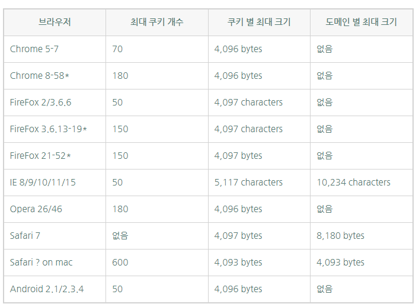
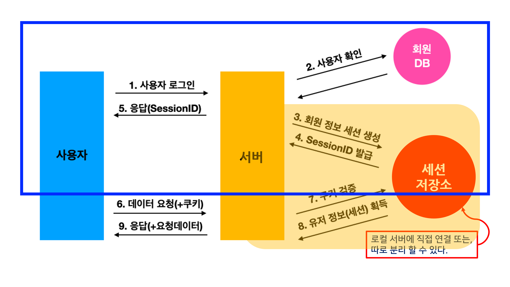

# 쿠키와 세션


# 0. 쿠키와 세션이 필요한 이유

[HTTP](https://github.com/psyStudy/CS_study/blob/main/Network/HTTP_HTTPS.md) 특성이자 약점을 보완하기 위해서!

→ connectionless, stateless : 서버는 클라이언트가 누구인지 매번 확인해야한다.

→ 클라이언트의 정보를 유지하기 위해 필요하다.

### connectionless

클라이언트가 요청을 한 후 응답을 받으면 그 연결을 끊어 버리는 특징

- HTTP는 먼저 클라이언트가 request를 서버에 보내면, 서버는 클라이언트에게 요청에 맞는 response를 보내고 연결을 끊는다.
- (HTTP 1.1에서 연결을 유지하고 재활용하는 기능이  Default로 추가되었고, keep-alive값으로 변경이 가능함.)

### stateless

통신이 끝나면 상태를 유지하지 않는 특징

- 연결을 끊는 순간 클라이언트와 서버의 통신이 끝나고, 상태 정보도 유지 되지 않음.

만약 쿠키와 세션을 사용하지 않으면, 쇼핑몰에서 옷을 구매하려고 로그인을 했는데 페이제를 이동할 때마다 계속 로그인을 해야한다.

# 1. 쿠키 Cookie

클라이언트(브라우저) 로컬에 저장되는  key와 value이 들어있는 string 형식의 작은 데이터 파일

쿠키 생긴 모양(?)

- 사용자가 인증이 유효한 시간을 명시할 수 있으며, 브라우저가 종료되어도 유효 시간 남았으면 인증이 유지된다.
- 클라이언트의 상태 정보를 로컬에 저장했다가 참조하는 방식이다.
- 클라이언트에 300개까지 쿠키를 저장할 수 있고, 하나의 도메인당 20개의 값만 가질 수 있다.
- 하나의 쿠키값은 4KB까지 저장한다.
- 브라우저 별 쿠키 제한도 다르다.
    
    
    
- Response Header에 Set-Cookie 속성을 요청하면 클라이언트에 쿠키를 만들 수 있다.
- 쿠키는 사용자가 따로 요청하지 않아도 브라우저가 Request시 Request Header를 넣어서 자동으로 서버에 전송한다.

### 쿠키 사용 예시

```
- 사이트에 로그인 시, 아이디와 비밀번호를 저장하시겠습니까
- 쇼핑몰 장바구니 기능
- 자동 로그인, 팝업에서 “오늘 더 이상 이 창을 보지 않음” 체크
```

## 2.1 쿠키의 구성요소

- 이름(key) : 각 쿠기를 구별하는 데 사용
- value : 쿠기의 이름과 관련된 값
- 유효시간 : 쿠키 유지시간
- 도메인 : 쿠키를 전송할 도메인
- 경로 : 쿠키를 전송할 요청 경로

※ 세션도 쿠키로 저장됨 확인

chrome > F12 > Application > Storage > Cookies


**쿠키 저장위치**

chrome의 경우 C:\Users\사용자이름\AppData\Local\Google\Chrome\User Data\Profile 1\Network 에 있다. sqlite 뷰어 등을 통해 확인 할 수 있다.


## 2.2 쿠키의 동작방식


1. 클라이언트가 페이지를 요청한다.
2. 서버에서 쿠키를 생성한다.
3. HTTP헤더에 쿠키를 포함 시켜 응답한다.
4. 브라우저가 종료되어도 쿠키 만료 기간이 안되면 클라이언트에서 보관하고 있다.
5. 같은 요청을 할 경우 HTTP 헤더에 쿠키를 함께 보낸다.
6. 서버에서 쿠키를 읽어 이전 상태 정보를 변경할 필요가 있을 때 쿠키를 업데이터 하여 변경된 쿠키를 HTTP헤더에 포함시켜 응답한다.

# 3. 세션 Session

쿠키를 기반으로 하지만, 사용자 정보 파일을 서버 측에서 관리하는 데이터.

**방문자가 웹 서버에 접속해 있는 상태를 하나의 단위로 보고 이를 세션이라한다.**

- 서버에서는 클라이언트를 구분하기 위해, 세션 ID를 부여하여 웹 브라우저가 서버에 접속해서 브라우저를 종료할 때까지 인증상태를 유지한다.
- 접속 시간에 제한을 두어 일정 시간 응답이 없으면 정보가 유지되지 않게 할 수 있다.
- 클라이언트가 request를 보내면, 해당 서버 엔진이 클라이언트에게 유일한 ID를 부여하는 데 이것이 세션ID 이다.
- 사용자에 대한 정보를 서버에 두기 때문에 쿠키보다 보안성이 좋지만, 사용자가 많을 수록 서버 메모리를 많이 차지하게 됨.
- 따라서 동시 접속자 수가 많은 웹 사이트인 경우 서버에 과부하를 주어 성능이 저하될 수 있다.
    - **보안이 좋은 세션대신 쿠키를 사용하는 이유이기도 하다! 쿠키와 세션을 적절히 사용하여 보안과 속도, 자원낭비 측면의 밸런스를 잡는것!**

### 세션 사용 예시

```
로그인 같이 보안상 중요한 작업을 수행할 때 시
(화면을 이동해도 로그아웃 전까지는 로그인이 유지됨.)
```

### issue - 세션 ID 생성방식? 어떻게 만드는지

난수처럼 생겼다.  (위 쿠키 구성 요소 참조)

HttpSession을 통해 생성한다.

[https://enai.tistory.com/29](https://enai.tistory.com/29)

```
HttpSession session = request.getSession();
HttpSession session = request.getSession(true); /*디폴트가 true*/
```

### issue - 세션 저장소를 서버 밖에 둘 수 있을까? 있다.

1. 서버 1 대에 1개의 세션 저장소가 생성된다.
    - 별도의 처리가 없다면 정합성 문제 발생
    
    
    
2. Sticky Session 방식 이용 
    - 최초로 1번 서버에서 세션이 생성되면 이후 요청은 모두 1번 서버로 가게하는 방식 (기존의 로드밸런싱 알고리즘을 통해 구현 가능)
    - 서버 트래픽 집중 위험성 있음
    - 그 외 여러가지 방식이 있음(세션 클러스터링 등)
        
        
        
3. 세션 스토리지 분리 방식 이용
    - 기존의 서버가 갖고 있는 로컬 세션 저장소를 이용하는 것이 아니라 별도의 세션 저장소를 이
    
    
    

## 3.1 세션 특징

- 각 클라이언트에게 고유 ID를 보유한다.
- 세션 ID로 클라이언트를 구분해서 클라이언트의 요구에 맞는 서비스를 제공한다.
- 보안 면에서 쿠키보다 우수하다.
- 사용자가 많아질수록 서버메모리를 많이 차지하게 된다.

## 3.2 세션 동작 방식



1. 클라이언트가 서버에 접속 시 세션ID를 발급받음.
2. 클라이언트는 세션 ID를 쿠키를 사용해서 저장하고 있음.
3. 클라이언트는 서버에 요청할 때, 이 쿠키의 세션 ID를 같이 서버에 전달해서 요청
4. 서버는 세션 ID를 전달받아서, 별다른 작업없이 세션 ID로 세션에 있는 클라이언트 정보를 가져와서 사용
5. 클라이언트 정보를 가지고 서버 요청을 처리하여 클라이언트에게 응답.

# 4. 쿠키와 세션의 차이

|  | 쿠키 | 세션 |
| --- | --- | --- |
| 저장 위치 | 클라이언트(졉속자의 PC) | 웹 서버 |
| 저장 형식 | text | Object |
| ⭐만료 시점 | 쿠키 저장시 설정
(브라우저가 종료되어도, 만료시점이 지나지 않으면 자동으로 삭제되지 않는다.) | 설정된 기간이 지나거나 브라우저 종료시 삭제된다. |
| 사용하는 자원
(리소스) | 클라이언트 리소스 | 웹 서버 리소스 |
| 용량 제한 | 총 300개
하나의 도메인 당 20개
하나의 쿠키 당 4KB | 서버가 허용하는 범위 내에서는 용량 제한없음 |
| 속도 | 세션보다 빠르다 | 쿠키보다 느리다 |
| 보안 | 세션보다 안좋다 | 쿠키보다 좋다  |
- 세션은 서버의 처리가 필요하기 때문에 쿠키보다 보안면에서 우수하지만 속도면에서 느리다.
- 쿠키는 로컬에 저장되므로 변질되거나, request에서 스니핑 당할 우려가 있어 보안에 취약하지만, 세션은 세션ID만 저장하고 ID로 구분하여 서버에서 처리하여 보안이 좋다.

### [참고]쿠키/세션 만 이용해 상태를 유지한다면

- 쿠키를 사용하는 상태유지


- 세션을 사용하는 상태유지


# 5. 캐시와는 다르다!

- 캐시는 이미지나, css, js파일 등을 브라우저나 서버 앞 단에 저장해놓고 사용하는 것.
- 한번 캐시에 저장되면 브라우저를 참고하기 때문에 서버에서 변경이 되어도 사용자는 변경되지 않은 것 처럼 보일 수 있다.
- 이는 캐시를 지우거나, 서버에서 클라이언트로 응답을 보낼 때 header에 캐시 만료시간을 명시하여 해결할 수 있다.

---

# 면접질문

- 쿠키와 세션에 대해 설명해보세요.
- 쿠키와 세션의 차이점은 무엇입니까?
- 세션은 서버에 저장되고, 쿠키는 클라이언트에 저장된다고 하셨는데, 그럼 쿠키가 안되는 상황에서도 세션은 사용할 수 있나요?
    - 몇가지 설정을 통해서 세션을 사용 할 수 있다.
    - 세션은 쿠키를 이용한다. 어떤 웹 브라우저가 서버에 요청을 하면 서버는 세션 아이디를 할당해서 응답할 때 함께 전달한다. 웹 브라우저는 이 세션 아이디를 쿠키에 저장해두고 매 요청마다 세션 아이디를 함께 전달한다. 서버는 세션 아이디를 바탕으로 사용자를 식별하고 사용자의 데이터를 서버에 저장하여 관리한다.
    - 서버에서는 저장된 세션과 클라이언트를 매칭하기 위해서 세션 식별정보를 클라이언트에 남겨둬야 한다. 이때 세션식별자를 쿠키로 저장하는 것이 보편적이다. (쿠키에 세션 식별자를 저장하는 경우, 식별자로 클라이언트를 유추하거나 특정할 수 없게해야만 안전하다. 또한 중복되지 않아야 한다.)
    - 세션/쿠키를 이용해서 클라이언트를 식별할 수 있는 것이지, 세션/쿠키가 클라이언트를 식별해 주는것은 아니다. 따라서 쿠키가 안되는 상황에서 세션을 사용하려면, 세션식별자로 쿠키가 아닌 다른 값을 이용하도록 따로 설정해줘야 한다.
    - (참고) - (휘발성 데이터로 쿠키를 대신하는 경우)
        - was설정에 따라 세션정보를 url에 담을 수 있다. 예를들어 SPA형태로 개발할 때 로그인 인증값을 저장할 수 있는 변수를 만들어서 로그인 인증 토큰을 저장시키는 방법을 사용해볼 수 있다. 시스템 메모리에 저장되다 보니 쿠키와 관계없이 잘 작동된다. 다만 근본적인 문제해결은 되지 못하는게, 다른 탭에선 로그인이 전혀유지 될 수 없고 새로고침하는 순간 로그인 다시 해야하기 때문이다.

# 출처

- [https://interconnection.tistory.com/74](https://interconnection.tistory.com/74)
- [https://hahahoho5915.tistory.com/32](https://hahahoho5915.tistory.com/32)
- [https://velog.io/@sorzzzzy/Code.presso-쿠키와-세션개념과-활용-예시를-알아보자](https://velog.io/@sorzzzzy/Code.presso-%EC%BF%A0%ED%82%A4%EC%99%80-%EC%84%B8%EC%85%98%EA%B0%9C%EB%85%90%EA%B3%BC-%ED%99%9C%EC%9A%A9-%EC%98%88%EC%8B%9C%EB%A5%BC-%EC%95%8C%EC%95%84%EB%B3%B4%EC%9E%90)
- [https://drsggg.tistory.com/388](https://drsggg.tistory.com/388)
- [https://blog.naver.com/PostView.naver?blogId=seek316&logNo=222639613843](https://blog.naver.com/PostView.naver?blogId=seek316&logNo=222639613843)
- [https://hyuntaeknote.tistory.com/6](https://hyuntaeknote.tistory.com/6)
