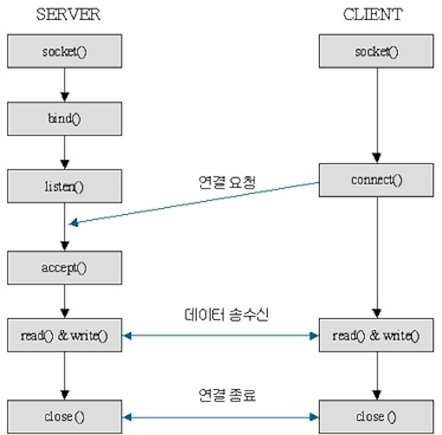

## 개념
> **프로세스 간 통신** (=**I**nter **P**rocess **C**ommunication)

- 즉, 프로세스들끼리 서로 데이터를 주고받는 행위 또는 그에 대한 방법을 뜻함 
- 각 프로세스는 별도의 주소 공간에서 실행되며, 한 프로세스는 다른 프로세스의 변수나 자료구조에 접근할 수 없기 때문 
- **커널 영역에서 IPC 설비를 제공함** 


<br></br>
## 주요 IPC 방식
### PIPE (파이프)


- 파이프는 두 개의 프로세스를 연결함 (한 프로세스는 데이터를 쓰기만, 나머지 프로세스는 읽기만 함)
- FIFO 구조로 동작함 
- 부모(write)-자식(read) 간의 단방향 통신으로 자주 사용함 
- 만약 양방향(전이중) 통신을 하고 싶으면 두 개의 파이프를 만들어야 함 
- 한 프로세스에서 read/write 작업이 끝나기 전에는 다른 프로세스에서 작업을 할 수 없음 
- pipe 함수로 파이프를 생성할 수 있음
```java
단방향 - 데이터를 전송하는 방향이 단방향인 것
양방향 - 전이중방식 또는 반이중방식 
반이중 - 전송의 방향은 양방향이지만, 전송이 이루어지는 한 순간에는 양쪽 중 한 방향만 전송이 가능한 것
전이중 - 동시에 양방향 전송이 가능한 것, 데이터를 수신하고 있는 동안에도 보내고 싶은 데이터를 송신할 수 있어 전송 능률이 높음 
```


- 간단하지만, 전이중 통신을 하려는 경우 구현이 복잡해지고 버퍼가 상대적으로 작기 때문에 overflow 될 확률이 높음 
<br></br>
### Named PIPE (지명 파이프)


- PIPE와 달리 부모-자식 관계가 아닌 서로 다른 프로세스들끼리 통신이 가능함 (단, 통신할 PIPE의 이름이 존재하고, **두 프로세스가 PIPE의 이름을 알아야 함**)
- PIPE와 마찬가지로 FIFO 구조로 동작하며, 단방향 통신임 
- mkfifo or mknod 함수로 이름이 있는 파이프를 생성할 수 있음 
<br></br>
### Message Queue (메시지 큐)

- 큐에 있는 데이터에 번호를 붙여 **여러 개의 프로세스가 데이터를 읽고 쓸 수 있게 함** (메시지큐는 파이프처럼 데이터의 흐름이 아니라 메모리 공간!)
- 입출력 방식은 PIPE와 동일함 (단방향 통신, FIFO 구조)
- 각각의 데이터를 구조체 모양으로 큐 안에 저장함 
<br></br>
### Shared Memory (공유 메모리)


- 프로세스 간 메모리 영역을 공유해서 사용할 수 있도록 허용함 (**여러 프로세스가 공유 메모리에 접근하여 읽고 쓸 수 있음 -> 동기화 필요!**)
- 공유 메모리 정보들은 구조체에 의해 관리됨 


- 중개자 없이 곧바로 메모리에 접근할 수 있기 때문에 모든 IPC 방식 중에서 속도가 가장 빠름 
- 같은 자원을 공유해서 쓰기 때문에 동기화 문제, 교착 상태 발생 가능성이 있음 
<br></br>
### Memory Map (메모리 맵)


- 메모리 영역을 공유한다는 점에선 공유 메모리와 비슷하지만, 차이점은 '파일'을 '메모리'에 '매핑'시켜 공유한다는 것
- **한 프로세스가 접근할 수 있는 파일 영역이 정해져 있음** 
- 메모리에 써진 내용이 파일에도 똑같이 써지고, 파일은 다른 프로세스에서도 접근 가능하기 때문에 데이터를 공유할 수 있게 됨 


- 일반적인 파일 I/O에 비해 성능은 좋지만 많은 메모리를 요구하며, 많은 데이터를 얼마나 오랫동안 메모리에 둘 것인지 컨트롤 할 수 없음 
<br></br>
### Socket (소켓)



- 네트워크를 이용한 클라이언트 프로세스와 서버 프로세스 간 통신 (네트워크를 이용하므로 다른 시스템 간 통신이 가능함)
- 서버에서는 bind, listen, accept를 진행해 소켓 연결을 위한 준비를 함 
- 클라이언트에서는 connect로 서버에 연결을 요청하고, 연결이 수립되면 서버와 클라이언트 간 데이터를 주고 받을 수 있음 -> 전이중 통신이 가능함 


**-> 네트워크 단원에서 자세히 다룰 예정!!**

<br></br>


각각의 방식은 서로 다른 장단점을 가지고 있기 때문에, 대부분의 운영체제에서는 한 가지 방식만 사용하는 것이 아니라 모든 방식을 다 사용함 


<br></br>
#### 출처
https://ko.wikipedia.org/wiki/프로세스_간_통신    
https://heeonii.tistory.com/13    
https://mangkyu.tistory.com/9    
https://computer-serendipity.com/message-queues/    
https://dar0m.tistory.com/233    
https://terms.tta.or.kr/dictionary/dictionaryView.do?subject=%ED%86%B5%EC%8B%A0+%EB%B0%A9%EC%8B%9D   
https://zetawiki.com/wiki/%EC%96%91%EB%B0%A9%ED%96%A5%ED%86%B5%EC%8B%A0,_%EC%A0%84%EC%9D%B4%EC%A4%91%EB%B0%A9%EC%8B%9D,_%EB%B0%98%EC%9D%B4%EC%A4%91%EB%B0%A9%EC%8B%9D,_%EB%8B%A8%EB%B0%A9%ED%96%A5%ED%86%B5%EC%8B%A0  
