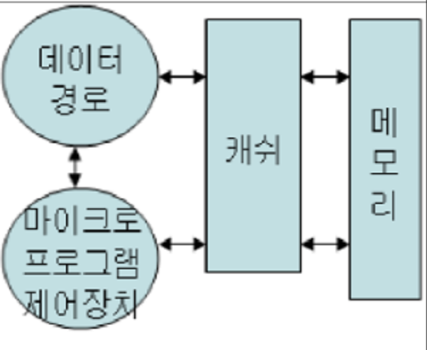
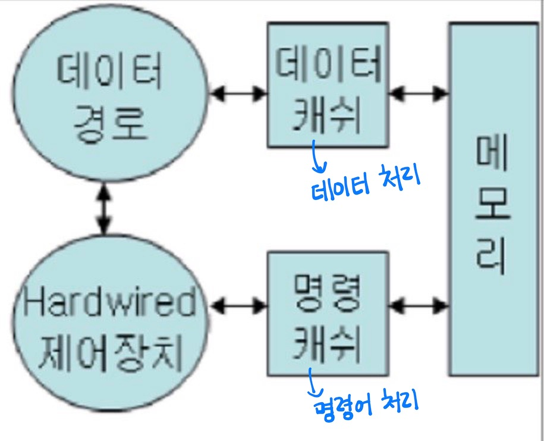

# RISC와 CISC

CPU를 설계하는 방식 

- 명령어가 HW적인 방식을 RISC, SW적인 방식을 CISC라고 함
- **RISC와 CISC 중 어느 쪽의 성능이 더 우수한지 딱 잘라 말할 수 없지만, 요즘엔 RISC를 많이 쓰는 추세!**

## CISC
Complex Instruction Set Computer = 복잡한 명령 집합 컴퓨터

- 모든 고급언어 문장에 기계 명령어가 대응되게 한 컴퓨터 → 복잡하고 많은 종류의 CPU 명령어를 사용함



- 수백개의 명령어를 내장하기 때문에 프로그램을 짜기 편리하고, CPU를 복잡하고 세밀하게 다룰 수 있음
- 컴파일이 쉽고, 호환성이 좋음
<br></br>
- 명령어의 길이가 가변적이고 편차가 큼 (명령어를 인출할 때 언제가 명령어 종료 시점인지 알 수 없음)
- 명령어 해석에 필요한 회로가 복잡해 병렬 처리가 쉽지 않음
- 속도가 느리고 전력 소모가 큼
<br></br>
- 호환성이 절대적으로 필요한 PC 환경에 사용, 인텔사의 CPU에 주로 사용됨


<br></br>
## RISC
Reduced Instruction Set Computer = 축소된 명령 집합 컴퓨터

- CISC의 많은 명령어 중 주로 쓰이는 몇가지만 추려서 하드웨어로 구현한 것 (IBM에서 명령어의 20% 정도가 80%의 일을 처리한다는 것을 증명함)
- 컴퓨터의 실행 속도를 높이기 위해 **복잡한 처리를 소프트웨어에 맡기는 방식**을 채택함
> RISC는 스택 관련 명령어를 내장하고 있지 않기 때문에, return address 나 기타 스택 자료 구조는 SW적으로 처리해주어야 함     
단순한 CPU 명령어를 사용하기 때문에 컴파일러의 최적화가 요구됨 -> 이런 식으로 SW가 처리해야 하는 양이 많음!      

**→ 하드웨어가 간단한 대신 소프트웨어가 복잡하고 크기가 커짐**



- 간단하고 적은 종류의 CPU 명령어만 사용함

```java
// ALU 레지스터-상수 연산 명령어
ADDI, SLTI, SLTIU, XORI, ORI, ANDI, LUI, AUIPC

// 레지스터-레지스터 연산 명령어
// 예시) add a, b, c -> a = b + c
ADD, SUB, SLT, SLTU, XOR, OR, AND, SLL, SRL, SRA

등등 
```

- 고정 길이(32bit) 명령어 형식 → 파이프라인 처리 고속화 (해석 속도가 빠름, 병렬 처리 용이, 컴파일 어려움)
```java
명령어 파이프라인
- 명령어를 읽어 순차적으로 실행하는 프로세서에 적용되는 기술
- 한 번에 하나의 명령어만 실행하는 것이 아니라 하나의 명령어가 실행되는 도중에 다른 명령어 실행을 시작 
  하는 식으로 동시에 여러 개의 명령어를 실행하는 기법 
- RISC는 고정 길이 명령어로 명령어가 한 클록에 처리되기 때문에, 한 명령어를 오래 처리해서 다음 명령어 
  처리가 늦어지지 않음

병렬 처리
- 여러 명령어를 동시에 처리함으로서 CPU가 휴식없이 지속적으로 작동하게 하는 방법 

컴파일
- 사람이 이해하는 언어를 컴퓨터가 이해할 수 있는 언어로 바꾸어 주는 과정 
- RISC는 복잡한 언어를 단순한 명령으로 나타내야 하기 때문에 컴파일이 어려움
```
<br></br>
- 단순화를 위해 코드밀도가 감소하여 같은 내용을 처리하는데 더 많은 코드 용량이 필요함
(메모리를 대상으로 하는 연산 명령어의 경우 CISC에서는 1개 명령어로 표현 가능하지만, RISC에서는 load-execute-store로 3개의 명령어가 필요함)
- CISC 방식의 기존 시스템과 호환되지 않아 호환성이 낮음
<br></br>
- 고성능의 워크스테이션이나 그래픽용 컴퓨터에서 주로 사용함 → ARM(임베디드 개발에서 많이 쓰임, 저전력), MIP, RISC-V 등

<br></br>

마이크로 프로그램 제어 및 하드와이어드 제어 방식에 대한 자세한 내용은 [https://esyeonge.tistory.com/28](https://esyeonge.tistory.com/28) 참고!

<br></br>
<br></br>

### 출처
[https://namu.wiki/w/RISC-V/명령어 목록](https://namu.wiki/w/RISC-V/%EB%AA%85%EB%A0%B9%EC%96%B4%20%EB%AA%A9%EB%A1%9D)

[https://blog.skby.net/마이크로프로세서-microprocessor/](https://blog.skby.net/%EB%A7%88%EC%9D%B4%ED%81%AC%EB%A1%9C%ED%94%84%EB%A1%9C%EC%84%B8%EC%84%9C-microprocessor/)

[https://ko.wikipedia.org/wiki/명령어_파이프라인](https://ko.wikipedia.org/wiki/%EB%AA%85%EB%A0%B9%EC%96%B4_%ED%8C%8C%EC%9D%B4%ED%94%84%EB%9D%BC%EC%9D%B8)

[https://m.cafe.daum.net/coders/KfIi/221](https://m.cafe.daum.net/coders/KfIi/221)

[https://kkhipp.tistory.com/166](https://kkhipp.tistory.com/166)

[https://kwon-jjing.tistory.com/48](https://kwon-jjing.tistory.com/48)

[https://itwiki.kr/w/RISC](https://itwiki.kr/w/RISC)
